# AI 跑团 GM · 微服务毕设 — AI 可执行实现规格书

## 文档目的

本文件（DOC B）是一份**面向 AI 编码助手的可执行实现规格书**。它的唯一目标，是让一个具备 Java / Spring Cloud / Vue 工程能力的 AI 编码助手，**仅凭本文档（及其引用的基线小节）即可从零把整套系统实现出来，过程中无需向人类作者反复追问**。

因此本文档与一般「架构设计文档」的写法不同：

- 它不解释「为什么这样设计」（那是架构设计文档 [[AI跑团GM·微服务毕设-架构设计]] 的职责），而是回答「**具体要建哪些文件、写哪些类、配哪些 yml、跑哪些 SQL、按什么顺序提交**」。
- 它把所有易产生歧义的契约（服务名、表名、字段名、接口路径、JSON 字段名、错误码、版本号）**前置固化在「实现基线」01 节**，后续所有章节一律引用、不得自创。
- 它把实现过程拆成**有先后依赖的「构建阶段」（09 节）**，每一阶段都有明确的产出物与可验证的完成标准（Definition of Done），保证「做一步、能跑一步、不翻车」。

一句话概括读者契约：**「读完基线 + 按阶段顺序照做 = 一个可演示的、覆盖全部课程硬性要求的 AI 跑团 GM 系统」**。

> 主题回顾：单人 AI 跑团 / 互动叙事「游戏主持人（GM）」，采用「有剧情状态机轨道的开放冒险」混合模式——玩家体感自由即兴，但 LLM 被剧情状态机白名单约束在有限节点内，保证不跑偏、不翻车。AI 难点聚焦三处：①剧情状态机约束 LLM；②多 NPC 人格一致；③长程记忆 / RAG。统一基准日期 **2026-05-29**。

## 目标读者与使用方式

**目标读者**：执行实现的 AI 编码助手（首要）；以及需要复核进度的人类作者（次要）。

**正确的使用方式（务必按此顺序）**：

1. **先通读「① 实现基线」（01 节）**。这是全文的「事实源（Single Source of Truth）」，固定了技术栈版本、仓库结构、全局约定（统一返回体 / 错误码 / JWT / Feign / CORS / 时间格式 / 分页）、完整 DDL、REST API 契约、AI 引擎 JSON Schema、种子剧本 id 命名规范。**任何后续章节与基线冲突时，以基线为准。**
2. **再按「构建阶段」（见 `08-devops` §11 构建阶段）的阶段顺序逐步实现**。阶段之间存在依赖（如：必须先有 `common` 与 Nacos，才能起任何业务服务；必须先有 user-service 与 gateway 的鉴权链路，才能联调需要登录的接口；必须先有 scenario-service 的剧本数据，game-service 才能开局；必须先有 ai-engine-service 的结构化输出，才能跑通核心回合）。**不要跳阶段并行乱做**。
3. **每实现完一个阶段，对照该阶段的「完成标准」自检**，确认可运行 / 可调通后再进入下一阶段。
4. 实现细节遇到不确定时，**优先回查基线 01 节**，而不是自行发明命名或结构。

**章节定位速记**：

| 角色 | 章节（真实文件名） | 何时读 |
|---|---|---|
| 事实源 / 契约 | `01-foundation` 实现基线 | 动工前必读，全程随时回查 |
| 公共地基 / 鉴权入口 | `02-common`、`03-gateway` | 最先实现（被所有服务依赖） |
| 各服务实现细则 | `02-user-service`、`03-scenario-service`、`05-ai-engine-service`、`06-memory-service`、`04-game-service` | 实现到对应服务时读 |
| 施工总顺序 / 本地运行 | `08-devops`（§11 构建阶段 + 一键运行） | 规划与推进时读 |
| 前端 | `07-frontend` | 后端可调通后读 |
| 设计动机 / 选型论证 | 架构设计文档（DOC A） | 需要理解「为什么」时读 |

## 整体 Definition of Done（系统级验收）

下列条目**全部满足**，方可认为本毕设系统「实现完成」。这是系统级总验收清单；各「构建阶段」另有阶段级 DoD（见 `08-devops` §11 构建阶段）。

**A. 课程硬性要求（必须 100% 覆盖）**

- [ ] **Spring Cloud 微服务 + 合理分层**：按基线固定的 7 个模块（`gateway` / `nacos`（注册+配置中心，外部部署）/ `user-service` / `scenario-service` / `game-service` / `ai-engine-service` / `memory-service`）实现，各服务 `controller → service → mapper/entity` 分层清晰，公共能力沉淀到 `common` 模块。
- [ ] **注册 / 登录**：`POST /api/user/auth/register`、`POST /api/user/auth/login` 可用，登录签发 HS256 JWT，密码 BCrypt 存储。
- [ ] **至少一个业务 CRUD**：剧本管理（scenario-service）对 `scenario / scene_node / npc / transition` 的增删改查全部可用。
- [ ] **至少 2 种角色 + RBAC 权限区分**：实现 `PLAYER` / `AUTHOR` / `ADMIN` 三角色，接口按基线 §5 的「角色」列做方法级 RBAC（如 AUTHOR 仅能改本人剧本、ADMIN 才能管用户）。
- [ ] **网页美观**：Vue3 + Vite + Element Plus + Pinia 前端，登录 / 剧本大厅 / 游玩页 / 编剧编辑器 / 管理员用户管理页面均完成且视觉协调。
- [ ] **自带一个有难度、不普通的 AI 功能**：AI 跑团 GM 核心闭环（状态机约束 LLM + 多 NPC 人格一致 + 长程记忆 RAG）跑通。

**B. AI 难点三要素（本毕设亮点）**

- [ ] **状态机约束 LLM**：LLM 的 `proposedTransition.toNodeId` 必须命中当前节点 `transitions` 白名单且条件求值为真，否则被拒（错误码 1503），AI 永远跳不出编剧画好的状态机轨道（基线 §6.5）。
- [ ] **多 NPC 人格一致**：单次请求内 LLM 同时扮演多个 NPC，`npcDialogues[].npcId` 必须属于当前节点出场 NPC，人格由 `persona` 注入并在跨回合中保持一致。
- [ ] **长程记忆 / RAG**：关键事件经 memory-service 向量化入 pgvector，后续回合按语义召回 topK 注入 prompt（`/api/memory/store`、`/api/memory/recall`）。

**C. 工程质量底线**

- [ ] 所有服务可注册到 Nacos，配置从 Nacos 配置中心下发（至少 `aigm.jwt.secret` 与 LLM API Key 走配置中心）。
- [ ] 所有对外接口经 gateway，统一返回体 `R<T>`（基线 §3.1）、统一错误码（基线 §3.2）。
- [ ] 数据库按基线 §4 完整 DDL 建表，三个 MySQL 库（`aigm_user` / `aigm_scenario` / `aigm_game`）+ 一个 PostgreSQL 库（`aigm_memory`，含 pgvector 扩展）就绪。
- [ ] 内置「迷雾古宅」种子剧本数据可直接开局，**端到端 demo 可一次性走通：注册/登录 → 选剧本 → 开局 → 连续若干回合（叙事 + NPC 对白 + 状态变更 + 节点推进）→ 抵达结局**，过程不报错、不跑偏。

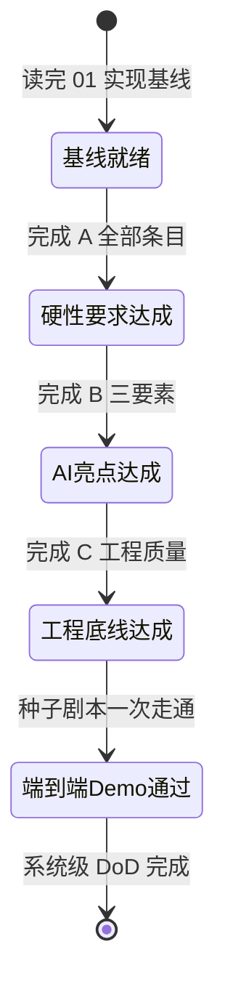

## 前置假设与环境前提

实现前假定下列环境已就绪（**版本必须与基线 §1 完全一致，不得擅自升降大版本**）：

- **JDK 17（LTS）** 已安装并配置为构建/运行 JDK。
- **Maven 3.9.x** 可用，能进行多模块 reactor 构建。
- **Node.js 20.x（LTS）** 可用（前端 Vite 5 要求 Node ≥ 18）。
- **MySQL 8.0.x（建议 8.0.36）** 单实例可用，将分库承载 `aigm_user` / `aigm_scenario` / `aigm_game`。
- **PostgreSQL 16.x + pgvector 0.7.x** 可用，承载 `aigm_memory`，且具备执行 `CREATE EXTENSION vector` 的权限。
- **Nacos Server 2.3.x（建议 2.3.2）** 以 standalone 单机模式启动，同时作注册中心与配置中心。
- **LLM 与嵌入服务**：一个 **OpenAI 兼容**的大模型接口（推荐国产 DeepSeek / 智谱 GLM / 通义千问之一）及其 API Key，经配置中心下发、可切换；以及一个输出 **1024 维**向量的嵌入模型（与基线 §4.4 `vector(1024)` 维度严格一致）。**真实 Key 不写入代码仓库，仅通过 Nacos 配置或本地环境变量注入。**
- 操作系统不限（Windows / macOS / Linux 均可）；本地可借助 `docker-compose.yml` 起 MySQL / PostgreSQL / Nacos（可选）。
- 网络可访问所选 LLM 厂商的 OpenAI 兼容 endpoint。

> 维度强约束提醒：嵌入模型输出维度**必须**为 1024，否则向 `t_memory.embedding` 插入时报错。若必须更换为其它维度的嵌入模型，须同步修改基线 §4.4 的 DDL 维度——但本规格默认锁定 1024，不建议改动。

## 明确的禁止事项

为保证「可控、做得完、demo 不翻车」，实现过程中**严禁**以下行为：

1. **禁止偏离命名**：服务名、模块名、数据库名、表名、字段名、接口路径、JSON 字段名、角色编码（`PLAYER` / `AUTHOR` / `ADMIN`）、错误码、id 命名规范（`node_*` / `npc_*` / flag key 等）**一律以基线 01 节为唯一标准**，不得新增、重命名或调整大小写 / 命名风格。
2. **禁止私自更换技术栈与版本**：不得替换或跨大版本升降 Spring Boot 3.2.5 / Spring Cloud 2023.0.1 / Spring Cloud Alibaba 2023.0.1.0 / MyBatis-Plus（boot3 starter）/ Vue3 / Element Plus 等基线锁定组件；三件套（Boot / Cloud / Alibaba）版本必须整组使用，否则启动即报兼容性异常。
3. **禁止超纲扩大 AI 范围**：只调用现成大模型的 OpenAI 兼容接口；**不自训模型、不做自主多 Agent 编排、不做语音**。AI 边界严格落在基线 §6 的引擎契约内。
4. **禁止破坏状态机约束**：不得让 LLM 的跳转绕过白名单校验（基线 §6.5）。任何「自由发挥的剧情推进」都必须收敛到编剧预设的 `transitions` 之内。
5. **禁止在 gateway 引入 WebMVC**：gateway 基于 WebFlux，**不得**引入 `spring-boot-starter-web`，也不得在下游服务重复配置 CORS（CORS 统一在 gateway，见基线 §3.5）。
6. **禁止下游服务重复解析 JWT**：JWT 校验**只**在 gateway 全局过滤器进行，下游服务信任网关透传的 `X-User-Id` / `X-User-Name` / `X-User-Roles` 头做 RBAC（基线 §3.3）。
7. **禁止把内部接口对外暴露**：`/api/ai/**`、`/api/memory/**` 为 INTERNAL，网关不对外路由（基线 §3.4 / §5.0）。
8. **禁止泄露密钥**：LLM API Key、JWT secret 等敏感配置不得硬编码进源码或提交进仓库。
9. **禁止占位式交付**：不得用「TODO / 待补充 / 略」充数；每个阶段都要交付可运行的真实实现。

## 与架构设计文档（DOC A）的关系

本实现规格书（DOC B）与架构设计文档（DOC A，双链：[[AI跑团GM·微服务毕设-架构设计]]）是**同一套事实源下的一对姊妹文档**，分工互补：

- **DOC A（架构设计）** 回答「**是什么 / 为什么**」：系统总体架构、服务拆分动机、技术选型论证、状态机与 RAG 的方法学、时序与部署视图、风险与权衡。面向需要理解设计意图的读者。
- **DOC B（本实现规格）** 回答「**怎么建 / 按什么顺序建**」：具体文件清单、类骨架、配置内容、可执行 SQL、接口实现细则、构建阶段与逐阶段 DoD。面向直接动手实现的 AI 编码助手。

两者**共享同一基线**：基线 01 节中的服务命名、DDL、API 契约、AI 引擎 JSON Schema 是两份文档共同遵守的「Single Source of Truth」。**当 DOC A 的概念描述与基线的具体字段产生差异时，实现一律以基线为准**；如发现 DOC A 与基线确有冲突，应回头修正文档，而非在实现中各自发挥。

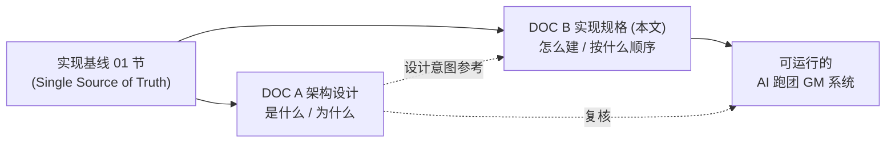

## 阅读顺序导航

按下表顺序阅读与实现，是「不追问即可完工」的推荐路径：

> 文件编号与实际文件一一对应（已统一，导航编号即文件名前缀）：`00-intro`、`01-foundation`、`02-common`、`03-gateway`、`04-game-service`、`05-ai-engine-service`、`06-memory-service`、`07-frontend`、`08-devops`，外加 `02-user-service`、`03-scenario-service`（user/scenario 与 common/gateway 共享 02/03 段位，按「先地基类、后业务类」阅读）。下图按**依赖与施工顺序**给出推荐阅读路径（与文件名前缀不必严格相等，但每个节点都标注了对应的真实文件名）。

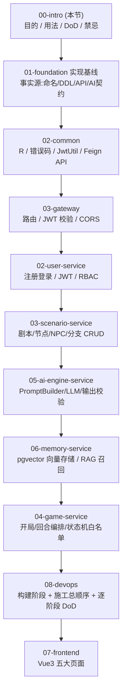

导航说明：

1. **00-intro（本节）** → 先建立全局认知：文档目的、使用方式、整体 DoD、环境前提、禁止事项。
2. **01-foundation 实现基线** → 必读且全程回查的事实源。
3. **02-common → 03-gateway → 02-user-service → 03-scenario-service → 05-ai-engine-service → 06-memory-service → 04-game-service** → 按依赖顺序逐节实现：先 `common`（公共地基：`R`/`ResultCode`/`BizException`/`JwtUtil`/Feign API）与 `gateway`（鉴权入口），再 `user-service`（鉴权数据面），再 `scenario-service`（业务数据地基），随后 `ai-engine-service`、`memory-service`（AI 与记忆能力），最后 `game-service`（编排核心，依赖前述全部）。
4. **08-devops 构建阶段** → 把上面的实现拆成可逐步验证、可演示的施工阶段（含逐阶段完成标准 DoD）与本地一键运行；**推进项目时以「08-devops 的施工顺序 + 阶段 DoD」为主线**，遇到某服务细节再翻对应实现小节。
5. **07-frontend** → 后端接口可调通后实现 Vue3 五大页面，最后联调端到端 demo。

> 编号澄清：早期草稿曾把导航编号写成 02 common / 03 gateway / 04 user / … / 08 game / 10 前端，与实际文件名不符。**现以本图为准**：common、gateway、game-service 三篇已补齐为 `02-common.md`、`03-gateway.md`、`04-game-service.md`；构建阶段并入 `08-devops.md`（§11 构建阶段）；前端为 `07-frontend.md`。

> 一句话路线：**先吃透基线（01），再按服务把地基到编排逐层垒起（02–08），用构建阶段（09）做施工节拍与验收，最后接上前端（10）跑通端到端 demo。**

## 一、实现基线（技术栈 / 仓库结构 / 全局约定 / 数据模型 / API 契约 / AI 引擎契约 / 种子大纲）

> 本节是两份文档共享的「事实源（Single Source of Truth）」。下游所有小节都必须读取本节并与之对齐：服务命名、数据库表名/字段、返回体结构、错误码、JWT claims、API 路径、AI 引擎 JSON Schema、id 命名规范，一律以此处为准。出现冲突时，以本节为最终裁决。
>
> 项目主题：AI 跑团 / 互动叙事「游戏主持人（GM）」。形态：单人，混合模式——“有剧情状态机轨道的开放冒险”。
> 统一基准日期：**2026-05-29**。

---

### 1. 技术栈与版本锁定（兼容性版本矩阵）

下表是一套经过验证、相互兼容的版本组合。**严禁混搭其它大版本**——Spring Boot / Spring Cloud / Spring Cloud Alibaba 三者的版本必须严格对应，否则启动报 `IllegalStateException: Spring Cloud version compatibility`。

| 分类 | 组件 | 锁定版本 | 兼容/说明 |
|---|---|---|---|
| 运行时 | JDK | **17** (LTS) | Spring Boot 3.x 最低要求 JDK 17 |
| 构建 | Maven | **3.9.x** | 多模块 reactor 构建 |
| 后端框架 | Spring Boot | **3.2.5** | 与下方 Cloud 2023.0.x 配套 |
| 微服务 | Spring Cloud | **2023.0.1** (代号 Leyton) | 必须搭配 Spring Boot 3.2.x |
| 阿里生态 | Spring Cloud Alibaba | **2023.0.1.0** | 对应 Spring Cloud 2023.0.x；提供 Nacos / Sentinel starter |
| 注册+配置中心 | Nacos Server | **2.3.x** (建议 2.3.2) | 单机 standalone 模式即可满足毕设 |
| 服务调用 | OpenFeign | 随 Spring Cloud 2023.0.1 | `spring-cloud-starter-openfeign` |
| 限流熔断 | Sentinel | 随 Alibaba 2023.0.1.0 | 可选，演示用，默认放行 |
| 网关 | Spring Cloud Gateway | 随 Spring Cloud 2023.0.1 | **基于 WebFlux（响应式），网关模块禁止引入 spring-boot-starter-web** |
| 业务数据库 | MySQL | **8.0.x** (建议 8.0.36) | user/scenario/game 三服务共用一个实例、分库 |
| 向量数据库 | PostgreSQL | **16.x** | memory-service 专用 |
| 向量扩展 | pgvector | **0.7.x** | `CREATE EXTENSION vector` |
| MySQL 驱动 | mysql-connector-j | 8.0.x | Boot 3 已托管版本 |
| PG 驱动 | postgresql | 42.7.x | Boot 3 已托管版本 |
| ORM | MyBatis-Plus | **3.5.5** (适配 Boot3 的 `mybatis-plus-spring-boot3-starter`) | 注意是 **boot3** starter，普通 starter 在 Boot3 下不工作 |
| 鉴权 | jjwt | **0.12.x** (jjwt-api / jjwt-impl / jjwt-jackson) | 生成/解析 JWT |
| 工具 | Hutool | 5.8.x（可选） | 通用工具 |
| 文档 | springdoc-openapi | **2.5.0** (`springdoc-openapi-starter-webmvc-ui`) | Swagger UI，Boot3 专用版本 |
| 前端框架 | Vue | **3.4.x** | Composition API + `<script setup>` |
| 前端构建 | Vite | **5.x** | |
| UI 库 | Element Plus | **2.7.x** | 配 `@element-plus/icons-vue` |
| 状态管理 | Pinia | **2.1.x** | 持久化用 `pinia-plugin-persistedstate` |
| HTTP | axios | **1.7.x** | 统一封装拦截器注入 JWT |
| 路由 | vue-router | **4.x** | |
| Node | Node.js | **20.x** (LTS) | Vite 5 要求 Node ≥18 |

**关键兼容矩阵（务必整组使用）**：
```
Spring Boot 3.2.5  ──  Spring Cloud 2023.0.1  ──  Spring Cloud Alibaba 2023.0.1.0
                                                   ├─ Nacos 2.3.x
                                                   └─ Sentinel (随 Alibaba)
JDK 17  +  Maven 3.9.x
MySQL 8.0  +  mybatis-plus-spring-boot3-starter 3.5.5
PostgreSQL 16  +  pgvector 0.7
```

---

### 2. 仓库结构（Maven 多模块 + 独立前端）

后端为 Maven 多模块（聚合 + 继承），前端独立目录。模块命名固定，**勿改名**。

```
ai-gm/                                   # 仓库根
├── pom.xml                              # 顶层 parent / 聚合 pom（packaging=pom）
├── README.md
├── docker-compose.yml                   # 本地起 MySQL/PostgreSQL/Nacos（可选）
│
├── common/                              # 公共模块（被所有业务服务依赖，无 web 启动）
│   ├── pom.xml
│   └── src/main/java/com/aigm/common/
│       ├── result/         R.java, ResultCode.java          # 统一返回体 + 错误码枚举
│       ├── exception/      BizException.java, GlobalExceptionHandler.java
│       ├── constant/       RoleConst.java, CommonConst.java # PLAYER/AUTHOR/ADMIN 等
│       ├── util/           JwtUtil.java, PageQuery.java, PageResult.java
│       └── feign/          # feign-api：服务间调用的接口 + DTO（供其它服务 import）
│                           AiEngineClient.java, MemoryClient.java,
│                           ScenarioClient.java, dto/...
│
├── gateway/                             # Spring Cloud Gateway（统一入口/路由/JWT校验）
│   ├── pom.xml                          # 依赖 spring-cloud-starter-gateway（WebFlux）
│   └── src/main/
│       ├── java/com/aigm/gateway/
│       │   ├── GatewayApplication.java
│       │   ├── filter/    JwtAuthGlobalFilter.java          # 解析 JWT，下发 X-User-* 头
│       │   └── config/    CorsConfig.java, RouteConfig.java(或用 yml)
│       └── resources/     bootstrap.yml, application.yml
│
├── user-service/                        # 注册/登录/JWT/RBAC（MySQL: aigm_user）
│   ├── pom.xml
│   └── src/main/java/com/aigm/user/
│       ├── UserApplication.java
│       ├── controller/  AuthController.java, UserController.java, AdminUserController.java
│       ├── service/     impl/...
│       ├── mapper/      UserMapper.java, RoleMapper.java, UserRoleMapper.java
│       ├── entity/      User.java, Role.java, UserRole.java
│       └── dto/         LoginDTO.java, RegisterDTO.java, UserVO.java
│
├── scenario-service/                    # 剧本 CRUD（MySQL: aigm_scenario）
│   └── src/main/java/com/aigm/scenario/
│       ├── controller/  ScenarioController.java, SceneNodeController.java,
│       │                NpcController.java, TransitionController.java
│       ├── service/ ... mapper/ ... entity/ Scenario/SceneNode/Npc/Transition/FlagDef
│       └── dto/
│
├── game-service/                        # 对局/状态/回合（MySQL: aigm_game）
│   └── src/main/java/com/aigm/game/
│       ├── controller/  GameSessionController.java, TurnController.java
│       ├── service/     GameService.java（编排：取状态→调 ai-engine→校验→落库→存记忆）
│       ├── mapper/ ... entity/ GameSession/GameState/Turn
│       └── feign/       (引用 common.feign 的 AiEngineClient/MemoryClient/ScenarioClient)
│
├── ai-engine-service/                   # 无状态：状态+输入→LLM→结构化输出
│   └── src/main/java/com/aigm/ai/
│       ├── controller/  AiGenerateController.java   # POST /api/ai/generate（内部）
│       ├── service/     PromptBuilder.java, LlmClient.java, OutputValidator.java
│       ├── llm/         OpenAiCompatClient.java     # DeepSeek/GLM/Qwen OpenAI 兼容
│       └── dto/         GenerateRequest.java, GenerateResponse.java（= AI 引擎 schema）
│
├── memory-service/                      # pgvector 长程记忆/RAG（PostgreSQL）
│   └── src/main/java/com/aigm/memory/
│       ├── controller/  MemoryController.java       # /api/memory/store, /recall
│       ├── service/     EmbeddingClient.java, MemoryService.java
│       ├── mapper/      MemoryMapper.java（原生 SQL 处理 vector 类型）
│       └── entity/      Memory.java
│
└── frontend/                            # Vue3 + Vite + Element Plus + Pinia（独立）
    ├── package.json
    ├── vite.config.js
    ├── index.html
    └── src/
        ├── main.js
        ├── App.vue
        ├── api/        request.js(axios封装), user.js, scenario.js, game.js
        ├── store/      user.js(Pinia), game.js
        ├── router/     index.js（路由守卫做前端 RBAC）
        ├── views/      Login.vue, Register.vue,
        │               player/ GameHall.vue, GamePlay.vue,
        │               author/ ScenarioList.vue, ScenarioEditor.vue,
        │               admin/  UserManage.vue
        ├── components/ NarrativePanel.vue, NpcDialogue.vue, StateBar.vue
        └── assets/
```

**模块依赖关系**：`common` 被所有业务服务依赖；业务服务之间**不直接依赖对方源码**，只通过 `common/feign` 中的 Feign 接口 + DTO 调用。`gateway` 不依赖 `common` 的 web 部分（避免引入 WebMVC 与 WebFlux 冲突），仅复用 `JwtUtil`/`R`。

---

### 3. 全局约定

#### 3.1 统一返回体 `R<T>`
所有 HTTP 接口（除流式外）返回统一结构：
```json
{
  "code": 0,
  "message": "success",
  "data": { }
}
```
- `code`：业务码，**0 表示成功**，非 0 表示失败（见 3.2 错误码表）。
- `message`：人类可读信息，失败时为错误描述。
- `data`：业务数据，可为对象 / 数组 / null。

Java 定义（`common.result.R`）约定方法：`R.ok()`、`R.ok(data)`、`R.fail(ResultCode)`、`R.fail(code, message)`。HTTP 状态码统一返回 200（除网关鉴权失败返回 401/403），业务结果由 `code` 表达。

成功示例（分页）：
```json
{
  "code": 0,
  "message": "success",
  "data": { "list": [ { "id": 1, "title": "迷雾古宅" } ], "total": 1, "page": 1, "size": 10 }
}
```
失败示例：
```json
{ "code": 1002, "message": "用户名或密码错误", "data": null }
```

#### 3.2 统一错误码表（分段）

> 下表的 **`ResultCode` 枚举名列是全局唯一标准**：`common.result.ResultCode` 严格按此列落地（枚举名 + code + 默认 message），所有服务、所有文档一律引用此枚举名，**不得自创别名**（如不得用 `UNAUTHORIZED`/`FORBIDDEN`/`RESOURCE_EXISTS`/`AI_LLM_CALL_FAILED` 等同义异名）。出现冲突时以本列为最终裁决。

| 段 | code | ResultCode 枚举名（唯一标准） | 含义 / 默认 message |
|---|---|---|---|
| 成功 | 0 | `SUCCESS` | 成功 success |
| **鉴权 AUTH (1000–1099)** | 1001 | `AUTH_NOT_LOGIN` | 未登录 / Token 缺失 |
| | 1002 | `AUTH_BAD_CREDENTIALS` | 用户名或密码错误 |
| | 1003 | `AUTH_TOKEN_EXPIRED` | Token 过期 |
| | 1004 | `AUTH_TOKEN_INVALID` | Token 非法 |
| | 1005 | `AUTH_NO_PERMISSION` | 无权限（角色不足） |
| | 1006 | `AUTH_ACCOUNT_DISABLED` | 账号被禁用 |
| **参数 PARAM (1100–1199)** | 1100 | `PARAM_INVALID` | 参数校验失败 |
| | 1101 | `PARAM_MISSING` | 缺少必填参数 |
| | 1102 | `PARAM_FORMAT_ERROR` | 参数格式错误 |
| | 1103 | `PAGE_PARAM_INVALID` | 分页参数非法 |
| **业务 BIZ (1200–1499)** | 1200 | `RESOURCE_NOT_FOUND` | 资源不存在 |
| | 1201 | `RESOURCE_EXISTS` | 资源已存在 / 重复 |
| | 1202 | `STATE_INVALID` | 状态非法（如对局已结束） |
| | 1210 | `SCENARIO_NO_START_NODE` | 剧本无起始节点 |
| | 1211 | `NODE_NO_TRANSITION` | 节点无可用分支 |
| | 1220 | `GAME_SESSION_NOT_FOUND` | 对局不存在 |
| | 1221 | `GAME_SESSION_FORBIDDEN` | 非本人对局（越权访问） |
| **AI (1500–1599)** | 1500 | `AI_LLM_FAILED` | LLM 调用失败 / 超时 |
| | 1501 | `AI_LLM_BAD_JSON` | LLM 返回非合法 JSON |
| | 1502 | `AI_OUTPUT_SCHEMA_INVALID` | 输出 schema 校验失败 |
| | 1503 | `AI_TRANSITION_REJECTED` | proposedTransition 不在白名单（越界被拒） |
| | 1504 | `AI_EMBEDDING_FAILED` | 嵌入（embedding）生成失败 |
| **系统 SYS (1900–1999)** | 1900 | `SYSTEM_ERROR` | 系统内部错误 |
| | 1901 | `SERVICE_UNAVAILABLE` | 下游服务不可用（Feign） |
| | 1902 | `DB_ERROR` | 数据库错误 |
| | 1903 | `RATE_LIMITED` | 限流 / 熔断 |

`ResultCode` 枚举即按此表落地（枚举名 + code + 默认 message）。下游引用错误码时，**只引用上表「枚举名」列**（如 `R.fail(ResultCode.AUTH_NOT_LOGIN)`）。

#### 3.3 JWT 约定
- 算法：HS256；密钥从 Nacos 配置中心下发（`aigm.jwt.secret`），所有服务共享同一密钥以便校验。
- 传递：`Authorization: Bearer <token>`。
- Claims：
  ```json
  {
    "userId": 1001,
    "username": "alice",
    "roles": ["PLAYER"],
    "iat": 1748505600,
    "exp": 1748592000
  }
  ```
- 过期策略：Access Token 有效期 **24h**（毕设演示从简）。可选 Refresh Token 7d；不实现刷新时，过期即要求重新登录（返回 1003）。
- 校验位置：**统一在 gateway 全局过滤器校验**。校验通过后，网关把 `userId`/`username`/`roles` 解析出来，通过请求头 `X-User-Id`、`X-User-Name`、`X-User-Roles`（逗号分隔）透传给下游服务；下游服务**信任网关头**做方法级 RBAC，不再重复解析 token（内部服务不直接对外暴露）。
- 白名单（网关放行、无需 token）：`/api/user/auth/register`、`/api/user/auth/login`、`/api/user/auth/captcha`（可选）、Swagger 文档路径。

#### 3.4 服务间 OpenFeign 调用约定
- Feign 接口统一放在 `common/feign`，由调用方 import。
- 服务名（spring.application.name，注册到 Nacos，**Feign 用此名**）与固定端口（**全局唯一标准，所有文档/yml/脚本一律以此为准**）：

  | 服务名（spring.application.name） | 端口 | 网关暴露前缀 / 说明 |
  |---|---|---|
  | `gateway` | **8080** | 系统唯一对外入口；前端 `axios.baseURL=http://localhost:8080` |
  | `user-service` | **8081** | 经网关 `/api/user/**` |
  | `scenario-service` | **8082** | 经网关 `/api/scenario/**` |
  | `game-service` | **8083** | 经网关 `/api/game/**` |
  | `ai-engine-service` | **8084** | INTERNAL，网关不对外路由 |
  | `memory-service` | **8085** | INTERNAL，网关不对外路由 |

- **内部接口前缀统一策略**：所有「仅供服务间 Feign 调用、网关不对外路由」的内部接口，统一使用 `/api/<服务短名>/**` 前缀——即 ai-engine 用 `/api/ai/**`、memory 用 `/api/memory/**`、scenario 的运行时只读接口用 `/api/scenario/run/**`（属 `/api/scenario/**` 路由族但走 Feign 内网直连，详见 §5.2 备注）。**不使用 `/internal/**` 这一独立前缀**，以便网关白名单/拦截逻辑只需按 `/api/...` 统一处理。
- Feign 调用传递内部标识头 `X-Internal-Call: true`，并透传 `X-User-Id` 以便记忆按用户/会话隔离。
- 超时：AI 相关 Feign 调用 connectTimeout 3s、readTimeout **60s**（LLM 较慢）；其余默认 5s。失败统一抛 `BizException(ResultCode.SERVICE_UNAVAILABLE)`（1901）。

#### 3.4.1 Nacos 注册与配置中心统一约定（全局唯一标准）
> 以下命名是全局唯一标准，所有服务 `bootstrap.yml` 与 §08-devops 发布脚本一律以此为准，**不得自创 dataId / namespace / profile 别名**。

- **namespace**：注册中心与配置中心统一用 `public`（毕设单环境，不再额外建命名空间）。
- **group**：统一 `DEFAULT_GROUP`。
- **profile**：统一 `spring.profiles.active=local`。
- **共享配置 dataId**：统一 `aigm-common.yaml`（放 `aigm.jwt.secret`、Jackson 时间格式、MyBatis-Plus 分页开关等全局项）。**所有服务（含 ai-engine-service、memory-service、gateway）都必须 `shared-configs` 引入 `aigm-common.yaml`**，否则取不到共享的 `aigm.jwt.secret`。
- **各服务自有 dataId**：`${spring.application.name}.yaml`（不带 profile 后缀），如 `user-service.yaml`、`ai-engine-service.yaml`、`gateway.yaml`。
- **file-extension**：`yaml`。

#### 3.5 跨域 CORS
统一在 **gateway** 配置（下游不再单独配，避免重复响应头报错）：允许来源 `http://localhost:5173`（前端 Vite 默认）等，允许方法 `GET,POST,PUT,DELETE,OPTIONS`，允许头 `Authorization,Content-Type`，`allowCredentials=true`，`maxAge=3600`。

#### 3.6 统一时间格式
- 传输/JSON：`yyyy-MM-dd HH:mm:ss`（`@JsonFormat(pattern, timezone="GMT+8")`），全局 Jackson 配置统一。
- 数据库：MySQL `DATETIME`、PostgreSQL `TIMESTAMP`。基准日期 **2026-05-29**。

#### 3.7 分页约定
- 请求参数：`page`（从 **1** 开始，默认 1）、`size`（默认 10，最大 100），可带业务过滤字段；超界返回 1103。
- 响应：`data: { list: [], total, page, size }`（见 3.1 示例）。`common.util.PageQuery`/`PageResult` 统一承载，配合 MyBatis-Plus 分页插件。

---

### 4. 完整数据模型 DDL（可执行）

> 字符集统一 `utf8mb4`（MySQL）；命名统一 `t_` 前缀、蛇形；逻辑删除字段 `deleted`(0/1)；审计字段 `created_at`/`updated_at`。角色固定取值：`PLAYER` / `AUTHOR` / `ADMIN`。

#### 4.1 user-service（MySQL，库名 `aigm_user`）
```sql
CREATE DATABASE IF NOT EXISTS aigm_user DEFAULT CHARSET utf8mb4 COLLATE utf8mb4_general_ci;
USE aigm_user;

-- 用户表
CREATE TABLE t_user (
  id            BIGINT       NOT NULL AUTO_INCREMENT COMMENT '用户ID',
  username      VARCHAR(50)  NOT NULL              COMMENT '用户名(登录账号)',
  password      VARCHAR(100) NOT NULL              COMMENT 'BCrypt 加密后的密码',
  nickname      VARCHAR(50)  DEFAULT NULL          COMMENT '昵称',
  avatar        VARCHAR(255) DEFAULT NULL          COMMENT '头像URL',
  status        TINYINT      NOT NULL DEFAULT 1    COMMENT '状态:1正常 0禁用',
  deleted       TINYINT      NOT NULL DEFAULT 0    COMMENT '逻辑删除:0未删 1已删',
  created_at    DATETIME     NOT NULL DEFAULT CURRENT_TIMESTAMP COMMENT '创建时间',
  updated_at    DATETIME     NOT NULL DEFAULT CURRENT_TIMESTAMP ON UPDATE CURRENT_TIMESTAMP COMMENT '更新时间',
  PRIMARY KEY (id),
  UNIQUE KEY uk_username (username)
) ENGINE=InnoDB COMMENT='用户表';

-- 角色表
CREATE TABLE t_role (
  id            BIGINT      NOT NULL AUTO_INCREMENT COMMENT '角色ID',
  role_code     VARCHAR(20) NOT NULL               COMMENT '角色编码:PLAYER/AUTHOR/ADMIN',
  role_name     VARCHAR(50) NOT NULL               COMMENT '角色名称',
  created_at    DATETIME    NOT NULL DEFAULT CURRENT_TIMESTAMP COMMENT '创建时间',
  PRIMARY KEY (id),
  UNIQUE KEY uk_role_code (role_code)
) ENGINE=InnoDB COMMENT='角色表';

-- 用户-角色关联表
CREATE TABLE t_user_role (
  id        BIGINT NOT NULL AUTO_INCREMENT COMMENT '主键',
  user_id   BIGINT NOT NULL               COMMENT '用户ID',
  role_id   BIGINT NOT NULL               COMMENT '角色ID',
  PRIMARY KEY (id),
  UNIQUE KEY uk_user_role (user_id, role_id),
  KEY idx_user_id (user_id),
  KEY idx_role_id (role_id),
  CONSTRAINT fk_ur_user FOREIGN KEY (user_id) REFERENCES t_user(id),
  CONSTRAINT fk_ur_role FOREIGN KEY (role_id) REFERENCES t_role(id)
) ENGINE=InnoDB COMMENT='用户角色关联表';

-- 初始化角色
INSERT INTO t_role (role_code, role_name) VALUES
  ('PLAYER','玩家'), ('AUTHOR','编剧'), ('ADMIN','管理员');
```

#### 4.2 scenario-service（MySQL，库名 `aigm_scenario`）
```sql
CREATE DATABASE IF NOT EXISTS aigm_scenario DEFAULT CHARSET utf8mb4 COLLATE utf8mb4_general_ci;
USE aigm_scenario;

-- 剧本
CREATE TABLE t_scenario (
  id             BIGINT       NOT NULL AUTO_INCREMENT COMMENT '剧本ID',
  title          VARCHAR(100) NOT NULL               COMMENT '剧本标题',
  intro          VARCHAR(500) DEFAULT NULL            COMMENT '简介',
  cover          VARCHAR(255) DEFAULT NULL            COMMENT '封面URL',
  genre          VARCHAR(30)  DEFAULT NULL            COMMENT '题材:悬疑/奇幻等',
  start_node_id  BIGINT       DEFAULT NULL            COMMENT '起始场景节点ID(指向t_scene_node)',
  status         TINYINT      NOT NULL DEFAULT 0      COMMENT '状态:0草稿 1已发布 2下架',
  author_id      BIGINT       NOT NULL               COMMENT '作者(编剧)用户ID',
  deleted        TINYINT      NOT NULL DEFAULT 0      COMMENT '逻辑删除',
  created_at     DATETIME     NOT NULL DEFAULT CURRENT_TIMESTAMP COMMENT '创建时间',
  updated_at     DATETIME     NOT NULL DEFAULT CURRENT_TIMESTAMP ON UPDATE CURRENT_TIMESTAMP COMMENT '更新时间',
  PRIMARY KEY (id),
  KEY idx_author (author_id),
  KEY idx_status (status)
) ENGINE=InnoDB COMMENT='剧本表';

-- 场景节点(状态机节点)
CREATE TABLE t_scene_node (
  id              BIGINT       NOT NULL AUTO_INCREMENT COMMENT '节点ID',
  scenario_id     BIGINT       NOT NULL               COMMENT '所属剧本ID',
  node_key        VARCHAR(50)  NOT NULL               COMMENT '节点业务key(剧本内唯一,如node_intro)',
  title           VARCHAR(100) NOT NULL               COMMENT '节点标题',
  narrative_brief TEXT         NOT NULL               COMMENT '叙事提示要点(喂给LLM的剧情纲要/氛围/目标)',
  is_ending       TINYINT      NOT NULL DEFAULT 0     COMMENT '是否结局节点:0否 1是',
  ending_type     VARCHAR(20)  DEFAULT NULL            COMMENT '结局类型:WIN/LOSE/NEUTRAL',
  sort_no         INT          NOT NULL DEFAULT 0     COMMENT '排序',
  created_at      DATETIME     NOT NULL DEFAULT CURRENT_TIMESTAMP,
  updated_at      DATETIME     NOT NULL DEFAULT CURRENT_TIMESTAMP ON UPDATE CURRENT_TIMESTAMP,
  PRIMARY KEY (id),
  UNIQUE KEY uk_scenario_nodekey (scenario_id, node_key),
  KEY idx_scenario (scenario_id),
  CONSTRAINT fk_node_scenario FOREIGN KEY (scenario_id) REFERENCES t_scenario(id)
) ENGINE=InnoDB COMMENT='场景节点表';

-- NPC 人设
CREATE TABLE t_npc (
  id            BIGINT       NOT NULL AUTO_INCREMENT COMMENT 'NPC ID',
  scenario_id   BIGINT       NOT NULL               COMMENT '所属剧本ID',
  npc_key       VARCHAR(50)  NOT NULL               COMMENT 'NPC业务key(剧本内唯一,如npc_butler)',
  name          VARCHAR(50)  NOT NULL               COMMENT 'NPC名称',
  persona       TEXT         NOT NULL               COMMENT '人格设定(性格/说话风格/动机,保证人格一致)',
  background    TEXT         DEFAULT NULL            COMMENT '背景故事',
  secret        TEXT         DEFAULT NULL            COMMENT '隐藏秘密(可被剧情解锁)',
  avatar        VARCHAR(255) DEFAULT NULL,
  created_at    DATETIME     NOT NULL DEFAULT CURRENT_TIMESTAMP,
  updated_at    DATETIME     NOT NULL DEFAULT CURRENT_TIMESTAMP ON UPDATE CURRENT_TIMESTAMP,
  PRIMARY KEY (id),
  UNIQUE KEY uk_scenario_npckey (scenario_id, npc_key),
  KEY idx_scenario (scenario_id),
  CONSTRAINT fk_npc_scenario FOREIGN KEY (scenario_id) REFERENCES t_scenario(id)
) ENGINE=InnoDB COMMENT='NPC人设表';

-- 节点-NPC 关联(某节点出场哪些NPC)
CREATE TABLE t_node_npc (
  id        BIGINT NOT NULL AUTO_INCREMENT,
  node_id   BIGINT NOT NULL COMMENT '节点ID',
  npc_id    BIGINT NOT NULL COMMENT 'NPC ID',
  PRIMARY KEY (id),
  UNIQUE KEY uk_node_npc (node_id, npc_id),
  KEY idx_node (node_id),
  CONSTRAINT fk_nn_node FOREIGN KEY (node_id) REFERENCES t_scene_node(id),
  CONSTRAINT fk_nn_npc  FOREIGN KEY (npc_id)  REFERENCES t_npc(id)
) ENGINE=InnoDB COMMENT='节点NPC关联表';

-- 分支(状态机的边)
CREATE TABLE t_transition (
  id            BIGINT       NOT NULL AUTO_INCREMENT COMMENT '分支ID',
  scenario_id   BIGINT       NOT NULL               COMMENT '所属剧本ID(冗余,便于查询)',
  from_node_id  BIGINT       NOT NULL               COMMENT '源节点ID',
  to_node_id    BIGINT       NOT NULL               COMMENT '目标节点ID',
  condition_expr VARCHAR(255) DEFAULT NULL           COMMENT '触发条件表达式(如 flag.has_key==true)',
  description   VARCHAR(255) DEFAULT NULL            COMMENT '分支说明(给AI/编剧看)',
  priority      INT          NOT NULL DEFAULT 0     COMMENT '优先级(数值大优先匹配)',
  created_at    DATETIME     NOT NULL DEFAULT CURRENT_TIMESTAMP,
  PRIMARY KEY (id),
  KEY idx_from (from_node_id),
  KEY idx_scenario (scenario_id),
  CONSTRAINT fk_tr_from FOREIGN KEY (from_node_id) REFERENCES t_scene_node(id),
  CONSTRAINT fk_tr_to   FOREIGN KEY (to_node_id)   REFERENCES t_scene_node(id)
) ENGINE=InnoDB COMMENT='分支(状态转移边)表';

-- 旗标定义(可选:声明剧本里用到的flag,便于编辑器提示)
CREATE TABLE t_flag_def (
  id            BIGINT       NOT NULL AUTO_INCREMENT COMMENT '旗标定义ID',
  scenario_id   BIGINT       NOT NULL               COMMENT '所属剧本ID',
  flag_key      VARCHAR(50)  NOT NULL               COMMENT '旗标key(如 has_key)',
  flag_name     VARCHAR(100) DEFAULT NULL            COMMENT '旗标含义',
  default_value VARCHAR(20)  DEFAULT 'false'        COMMENT '默认值',
  PRIMARY KEY (id),
  UNIQUE KEY uk_scenario_flag (scenario_id, flag_key),
  KEY idx_scenario (scenario_id),
  CONSTRAINT fk_flag_scenario FOREIGN KEY (scenario_id) REFERENCES t_scenario(id)
) ENGINE=InnoDB COMMENT='旗标定义表';
```

#### 4.3 game-service（MySQL，库名 `aigm_game`）
```sql
CREATE DATABASE IF NOT EXISTS aigm_game DEFAULT CHARSET utf8mb4 COLLATE utf8mb4_general_ci;
USE aigm_game;

-- 对局
CREATE TABLE t_game_session (
  id            BIGINT       NOT NULL AUTO_INCREMENT COMMENT '对局ID',
  user_id       BIGINT       NOT NULL               COMMENT '玩家用户ID',
  scenario_id   BIGINT       NOT NULL               COMMENT '剧本ID',
  title         VARCHAR(100) DEFAULT NULL            COMMENT '存档名(默认=剧本名+时间)',
  status        TINYINT      NOT NULL DEFAULT 1      COMMENT '状态:1进行中 2已通关 3已失败 4已弃局',
  turn_count    INT          NOT NULL DEFAULT 0      COMMENT '已进行回合数',
  created_at    DATETIME     NOT NULL DEFAULT CURRENT_TIMESTAMP COMMENT '开局时间',
  updated_at    DATETIME     NOT NULL DEFAULT CURRENT_TIMESTAMP ON UPDATE CURRENT_TIMESTAMP COMMENT '最近游玩时间',
  PRIMARY KEY (id),
  KEY idx_user (user_id),
  KEY idx_user_status (user_id, status)
) ENGINE=InnoDB COMMENT='对局/存档表';

-- 对局状态(与session一对一,记录当前状态机快照)
CREATE TABLE t_game_state (
  id               BIGINT   NOT NULL AUTO_INCREMENT COMMENT '主键',
  session_id       BIGINT   NOT NULL               COMMENT '对局ID',
  current_node_id  BIGINT   NOT NULL               COMMENT '当前所处场景节点ID',
  flags            JSON     DEFAULT NULL            COMMENT '旗标 {"has_key":true,...}',
  inventory        JSON     DEFAULT NULL            COMMENT '物品 ["生锈的钥匙","日记本"]',
  attributes       JSON     DEFAULT NULL            COMMENT '属性 {"sanity":80,"trust":3}',
  recent_summary   TEXT     DEFAULT NULL            COMMENT '近况摘要(滚动压缩的剧情回顾,喂LLM)',
  updated_at       DATETIME NOT NULL DEFAULT CURRENT_TIMESTAMP ON UPDATE CURRENT_TIMESTAMP,
  PRIMARY KEY (id),
  UNIQUE KEY uk_session (session_id),
  CONSTRAINT fk_state_session FOREIGN KEY (session_id) REFERENCES t_game_session(id)
) ENGINE=InnoDB COMMENT='对局状态表';

-- 回合
CREATE TABLE t_turn (
  id            BIGINT   NOT NULL AUTO_INCREMENT COMMENT '回合ID',
  session_id    BIGINT   NOT NULL               COMMENT '对局ID',
  turn_no       INT      NOT NULL               COMMENT '回合序号(从1递增)',
  node_id       BIGINT   NOT NULL               COMMENT '该回合发生时所在节点ID',
  player_input  TEXT     DEFAULT NULL            COMMENT '玩家输入(首回合可为空)',
  ai_output     JSON     NOT NULL               COMMENT 'AI结构化输出(见AI引擎schema:narrative/npcDialogues/stateChanges/...)',
  created_at    DATETIME NOT NULL DEFAULT CURRENT_TIMESTAMP COMMENT '创建时间',
  PRIMARY KEY (id),
  UNIQUE KEY uk_session_turn (session_id, turn_no),
  KEY idx_session (session_id),
  CONSTRAINT fk_turn_session FOREIGN KEY (session_id) REFERENCES t_game_session(id)
) ENGINE=InnoDB COMMENT='回合表';
```

#### 4.4 memory-service（PostgreSQL 16 + pgvector，库名 `aigm_memory`）
```sql
-- 在 aigm_memory 库中执行
CREATE EXTENSION IF NOT EXISTS vector;

CREATE TABLE t_memory (
  id          BIGSERIAL    PRIMARY KEY,
  session_id  BIGINT       NOT NULL,                 -- 对局ID(记忆按对局隔离)
  content     TEXT         NOT NULL,                 -- 记忆原文(关键事件/玩家选择)
  embedding   vector(1024) NOT NULL,                 -- 向量(维度按嵌入模型,1024对应bge-large/通用)
  mem_type    VARCHAR(20)  NOT NULL DEFAULT 'EVENT', -- 类型:EVENT/CHOICE/NPC_FACT/ITEM
  importance  SMALLINT     NOT NULL DEFAULT 3,       -- 重要度1-5,召回时排序加权
  created_at  TIMESTAMP    NOT NULL DEFAULT NOW()
);

COMMENT ON TABLE  t_memory IS '长程记忆向量表';
COMMENT ON COLUMN t_memory.embedding IS '内容向量,维度需与嵌入模型一致';

-- 普通索引:按对局过滤
CREATE INDEX idx_memory_session ON t_memory (session_id);

-- 向量索引(余弦距离),HNSW 适合读多写少的召回场景
CREATE INDEX idx_memory_embedding ON t_memory
  USING hnsw (embedding vector_cosine_ops);
-- 备选(数据量小可用 ivfflat): 
-- CREATE INDEX idx_memory_embedding ON t_memory USING ivfflat (embedding vector_cosine_ops) WITH (lists = 100);
```
> 注意：`embedding` 维度（1024）必须与所选嵌入模型输出维度一致。若改用 OpenAI `text-embedding-3-small`(1536) 或 DeepSeek/智谱的嵌入模型，需同步改 DDL 维度，否则插入报错。本基线锁定 **1024**。

---

### 5. 完整 REST API 契约

> 所有对外路径经 gateway。`角色` 列为访问该接口所需角色（多个=任一满足）；`PUBLIC`=白名单无需登录；`INTERNAL`=仅服务间调用，网关不对外。请求/响应体省略统一 `R` 外壳，只写 `data` 内容。

#### 5.0 gateway 路由前缀规划
| 前缀 | 转发到 | 鉴权 |
|---|---|---|
| `/api/user/**` | user-service | 除 auth 白名单外需 token |
| `/api/scenario/**` | scenario-service | 需 token |
| `/api/game/**` | game-service | 需 token (PLAYER) |
| `/api/ai/**` | ai-engine-service | INTERNAL（不对外暴露） |
| `/api/memory/**` | memory-service | INTERNAL（不对外暴露） |
| `/doc/**`,`/v3/api-docs/**` | 各服务 | PUBLIC（Swagger） |

#### 5.1 user-service
| 方法 | 路径 | 角色 | 请求体 | 响应体(data) | 说明 |
|---|---|---|---|---|---|
| POST | /api/user/auth/register | PUBLIC | `{username,password,nickname?}` | `{userId}` | 注册，默认授予 PLAYER |
| POST | /api/user/auth/login | PUBLIC | `{username,password}` | `{token,userInfo:{userId,username,nickname,roles[]}}` | 登录签发 JWT |
| GET | /api/user/me | 登录任意 | - | `{userId,username,nickname,avatar,roles[]}` | 当前登录用户信息 |
| PUT | /api/user/me | 登录任意 | `{nickname?,avatar?}` | `true` | 修改个人资料 |
| GET | /api/user/admin/users | ADMIN | query: `page,size,username?` | `{list:[UserVO],total,page,size}` | 管理员分页查用户 |
| PUT | /api/user/admin/users/{id}/status | ADMIN | `{status}` | `true` | 启用/禁用用户 |
| PUT | /api/user/admin/users/{id}/roles | ADMIN | `{roles:["PLAYER","AUTHOR"]}` | `true` | 分配角色(RBAC核心) |
| DELETE | /api/user/admin/users/{id} | ADMIN | - | `true` | 逻辑删除用户 |

#### 5.2 scenario-service
> 编剧只能管理自己创建的剧本；ADMIN 可管理全部；PLAYER 只读已发布剧本。
>
> **运行时只读接口（INTERNAL，供 game-service Feign 调用）**：除下表对外 CRUD 接口外，scenario-service 另提供一组**运行时只读、按当前节点/白名单组织**的内部接口，前缀 `/api/scenario/run/**`（属 `/api/scenario/**` 路由族，但 game-service 经 Feign 服务名直连内网调用，前端不会用到）：
> - `GET /api/scenario/run/{scenarioId}` → `ScenarioRunVO`（开局所需：title/genre/startNodeId 等精简定义）。
> - `GET /api/scenario/run/{scenarioId}/node/{nodeId}` → `SceneNodeRunVO`（当前节点完整定义，含 `npcs[]` 与 `transitions[]` 白名单，字段对齐 §6.2）。
>
> game-service **运行时取节点/NPC/白名单一律走上述 `/api/scenario/run/**` 内部接口**，不走下面的对外 CRUD 路径（`/api/scenario/{sid}/nodes`、`/npcs` 等是给编辑器/详情页用的，非按当前节点组织）。
| 方法 | 路径 | 角色 | 请求体 | 响应体(data) | 说明 |
|---|---|---|---|---|---|
| GET | /api/scenario/published | PLAYER/AUTHOR/ADMIN | query:`page,size,genre?` | `{list:[ScenarioVO],total,page,size}` | 玩家可玩剧本列表(status=1) |
| GET | /api/scenario/{id} | 登录任意 | - | `ScenarioDetailVO`(含 nodes/npcs/transitions) | 剧本详情(供开局/编辑) |
| GET | /api/scenario/mine | AUTHOR/ADMIN | query:`page,size,status?` | `{list,total,page,size}` | 我创建的剧本 |
| POST | /api/scenario | AUTHOR/ADMIN | `{title,intro,genre,cover?}` | `{id}` | 新建剧本(草稿) |
| PUT | /api/scenario/{id} | AUTHOR(本人)/ADMIN | `{title?,intro?,genre?,cover?,startNodeId?}` | `true` | 改剧本 |
| PUT | /api/scenario/{id}/publish | AUTHOR(本人)/ADMIN | `{status}` | `true` | 发布/下架(校验有起始节点+分支闭环) |
| DELETE | /api/scenario/{id} | AUTHOR(本人)/ADMIN | - | `true` | 逻辑删剧本 |
| -- 节点 -- | | | | | |
| GET | /api/scenario/{sid}/nodes | 登录任意 | - | `[SceneNodeVO]` | 列剧本所有节点 |
| POST | /api/scenario/{sid}/nodes | AUTHOR(本人)/ADMIN | `{nodeKey,title,narrativeBrief,isEnding?,endingType?,npcIds?[]}` | `{id}` | 新建节点 |
| PUT | /api/scenario/nodes/{nodeId} | AUTHOR(本人)/ADMIN | `{title?,narrativeBrief?,isEnding?,endingType?,npcIds?[]}` | `true` | 改节点 |
| DELETE | /api/scenario/nodes/{nodeId} | AUTHOR(本人)/ADMIN | - | `true` | 删节点(级联删相关分支) |
| -- NPC -- | | | | | |
| GET | /api/scenario/{sid}/npcs | 登录任意 | - | `[NpcVO]` | 列NPC |
| POST | /api/scenario/{sid}/npcs | AUTHOR(本人)/ADMIN | `{npcKey,name,persona,background?,secret?,avatar?}` | `{id}` | 新建NPC |
| PUT | /api/scenario/npcs/{npcId} | AUTHOR(本人)/ADMIN | `{name?,persona?,background?,secret?,avatar?}` | `true` | 改NPC |
| DELETE | /api/scenario/npcs/{npcId} | AUTHOR(本人)/ADMIN | - | `true` | 删NPC |
| -- 分支 -- | | | | | |
| GET | /api/scenario/{sid}/transitions | 登录任意 | - | `[TransitionVO]` | 列分支 |
| POST | /api/scenario/transitions | AUTHOR(本人)/ADMIN | `{scenarioId,fromNodeId,toNodeId,conditionExpr?,description?,priority?}` | `{id}` | 新建分支 |
| PUT | /api/scenario/transitions/{id} | AUTHOR(本人)/ADMIN | `{toNodeId?,conditionExpr?,description?,priority?}` | `true` | 改分支 |
| DELETE | /api/scenario/transitions/{id} | AUTHOR(本人)/ADMIN | - | `true` | 删分支 |

#### 5.3 game-service
| 方法 | 路径 | 角色 | 请求体 | 响应体(data) | 说明 |
|---|---|---|---|---|---|
| POST | /api/game/sessions | PLAYER | `{scenarioId}` | `{sessionId, state:GameStateVO, firstTurn:AiOutput}` | 开局：建session+初始state(=剧本起始节点)，并生成开场叙事(调ai-engine) |
| POST | /api/game/sessions/{id}/turns | PLAYER(本人) | `{playerInput}` | `{turn:{turnNo,playerInput,aiOutput}, state:GameStateVO, finished:bool}` | 提交一回合(核心编排) |
| GET | /api/game/sessions/{id} | PLAYER(本人) | - | `{session, state, turns:[...]}` | 查对局详情(含历史回合=读档) |
| GET | /api/game/sessions | PLAYER(本人) | query:`page,size,status?` | `{list:[SessionVO],total,page,size}` | 我的存档列表 |
| PUT | /api/game/sessions/{id}/abandon | PLAYER(本人) | - | `true` | 弃局(status=4) |
| GET | /api/game/sessions/{id}/state | PLAYER(本人) | - | `GameStateVO` | 单独取当前状态(读档恢复用) |
| POST | /api/game/sessions/{id}/turns/stream | PLAYER(本人) | `{playerInput}` | SSE 事件流 | **可选 SSE 变体**（加分项，非核心契约），与 `/turns` 语义一致但以 `text/event-stream` 增量推送 `narrative`；默认可不实现，前端默认 `enableStream=false` 走非流式 `/turns` |

> 存/读档说明：本设计**对局即存档**——每次提交回合自动持久化 `t_game_state` + `t_turn`，无需显式“保存”。读档=`GET /api/game/sessions/{id}` 拉取 state+全部 turns 回放。
>
> SSE 流式说明：`POST /api/game/sessions/{id}/turns/stream` 为**可选增强**，与非流式 `/turns` 返回同一份结果，仅交互体验不同。若实现，网关需为该路径放行 `text/event-stream`（CORS allowedHeaders 已含通用项）；不实现时前端以 `enableStream=false` 默认走 `/turns`，不影响任何验收项。

#### 5.4 ai-engine-service（INTERNAL）
| 方法 | 路径 | 角色 | 请求体 | 响应体(data) | 说明 |
|---|---|---|---|---|---|
| POST | /api/ai/generate | INTERNAL | `GenerateRequest`(见 §6) | `GenerateResponse`(见 §6) | 收“状态+节点定义+NPC+召回记忆+玩家输入”，调LLM，产出结构化叙事与状态变更。无状态。 |

#### 5.5 memory-service（INTERNAL）
| 方法 | 路径 | 角色 | 请求体 | 响应体(data) | 说明 |
|---|---|---|---|---|---|
| POST | /api/memory/store | INTERNAL | `{sessionId, items:[{content,memType,importance}]}` | `{storedCount}` | 批量向量化并入库 |
| POST | /api/memory/recall | INTERNAL | `{sessionId, query, topK?=5}` | `{memories:[{content,memType,importance,score}]}` | 按 query 语义召回 topK，结合 importance 加权排序 |

---

### 6. AI 引擎契约（核心，JSON Schema 精确定义）

ai-engine-service 无状态。game-service 在每回合负责：① 读 `t_game_state` 组装 `GameState`；② 从 scenario-service 取**当前节点**定义（含其 `transitions` 白名单）与出场 NPC；③ 调 memory-service `recall` 拿相关记忆；④ 组装 `GenerateRequest` 调 `/api/ai/generate`；⑤ 校验返回（尤其 `proposedTransition` 白名单）；⑥ 应用 `stateChanges` 落库、写 `t_turn`、调 `memory/store`。

#### 6.1 GameState（运行态状态）
```json
{
  "currentNodeId": 1001,
  "flags": { "has_key": true, "talked_to_butler": false },
  "inventory": ["生锈的钥匙", "破旧的日记"],
  "attributes": { "sanity": 75, "trust_butler": 2 },
  "recentSummary": "玩家进入古宅，撬开抽屉找到一把生锈的钥匙，尚未与管家深入交谈。"
}
```

#### 6.2 状态机节点模型 node（由 scenario-service 提供给 ai-engine）
```json
{
  "id": 1001,
  "nodeKey": "node_hall",
  "title": "幽暗的大厅",
  "narrativeBrief": "玩家身处布满灰尘的大厅。氛围:阴森、悬疑。目标:让玩家决定上楼/进书房/找管家。线索:墙上挂画后有暗格。不要直接剧透凶手。",
  "isEnding": false,
  "endingType": null,
  "npcIds": [2001, 2002],
  "transitions": [
    { "toNodeId": 1002, "condition": "always",                "priority": 10, "description": "上楼" },
    { "toNodeId": 1003, "condition": "flag.has_key==true",    "priority": 20, "description": "用钥匙进书房" },
    { "toNodeId": 1004, "condition": "attr.evidence>=1 && flag.talked_to_butler==true", "priority": 5, "description": "跟随管家" }
  ]
}
```

##### 6.2.1 condition 受控小语法（全局唯一标准，编辑期与运行期必须一致）
> `t_transition.condition_expr` / node JSON 的 `transitions[].condition` 一律使用下面这套**受控小语法**。**编辑期（scenario-service 发布校验的正则）与运行期（求值器）必须支持完全相同的语法集合**，否则会出现「编辑期能写、运行期判 false 永远跳不过去」的硬冲突。所有文档（含 DOC A）一律以本表为准。

| 形态 | 语法 | 示例 | 求值含义 |
|---|---|---|---|
| 恒真 | `always` | `always` | 永远满足 |
| flag 判等 | `flag.<key>==true` / `flag.<key>==false` | `flag.has_key==true` | 读 `state.flags[key]`，缺省视为 false |
| 属性比较 | `attr.<key><op><整数>`，`op ∈ { >= , <= , > , < , == }` | `attr.evidence>=2`、`attr.sanity<=0` | 读 `state.attributes[key]`，缺省视为 0 |
| 持有物品 | `item.<物品名>` | `item.生锈的钥匙` | `state.inventory` 是否包含该物品 |
| 与组合 | 用 ` && ` 串联上述任意原子 | `flag.has_key==true && attr.evidence>=1` | 全部为真才为真；**只支持 `&&`，不支持 `||`**（多分支用多条 transition + `priority` 表达） |

锁定要点（消除历史分歧）：
- **属性前缀统一为 `attr.`**（不是 `attributes.`）。
- **运算符集合统一为 `>= <= > < ==` 五个，不含 `!=`**。
- **运行期求值器必须支持 `item.` 与 `&&` 拆分**（与编辑期一致），不得只认 `flag.`/`attr.`。
- 求值原则：**看不懂的表达式一律返回 false**（宁可少放行，不错放行）。空表达式等价于 `always`（恒真）。

#### 6.3 GenerateRequest（game → ai-engine 入参）
```json
{
  "sessionId": 5001,
  "scenarioContext": {
    "title": "迷雾古宅",
    "genre": "悬疑"
  },
  "gameState": { "...见 6.1..." },
  "currentNode": { "...见 6.2,含 transitions 白名单..." },
  "npcs": [
    { "npcId": 2001, "npcKey": "npc_butler", "name": "管家·霍金斯",
      "persona": "年迈、表面恭敬实则警惕，说话用敬语、爱回避正面问题。",
      "knownFacts": "知道主人死亡当晚的部分真相但隐瞒。" }
  ],
  "recalledMemories": [
    { "content": "玩家曾承诺保护女仆的安全", "memType": "CHOICE", "importance": 4 }
  ],
  "playerInput": "我走到管家面前，问他昨晚听到了什么。",
  "isFirstTurn": false
}
```

> `npcs[].knownFacts` 的组装责任方 = **game-service**：scenario-service 只提供原料（`t_npc.background` 与 `t_npc.secret`，运行时只读接口默认 `knownFacts=background`、`secret` 不下发）；game-service 在拼 `GenerateRequest` 时，按当前 `state.flags` 判断哪些 `secret` 已被剧情解锁，将已解锁的 `secret` 并入 `knownFacts` 后再传给 ai-engine。即「按 flag 动态解锁」在 game-service 完成，编剧无需把秘密手填进 background。

#### 6.4 LLM 强制结构化输出 schema（GenerateResponse / ai_output）
LLM 被 system prompt + JSON-mode（或 OpenAI 兼容 `response_format:{type:"json_object"}`）约束，**必须且只能**返回如下结构：
```json
{
  "narrative": "管家霍金斯的目光闪烁了一下，他擦了擦银盘……（场景叙事，第二人称，100-200字）",
  "npcDialogues": [
    { "npcId": 2001, "line": "先生，昨夜风大，老宅子总有声响，不足为奇。" }
  ],
  "stateChanges": {
    "setFlags":   ["talked_to_butler"],
    "clearFlags": [],
    "addItems":   [],
    "removeItems":[],
    "attrDelta":  { "trust_butler": -1, "sanity": 0 }
  },
  "proposedTransition": {
    "toNodeId": 1004,
    "reason": "玩家与管家完成了对话，满足 flag.talked_to_butler==true，推进到'跟随管家'。"
  },
  "memoryToStore": [
    { "content": "玩家质问管家昨晚的动静，管家回避，玩家对其信任下降。", "memType": "EVENT", "importance": 3 }
  ]
}
```
字段约束：
- `narrative`：必填，非空字符串。
- `npcDialogues[].npcId`：必须属于 `currentNode.npcIds`，否则该条丢弃（记 warn）。
- `stateChanges` 五个字段均必填（无变化用空数组 / 空对象）。`setFlags`/`clearFlags`/`addItems`/`removeItems` 为字符串数组；`attrDelta` 为 `{属性名:整数增量}`。
- `proposedTransition.toNodeId`：`null`（表示**停留在当前节点**继续即兴）或一个整数。
- `memoryToStore`：可为空数组；`importance` 取 1–5。
- 实现可在 `GenerateResponse` 上附加一个**非契约性的 `validation` 调试字段**（如记录是否触发 1501/1502/1503、是否降级），供排错使用；它不属于核心契约，game-service 可忽略，下游不得依赖其结构。

#### 6.5 状态机白名单校验规则（防跑偏，核心）

> 职责划分（消除「谁求值」的分歧）：**condition 的最终权威求值在 game-service**（它持有权威 `t_game_state`，在应用 `stateChanges` 之后求值）。ai-engine 可在返回前做一次同语法的预校验/纠偏（用请求里带的状态），但**以 game-service 的求值结果为准**。两处求值器必须实现 §6.2.1 完全相同的受控小语法（`always`/`flag.`/`attr.`/`item.`/`&&`），不得各支持一个子集。

ai-engine（预校验）与 game-service（权威校验，应用前）必须执行：
1. **JSON 合法性**：解析失败 → `AI_LLM_BAD_JSON`(1501)，触发一次重试（带“仅输出合法JSON”的强提示）；再失败则降级（仅用 `narrative` 兜底，`proposedTransition=null`）。
2. **Schema 校验**：缺字段/类型错 → `AI_OUTPUT_SCHEMA_INVALID`(1502)，按 6.4 约束补默认值或丢弃非法子项。
3. **白名单校验（最关键）**：
   - 若 `proposedTransition.toNodeId == null` → 合法，停留当前节点。
   - 否则 `toNodeId` **必须**出现在 `currentNode.transitions[].toNodeId` 集合中；**且**对应分支的 `condition`（按 §6.2.1 语法）在应用 `stateChanges` 后求值为真（`always` 恒真）。
   - 不满足 → **拒绝该转移**（`AI_TRANSITION_REJECTED`,1503），强制 `currentNodeId` 不变（回退到“停留”），保留 `narrative`/`npcDialogues`/`stateChanges` 但忽略越界跳转。保证 AI 永远跳不出编剧画好的状态机轨道。
4. **属性边界**：`attrDelta` 应用后对属性做 clamp（如 sanity ∈ [0,100]），避免溢出。
5. 校验通过后：写 `t_game_state`（更新 flags/inventory/attributes/current_node_id/recent_summary）、写 `t_turn(ai_output=完整JSON)`、`turn_count++`；若目标节点 `isEnding=1` 则 `session.status` 置 2/3（按 endingType）。

---

### 7. 种子小冒险大纲（大纲 + id 命名规范 + 完整可插库 SQL，见 §7.7）

#### 7.1 题材建议
**「迷雾古宅 / The Misty Manor」**——单人悬疑解谜，5–10 分钟可玩。玩家受邀来到一座宅邸，主人离奇死亡，玩家需在与 NPC 周旋、搜集线索中找出真相。氛围阴森克制，胜利=指认真凶且证据充分。亦可替换为奇幻题材「精灵森林的低语」，结构同构。

#### 7.2 节点骨架（6–8 个）
| nodeKey | 标题 | 作用 | 主要分支(toNodeKey) |
|---|---|---|---|
| node_intro | 雨夜抵达 | 起始节点，交代背景、给出初始目标 | →node_hall |
| node_hall | 幽暗的大厅 | 中枢探索点，分流 | →node_study(需 has_key) / →node_servant / →node_upstairs |
| node_servant | 仆人区 | 与女仆对话获线索，可拿钥匙 | →node_hall / →node_study(获得 has_key 后) |
| node_study | 书房密室 | 关键线索：日记/暗格 | →node_upstairs / →node_confront |
| node_upstairs | 二楼卧室 | 发现凶器/血迹，sanity 考验 | →node_confront |
| node_confront | 对峙真凶 | 收束节点，依据证据数判定 | →node_win(证据足) / →node_lose(证据不足) |
| node_win | 真相大白(WIN) | 结局 isEnding=1, WIN | — |
| node_lose | 误判/逃脱(LOSE) | 结局 isEnding=1, LOSE | — |

#### 7.3 NPC（3–4 个）
| npcKey | 名称 | 人设要点 |
|---|---|---|
| npc_butler | 管家·霍金斯 | 年迈、恭敬却警惕、回避正题；隐瞒当晚真相（可疑但非真凶） |
| npc_maid | 女仆·莉莉 | 胆小、知道关键线索、被威胁不敢说；信任足够会给钥匙 |
| npc_doctor | 家庭医生·格雷 | 表面温和理性，**真凶**；动机=遗产/旧怨 |
| npc_ghost(可选) | 低语的幻影 | 高 sanity 消耗时出现，给暗示，制造悬疑氛围 |

#### 7.4 关键旗标 / 物品 / 属性
- flags：`has_key`（拿到书房钥匙）、`talked_to_maid`、`found_diary`（书房日记）、`found_weapon`（二楼凶器）、`maid_trusts`（女仆信任）。
- inventory：`生锈的钥匙`、`褪色的日记`、`沾血的手术刀`。
- attributes：`sanity`(理智 0–100，初始 80)、`evidence`(证据数 0–3)、`trust_doctor`/`trust_butler`。

#### 7.5 胜利条件
到达 `node_confront` 时若 `evidence >= 2`（如同时持有 `found_diary` 与 `found_weapon`，或日记+女仆证词），可进入 `node_win`（指认 npc_doctor 成功）；否则进入 `node_lose`。`sanity` 归 0 提前触发 LOSE（精神崩溃）。

#### 7.6 id 命名规范（全局对齐）
- **节点 `node_key`**：`node_<语义英文>`，如 `node_hall`、`node_confront`（剧本内唯一，对应 `t_scene_node.node_key`）。
- **NPC `npc_key`**：`npc_<语义英文>`，如 `npc_butler`（对应 `t_npc.npc_key`）。
- **flag key**：小写蛇形语义词，如 `has_key`、`found_diary`（对应 `t_flag_def.flag_key` 及 state.flags 的 key）。
- **物品名**：直接用中文短名作为 inventory 元素与 add/removeItems 的值，需在剧本内保持唯一一致拼写。
- **属性名**：小写蛇形，如 `sanity`、`trust_butler`，attrDelta 与 attributes 的 key 必须一致。
- 数据库主键 `id` 为自增 BIGINT；业务 key（node_key/npc_key/flag_key）用于剧本内引用与 AI prompt 可读性，**AI 引擎对外用数值 id（nodeId/npcId）**做白名单校验，编辑器/种子数据用 key 做人读对齐。

#### 7.7 种子剧本完整可执行 INSERT（「迷雾古宅」，对齐 §7.2–§7.6 与状态机）

> 这是 §08-devops §4.2 所引「种子剧本」小节的**唯一权威来源**。放入 `deploy/mysql-init/04-seed.sql` 的 `aigm_scenario` 段（接在账号种子之后）。`author_id=1002`（种子编剧 author，见 §08-devops §4.2）、`status=1`（已发布，玩家可见可开局）。**显式指定主键 id** 以便分支/关联表互相引用：剧本 id=1；节点 3001–3008；NPC 2001–2004。状态机边的 `condition_expr` 严格用 §6.2.1 受控小语法（`attr.`/`flag.`/`always`），胜负门槛 `attr.evidence>=2`（§7.5）。

```sql
-- ============ aigm_scenario 种子：迷雾古宅 ============
USE aigm_scenario;

-- 剧本(先插, start_node_id 待节点插入后再 UPDATE)
INSERT INTO t_scenario (id, title, intro, genre, start_node_id, status, author_id) VALUES
  (1, '迷雾古宅', '雨夜受邀来到离奇宅邸，主人暴毙，你要在与众人周旋中找出真凶。', '悬疑', NULL, 1, 1002);

-- 场景节点(状态机的状态)
INSERT INTO t_scene_node (id, scenario_id, node_key, title, narrative_brief, is_ending, ending_type, sort_no) VALUES
  (3001, 1, 'node_intro',    '雨夜抵达',   '玩家雨夜抵达古宅，管家开门。氛围:阴森、压抑。目标:交代背景并把玩家引入大厅。不要剧透凶手。', 0, NULL, 1),
  (3002, 1, 'node_hall',     '幽暗的大厅', '布满灰尘的大厅，中枢探索点。氛围:阴森。目标:让玩家选择去仆人区/上楼/(有钥匙时)进书房。线索:墙上挂画后有暗格。', 0, NULL, 2),
  (3003, 1, 'node_servant',  '仆人区',     '女仆莉莉在此。目标:玩家可通过对话取得女仆信任，获得书房钥匙(set has_key)。线索:女仆知道当晚部分真相但害怕。', 0, NULL, 3),
  (3004, 1, 'node_study',    '书房密室',   '需钥匙进入。关键线索:抽屉暗格里的褪色日记(found_diary, evidence+1)。氛围:尘封、隐秘。', 0, NULL, 4),
  (3005, 1, 'node_upstairs', '二楼卧室',   '主人卧室，发现沾血手术刀(found_weapon, evidence+1)与血迹。高 sanity 考验。', 0, NULL, 5),
  (3006, 1, 'node_confront', '对峙真凶',   '收束节点。依据已掌握证据数判定:evidence>=2 可成功指认家庭医生格雷。', 0, NULL, 6),
  (3007, 1, 'node_win',      '真相大白',   '证据确凿，成功指认真凶 npc_doctor，沉冤得雪。结局 WIN。', 1, 'WIN',  7),
  (3008, 1, 'node_lose',     '误判/逃脱',  '证据不足或精神崩溃，真凶逍遥法外。结局 LOSE。', 1, 'LOSE', 8);

-- 回填起始节点
UPDATE t_scenario SET start_node_id = 3001 WHERE id = 1;

-- NPC 人设
INSERT INTO t_npc (id, scenario_id, npc_key, name, persona, background, secret) VALUES
  (2001, 1, 'npc_butler', '管家·霍金斯', '年迈、表面恭敬实则警惕；说话用敬语、爱回避正面问题；语速慢、滴水不漏。', '在古宅服侍三十年，熟悉宅中一切。', '当晚听到书房有争执但隐瞒，怕被牵连。'),
  (2002, 1, 'npc_maid',   '女仆·莉莉',   '胆小、善良、紧张；说话断续、欲言又止；被威胁不敢说真话。',           '年轻女仆，目睹了一些关键细节。',     '看到医生深夜进出主人房间；信任足够会交出书房钥匙。'),
  (2003, 1, 'npc_doctor', '家庭医生·格雷', '表面温和理性、谈吐得体；实为真凶；被逼问时强词夺理、转移话题。',     '主人的私人医生，常出入宅邸。',       '为侵吞遗产用药物谋害主人，手术刀是凶器。'),
  (2004, 1, 'npc_ghost',  '低语的幻影',   '神秘、破碎、似真似幻；只在玩家 sanity 低时出现，给隐晦暗示。',       '宅中传说的幽灵，亦可能是幻觉。',     '低语指向二楼与书房的线索。');

-- 节点-NPC 出场关联
INSERT INTO t_node_npc (node_id, npc_id) VALUES
  (3001, 2001),               -- 抵达:管家
  (3002, 2001),               -- 大厅:管家
  (3003, 2002),               -- 仆人区:女仆
  (3005, 2004),               -- 二楼:幻影(sanity 低时)
  (3006, 2001), (3006, 2002), (3006, 2003); -- 对峙:管家/女仆/医生同场

-- 分支(状态机的边); condition_expr 用 §6.2.1 受控小语法
INSERT INTO t_transition (scenario_id, from_node_id, to_node_id, condition_expr, description, priority) VALUES
  (1, 3001, 3002, 'always',            '走进大厅',           10),
  (1, 3002, 3003, 'always',            '去仆人区找女仆',     10),
  (1, 3002, 3005, 'always',            '上楼',               8),
  (1, 3002, 3004, 'flag.has_key==true','用钥匙进书房',       20),
  (1, 3003, 3002, 'always',            '返回大厅',           5),
  (1, 3003, 3004, 'flag.has_key==true','拿到钥匙后直接去书房',15),
  (1, 3004, 3005, 'always',            '离开书房上楼',       8),
  (1, 3004, 3006, 'attr.evidence>=1',  '掌握线索后去对峙',   12),
  (1, 3005, 3006, 'always',            '下楼对峙',           10),
  (1, 3006, 3007, 'attr.evidence>=2',  '证据充分，指认真凶', 20),
  (1, 3006, 3008, 'attr.evidence<2',   '证据不足，误判收场', 10);

-- 旗标定义(便于编辑器提示; 与 state.flags 的 key 一致)
INSERT INTO t_flag_def (scenario_id, flag_key, flag_name, default_value) VALUES
  (1, 'has_key',        '已获得书房钥匙',   'false'),
  (1, 'maid_trusts',    '女仆已信任玩家',   'false'),
  (1, 'found_diary',    '已找到书房日记',   'false'),
  (1, 'found_weapon',   '已找到二楼凶器',   'false'),
  (1, 'talked_to_maid', '已与女仆交谈',     'false');
```

> 与状态机三处画法一致性（已统一）：本 SQL 的边集 = A `04-ai-design` §1.1 = `03-scenario-service` §10.1：`node_study→node_confront : attr.evidence>=1`、`node_confront→node_win : attr.evidence>=2`、`node_confront→node_lose : attr.evidence<2`。
> evidence 的累加由编剧通过节点 `narrative_brief` 引导 + LLM 输出 `attrDelta:{evidence:+1}` 在拿到日记(node_study)/凶器(node_upstairs)时发生；game-service 应用后求值白名单条件（基线 §6.5）。`sanity` 归 0 的强制 LOSE 作为可选增强，由 game-service 在 clamp 后判断（非必须）。
## 二、common 模块实现规格（R / ResultCode / BizException / GlobalExceptionHandler / JwtUtil / 分页 / 常量 / Feign API）

> 本节给出 `common` 模块的**完整可抄实现**。它是全系统的公共地基：所有业务服务（user/scenario/game/ai-engine/memory）与 gateway 都依赖它。所有类的包名、类名、方法签名一律以本节为准，下游引用时不得自创别名。命名严格对齐基线（§01-foundation）：统一返回体 `R<T>`、错误码枚举名（基线 §3.2 唯一标准）、JWT claims（基线 §3.3）、分页约定（基线 §3.7）、角色编码 `PLAYER`/`AUTHOR`/`ADMIN`。基准日期 **2026-05-29**。

---

### 1. 模块定位与依赖边界

- `common` 是「被依赖库」，**无主类、不可独立运行、不引 web 启动器**（它会被 gateway 这种 WebFlux 模块也依赖，故不能拖入 WebMVC）。
- 它提供：统一返回体、错误码枚举、业务异常 + 全局异常处理、JWT 工具、分页载体、公共常量、Feign 接口 + DTO。
- 业务服务之间**不直接依赖对方源码**，只通过 `common/feign` 的 Feign 接口 + DTO 调用（基线 §2/§3.4）。
- `GlobalExceptionHandler` 用 `@RestControllerAdvice`，属于 WebMVC 组件——它**只对引入了 spring-web(MVC) 的业务服务生效**；gateway（WebFlux）不使用它，gateway 的异常在其全局过滤器内自行返回 `R`（见 `03-gateway`）。

> 组件扫描约定（消除「其他服务扫不到 common」的隐患）：本模块通过 **Spring Boot 自动配置** 注册 `GlobalExceptionHandler` 与 `JwtUtil`，**无需各服务在启动类 `scanBasePackages` 里手动加 `com.aigm.common`**。见 §7「自动配置」。（若某服务确实写了 `scanBasePackages`，也必须把 `com.aigm.common` 一并包含，二者取其一即可，推荐用自动配置。）

---

### 2. pom.xml（common 模块）

```xml
<?xml version="1.0" encoding="UTF-8"?>
<project xmlns="http://maven.apache.org/POM/4.0.0"
         xmlns:xsi="http://www.w3.org/2001/XMLSchema-instance"
         xsi:schemaLocation="http://maven.apache.org/POM/4.0.0 http://maven.apache.org/xsd/maven-4.0.0.xsd">
  <modelVersion>4.0.0</modelVersion>

  <parent>
    <groupId>com.aigm</groupId>
    <artifactId>ai-gm</artifactId>
    <version>1.0.0</version>
    <relativePath>../pom.xml</relativePath>
  </parent>

  <artifactId>common</artifactId>
  <packaging>jar</packaging>
  <name>common</name>

  <dependencies>
    <!-- 仅取 web 的 API 类型(ResponseEntity/注解), 用 optional 避免把 servlet 容器强加给 gateway(WebFlux) -->
    <dependency>
      <groupId>org.springframework.boot</groupId>
      <artifactId>spring-boot-starter-web</artifactId>
      <optional>true</optional>
    </dependency>

    <!-- 校验注解(@RestControllerAdvice 捕获 MethodArgumentNotValidException 用) -->
    <dependency>
      <groupId>org.springframework.boot</groupId>
      <artifactId>spring-boot-starter-validation</artifactId>
      <optional>true</optional>
    </dependency>

    <!-- OpenFeign：common/feign 的 @FeignClient 接口需要它(由调用方提供运行期实现) -->
    <dependency>
      <groupId>org.springframework.cloud</groupId>
      <artifactId>spring-cloud-starter-openfeign</artifactId>
      <optional>true</optional>
    </dependency>

    <!-- JWT (jjwt 0.12.x) -->
    <dependency>
      <groupId>io.jsonwebtoken</groupId><artifactId>jjwt-api</artifactId><version>0.12.5</version>
    </dependency>
    <dependency>
      <groupId>io.jsonwebtoken</groupId><artifactId>jjwt-impl</artifactId><version>0.12.5</version><scope>runtime</scope>
    </dependency>
    <dependency>
      <groupId>io.jsonwebtoken</groupId><artifactId>jjwt-jackson</artifactId><version>0.12.5</version><scope>runtime</scope>
    </dependency>

    <!-- Lombok -->
    <dependency>
      <groupId>org.projectlombok</groupId><artifactId>lombok</artifactId><optional>true</optional>
    </dependency>
  </dependencies>
</project>
```

> `optional=true`：让依赖不向下传递，避免把 WebMVC/servlet 强行带进 gateway（WebFlux）。gateway 只用到 `R`/`ResultCode`/`JwtUtil`（不触碰 `GlobalExceptionHandler`），故 web 标 optional 即可。**落地约定**：下文为节省篇幅把多个类写在同一代码块，实际须「一个顶层 public 类一个 `.java` 文件」。

---

### 3. 统一返回体 `R<T>`（`com.aigm.common.result.R`）

对齐基线 §3.1：成功 `code=0`，方法 `R.ok()` / `R.ok(data)` / `R.fail(ResultCode)` / `R.fail(code, message)`。

```java
package com.aigm.common.result;

import lombok.Data;
import java.io.Serializable;

@Data
public class R<T> implements Serializable {
    private int code;        // 0 成功; 非 0 见 ResultCode(基线 §3.2)
    private String message;
    private T data;

    public R() {}
    public R(int code, String message, T data) {
        this.code = code; this.message = message; this.data = data;
    }

    public static <T> R<T> ok()            { return new R<>(0, "success", null); }
    public static <T> R<T> ok(T data)      { return new R<>(0, "success", data); }
    public static <T> R<T> fail(ResultCode rc) { return new R<>(rc.getCode(), rc.getMessage(), null); }
    public static <T> R<T> fail(ResultCode rc, String message) { return new R<>(rc.getCode(), message, null); }
    public static <T> R<T> fail(int code, String message)      { return new R<>(code, message, null); }

    public boolean isOk() { return this.code == 0; }
}
```

---

### 4. 错误码枚举 `ResultCode`（`com.aigm.common.result.ResultCode`）

**严格按基线 §3.2 的「ResultCode 枚举名」列落地，枚举名即唯一标准，下游只引用此处常量。**

```java
package com.aigm.common.result;

import lombok.Getter;

@Getter
public enum ResultCode {

    SUCCESS(0, "success"),

    // ===== 鉴权 AUTH 1000–1099 =====
    AUTH_NOT_LOGIN(1001, "未登录或登录已失效"),
    AUTH_BAD_CREDENTIALS(1002, "用户名或密码错误"),
    AUTH_TOKEN_EXPIRED(1003, "登录已过期，请重新登录"),
    AUTH_TOKEN_INVALID(1004, "Token 非法"),
    AUTH_NO_PERMISSION(1005, "无权限访问"),
    AUTH_ACCOUNT_DISABLED(1006, "账号已被禁用"),

    // ===== 参数 PARAM 1100–1199 =====
    PARAM_INVALID(1100, "参数校验失败"),
    PARAM_MISSING(1101, "缺少必填参数"),
    PARAM_FORMAT_ERROR(1102, "参数格式错误"),
    PAGE_PARAM_INVALID(1103, "分页参数非法"),

    // ===== 业务 BIZ 1200–1499 =====
    RESOURCE_NOT_FOUND(1200, "资源不存在"),
    RESOURCE_EXISTS(1201, "资源已存在或重复"),
    STATE_INVALID(1202, "状态非法"),
    SCENARIO_NO_START_NODE(1210, "剧本无起始节点"),
    NODE_NO_TRANSITION(1211, "节点无可用分支"),
    GAME_SESSION_NOT_FOUND(1220, "对局不存在"),
    GAME_SESSION_FORBIDDEN(1221, "无权访问该对局"),

    // ===== AI 1500–1599 =====
    AI_LLM_FAILED(1500, "AI 调用失败或超时"),
    AI_LLM_BAD_JSON(1501, "AI 返回非合法 JSON"),
    AI_OUTPUT_SCHEMA_INVALID(1502, "AI 输出 schema 校验失败"),
    AI_TRANSITION_REJECTED(1503, "AI 提议的剧情跳转越界被拒"),
    AI_EMBEDDING_FAILED(1504, "嵌入向量生成失败"),

    // ===== 系统 SYS 1900–1999 =====
    SYSTEM_ERROR(1900, "系统内部错误"),
    SERVICE_UNAVAILABLE(1901, "下游服务不可用"),
    DB_ERROR(1902, "数据库错误"),
    RATE_LIMITED(1903, "请求过于频繁，请稍后再试");

    private final int code;
    private final String message;

    ResultCode(int code, String message) { this.code = code; this.message = message; }
}
```

---

### 5. 业务异常与全局异常处理

#### 5.1 `BizException`（`com.aigm.common.exception.BizException`，三构造器）

```java
package com.aigm.common.exception;

import com.aigm.common.result.ResultCode;
import lombok.Getter;

@Getter
public class BizException extends RuntimeException {
    private final int code;

    /** 用枚举默认 message */
    public BizException(ResultCode rc) {
        super(rc.getMessage());
        this.code = rc.getCode();
    }
    /** 用枚举 code + 自定义 message */
    public BizException(ResultCode rc, String message) {
        super(message);
        this.code = rc.getCode();
    }
    /** 直接给 code + message(用于个别只有数字码的场景, 如 scenario 的 1100/1210 自定义提示) */
    public BizException(int code, String message) {
        super(message);
        this.code = code;
    }
}
```

> 说明：scenario-service 等处出现的 `new BizException(1100, "非法 condition...")`、`new BizException(1210, "...")` 即用第三个构造器；推荐优先用 `BizException(ResultCode)` / `BizException(ResultCode, msg)`。

#### 5.2 `GlobalExceptionHandler`（`com.aigm.common.exception.GlobalExceptionHandler`）

捕获 `BizException`、参数校验异常、兜底异常，统一返回 `R`（HTTP 200，业务结果由 `code` 表达，基线 §3.1）。

```java
package com.aigm.common.exception;

import com.aigm.common.result.R;
import com.aigm.common.result.ResultCode;
import lombok.extern.slf4j.Slf4j;
import org.springframework.validation.BindException;
import org.springframework.validation.FieldError;
import org.springframework.web.bind.MethodArgumentNotValidException;
import org.springframework.web.bind.annotation.ExceptionHandler;
import org.springframework.web.bind.annotation.RestControllerAdvice;

@Slf4j
@RestControllerAdvice
public class GlobalExceptionHandler {

    @ExceptionHandler(BizException.class)
    public R<Void> handleBiz(BizException e) {
        log.warn("[BizException] code={}, msg={}", e.getCode(), e.getMessage());
        return R.fail(e.getCode(), e.getMessage());
    }

    /** @Valid 参数校验失败 → 1100，取第一条字段错误信息 */
    @ExceptionHandler({MethodArgumentNotValidException.class, BindException.class})
    public R<Void> handleValid(Exception e) {
        FieldError fe = null;
        if (e instanceof MethodArgumentNotValidException me) {
            fe = me.getBindingResult().getFieldError();
        } else if (e instanceof BindException be) {
            fe = be.getBindingResult().getFieldError();
        }
        String msg = fe != null ? fe.getDefaultMessage() : ResultCode.PARAM_INVALID.getMessage();
        return R.fail(ResultCode.PARAM_INVALID.getCode(), msg);
    }

    /** 兜底：未预期异常 → 1900，不向客户端暴露堆栈 */
    @ExceptionHandler(Exception.class)
    public R<Void> handleOther(Exception e) {
        log.error("[UnhandledException]", e);
        return R.fail(ResultCode.SYSTEM_ERROR);
    }
}
```

---

### 6. JWT 工具 `JwtUtil`（`com.aigm.common.util.JwtUtil`）

jjwt 0.12.x；HS256；claims = `userId/username/roles/iat/exp`（基线 §3.3）。被 **user-service（签发）** 与 **gateway（校验/解析）** 共同依赖，签发与解析必须用同一密钥。

```java
package com.aigm.common.util;

import io.jsonwebtoken.Claims;
import io.jsonwebtoken.Jwts;
import io.jsonwebtoken.security.Keys;
import javax.crypto.SecretKey;
import java.nio.charset.StandardCharsets;
import java.util.Date;
import java.util.List;

/** 无状态工具类: 密钥由调用方(user-service/gateway)从 aigm.jwt.secret 注入后传入。 */
public final class JwtUtil {

    private JwtUtil() {}

    private static SecretKey key(String secret) {
        // HS256 要求密钥 >= 32 字节(基线 §3.3 的 secret 已 >= 32)
        return Keys.hmacShaKeyFor(secret.getBytes(StandardCharsets.UTF_8));
    }

    /**
     * 签发 token。
     * @param secret         共享密钥(aigm.jwt.secret)
     * @param expireSeconds  有效期秒数(基线 §3.3 = 86400)
     * @param userId         用户ID
     * @param username       用户名
     * @param roles          角色列表(如 ["PLAYER"])
     */
    public static String create(String secret, long expireSeconds,
                                Long userId, String username, List<String> roles) {
        long now = System.currentTimeMillis();
        Date iat = new Date(now);
        Date exp = new Date(now + expireSeconds * 1000L);
        return Jwts.builder()
                .claim("userId", userId)
                .claim("username", username)
                .claim("roles", roles)
                .issuedAt(iat)
                .expiration(exp)
                .signWith(key(secret))      // HS256(由密钥长度推断)
                .compact();
    }

    /** 解析并验签; 过期/非法会抛 jjwt 异常(由调用方区分 1003/1004)。 */
    public static Claims parse(String secret, String token) {
        return Jwts.parser()
                .verifyWith(key(secret))
                .build()
                .parseSignedClaims(token)
                .getPayload();
    }
}
```

> 调用方区分错误码：gateway 校验时 `catch (ExpiredJwtException → AUTH_TOKEN_EXPIRED 1003)`、`catch (JwtException/其它 → AUTH_TOKEN_INVALID 1004)`；缺 token → `AUTH_NOT_LOGIN 1001`（见 `03-gateway`）。

---

### 7. 分页载体 `PageQuery` / `PageResult`（`com.aigm.common.util`）

对齐基线 §3.7：`page` 从 1，`size` 默认 10、最大 100，超界抛 `PAGE_PARAM_INVALID(1103)`。

```java
package com.aigm.common.util;

import com.aigm.common.exception.BizException;
import com.aigm.common.result.ResultCode;
import lombok.Data;

@Data
public class PageQuery {
    private long page = 1;     // 从 1 开始
    private long size = 10;    // 默认 10, 最大 100

    public PageQuery() {}
    public PageQuery(long page, long size) { this.page = page; this.size = size; }

    public static PageQuery of(Long page, Long size) {
        long p = (page == null || page < 1) ? 1 : page;
        long s = (size == null) ? 10 : size;
        if (s < 1 || s > 100) throw new BizException(ResultCode.PAGE_PARAM_INVALID); // 1103
        return new PageQuery(p, s);
    }

    /** MyBatis-Plus 偏移(如需手写 SQL 时用); MP 的 Page 直接用 page/size。 */
    public long offset() { return (page - 1) * size; }
}
```

```java
package com.aigm.common.util;

import lombok.Data;
import java.util.List;

@Data
public class PageResult<T> {
    private List<T> list;
    private long total;
    private long page;
    private long size;

    public static <T> PageResult<T> of(List<T> list, long total, long page, long size) {
        PageResult<T> r = new PageResult<>();
        r.setList(list); r.setTotal(total); r.setPage(page); r.setSize(size);
        return r;
    }
}
```

---

### 8. 公共常量

```java
package com.aigm.common.constant;

/** 角色编码(基线: PLAYER/AUTHOR/ADMIN)。 */
public final class RoleConst {
    private RoleConst() {}
    public static final String PLAYER = "PLAYER";
    public static final String AUTHOR = "AUTHOR";
    public static final String ADMIN  = "ADMIN";
}
```

```java
package com.aigm.common.constant;

/** 网关透传头与内部调用头(基线 §3.3 / §3.4)。 */
public final class CommonConst {
    private CommonConst() {}
    public static final String HEADER_USER_ID    = "X-User-Id";
    public static final String HEADER_USER_NAME  = "X-User-Name";
    public static final String HEADER_USER_ROLES = "X-User-Roles";   // 逗号分隔
    public static final String HEADER_INTERNAL   = "X-Internal-Call"; // "true"
    public static final String ROLE_SEPARATOR    = ",";
}
```

---

### 9. 自动配置（让 common 组件无需手动 scan 即生效）

Spring Boot 3 用 `META-INF/spring/org.springframework.boot.autoconfigure.AutoConfiguration.imports` 注册自动配置。

`com.aigm.common.config.CommonAutoConfiguration`：

```java
package com.aigm.common.config;

import com.aigm.common.exception.GlobalExceptionHandler;
import org.springframework.boot.autoconfigure.AutoConfiguration;
import org.springframework.boot.autoconfigure.condition.ConditionalOnClass;
import org.springframework.context.annotation.Bean;
import org.springframework.web.bind.annotation.RestControllerAdvice;

@AutoConfiguration
@ConditionalOnClass(RestControllerAdvice.class)   // 仅在引入了 web(MVC) 的服务里装配; gateway(WebFlux) 不装
public class CommonAutoConfiguration {

    @Bean
    public GlobalExceptionHandler globalExceptionHandler() {
        return new GlobalExceptionHandler();
    }
}
```

文件 `common/src/main/resources/META-INF/spring/org.springframework.boot.autoconfigure.AutoConfiguration.imports`：

```
com.aigm.common.config.CommonAutoConfiguration
```

> 效果：user/scenario/game/ai-engine/memory 引入 `common` 后，`GlobalExceptionHandler` 自动生效，**不必在各自启动类写 `scanBasePackages={"com.aigm.xxx","com.aigm.common"}`**；gateway 因无 `@RestControllerAdvice`（WebFlux）而不会装配它（避免 WebMVC 类加载报错）。

---

### 10. Feign 接口与 DTO（`com.aigm.common.feign` / `com.aigm.common.feign.dto`）

服务间调用的接口与 DTO 集中在此，由调用方 import。**内部接口前缀统一 `/api/<svc>/...`（基线 §3.4）。** 这里只给接口签名与 DTO 字段；服务端实现见各服务小节，DTO 字段对齐基线 §6。

- `ScenarioClient`（path=`/api/scenario/run`）：见 `03-scenario-service` §9.2，返回 `ScenarioRunVO` / `SceneNodeRunVO`。
- `AiEngineClient`（path=`/api/ai`）：见 `05-ai-engine-service`，`POST /generate` 入参 `GenerateRequest`、返回 `GenerateResponse`（基线 §6.3/§6.4）。
- `MemoryClient`（path=`/api/memory`）：见 `06-memory-service`，`POST /store`、`POST /recall`（基线 §5.5）。

`AiEngineClient` / `MemoryClient` 接口签名（DTO 字段以各服务小节 + 基线 §6 为准；落地时每个 DTO 独立成 `public` 文件放 `common/feign/dto`）：

```java
package com.aigm.common.feign;

import com.aigm.common.feign.dto.*;
import com.aigm.common.result.R;
import org.springframework.cloud.openfeign.FeignClient;
import org.springframework.web.bind.annotation.PostMapping;
import org.springframework.web.bind.annotation.RequestBody;

@FeignClient(name = "ai-engine-service", path = "/api/ai")
public interface AiEngineClient {
    @PostMapping("/generate")
    R<GenerateResponse> generate(@RequestBody GenerateRequest req);
}
```

```java
package com.aigm.common.feign;

import com.aigm.common.feign.dto.*;
import com.aigm.common.result.R;
import org.springframework.cloud.openfeign.FeignClient;
import org.springframework.web.bind.annotation.PostMapping;
import org.springframework.web.bind.annotation.RequestBody;

@FeignClient(name = "memory-service", path = "/api/memory")
public interface MemoryClient {
    @PostMapping("/store")
    R<StoreResult> store(@RequestBody StoreRequest req);

    @PostMapping("/recall")
    R<RecallResult> recall(@RequestBody RecallRequest req);
}
```

> Feign 调用方需在启动类加 `@EnableFeignClients(basePackages = "com.aigm.common.feign")`，并配置基线 §3.4 的超时（AI 相关 readTimeout 60s）。DTO 名称与字段以对应服务小节 + 基线 §6 为准：`GenerateRequest`/`GenerateResponse`（`05-ai-engine-service`、基线 §6.3/§6.4）、`ScenarioRunVO`/`SceneNodeRunVO`（`03-scenario-service` §9.1）、`StoreRequest`/`StoreResult`/`RecallRequest`/`RecallResult`/`RecalledMemory`（`06-memory-service` §6.5、基线 §5.5）。**全部放在 `com.aigm.common.feign.dto`、各自独立 `public` 文件**，保证 game-service 等跨模块可见（这也是 `06-memory-service` / `03-scenario-service` 里那些「展示用包级 class」落地时必须改 `public` 并独立成文件的原因）。

---

### 11. 验收标准（DoD）

- [ ] `mvn -pl common install` 成功，产出可被其它模块依赖的 jar（无主类、不可 `spring-boot:run`）。
- [ ] `ResultCode` 枚举名 + code 与基线 §3.2 表逐行一致，无遗漏、无别名。
- [ ] `R.ok()/ok(data)/fail(ResultCode)/fail(ResultCode,msg)/fail(code,msg)` 可用；`BizException` 三构造器可用。
- [ ] 业务服务引入 `common` 后，抛 `BizException` 经 `GlobalExceptionHandler` 返回 `R{code,message}`（HTTP 200）；`@Valid` 失败返回 1100；未预期异常返回 1900——**且无需在启动类手动 scan `com.aigm.common`**（自动配置生效）。
- [ ] `JwtUtil.create(...)` 签发的 token 能被 `JwtUtil.parse(...)`（同密钥）解出 `userId/username/roles`，`exp - iat == expireSeconds`（86400）。
- [ ] `PageQuery.of(page,size)`：`size>100` 或 `<1` 抛 `PAGE_PARAM_INVALID(1103)`；`PageResult.of(...)` 字段 `{list,total,page,size}` 对齐基线 §3.1。
- [ ] gateway 依赖 common 后**不会**被传递引入 servlet 容器（web optional 生效），可正常以 WebFlux 启动。
## 二、user-service 实现规格（注册/登录/JWT/RBAC/管理员用户管理）

> 本节严格对齐 §1 基线：服务名 `user-service`、库名 `aigm_user`、表 `t_user`/`t_role`/`t_user_role`、角色 `PLAYER`/`AUTHOR`/`ADMIN`、统一返回体 `R<T>`、错误码表（1001~1006 等）、JWT claims（`userId`/`username`/`roles`/`iat`/`exp`）、网关透传头 `X-User-Id`/`X-User-Name`/`X-User-Roles`、API 路径（`/api/user/**`）。所有标识符、字段名、路径与基线一致，不自创、不改名。
>
> ORM 选型：**MyBatis-Plus 3.5.5（boot3 starter）**，与 §1 锁定一致；下文给出与之配套的 entity/mapper/service/controller 全套骨架。
> 基准日期：**2026-05-29**。

---

### 1. 模块职责与边界

user-service 是系统唯一的「账号与权限事实源」：

- 负责注册、登录、签发 JWT（HS256，密钥来自 Nacos 配置 `aigm.jwt.secret`）。
- 负责 RBAC 的「数据面」：维护 `t_user` / `t_role` / `t_user_role`，提供管理员的用户管理与角色分配接口。
- **不负责** 网关层的 JWT 拦截（那是 gateway 的全局过滤器）。本服务自身的方法级 RBAC **信任网关透传的请求头**（`X-User-Id`/`X-User-Name`/`X-User-Roles`），不再二次解析 token（见 §1 3.3）。
- 仅 `register`/`login` 两个接口对外免登录（网关白名单），其余接口要求已登录，`/api/user/admin/**` 额外要求 `ADMIN` 角色。
- JWT 的「签发」在本服务（登录时），JWT 的「校验」主入口在 gateway；本服务复用 `common.util.JwtUtil` 来签发 token，保证 claims 结构与网关解析一致。

边界示意：

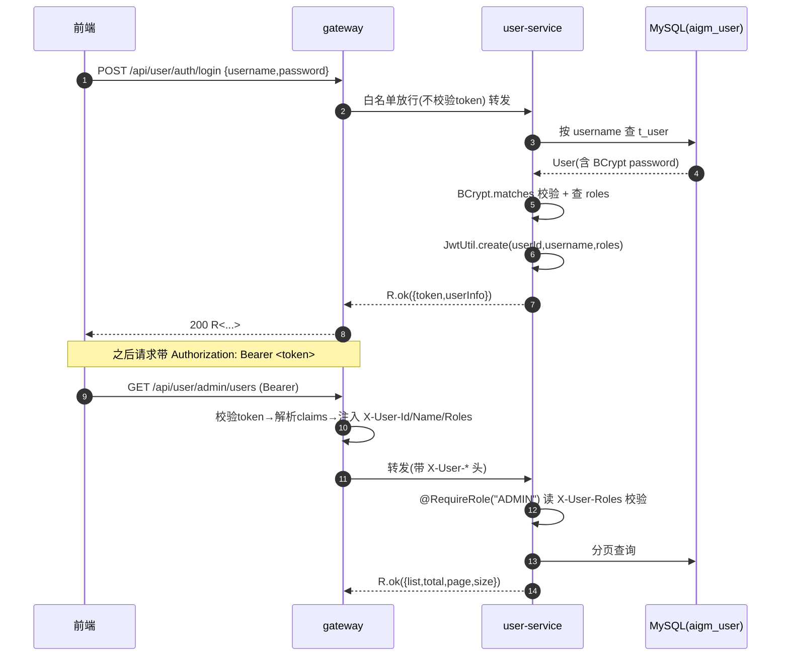

---

### 2. pom 依赖片段（`user-service/pom.xml`）

> 版本由根 `pom.xml`（parent）统一托管 Spring Boot 3.2.5 / Spring Cloud 2023.0.1 / Spring Cloud Alibaba 2023.0.1.0；此处只声明依赖坐标，版本尽量交由 BOM/parent 管理，仅对未被托管者显式写版本。

```xml
<?xml version="1.0" encoding="UTF-8"?>
<project xmlns="http://maven.apache.org/POM/4.0.0"
         xmlns:xsi="http://www.w3.org/2001/XMLSchema-instance"
         xsi:schemaLocation="http://maven.apache.org/POM/4.0.0 http://maven.apache.org/xsd/maven-4.0.0.xsd">
  <modelVersion>4.0.0</modelVersion>

  <parent>
    <groupId>com.aigm</groupId>
    <artifactId>ai-gm</artifactId>
    <version>1.0.0</version>
    <relativePath>../pom.xml</relativePath>
  </parent>

  <artifactId>user-service</artifactId>
  <packaging>jar</packaging>
  <name>user-service</name>

  <dependencies>
    <!-- 公共模块：R / ResultCode / BizException / JwtUtil / RoleConst / PageQuery 等 -->
    <dependency>
      <groupId>com.aigm</groupId>
      <artifactId>common</artifactId>
      <version>1.0.0</version>
    </dependency>

    <!-- Web（MVC，非网关，可正常引入） -->
    <dependency>
      <groupId>org.springframework.boot</groupId>
      <artifactId>spring-boot-starter-web</artifactId>
    </dependency>

    <!-- Actuator：暴露 /actuator/health（§08-devops DoD 要求各服务健康检查 UP） -->
    <dependency>
      <groupId>org.springframework.boot</groupId>
      <artifactId>spring-boot-starter-actuator</artifactId>
    </dependency>

    <!-- 参数校验 @Valid / @NotBlank -->
    <dependency>
      <groupId>org.springframework.boot</groupId>
      <artifactId>spring-boot-starter-validation</artifactId>
    </dependency>

    <!-- Nacos 注册中心 -->
    <dependency>
      <groupId>com.alibaba.cloud</groupId>
      <artifactId>spring-cloud-starter-alibaba-nacos-discovery</artifactId>
    </dependency>
    <!-- Nacos 配置中心 -->
    <dependency>
      <groupId>com.alibaba.cloud</groupId>
      <artifactId>spring-cloud-starter-alibaba-nacos-config</artifactId>
    </dependency>
    <!-- bootstrap.yml 支持（Spring Cloud 2023 需显式引入） -->
    <dependency>
      <groupId>org.springframework.cloud</groupId>
      <artifactId>spring-cloud-starter-bootstrap</artifactId>
    </dependency>

    <!-- MyBatis-Plus（Boot3 专用 starter，对应 3.5.5） -->
    <dependency>
      <groupId>com.baomidou</groupId>
      <artifactId>mybatis-plus-spring-boot3-starter</artifactId>
      <version>3.5.5</version>
    </dependency>
    <!-- MySQL 驱动（版本由 Boot3 托管） -->
    <dependency>
      <groupId>com.mysql</groupId>
      <artifactId>mysql-connector-j</artifactId>
    </dependency>

    <!-- 密码加密 BCrypt：spring-security-crypto 轻量子模块，仅取 BCryptPasswordEncoder，不引入整套安全过滤器 -->
    <dependency>
      <groupId>org.springframework.security</groupId>
      <artifactId>spring-security-crypto</artifactId>
    </dependency>

    <!-- JWT（jjwt 0.12.x），由 common 传递依赖；此处显式声明以防 scope 问题 -->
    <dependency>
      <groupId>io.jsonwebtoken</groupId>
      <artifactId>jjwt-api</artifactId>
      <version>0.12.5</version>
    </dependency>
    <dependency>
      <groupId>io.jsonwebtoken</groupId>
      <artifactId>jjwt-impl</artifactId>
      <version>0.12.5</version>
      <scope>runtime</scope>
    </dependency>
    <dependency>
      <groupId>io.jsonwebtoken</groupId>
      <artifactId>jjwt-jackson</artifactId>
      <version>0.12.5</version>
      <scope>runtime</scope>
    </dependency>

    <!-- Swagger UI（Boot3 专用） -->
    <dependency>
      <groupId>org.springdoc</groupId>
      <artifactId>springdoc-openapi-starter-webmvc-ui</artifactId>
      <version>2.5.0</version>
    </dependency>

    <!-- 测试 -->
    <dependency>
      <groupId>org.springframework.boot</groupId>
      <artifactId>spring-boot-starter-test</artifactId>
      <scope>test</scope>
    </dependency>
  </dependencies>

  <build>
    <plugins>
      <plugin>
        <groupId>org.springframework.boot</groupId>
        <artifactId>spring-boot-maven-plugin</artifactId>
      </plugin>
    </plugins>
  </build>
</project>
```

> 说明：`spring-boot-starter-security` **不引入**——只用 `spring-security-crypto` 拿 `BCryptPasswordEncoder`，避免引入整套 Spring Security 过滤链与登录页，鉴权一律走「网关校验 + 服务内注解」的轻量方案。

---

### 3. 配置文件

#### 3.1 `bootstrap.yml`（先于 application.yml 加载，定位 Nacos）

```yaml
# user-service/src/main/resources/bootstrap.yml
spring:
  application:
    name: user-service            # 注册到 Nacos 的服务名，Feign 用此名（与基线 §3.4 一致）
  profiles:
    active: local                 # 基线 §3.4.1 统一 profile=local
  cloud:
    nacos:
      discovery:
        server-addr: ${NACOS_ADDR:127.0.0.1:8848}
        username: ${NACOS_USER:nacos}
        password: ${NACOS_PASSWORD:nacos}
        namespace: public         # 基线 §3.4.1 统一 namespace=public
      config:
        server-addr: ${NACOS_ADDR:127.0.0.1:8848}
        username: ${NACOS_USER:nacos}
        password: ${NACOS_PASSWORD:nacos}
        namespace: public
        file-extension: yaml
        # 共享配置：jwt 密钥、数据库公共项等放在 aigm-common.yaml；本服务私有放 user-service.yaml
        shared-configs:
          - data-id: aigm-common.yaml
            group: DEFAULT_GROUP
            refresh: true
        # 主配置 dataId = ${spring.application.name}.${file-extension} = user-service.yaml（基线 §3.4.1，不带 profile 后缀）
```

#### 3.2 `application.yml`（本地兜底；线上以 Nacos 配置为准）

```yaml
# user-service/src/main/resources/application.yml
server:
  port: 8081                      # user-service 固定端口（gateway 8080 / user 8081 / scenario 8082 / game 8083 / ai 8084 / memory 8085）

spring:
  datasource:
    driver-class-name: com.mysql.cj.jdbc.Driver
    url: jdbc:mysql://${MYSQL_HOST:127.0.0.1}:3306/aigm_user?useSSL=false&serverTimezone=GMT%2B8&characterEncoding=utf8mb4&allowPublicKeyRetrieval=true
    username: ${MYSQL_USER:root}
    password: ${MYSQL_PASSWORD:aigm123456}   # 与 §08-devops docker-compose 的 MYSQL_ROOT_PASSWORD 一致
  jackson:
    date-format: yyyy-MM-dd HH:mm:ss   # 与 §1 3.6 统一时间格式
    time-zone: GMT+8
    default-property-inclusion: non_null

mybatis-plus:
  configuration:
    map-underscore-to-camel-case: true        # created_at -> createdAt
    log-impl: org.apache.ibatis.logging.stdout.StdOutImpl   # dev 打印 SQL，上线关掉
  global-config:
    db-config:
      id-type: auto                            # 主键自增，对齐 DDL AUTO_INCREMENT
      logic-delete-field: deleted              # 逻辑删除字段
      logic-delete-value: 1
      logic-not-delete-value: 0

# JWT 配置（线上由 Nacos 的 aigm-common.yaml 下发，所有服务共享同一 secret）
aigm:
  jwt:
    secret: aigm-super-secret-key-please-change-in-prod-2026-05-29-min-32bytes
    expire-seconds: 86400         # 24h，对齐 §1 3.3 Access Token 24h

springdoc:
  swagger-ui:
    path: /doc/user.html          # 经网关 /doc/** 放行
  api-docs:
    path: /v3/api-docs
```

#### 3.3 Nacos 上 `aigm-common.yaml`（共享配置，节选与本服务相关部分）

```yaml
# Nacos DataId: aigm-common.yaml  Group: DEFAULT_GROUP  Namespace: public
aigm:
  jwt:
    secret: aigm-super-secret-key-please-change-in-prod-2026-05-29-min-32bytes
    expire-seconds: 86400
```

> HS256 要求密钥字节长度 ≥ 32（256 bit），上述示例密钥已满足；生产替换为随机强密钥并仅放 Nacos，不入库 git。

---

### 4. 启动类与全局基础设施

#### 4.1 启动类 `UserApplication`

```java
// user-service/src/main/java/com/aigm/user/UserApplication.java
package com.aigm.user;

import org.mybatis.spring.annotation.MapperScan;
import org.springframework.boot.SpringApplication;
import org.springframework.boot.autoconfigure.SpringBootApplication;
import org.springframework.cloud.client.discovery.EnableDiscoveryClient;

@EnableDiscoveryClient                 // 注册到 Nacos
@MapperScan("com.aigm.user.mapper")    // 扫描 MyBatis-Plus Mapper
@SpringBootApplication
public class UserApplication {
    public static void main(String[] args) {
        SpringApplication.run(UserApplication.class, args);
    }
}
```

#### 4.2 MyBatis-Plus 分页插件 + BCrypt Bean `MyBatisPlusConfig`

```java
// user-service/src/main/java/com/aigm/user/config/MyBatisPlusConfig.java
package com.aigm.user.config;

import com.baomidou.mybatisplus.annotation.DbType;
import com.baomidou.mybatisplus.extension.plugins.MybatisPlusInterceptor;
import com.baomidou.mybatisplus.extension.plugins.inner.PaginationInnerInterceptor;
import org.springframework.context.annotation.Bean;
import org.springframework.context.annotation.Configuration;
import org.springframework.security.crypto.bcrypt.BCryptPasswordEncoder;
import org.springframework.security.crypto.password.PasswordEncoder;

@Configuration
public class MyBatisPlusConfig {

    @Bean
    public MybatisPlusInterceptor mybatisPlusInterceptor() {
        MybatisPlusInterceptor interceptor = new MybatisPlusInterceptor();
        interceptor.addInnerInterceptor(new PaginationInnerInterceptor(DbType.MYSQL));
        return interceptor;
    }

    @Bean
    public PasswordEncoder passwordEncoder() {
        return new BCryptPasswordEncoder();   // 默认强度 10
    }
}
```

#### 4.3 JWT 配置属性 `JwtProperties`（绑定 `aigm.jwt.*`）

```java
// user-service/src/main/java/com/aigm/user/config/JwtProperties.java
package com.aigm.user.config;

import org.springframework.boot.context.properties.ConfigurationProperties;
import org.springframework.stereotype.Component;

@Component
@ConfigurationProperties(prefix = "aigm.jwt")
public class JwtProperties {
    /** HS256 密钥，与 gateway 共享（来自 Nacos） */
    private String secret;
    /** 过期秒数，默认 86400(24h) */
    private long expireSeconds = 86400L;

    public String getSecret() { return secret; }
    public void setSecret(String secret) { this.secret = secret; }
    public long getExpireSeconds() { return expireSeconds; }
    public void setExpireSeconds(long expireSeconds) { this.expireSeconds = expireSeconds; }
}
```

> `common.util.JwtUtil` 由公共模块提供静态的签发/解析能力（基线 §2 已规定其位置）。为避免与 common 实现耦合，本服务通过下面的 `JwtTokenService` 薄封装注入 secret 后调用，签发出的 claims 结构严格对齐 §1 3.3。

---

### 5. 分层代码骨架

目录对齐 §1 §2 仓库结构：`controller / service(impl) / mapper / entity / dto`，外加 `config / security`。

```
user-service/src/main/java/com/aigm/user/
├── UserApplication.java
├── config/      MyBatisPlusConfig.java, JwtProperties.java, WebMvcConfig.java
├── security/    RequireRole.java, RoleCheckInterceptor.java, UserContext.java, JwtTokenService.java
├── controller/  AuthController.java, UserController.java, AdminUserController.java
├── service/     UserAuthService.java, UserService.java
│   └── impl/    UserAuthServiceImpl.java, UserServiceImpl.java
├── mapper/      UserMapper.java, RoleMapper.java, UserRoleMapper.java
├── entity/      User.java, Role.java, UserRole.java
└── dto/         RegisterDTO.java, LoginDTO.java, UpdateProfileDTO.java,
                 UpdateStatusDTO.java, UpdateRolesDTO.java,
                 LoginVO.java, UserVO.java
```

#### 5.1 entity（严格对齐 `t_user`/`t_role`/`t_user_role` 字段）

```java
// entity/User.java
package com.aigm.user.entity;

import com.baomidou.mybatisplus.annotation.*;
import com.fasterxml.jackson.annotation.JsonFormat;
import com.fasterxml.jackson.annotation.JsonIgnore;
import java.time.LocalDateTime;

@TableName("t_user")
public class User {
    @TableId(type = IdType.AUTO)
    private Long id;
    private String username;
    @JsonIgnore                              // 密码绝不出现在任何响应体
    private String password;                 // BCrypt 后的密文
    private String nickname;
    private String avatar;
    private Integer status;                  // 1正常 0禁用
    @TableLogic                              // 逻辑删除
    private Integer deleted;
    @JsonFormat(pattern = "yyyy-MM-dd HH:mm:ss", timezone = "GMT+8")
    private LocalDateTime createdAt;
    @JsonFormat(pattern = "yyyy-MM-dd HH:mm:ss", timezone = "GMT+8")
    private LocalDateTime updatedAt;
    // getters / setters 省略书写形式，实现时全部生成
}
```

```java
// entity/Role.java
package com.aigm.user.entity;

import com.baomidou.mybatisplus.annotation.*;
import java.time.LocalDateTime;

@TableName("t_role")
public class Role {
    @TableId(type = IdType.AUTO)
    private Long id;
    private String roleCode;     // PLAYER / AUTHOR / ADMIN
    private String roleName;
    private LocalDateTime createdAt;
    // getters / setters
}
```

```java
// entity/UserRole.java
package com.aigm.user.entity;

import com.baomidou.mybatisplus.annotation.*;

@TableName("t_user_role")
public class UserRole {
    @TableId(type = IdType.AUTO)
    private Long id;
    private Long userId;
    private Long roleId;
    // getters / setters
}
```

> 上面三个 entity 的 getter/setter 在落地时必须完整生成（或用 Lombok `@Data`；若用 Lombok 需在 pom 加 `lombok` 依赖并配 annotation processor，本规格不强制）。

#### 5.2 dto（请求/响应载体，字段名对齐 §1 5.1 API 契约）

```java
// dto/RegisterDTO.java  —— POST /api/user/auth/register 请求体
package com.aigm.user.dto;

import jakarta.validation.constraints.*;

public class RegisterDTO {
    @NotBlank(message = "用户名不能为空")
    @Pattern(regexp = "^[A-Za-z0-9_]{3,50}$", message = "用户名为3-50位字母数字下划线")
    private String username;

    @NotBlank(message = "密码不能为空")
    @Size(min = 6, max = 32, message = "密码长度6-32")
    private String password;

    private String nickname;   // 可空，默认取 username
    // getters / setters
}
```

```java
// dto/LoginDTO.java  —— POST /api/user/auth/login 请求体
package com.aigm.user.dto;

import jakarta.validation.constraints.NotBlank;

public class LoginDTO {
    @NotBlank(message = "用户名不能为空")
    private String username;
    @NotBlank(message = "密码不能为空")
    private String password;
    // getters / setters
}
```

```java
// dto/UpdateProfileDTO.java —— PUT /api/user/me
package com.aigm.user.dto;

public class UpdateProfileDTO {
    private String nickname;   // 二者均可空，只更新非空字段
    private String avatar;
    // getters / setters
}
```

```java
// dto/UpdateStatusDTO.java —— PUT /api/user/admin/users/{id}/status
package com.aigm.user.dto;

import jakarta.validation.constraints.NotNull;

public class UpdateStatusDTO {
    @NotNull(message = "status 不能为空")
    private Integer status;    // 1正常 0禁用
    // getters / setters
}
```

```java
// dto/UpdateRolesDTO.java —— PUT /api/user/admin/users/{id}/roles
package com.aigm.user.dto;

import jakarta.validation.constraints.NotEmpty;
import java.util.List;

public class UpdateRolesDTO {
    @NotEmpty(message = "roles 不能为空")
    private List<String> roles;  // ["PLAYER","AUTHOR","ADMIN"] 子集
    // getters / setters
}
```

```java
// dto/LoginVO.java —— 登录响应 data
package com.aigm.user.dto;

public class LoginVO {
    private String token;
    private UserVO userInfo;     // {userId,username,nickname,roles[]}
    // getters / setters
    public LoginVO() {}
    public LoginVO(String token, UserVO userInfo) { this.token = token; this.userInfo = userInfo; }
}
```

```java
// dto/UserVO.java —— /api/user/me 与 admin 列表的用户视图
package com.aigm.user.dto;

import com.fasterxml.jackson.annotation.JsonFormat;
import java.time.LocalDateTime;
import java.util.List;

public class UserVO {
    private Long userId;          // 对外字段名用 userId（对齐契约），内部对应 t_user.id
    private String username;
    private String nickname;
    private String avatar;
    private Integer status;
    private List<String> roles;   // ["PLAYER",...]
    @JsonFormat(pattern = "yyyy-MM-dd HH:mm:ss", timezone = "GMT+8")
    private LocalDateTime createdAt;
    // getters / setters
}
```

#### 5.3 mapper（MyBatis-Plus，复杂查询用注解 SQL）

```java
// mapper/UserMapper.java
package com.aigm.user.mapper;

import com.aigm.user.entity.User;
import com.baomidou.mybatisplus.core.mapper.BaseMapper;
import org.apache.ibatis.annotations.Mapper;

@Mapper
public interface UserMapper extends BaseMapper<User> {
    // 基础 CRUD + 分页由 BaseMapper + 分页插件提供，无需自写
}
```

```java
// mapper/RoleMapper.java
package com.aigm.user.mapper;

import com.aigm.user.entity.Role;
import com.baomidou.mybatisplus.core.mapper.BaseMapper;
import org.apache.ibatis.annotations.Mapper;
import org.apache.ibatis.annotations.Param;
import org.apache.ibatis.annotations.Select;
import java.util.List;

@Mapper
public interface RoleMapper extends BaseMapper<Role> {

    /** 按 userId 查其角色编码列表（连表 t_user_role） */
    @Select("SELECT r.role_code FROM t_role r " +
            "JOIN t_user_role ur ON ur.role_id = r.id " +
            "WHERE ur.user_id = #{userId}")
    List<String> selectRoleCodesByUserId(@Param("userId") Long userId);
}
```

```java
// mapper/UserRoleMapper.java
package com.aigm.user.mapper;

import com.aigm.user.entity.UserRole;
import com.baomidou.mybatisplus.core.mapper.BaseMapper;
import org.apache.ibatis.annotations.Mapper;

@Mapper
public interface UserRoleMapper extends BaseMapper<UserRole> {
    // 角色分配走 delete by userId + 批量 insert，BaseMapper 足够
}
```

---

### 6. 安全基础设施（JWT 签发 + 服务内 RBAC）

#### 6.1 JWT 签发封装 `JwtTokenService`

> 复用 `common.util.JwtUtil`（基线规定其在 common 中）。本服务注入密钥与过期时长，产出严格对齐 §1 3.3 claims 的 token。

```java
// security/JwtTokenService.java
package com.aigm.user.security;

import com.aigm.common.util.JwtUtil;      // 来自 common 模块
import com.aigm.user.config.JwtProperties;
import org.springframework.stereotype.Service;
import java.util.List;

@Service
public class JwtTokenService {

    private final JwtProperties props;

    public JwtTokenService(JwtProperties props) {
        this.props = props;
    }

    /**
     * 签发 Access Token。
     * claims 与 §1 3.3 一致：userId / username / roles / iat / exp。
     */
    public String issue(Long userId, String username, List<String> roles) {
        return JwtUtil.create(
                props.getSecret(),
                props.getExpireSeconds(),
                userId,
                username,
                roles
        );
    }
}
```

> `JwtUtil.create(secret, expireSeconds, userId, username, roles)` 用 HS256，内部以 `Keys.hmacShaKeyFor(secret.getBytes(StandardCharsets.UTF_8))` 构造密钥，`setIssuedAt(now)`、`setExpiration(now+expire)`，并 `claim("userId",userId)`、`claim("username",username)`、`claim("roles",roles)`。gateway 用同一 `JwtUtil.parse(secret, token)` 解析，保证一致。

#### 6.2 当前请求上下文 `UserContext`（读取网关透传头）

```java
// security/UserContext.java
package com.aigm.user.security;

import jakarta.servlet.http.HttpServletRequest;
import org.springframework.web.context.request.RequestContextHolder;
import org.springframework.web.context.request.ServletRequestAttributes;
import java.util.Arrays;
import java.util.Collections;
import java.util.List;

/** 从网关透传头读取当前用户身份（§1 3.3：X-User-Id / X-User-Name / X-User-Roles）。 */
public final class UserContext {

    public static final String H_USER_ID    = "X-User-Id";
    public static final String H_USER_NAME  = "X-User-Name";
    public static final String H_USER_ROLES = "X-User-Roles";   // 逗号分隔

    private UserContext() {}

    private static HttpServletRequest request() {
        ServletRequestAttributes attrs =
                (ServletRequestAttributes) RequestContextHolder.getRequestAttributes();
        return attrs == null ? null : attrs.getRequest();
    }

    public static Long getUserId() {
        HttpServletRequest req = request();
        if (req == null) return null;
        String v = req.getHeader(H_USER_ID);
        return (v == null || v.isBlank()) ? null : Long.valueOf(v);
    }

    public static String getUsername() {
        HttpServletRequest req = request();
        return req == null ? null : req.getHeader(H_USER_NAME);
    }

    public static List<String> getRoles() {
        HttpServletRequest req = request();
        if (req == null) return Collections.emptyList();
        String v = req.getHeader(H_USER_ROLES);
        if (v == null || v.isBlank()) return Collections.emptyList();
        return Arrays.stream(v.split(",")).map(String::trim).filter(s -> !s.isEmpty()).toList();
    }

    public static boolean hasRole(String roleCode) {
        return getRoles().contains(roleCode);
    }
}
```

#### 6.3 方法级 RBAC 注解 `@RequireRole` + 拦截器

```java
// security/RequireRole.java
package com.aigm.user.security;

import java.lang.annotation.*;

/** 标注在 Controller 方法或类上，要求当前用户至少具备其一角色（OR 关系）。 */
@Target({ElementType.METHOD, ElementType.TYPE})
@Retention(RetentionPolicy.RUNTIME)
public @interface RequireRole {
    String[] value();   // 例如 {"ADMIN"} 或 {"AUTHOR","ADMIN"}；引用 RoleConst 常量
}
```

```java
// security/RoleCheckInterceptor.java
package com.aigm.user.security;

import com.aigm.common.exception.BizException;
import com.aigm.common.result.ResultCode;
import jakarta.servlet.http.HttpServletRequest;
import jakarta.servlet.http.HttpServletResponse;
import org.springframework.stereotype.Component;
import org.springframework.web.method.HandlerMethod;
import org.springframework.web.servlet.HandlerInterceptor;
import java.util.Arrays;
import java.util.List;

/** 解析 @RequireRole，结合网关透传头做角色校验。 */
@Component
public class RoleCheckInterceptor implements HandlerInterceptor {

    @Override
    public boolean preHandle(HttpServletRequest request, HttpServletResponse response, Object handler) {
        if (!(handler instanceof HandlerMethod hm)) {
            return true;
        }
        // 方法注解优先，其次类注解
        RequireRole ann = hm.getMethodAnnotation(RequireRole.class);
        if (ann == null) {
            ann = hm.getBeanType().getAnnotation(RequireRole.class);
        }
        if (ann == null) {
            return true;   // 无注解 = 仅需登录（网关已校验 token），放行
        }
        // 必须已登录（网关注入了 X-User-Id）
        Long userId = UserContext.getUserId();
        if (userId == null) {
            throw new BizException(ResultCode.AUTH_NOT_LOGIN);          // 1001 未登录/Token缺失
        }
        List<String> need = Arrays.asList(ann.value());
        boolean ok = UserContext.getRoles().stream().anyMatch(need::contains);
        if (!ok) {
            throw new BizException(ResultCode.AUTH_NO_PERMISSION);             // 1005 无权限(角色不足)
        }
        return true;
    }
}
```

```java
// config/WebMvcConfig.java —— 注册拦截器
package com.aigm.user.config;

import com.aigm.user.security.RoleCheckInterceptor;
import org.springframework.context.annotation.Configuration;
import org.springframework.web.servlet.config.annotation.InterceptorRegistry;
import org.springframework.web.servlet.config.annotation.WebMvcConfigurer;

@Configuration
public class WebMvcConfig implements WebMvcConfigurer {

    private final RoleCheckInterceptor roleCheckInterceptor;

    public WebMvcConfig(RoleCheckInterceptor roleCheckInterceptor) {
        this.roleCheckInterceptor = roleCheckInterceptor;
    }

    @Override
    public void addInterceptors(InterceptorRegistry registry) {
        registry.addInterceptor(roleCheckInterceptor)
                .addPathPatterns("/api/user/**")
                // 注册/登录是白名单（网关已放行，且无身份头），无需走角色拦截
                .excludePathPatterns(
                        "/api/user/auth/register",
                        "/api/user/auth/login",
                        "/doc/**", "/v3/api-docs/**"
                );
    }
}
```

> 两层 RBAC（对齐 §1 要求「网关解析 + 服务内注解校验」）：
> 1. **网关层（粗粒度）**：gateway 校验 token 合法性、按路由前缀做角色门禁（如 `/api/user/admin/**` 在网关也可加 ADMIN 门禁），并注入 `X-User-*`。
> 2. **服务内（细粒度）**：本服务用 `@RequireRole("ADMIN")` 等注解 + 拦截器二次确认角色，做纵深防御；同时支持「本人」类校验（在 service 层比对 `UserContext.getUserId()`）。

引用的角色常量来自 `common.constant.RoleConst`（基线 §2）：`RoleConst.PLAYER="PLAYER"`、`RoleConst.AUTHOR="AUTHOR"`、`RoleConst.ADMIN="ADMIN"`。

---

### 7. service 层

#### 7.1 接口

```java
// service/UserAuthService.java
package com.aigm.user.service;

import com.aigm.user.dto.LoginDTO;
import com.aigm.user.dto.LoginVO;
import com.aigm.user.dto.RegisterDTO;

public interface UserAuthService {
    /** 注册，返回新用户 id；默认授予 PLAYER */
    Long register(RegisterDTO dto);
    /** 登录，校验密码 + 状态，签发 JWT */
    LoginVO login(LoginDTO dto);
}
```

```java
// service/UserService.java
package com.aigm.user.service;

import com.aigm.common.util.PageQuery;
import com.aigm.common.util.PageResult;
import com.aigm.user.dto.UpdateProfileDTO;
import com.aigm.user.dto.UserVO;
import java.util.List;

public interface UserService {
    /** 当前登录用户信息 */
    UserVO getCurrentUser(Long userId);
    /** 修改个人资料(仅 nickname/avatar) */
    boolean updateProfile(Long userId, UpdateProfileDTO dto);

    // ===== 管理员 =====
    /** 分页查用户(可按 username 模糊) */
    PageResult<UserVO> pageUsers(PageQuery query, String username);
    /** 启用/禁用 */
    boolean updateStatus(Long userId, Integer status);
    /** 分配角色(全量覆盖) */
    boolean updateRoles(Long userId, List<String> roleCodes);
    /** 逻辑删除用户 */
    boolean deleteUser(Long userId);
}
```

#### 7.2 注册 + 登录实现 `UserAuthServiceImpl`

```java
// service/impl/UserAuthServiceImpl.java
package com.aigm.user.service.impl;

import com.aigm.common.constant.RoleConst;
import com.aigm.common.exception.BizException;
import com.aigm.common.result.ResultCode;
import com.aigm.user.dto.*;
import com.aigm.user.entity.Role;
import com.aigm.user.entity.User;
import com.aigm.user.entity.UserRole;
import com.aigm.user.mapper.RoleMapper;
import com.aigm.user.mapper.UserMapper;
import com.aigm.user.mapper.UserRoleMapper;
import com.aigm.user.security.JwtTokenService;
import com.aigm.user.service.UserAuthService;
import com.baomidou.mybatisplus.core.toolkit.Wrappers;
import org.springframework.security.crypto.password.PasswordEncoder;
import org.springframework.stereotype.Service;
import org.springframework.transaction.annotation.Transactional;
import java.util.List;

@Service
public class UserAuthServiceImpl implements UserAuthService {

    private final UserMapper userMapper;
    private final RoleMapper roleMapper;
    private final UserRoleMapper userRoleMapper;
    private final PasswordEncoder passwordEncoder;
    private final JwtTokenService jwtTokenService;

    public UserAuthServiceImpl(UserMapper userMapper, RoleMapper roleMapper,
                               UserRoleMapper userRoleMapper, PasswordEncoder passwordEncoder,
                               JwtTokenService jwtTokenService) {
        this.userMapper = userMapper;
        this.roleMapper = roleMapper;
        this.userRoleMapper = userRoleMapper;
        this.passwordEncoder = passwordEncoder;
        this.jwtTokenService = jwtTokenService;
    }

    @Override
    @Transactional(rollbackFor = Exception.class)
    public Long register(RegisterDTO dto) {
        // 1. 用户名唯一性校验
        Long exist = userMapper.selectCount(
                Wrappers.<User>lambdaQuery().eq(User::getUsername, dto.getUsername()));
        if (exist != null && exist > 0) {
            throw new BizException(ResultCode.RESOURCE_EXISTS, "用户名已被占用"); // 1201
        }
        // 2. 落库：BCrypt 加密密码
        User u = new User();
        u.setUsername(dto.getUsername());
        u.setPassword(passwordEncoder.encode(dto.getPassword()));
        u.setNickname(dto.getNickname() == null || dto.getNickname().isBlank()
                ? dto.getUsername() : dto.getNickname());
        u.setStatus(1);
        userMapper.insert(u);   // 回填自增 id
        // 3. 默认授予 PLAYER 角色
        Role player = roleMapper.selectOne(
                Wrappers.<Role>lambdaQuery().eq(Role::getRoleCode, RoleConst.PLAYER));
        if (player == null) {
            throw new BizException(ResultCode.SYSTEM_ERROR, "PLAYER 角色未初始化"); // 1900
        }
        UserRole ur = new UserRole();
        ur.setUserId(u.getId());
        ur.setRoleId(player.getId());
        userRoleMapper.insert(ur);
        return u.getId();
    }

    @Override
    public LoginVO login(LoginDTO dto) {
        // 1. 取用户
        User u = userMapper.selectOne(
                Wrappers.<User>lambdaQuery().eq(User::getUsername, dto.getUsername()));
        if (u == null || !passwordEncoder.matches(dto.getPassword(), u.getPassword())) {
            throw new BizException(ResultCode.AUTH_BAD_CREDENTIALS);   // 1002 用户名或密码错误（不区分以防枚举）
        }
        // 2. 状态校验
        if (u.getStatus() == null || u.getStatus() != 1) {
            throw new BizException(ResultCode.AUTH_ACCOUNT_DISABLED); // 1006 账号被禁用
        }
        // 3. 查角色 + 签发 token
        List<String> roles = roleMapper.selectRoleCodesByUserId(u.getId());
        String token = jwtTokenService.issue(u.getId(), u.getUsername(), roles);
        // 4. 组装响应
        UserVO info = new UserVO();
        info.setUserId(u.getId());
        info.setUsername(u.getUsername());
        info.setNickname(u.getNickname());
        info.setRoles(roles);
        return new LoginVO(token, info);
    }
}
```

#### 7.3 用户/管理实现 `UserServiceImpl`

```java
// service/impl/UserServiceImpl.java
package com.aigm.user.service.impl;

import com.aigm.common.constant.RoleConst;
import com.aigm.common.exception.BizException;
import com.aigm.common.result.ResultCode;
import com.aigm.common.util.PageQuery;
import com.aigm.common.util.PageResult;
import com.aigm.user.dto.UpdateProfileDTO;
import com.aigm.user.dto.UserVO;
import com.aigm.user.entity.Role;
import com.aigm.user.entity.User;
import com.aigm.user.entity.UserRole;
import com.aigm.user.mapper.RoleMapper;
import com.aigm.user.mapper.UserMapper;
import com.aigm.user.mapper.UserRoleMapper;
import com.aigm.user.service.UserService;
import com.baomidou.mybatisplus.core.conditions.query.LambdaQueryWrapper;
import com.baomidou.mybatisplus.core.toolkit.Wrappers;
import com.baomidou.mybatisplus.extension.plugins.pagination.Page;
import org.springframework.stereotype.Service;
import org.springframework.transaction.annotation.Transactional;
import org.springframework.util.StringUtils;
import java.util.*;

@Service
public class UserServiceImpl implements UserService {

    private final UserMapper userMapper;
    private final RoleMapper roleMapper;
    private final UserRoleMapper userRoleMapper;

    public UserServiceImpl(UserMapper userMapper, RoleMapper roleMapper, UserRoleMapper userRoleMapper) {
        this.userMapper = userMapper;
        this.roleMapper = roleMapper;
        this.userRoleMapper = userRoleMapper;
    }

    @Override
    public UserVO getCurrentUser(Long userId) {
        User u = userMapper.selectById(userId);
        if (u == null) {
            throw new BizException(ResultCode.RESOURCE_NOT_FOUND); // 1200
        }
        return toVO(u, roleMapper.selectRoleCodesByUserId(userId));
    }

    @Override
    public boolean updateProfile(Long userId, UpdateProfileDTO dto) {
        User u = userMapper.selectById(userId);
        if (u == null) {
            throw new BizException(ResultCode.RESOURCE_NOT_FOUND);
        }
        if (StringUtils.hasText(dto.getNickname())) u.setNickname(dto.getNickname());
        if (dto.getAvatar() != null) u.setAvatar(dto.getAvatar());
        return userMapper.updateById(u) > 0;
    }

    @Override
    public PageResult<UserVO> pageUsers(PageQuery query, String username) {
        Page<User> page = new Page<>(query.getPage(), query.getSize());
        LambdaQueryWrapper<User> qw = Wrappers.<User>lambdaQuery()
                .like(StringUtils.hasText(username), User::getUsername, username)
                .orderByDesc(User::getId);
        Page<User> result = userMapper.selectPage(page, qw);
        // 批量取角色，避免 N+1（演示规模可逐个查；此处给批量思路）
        List<UserVO> list = new ArrayList<>();
        for (User u : result.getRecords()) {
            list.add(toVO(u, roleMapper.selectRoleCodesByUserId(u.getId())));
        }
        return PageResult.of(list, result.getTotal(), query.getPage(), query.getSize());
    }

    @Override
    public boolean updateStatus(Long userId, Integer status) {
        if (status == null || (status != 0 && status != 1)) {
            throw new BizException(ResultCode.PARAM_INVALID); // 1100
        }
        User u = userMapper.selectById(userId);
        if (u == null) {
            throw new BizException(ResultCode.RESOURCE_NOT_FOUND);
        }
        u.setStatus(status);
        return userMapper.updateById(u) > 0;
    }

    @Override
    @Transactional(rollbackFor = Exception.class)
    public boolean updateRoles(Long userId, List<String> roleCodes) {
        User u = userMapper.selectById(userId);
        if (u == null) {
            throw new BizException(ResultCode.RESOURCE_NOT_FOUND);
        }
        // 1. 校验角色编码合法（必须是 PLAYER/AUTHOR/ADMIN）
        Set<String> allowed = Set.of(RoleConst.PLAYER, RoleConst.AUTHOR, RoleConst.ADMIN);
        for (String rc : roleCodes) {
            if (!allowed.contains(rc)) {
                throw new BizException(ResultCode.PARAM_INVALID, "非法角色编码: " + rc);
            }
        }
        // 2. 取角色 id
        List<Role> roles = roleMapper.selectList(
                Wrappers.<Role>lambdaQuery().in(Role::getRoleCode, roleCodes));
        if (roles.size() != new HashSet<>(roleCodes).size()) {
            throw new BizException(ResultCode.RESOURCE_NOT_FOUND, "存在未初始化的角色");
        }
        // 3. 全量覆盖：先删后插
        userRoleMapper.delete(Wrappers.<UserRole>lambdaQuery().eq(UserRole::getUserId, userId));
        for (Role r : roles) {
            UserRole ur = new UserRole();
            ur.setUserId(userId);
            ur.setRoleId(r.getId());
            userRoleMapper.insert(ur);
        }
        return true;
    }

    @Override
    public boolean deleteUser(Long userId) {
        User u = userMapper.selectById(userId);
        if (u == null) {
            throw new BizException(ResultCode.RESOURCE_NOT_FOUND);
        }
        // @TableLogic 生效，deleteById 实为 UPDATE deleted=1
        return userMapper.deleteById(userId) > 0;
    }

    private UserVO toVO(User u, List<String> roles) {
        UserVO vo = new UserVO();
        vo.setUserId(u.getId());
        vo.setUsername(u.getUsername());
        vo.setNickname(u.getNickname());
        vo.setAvatar(u.getAvatar());
        vo.setStatus(u.getStatus());
        vo.setRoles(roles);
        vo.setCreatedAt(u.getCreatedAt());
        return vo;
    }
}
```

> `PageQuery`/`PageResult` 来自 `common.util`（基线 §2）：`PageQuery{page,size}`（含 1103 越界校验），`PageResult.of(list,total,page,size)` 产出 `{list,total,page,size}` 结构（对齐 §1 3.7）。

---

### 8. controller 层（路径/角色/响应体严格对齐 §1 5.1）

#### 8.1 `AuthController`（白名单，注册/登录）

```java
// controller/AuthController.java
package com.aigm.user.controller;

import com.aigm.common.result.R;
import com.aigm.user.dto.LoginDTO;
import com.aigm.user.dto.LoginVO;
import com.aigm.user.dto.RegisterDTO;
import com.aigm.user.service.UserAuthService;
import jakarta.validation.Valid;
import org.springframework.web.bind.annotation.*;
import java.util.Map;

@RestController
@RequestMapping("/api/user/auth")
public class AuthController {

    private final UserAuthService authService;

    public AuthController(UserAuthService authService) {
        this.authService = authService;
    }

    /** POST /api/user/auth/register  PUBLIC  -> {userId} */
    @PostMapping("/register")
    public R<Map<String, Long>> register(@Valid @RequestBody RegisterDTO dto) {
        Long userId = authService.register(dto);
        return R.ok(Map.of("userId", userId));
    }

    /** POST /api/user/auth/login  PUBLIC  -> {token,userInfo:{...}} */
    @PostMapping("/login")
    public R<LoginVO> login(@Valid @RequestBody LoginDTO dto) {
        return R.ok(authService.login(dto));
    }
}
```

#### 8.2 `UserController`（当前用户）

```java
// controller/UserController.java
package com.aigm.user.controller;

import com.aigm.common.result.R;
import com.aigm.user.dto.UpdateProfileDTO;
import com.aigm.user.dto.UserVO;
import com.aigm.user.security.UserContext;
import com.aigm.user.service.UserService;
import jakarta.validation.Valid;
import org.springframework.web.bind.annotation.*;

@RestController
@RequestMapping("/api/user")
public class UserController {

    private final UserService userService;

    public UserController(UserService userService) {
        this.userService = userService;
    }

    /** GET /api/user/me  登录任意  -> {userId,username,nickname,avatar,roles[]} */
    @GetMapping("/me")
    public R<UserVO> me() {
        Long userId = UserContext.getUserId();   // 来自网关透传头
        return R.ok(userService.getCurrentUser(userId));
    }

    /** PUT /api/user/me  登录任意  -> true */
    @PutMapping("/me")
    public R<Boolean> updateMe(@Valid @RequestBody UpdateProfileDTO dto) {
        Long userId = UserContext.getUserId();
        return R.ok(userService.updateProfile(userId, dto));
    }
}
```

#### 8.3 `AdminUserController`（ADMIN 管理用户与角色）

```java
// controller/AdminUserController.java
package com.aigm.user.controller;

import com.aigm.common.constant.RoleConst;
import com.aigm.common.result.R;
import com.aigm.common.util.PageQuery;
import com.aigm.common.util.PageResult;
import com.aigm.user.dto.UpdateRolesDTO;
import com.aigm.user.dto.UpdateStatusDTO;
import com.aigm.user.dto.UserVO;
import com.aigm.user.security.RequireRole;
import com.aigm.user.service.UserService;
import jakarta.validation.Valid;
import org.springframework.web.bind.annotation.*;

@RestController
@RequestMapping("/api/user/admin/users")
@RequireRole(RoleConst.ADMIN)     // 类级：本控制器所有方法均要求 ADMIN（1005 不足）
public class AdminUserController {

    private final UserService userService;

    public AdminUserController(UserService userService) {
        this.userService = userService;
    }

    /** GET /api/user/admin/users?page&size&username  ADMIN  -> {list,total,page,size} */
    @GetMapping
    public R<PageResult<UserVO>> page(@RequestParam(defaultValue = "1") Integer page,
                                      @RequestParam(defaultValue = "10") Integer size,
                                      @RequestParam(required = false) String username) {
        PageQuery query = new PageQuery(page, size);   // 内部做 1103 越界校验
        return R.ok(userService.pageUsers(query, username));
    }

    /** PUT /api/user/admin/users/{id}/status  ADMIN  -> true */
    @PutMapping("/{id}/status")
    public R<Boolean> updateStatus(@PathVariable Long id, @Valid @RequestBody UpdateStatusDTO dto) {
        return R.ok(userService.updateStatus(id, dto.getStatus()));
    }

    /** PUT /api/user/admin/users/{id}/roles  ADMIN  -> true  （RBAC 核心：分配角色） */
    @PutMapping("/{id}/roles")
    public R<Boolean> updateRoles(@PathVariable Long id, @Valid @RequestBody UpdateRolesDTO dto) {
        return R.ok(userService.updateRoles(id, dto.getRoles()));
    }

    /** DELETE /api/user/admin/users/{id}  ADMIN  -> true  （逻辑删除） */
    @DeleteMapping("/{id}")
    public R<Boolean> delete(@PathVariable Long id) {
        return R.ok(userService.deleteUser(id));
    }
}
```

> 错误处理由 `common.exception.GlobalExceptionHandler` 统一兜底：`BizException` → `R.fail(code,message)`；`@Valid` 校验失败 → 1100 参数校验失败；其它未捕获异常 → 1900 系统内部错误。本服务**不重复实现**全局异常处理器，直接复用 common。

---

### 9. RBAC 全链路与角色矩阵

#### 9.1 角色权限矩阵（本服务接口）

| 接口 | PUBLIC | PLAYER | AUTHOR | ADMIN |
|---|:---:|:---:|:---:|:---:|
| POST `/api/user/auth/register` | ✅ | ✅ | ✅ | ✅ |
| POST `/api/user/auth/login` | ✅ | ✅ | ✅ | ✅ |
| GET `/api/user/me` | ❌ | ✅ | ✅ | ✅ |
| PUT `/api/user/me` | ❌ | ✅ | ✅ | ✅ |
| GET `/api/user/admin/users` | ❌ | ❌ | ❌ | ✅ |
| PUT `/api/user/admin/users/{id}/status` | ❌ | ❌ | ❌ | ✅ |
| PUT `/api/user/admin/users/{id}/roles` | ❌ | ❌ | ❌ | ✅ |
| DELETE `/api/user/admin/users/{id}` | ❌ | ❌ | ❌ | ✅ |

#### 9.2 状态/角色变更不立即吊销旧 token 的说明

JWT 无状态，禁用用户或改其角色后，已签发的 token 在 24h 内仍可能通过网关校验。毕设范围内的处理：

- 禁用（status=0）：下次**登录**即拒（1006）；已持有 token 的会话不主动踢出（可接受）。
- 改角色：以**重新登录**后签发的新 token 生效为准。
- 如需更强一致性（超出毕设必需）：可在网关接入一个轻量「用户状态/版本」缓存校验，但本规格不要求实现。

RBAC 决策流：

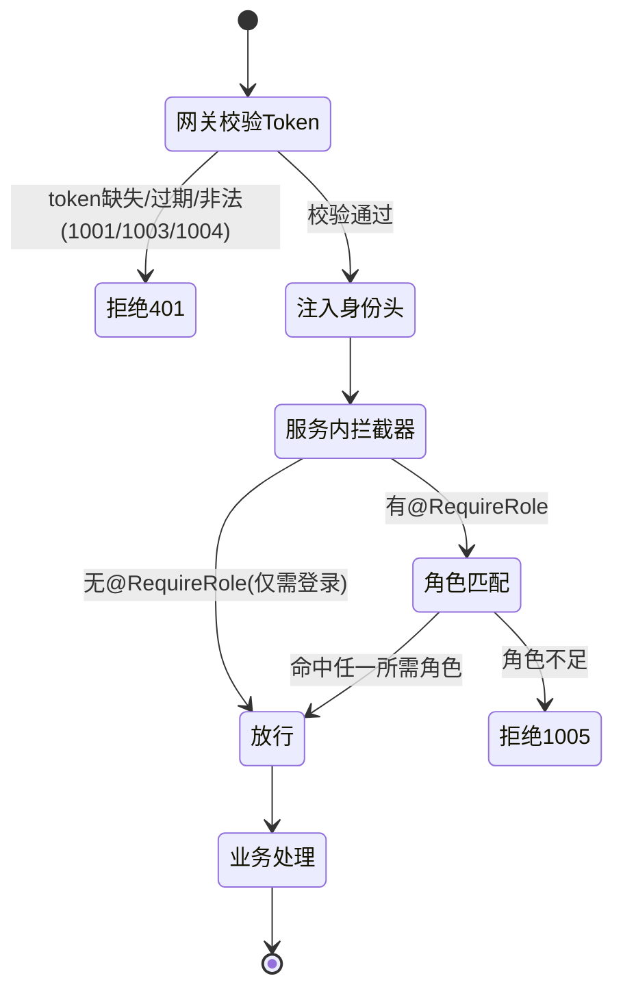

---

### 10. 密码与安全要点

- **存储**：仅存 BCrypt 密文（`BCryptPasswordEncoder` 默认 strength=10，自带盐），`t_user.password` 长度 100 足够（BCrypt 输出 60 字符）。明文密码绝不落库、绝不打日志。
- **响应**：`User.password` 加 `@JsonIgnore`，且对外一律用 `UserVO`（无 password 字段），双重保证密码不外泄。
- **登录失败信息**：用户名不存在与密码错误统一返回 1002「用户名或密码错误」，防止用户名枚举。
- **传输**：演示环境 HTTP；如部署到公网应启用 HTTPS（超出毕设必需，文档建议即可）。
- **密钥**：`aigm.jwt.secret` 仅放 Nacos，长度 ≥ 32 字节满足 HS256；不硬编码进打包产物的关键路径。

---

### 11. 错误码使用对照（本服务）

| 场景 | ResultCode | code | message(默认) |
|---|---|---|---|
| 未登录/缺少身份头 | `AUTH_NOT_LOGIN` | 1001 | 未登录或登录已失效 |
| 登录失败(用户名或密码错误) | `AUTH_BAD_CREDENTIALS` | 1002 | 用户名或密码错误 |
| 角色不足(非 ADMIN 访问 admin 接口) | `AUTH_NO_PERMISSION` | 1005 | 无权限访问 |
| 账号被禁用(status=0 登录) | `AUTH_ACCOUNT_DISABLED` | 1006 | 账号已被禁用 |
| 参数校验失败(@Valid) | `PARAM_INVALID` | 1100 | 参数校验失败 |
| 用户名已存在 | `RESOURCE_EXISTS` | 1201 | 资源已存在 |
| 用户不存在/角色未初始化 | `RESOURCE_NOT_FOUND` | 1200 | 资源不存在 |
| 分页参数越界 | `PAGE_PARAM_INVALID` | 1103 | 分页参数非法 |
| 角色未初始化等系统问题 | `SYSTEM_ERROR` | 1900 | 系统内部错误 |

> 上表 `ResultCode` 枚举名为建议命名，code 与 message 必须与 §1 3.2 错误码表一致；落地时以 common 中 `ResultCode` 已定义的常量名为准，本服务只负责正确「使用」而非「重定义」。

---

### 12. 验收标准（DoD，可逐条验证）

> 假设 gateway(8080)、Nacos(8848)、MySQL(3306, 已建 `aigm_user` 并跑过 §1 4.1 DDL)、user-service(8081) 均已启动。下列命令经 **gateway** 访问（端口 8080）。

1. **服务注册**：Nacos 控制台「服务列表」可见 `user-service`，健康实例数 ≥ 1；配置中心存在 `user-service.yaml` 与 `aigm-common.yaml`。
2. **注册成功**：
   ```bash
   curl -s -X POST http://localhost:8080/api/user/auth/register \
     -H "Content-Type: application/json" \
     -d '{"username":"alice","password":"123456","nickname":"爱丽丝"}'
   # 期望: {"code":0,"message":"success","data":{"userId": <自增id>}}
   ```
   且 `t_user` 新增一行（password 为 60 字符 BCrypt 串，以 `$2a$` 开头），`t_user_role` 新增一行指向 PLAYER。
3. **注册重名拦截**：重复上一步同 username → `{"code":1201,...}`。
4. **注册参数校验**：`password` 少于 6 位 → `{"code":1100,...}`。
5. **登录成功并签发 JWT**：
   ```bash
   curl -s -X POST http://localhost:8080/api/user/auth/login \
     -H "Content-Type: application/json" -d '{"username":"alice","password":"123456"}'
   # 期望: data.token 为三段式 JWT；data.userInfo.roles 含 "PLAYER"
   ```
   将 token 的 payload base64 解码后包含 `userId`/`username`/`roles`/`iat`/`exp` 五个 claim，`exp-iat == 86400`。
6. **登录失败**：错误密码 → `{"code":1002,...}`；不存在的用户名同样 1002（不泄露存在性）。
7. **带 token 访问 me**：
   ```bash
   curl -s http://localhost:8080/api/user/me -H "Authorization: Bearer <token>"
   # 期望: data 含 userId/username/nickname/avatar/roles，且无 password 字段
   ```
8. **无 token 访问 me**：网关拦截返回 `{"code":1001,...}`（HTTP 401 或 200+code=1001，按网关实现，与 §1 3.3 一致）。
9. **RBAC 拦截（核心）**：用 PLAYER 的 token 访问 `GET /api/user/admin/users` → `{"code":1005,...}`（角色不足）。
10. **管理员链路**：
    - 直接在 `t_user_role` 给某用户加 ADMIN（或预置一个 admin 账号），重新登录拿 ADMIN token。
    - `GET /api/user/admin/users?page=1&size=10` → `data` 为 `{list,total,page,size}` 分页结构，`list` 中每项含 `roles`。
    - `PUT /api/user/admin/users/{id}/roles` body `{"roles":["PLAYER","AUTHOR"]}` → `data:true`；之后该用户重新登录，`roles` 变为 `["PLAYER","AUTHOR"]`，`t_user_role` 对应两行（全量覆盖）。
    - `PUT /api/user/admin/users/{id}/status` body `{"status":0}` → `data:true`；该用户再登录返回 1006。
    - `DELETE /api/user/admin/users/{id}` → `data:true`；`t_user.deleted` 变为 1，列表查询不再出现该用户（逻辑删除生效）。
11. **分页越界**：`GET /api/user/admin/users?page=0&size=999` → `{"code":1103,...}`（PageQuery 越界校验）。
12. **统一返回体**：以上所有响应均为 `{code,message,data}` 三字段结构；成功 `code=0,message="success"`。
13. **密码不外泄**：任何接口响应、任何日志中均不出现明文或密文 password 字段（`User` 的 `@JsonIgnore` + 全部对外走 `UserVO` 已保证）。
14. **Swagger 可达**：`http://localhost:8080/doc/user.html`（经网关 `/doc/**` 白名单）可打开，列出本服务全部接口。

#### 验收时间线（建议）

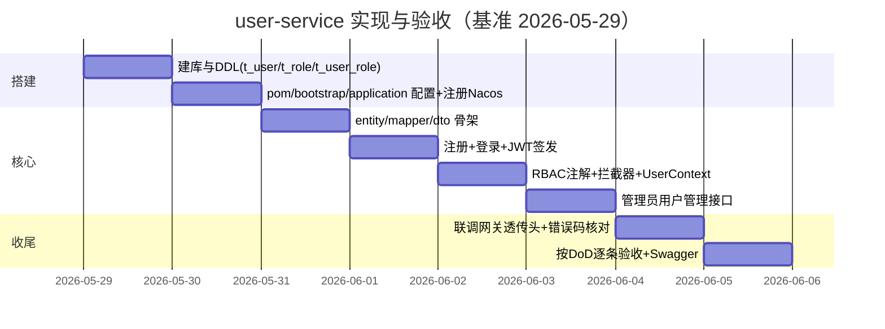

---

### 13. 与其它服务的契约一致性自检清单

- [ ] 服务名 `user-service` 与 §1 3.4、Feign 调用名一致。
- [ ] 表名 `t_user`/`t_role`/`t_user_role` 与字段（`role_code`、`status`、`deleted` 等）与 §1 4.1 DDL 完全一致。
- [ ] JWT claims（`userId`/`username`/`roles`/`iat`/`exp`）与 §1 3.3 一致；secret 取自 `aigm.jwt.secret`，与 gateway 共享。
- [ ] 网关透传头 `X-User-Id`/`X-User-Name`/`X-User-Roles` 读取逻辑与 §1 3.3 一致（roles 逗号分隔）。
- [ ] API 路径与角色（§1 5.1）逐行对齐：register/login PUBLIC，me 登录任意，admin/** 仅 ADMIN。
- [ ] 响应体 `data` 字段名（`userId`/`token`/`userInfo`/`list`/`total`/`page`/`size`）与契约一致。
- [ ] 错误码全部引用 common `ResultCode`，不新增不改值。
- [ ] 角色取值仅 `PLAYER`/`AUTHOR`/`ADMIN`，引用 `RoleConst`。

## 三、gateway 实现规格（Spring Cloud Gateway / 路由 / JWT 全局校验 / 头透传 / CORS / 内部接口隔离）

> 本节给出 `gateway` 模块的**完整可抄实现**。gateway 是系统唯一对外入口（基线 §3.4 端口 **8080**），承担：统一路由（基线 §5.0）、JWT 全局校验（基线 §3.3，校验只在此处做）、把身份注入 `X-User-*` 头透传下游、统一 CORS（基线 §3.5，下游不再配）、内部接口不对外（基线 §3.4/§5.0）。所有路径、错误码、claims 一律以基线为准。**gateway 基于 WebFlux，禁止引入 `spring-boot-starter-web`（基线禁止事项 5）。** 基准日期 **2026-05-29**。

---

### 1. 模块定位与依赖边界

- 基于 **Spring Cloud Gateway（WebFlux 响应式栈）**，不引入 WebMVC。
- 只复用 `common` 的 `JwtUtil`、`R`、`ResultCode`（基线 §2：gateway 不依赖 common 的 web 部分；common 的 web 依赖标了 `optional`，不会传递进来，故安全）。
- JWT 校验只在此处；下游服务信任网关注入的 `X-User-Id`/`X-User-Name`/`X-User-Roles` 头做方法级 RBAC，不再解析 token（基线 §3.3、禁止事项 6）。
- CORS 只在此处配（基线 §3.5、禁止事项 5）。

---

### 2. pom.xml（gateway 模块）

```xml
<?xml version="1.0" encoding="UTF-8"?>
<project xmlns="http://maven.apache.org/POM/4.0.0"
         xmlns:xsi="http://www.w3.org/2001/XMLSchema-instance"
         xsi:schemaLocation="http://maven.apache.org/POM/4.0.0 http://maven.apache.org/xsd/maven-4.0.0.xsd">
  <modelVersion>4.0.0</modelVersion>

  <parent>
    <groupId>com.aigm</groupId>
    <artifactId>ai-gm</artifactId>
    <version>1.0.0</version>
    <relativePath>../pom.xml</relativePath>
  </parent>

  <artifactId>gateway</artifactId>
  <packaging>jar</packaging>
  <name>gateway</name>

  <dependencies>
    <!-- 公共模块：仅用 JwtUtil / R / ResultCode（common 的 web 依赖为 optional，不会带进 WebMVC） -->
    <dependency>
      <groupId>com.aigm</groupId><artifactId>common</artifactId><version>1.0.0</version>
    </dependency>

    <!-- Spring Cloud Gateway（WebFlux），禁止再引 spring-boot-starter-web -->
    <dependency>
      <groupId>org.springframework.cloud</groupId>
      <artifactId>spring-cloud-starter-gateway</artifactId>
    </dependency>

    <!-- Nacos 注册中心 + 配置中心 + LoadBalancer（lb://） -->
    <dependency>
      <groupId>com.alibaba.cloud</groupId>
      <artifactId>spring-cloud-starter-alibaba-nacos-discovery</artifactId>
    </dependency>
    <dependency>
      <groupId>com.alibaba.cloud</groupId>
      <artifactId>spring-cloud-starter-alibaba-nacos-config</artifactId>
    </dependency>
    <dependency>
      <groupId>org.springframework.cloud</groupId>
      <artifactId>spring-cloud-starter-bootstrap</artifactId>
    </dependency>
    <dependency>
      <groupId>org.springframework.cloud</groupId>
      <artifactId>spring-cloud-starter-loadbalancer</artifactId>
    </dependency>

    <!-- Actuator：/actuator/health（§08-devops DoD 要求） -->
    <dependency>
      <groupId>org.springframework.boot</groupId>
      <artifactId>spring-boot-starter-actuator</artifactId>
    </dependency>
  </dependencies>

  <build>
    <plugins>
      <plugin>
        <groupId>org.springframework.boot</groupId>
        <artifactId>spring-boot-maven-plugin</artifactId>
      </plugin>
    </plugins>
  </build>
</project>
```

> 自检：若误引入 `spring-boot-starter-web`，启动会报 WebMVC/WebFlux 冲突（基线 §08-devops 排错表）。

---

### 3. 配置文件

#### 3.1 bootstrap.yml（接 Nacos，对齐基线 §3.4.1）

```yaml
spring:
  application:
    name: gateway
  profiles:
    active: local                 # 基线 §3.4.1 统一 profile=local
  cloud:
    nacos:
      discovery:
        server-addr: ${NACOS_ADDR:127.0.0.1:8848}
        username: ${NACOS_USER:nacos}
        password: ${NACOS_PASSWORD:nacos}
        namespace: public         # 基线 §3.4.1 统一 namespace=public
      config:
        server-addr: ${NACOS_ADDR:127.0.0.1:8848}
        username: ${NACOS_USER:nacos}
        password: ${NACOS_PASSWORD:nacos}
        namespace: public
        file-extension: yaml
        # 必须引入 aigm-common.yaml 取共享 aigm.jwt.secret(网关校验 JWT 用)；本服务私有 dataId=gateway.yaml
        shared-configs:
          - data-id: aigm-common.yaml
            group: DEFAULT_GROUP
            refresh: true
```

#### 3.2 application.yml（端口 + 路由 + CORS 的本地兜底；线上由 Nacos `gateway.yaml` 覆盖）

> 路由前缀对齐基线 §5.0；`discovery.locator.enabled=false` 关闭自动路由，**只显式声明对外路由**，从而 `/api/ai/**`、`/api/memory/**` 无路由 → 经网关访问返回 404（与 §08-devops 冒烟一致）。`/api/scenario/run/**` 不单独声明对外路由，由 §4 过滤器拦掉外部直达。

```yaml
server:
  port: 8080                      # 基线 §3.4 端口表: gateway=8080

spring:
  cloud:
    gateway:
      discovery:
        locator:
          enabled: false          # 关闭自动路由，杜绝内部服务被对外暴露
      routes:
        - id: user-service
          uri: lb://user-service
          predicates: [ "Path=/api/user/**" ]
        - id: scenario-service
          uri: lb://scenario-service
          predicates: [ "Path=/api/scenario/**" ]
        - id: game-service
          uri: lb://game-service
          predicates: [ "Path=/api/game/**" ]
        # 注意: 不声明 /api/ai/** 与 /api/memory/** 路由 → 经网关访问自然 404(基线 §3.4/§5.0)
      globalcors:                  # CORS 统一在此(基线 §3.5)，下游不再配
        cors-configurations:
          '[/**]':
            allowedOrigins: [ "http://localhost:5173" ]
            allowedMethods: [ GET, POST, PUT, DELETE, OPTIONS ]
            allowedHeaders: [ Authorization, Content-Type ]
            allowCredentials: true
            maxAge: 3600

# 网关自身的 JWT 校验所需密钥(从 aigm-common.yaml 下发；本地兜底值仅供离线启动)
aigm:
  jwt:
    secret: ${AIGM_JWT_SECRET:Zm9vYmFyLXNlY3JldC1rZXktZm9yLWFpZ20tZGVtby1vbmx5LTMyYnl0ZXMr}

management:
  endpoints:
    web:
      exposure:
        include: health,info
```

---

### 4. JWT 全局过滤器 `JwtAuthGlobalFilter`（WebFlux）

职责（基线 §3.3）：①内部接口外部直达拒绝 → ②白名单放行 → ③剥离客户端伪造的 `X-User-*`/`X-Internal-Call` 头 → ④取 `Authorization` 验签验过期 → ⑤注入可信身份头 → 放行。

> 与下游 RBAC 的分工：网关做「是否登录 + 身份注入」；具体「角色是否够、是否本人资源」由下游服务读 `X-User-Roles` 判断（见 `02-user-service`/`03-scenario-service`/`04-game-service` 的方法级 RBAC 与归属校验，错误码 1005/1221）。

```java
// gateway/src/main/java/com/aigm/gateway/filter/JwtAuthGlobalFilter.java
package com.aigm.gateway.filter;

import com.aigm.common.constant.CommonConst;
import com.aigm.common.result.R;
import com.aigm.common.result.ResultCode;
import com.aigm.common.util.JwtUtil;
import com.fasterxml.jackson.databind.ObjectMapper;
import io.jsonwebtoken.Claims;
import io.jsonwebtoken.ExpiredJwtException;
import io.jsonwebtoken.JwtException;
import lombok.extern.slf4j.Slf4j;
import org.springframework.beans.factory.annotation.Value;
import org.springframework.cloud.gateway.filter.GatewayFilterChain;
import org.springframework.cloud.gateway.filter.GlobalFilter;
import org.springframework.core.Ordered;
import org.springframework.core.io.buffer.DataBuffer;
import org.springframework.http.HttpHeaders;
import org.springframework.http.HttpStatus;
import org.springframework.http.MediaType;
import org.springframework.http.server.reactive.ServerHttpRequest;
import org.springframework.http.server.reactive.ServerHttpResponse;
import org.springframework.stereotype.Component;
import org.springframework.web.server.ServerWebExchange;
import reactor.core.publisher.Mono;

import java.nio.charset.StandardCharsets;
import java.util.List;

@Slf4j
@Component
public class JwtAuthGlobalFilter implements GlobalFilter, Ordered {

    @Value("${aigm.jwt.secret}")
    private String jwtSecret;

    private final ObjectMapper om = new ObjectMapper();

    // 白名单(基线 §3.3)：注册/登录/(可选验证码)/Swagger 文档
    private static final List<String> WHITE_LIST = List.of(
        "/api/user/auth/register", "/api/user/auth/login", "/api/user/auth/captcha",
        "/doc", "/v3/api-docs", "/swagger-ui", "/actuator/health");

    @Override
    public Mono<Void> filter(ServerWebExchange exchange, GatewayFilterChain chain) {
        ServerHttpRequest req = exchange.getRequest();
        String path = req.getURI().getPath();

        // 0) 内部接口不对外：外部对 /api/ai/**、/api/memory/**、/api/scenario/run/** 一律 404(伪装成"无此资源")
        //    注: /api/ai、/api/memory 本就无对外路由(也会 404); 此处显式拦截以覆盖 /api/scenario/run/**(它属已路由的 /api/scenario/** 族)
        if (isInternalPath(path) && !"true".equals(req.getHeaders().getFirst(CommonConst.HEADER_INTERNAL))) {
            return deny(exchange, HttpStatus.NOT_FOUND, ResultCode.RESOURCE_NOT_FOUND); // 对外表现为 404
        }

        // 1) 先剥离客户端伪造的可信头(防提权)
        ServerHttpRequest cleaned = stripForgedHeaders(req);

        // 2) 白名单放行
        if (isWhite(path)) {
            return chain.filter(exchange.mutate().request(cleaned).build());
        }

        // 3) 取 token
        String auth = req.getHeaders().getFirst(HttpHeaders.AUTHORIZATION);
        if (auth == null || !auth.startsWith("Bearer ")) {
            return deny(exchange, HttpStatus.UNAUTHORIZED, ResultCode.AUTH_NOT_LOGIN); // 401 + 1001
        }
        try {
            Claims c = JwtUtil.parse(jwtSecret, auth.substring(7));
            @SuppressWarnings("unchecked")
            List<String> roles = (List<String>) c.get("roles");
            ServerHttpRequest mutated = cleaned.mutate()
                .header(CommonConst.HEADER_USER_ID,   String.valueOf(c.get("userId")))
                .header(CommonConst.HEADER_USER_NAME, String.valueOf(c.get("username")))
                .header(CommonConst.HEADER_USER_ROLES, roles == null ? "" : String.join(",", roles))
                .build();
            return chain.filter(exchange.mutate().request(mutated).build());
        } catch (ExpiredJwtException e) {
            return deny(exchange, HttpStatus.UNAUTHORIZED, ResultCode.AUTH_TOKEN_EXPIRED); // 401 + 1003
        } catch (JwtException | IllegalArgumentException e) {
            return deny(exchange, HttpStatus.UNAUTHORIZED, ResultCode.AUTH_TOKEN_INVALID); // 401 + 1004
        }
    }

    private boolean isInternalPath(String p) {
        return p.startsWith("/api/ai/") || p.startsWith("/api/memory/") || p.startsWith("/api/scenario/run/");
    }

    private boolean isWhite(String p) {
        return WHITE_LIST.stream().anyMatch(p::startsWith);
    }

    // 无论请求是否带，一律删掉客户端传入的 X-User-* / X-Internal-Call，防伪造提权
    private ServerHttpRequest stripForgedHeaders(ServerHttpRequest req) {
        return req.mutate().headers(h -> {
            h.remove(CommonConst.HEADER_USER_ID);
            h.remove(CommonConst.HEADER_USER_NAME);
            h.remove(CommonConst.HEADER_USER_ROLES);
            h.remove(CommonConst.HEADER_INTERNAL);
        }).build();
    }

    private Mono<Void> deny(ServerWebExchange exchange, HttpStatus status, ResultCode rc) {
        ServerHttpResponse resp = exchange.getResponse();
        resp.setStatusCode(status);
        resp.getHeaders().setContentType(MediaType.APPLICATION_JSON);
        try {
            byte[] body = om.writeValueAsBytes(R.fail(rc));
            DataBuffer buf = resp.bufferFactory().wrap(body);
            return resp.writeWith(Mono.just(buf));
        } catch (Exception e) {
            resp.setStatusCode(HttpStatus.INTERNAL_SERVER_ERROR);
            return resp.setComplete();
        }
    }

    @Override public int getOrder() { return -100; } // 早于路由转发
}
```

> 关于 HTTP 状态码（消解基线 §3.3 vs §5.1 的模糊，见 §5）：**网关鉴权失败统一返回 HTTP 401 + 体 `R{code:1001/1003/1004}`**；内部接口外部直达统一返回 **HTTP 404 + 体 `R{code:1200}`**（伪装成"无此资源"，避免暴露内部服务存在）。网关是全系统**唯一**以非 200 HTTP 状态表达失败的位置（基线 §3.1）。

---

### 5. 「未登录」返回约定的唯一裁决（消除 401 vs 200+1001 的歧义）

基线 §3.3 说网关校验失败返回 401/403，§5.1 DoD 又出现「HTTP 401 或 200+code=1001」的两可表述。**本节作最终唯一裁决并锁定**：

- 网关鉴权失败：**HTTP 401**，响应体仍是统一 `R`（`{code:1001|1003|1004, message, data:null}`），`Content-Type: application/json`。
- 这样前端 `request.js` 拦截器既能按 HTTP 401 跳登录，也能读 `code` 区分「未登录/过期/非法」做不同提示——两套分支都成立、不矛盾（前端实现见 `07-frontend`）。
- §08-devops 冒烟「不带 token 访问 `/api/game/sessions` 期望 1001」据此理解为：HTTP 401 且体 `code=1001`，两者同时满足即通过。

> 注：本系统不使用 HTTP 403；「角色不足」由下游服务以 HTTP 200 + `R{code:1005}` 表达（基线 §3.1 业务结果用 code）。网关只判「是否登录」，不判「角色是否够」。

---

### 6. 启动类

```java
// gateway/src/main/java/com/aigm/gateway/GatewayApplication.java
package com.aigm.gateway;

import org.springframework.boot.SpringApplication;
import org.springframework.boot.autoconfigure.SpringBootApplication;

@SpringBootApplication
public class GatewayApplication {
    public static void main(String[] args) {
        SpringApplication.run(GatewayApplication.class, args);
    }
}
```

> 不需要 `@EnableFeignClients`（网关不发 Feign），不需要 `scanBasePackages` 加 common（只用其 `JwtUtil`/`R`/`ResultCode` 静态类型，非 Spring Bean）。

---

### 7. 验收标准（DoD）

- [ ] gateway 以 WebFlux 启动成功，`/actuator/health` 返回 `{"status":"UP"}`；**未引入 `spring-boot-starter-web`**（否则启动报 WebMVC/WebFlux 冲突）。
- [ ] 注册到 Nacos（namespace=public），从 `aigm-common.yaml` 取到 `aigm.jwt.secret`。
- [ ] 白名单：`POST /api/user/auth/login`、`/api/user/auth/register` 不带 token 可达 user-service。
- [ ] 校验：不带/非法 token 访问 `/api/game/sessions` → **HTTP 401 + 体 `R{code:1001}`**；过期 token → `1003`；签名错 → `1004`。
- [ ] 头注入：合法 token 请求到达下游时带 `X-User-Id`/`X-User-Name`/`X-User-Roles`，且**客户端自带的同名头被剥离**（伪造 `X-User-Roles:ADMIN` 不生效）。
- [ ] 内部隔离：经网关访问 `/api/ai/**`、`/api/memory/**`、`/api/scenario/run/**` 返回 **404**；而 game-service 经 Feign（带 `X-Internal-Call:true`、服务名直连）能正常调用 scenario-service 的 `/api/scenario/run/**`。
- [ ] CORS：来源 `http://localhost:5173` 的预检 `OPTIONS` 通过，下游无重复 CORS 响应头。
## 三、scenario-service 实现规格（剧本/场景节点/NPC/分支 CRUD + 状态机建模 + 对外读取）

> 本节严格对齐基线（§01-foundation）中的服务命名 `scenario-service`、库名 `aigm_scenario`、表名 `t_scenario`/`t_scene_node`/`t_npc`/`t_node_npc`/`t_transition`/`t_flag_def`、§5.2 的 REST 契约、§6 的状态机 node JSON 模型、§7 的 id 命名规范。所有字段名、路径、JSON key 一律以基线为准，不自创、不改名。基准日期 **2026-05-29**。
>
> scenario-service 的职责定位：它是「编剧（AUTHOR）的后台」+「剧本运行时只读源」。一端面向 AUTHOR/ADMIN 做剧本及其状态机（节点 node、边 transition、条件 condition）的全套 CRUD；另一端通过 Feign（`ScenarioClient`）把组装好的、可被 game-service / ai-engine-service 直接运行的剧本结构对外只读暴露。它**不持有任何对局运行态**（运行态在 game-service 的 `t_game_state`），只持有「剧本定义」这一份静态蓝图。

---

### 1. 模块定位与依赖边界

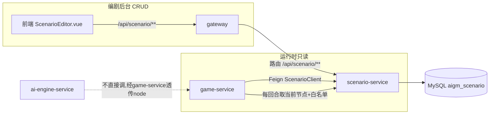

- 上游：gateway（对外 CRUD）、game-service（内部 Feign 只读取剧本运行结构）。
- 下游：MySQL `aigm_scenario`、Nacos（注册+配置）。
- **不依赖** 其它业务服务源码；自身只**被** game-service 通过 `common/feign/ScenarioClient` 调用，并**提供**该 Feign 接口的服务端实现（即 `ScenarioController` 中的对应方法 + 一个内部只读 controller）。
- 鉴权信任网关头：`X-User-Id`、`X-User-Name`、`X-User-Roles`（逗号分隔），本服务不解析 JWT，只做方法级 RBAC。

---

### 2. pom.xml（scenario-service 模块）

> 继承顶层 parent（统一管理 Spring Boot 3.2.5 / Spring Cloud 2023.0.1 / Alibaba 2023.0.1.0 版本，见基线 §1）。本模块为普通 Web 服务（WebMVC），引 MyBatis-Plus boot3 starter、Nacos discovery+config、OpenFeign、springdoc。

```xml
<?xml version="1.0" encoding="UTF-8"?>
<project xmlns="http://maven.apache.org/POM/4.0.0"
         xmlns:xsi="http://www.w3.org/2001/XMLSchema-instance"
         xsi:schemaLocation="http://maven.apache.org/POM/4.0.0 http://maven.apache.org/xsd/maven-4.0.0.xsd">
  <modelVersion>4.0.0</modelVersion>

  <parent>
    <groupId>com.aigm</groupId>
    <artifactId>ai-gm</artifactId>
    <version>1.0.0</version>
    <relativePath>../pom.xml</relativePath>
  </parent>

  <artifactId>scenario-service</artifactId>
  <name>scenario-service</name>
  <description>剧本/场景节点/NPC/分支 CRUD 与状态机定义服务</description>

  <dependencies>
    <!-- 公共模块: R / ResultCode / BizException / GlobalExceptionHandler / RoleConst / PageQuery / PageResult / feign -->
    <dependency>
      <groupId>com.aigm</groupId>
      <artifactId>common</artifactId>
      <version>1.0.0</version>
    </dependency>

    <!-- Web (WebMVC, 普通 servlet 栈; 注意非网关, 可引 web) -->
    <dependency>
      <groupId>org.springframework.boot</groupId>
      <artifactId>spring-boot-starter-web</artifactId>
    </dependency>
    <!-- Actuator：暴露 /actuator/health（§08-devops DoD 要求） -->
    <dependency>
      <groupId>org.springframework.boot</groupId>
      <artifactId>spring-boot-starter-actuator</artifactId>
    </dependency>
    <dependency>
      <groupId>org.springframework.boot</groupId>
      <artifactId>spring-boot-starter-validation</artifactId>
    </dependency>

    <!-- Nacos 注册中心 + 配置中心 -->
    <dependency>
      <groupId>com.alibaba.cloud</groupId>
      <artifactId>spring-cloud-starter-alibaba-nacos-discovery</artifactId>
    </dependency>
    <dependency>
      <groupId>com.alibaba.cloud</groupId>
      <artifactId>spring-cloud-starter-alibaba-nacos-config</artifactId>
    </dependency>
    <!-- bootstrap.yml 支持 -->
    <dependency>
      <groupId>org.springframework.cloud</groupId>
      <artifactId>spring-cloud-starter-bootstrap</artifactId>
    </dependency>

    <!-- OpenFeign: 本服务暂不主动调他人, 但 common.feign 内可能含被依赖的注解; 保留以便后续扩展 -->
    <dependency>
      <groupId>org.springframework.cloud</groupId>
      <artifactId>spring-cloud-starter-openfeign</artifactId>
    </dependency>

    <!-- MyBatis-Plus (务必 boot3 starter) -->
    <dependency>
      <groupId>com.baomidou</groupId>
      <artifactId>mybatis-plus-spring-boot3-starter</artifactId>
      <version>3.5.5</version>
    </dependency>

    <!-- MySQL 驱动 (版本由 Boot3 托管) -->
    <dependency>
      <groupId>com.mysql</groupId>
      <artifactId>mysql-connector-j</artifactId>
      <scope>runtime</scope>
    </dependency>

    <!-- Swagger UI (Boot3 专用) -->
    <dependency>
      <groupId>org.springdoc</groupId>
      <artifactId>springdoc-openapi-starter-webmvc-ui</artifactId>
      <version>2.5.0</version>
    </dependency>
  </dependencies>

  <build>
    <finalName>scenario-service</finalName>
    <plugins>
      <plugin>
        <groupId>org.springframework.boot</groupId>
        <artifactId>spring-boot-maven-plugin</artifactId>
      </plugin>
    </plugins>
  </build>
</project>
```

---

### 3. 配置文件

#### 3.1 bootstrap.yml（先于 application 加载，定位 Nacos 配置）

```yaml
spring:
  application:
    name: scenario-service          # 注册名, Feign 用此名
  profiles:
    active: local                   # 基线 §3.4.1 统一 profile=local
  cloud:
    nacos:
      server-addr: ${NACOS_ADDR:127.0.0.1:8848}
      username: ${NACOS_USER:nacos}
      password: ${NACOS_PASSWORD:nacos}
      discovery:
        namespace: public           # 基线 §3.4.1 统一 namespace=public
        group: DEFAULT_GROUP
      config:
        namespace: public
        group: DEFAULT_GROUP
        file-extension: yaml
        # 共享公共配置(全局唯一标准 dataId): jwt密钥/jackson时间格式/分页插件等
        shared-configs:
          - data-id: aigm-common.yaml
            group: DEFAULT_GROUP
            refresh: true
        # 本服务专属 dataId = scenario-service.yaml (基线 §3.4.1, 不带 profile 后缀)
```

#### 3.2 application.yml（本地兜底，正式以 Nacos 下发为准）

```yaml
server:
  port: 8082                         # scenario-service 端口

spring:
  datasource:
    driver-class-name: com.mysql.cj.jdbc.Driver
    url: jdbc:mysql://${MYSQL_HOST:127.0.0.1}:3306/aigm_scenario?useUnicode=true&characterEncoding=utf8&serverTimezone=GMT%2B8&useSSL=false&allowPublicKeyRetrieval=true
    username: ${MYSQL_USER:root}
    password: ${MYSQL_PASSWORD:aigm123456}   # 与 §08-devops docker-compose 的 MYSQL_ROOT_PASSWORD 一致
  jackson:
    date-format: yyyy-MM-dd HH:mm:ss
    time-zone: GMT+8

mybatis-plus:
  configuration:
    map-underscore-to-camel-case: true            # author_id -> authorId
    log-impl: org.apache.ibatis.logging.stdout.StdOutImpl
  global-config:
    db-config:
      logic-delete-field: deleted                 # 逻辑删除字段
      logic-delete-value: 1
      logic-not-delete-value: 0
      id-type: auto                               # 自增主键
  mapper-locations: classpath*:/mapper/*.xml

# Swagger
springdoc:
  swagger-ui:
    path: /doc/scenario.html
  api-docs:
    path: /v3/api-docs

# 日志
logging:
  level:
    com.aigm.scenario: debug
```

#### 3.3 启动类与配置类

```java
package com.aigm.scenario;

import org.mybatis.spring.annotation.MapperScan;
import org.springframework.boot.SpringApplication;
import org.springframework.boot.autoconfigure.SpringBootApplication;
import org.springframework.cloud.client.discovery.EnableDiscoveryClient;

// 不需要 scanBasePackages 含 com.aigm.common：common 的 GlobalExceptionHandler 由其自动配置注册(见 02-common §9)。
// 若两处(@Bean 自动配置 + 组件扫描)同时注册会冲突，故这里只扫本服务包。
// scenario-service 是运行时只读接口的 Feign 服务端, 自身不发 Feign, 故无需 @EnableFeignClients。
@SpringBootApplication(scanBasePackages = "com.aigm.scenario")
@EnableDiscoveryClient
@MapperScan("com.aigm.scenario.mapper")
public class ScenarioApplication {
    public static void main(String[] args) {
        SpringApplication.run(ScenarioApplication.class, args);
    }
}
```

```java
package com.aigm.scenario.config;

import com.baomidou.mybatisplus.annotation.DbType;
import com.baomidou.mybatisplus.extension.plugins.MybatisPlusInterceptor;
import com.baomidou.mybatisplus.extension.plugins.inner.PaginationInnerInterceptor;
import org.springframework.context.annotation.Bean;
import org.springframework.context.annotation.Configuration;

@Configuration
public class MybatisPlusConfig {
    @Bean
    public MybatisPlusInterceptor mybatisPlusInterceptor() {
        MybatisPlusInterceptor interceptor = new MybatisPlusInterceptor();
        interceptor.addInnerInterceptor(new PaginationInnerInterceptor(DbType.MYSQL));
        return interceptor;
    }
}
```

---

### 4. 实体（entity）—— 与基线 DDL 字段一一对应

> 字段名与 `t_scenario`/`t_scene_node`/`t_npc`/`t_node_npc`/`t_transition`/`t_flag_def` 完全一致，由 MyBatis-Plus 下划线转驼峰映射。

```java
package com.aigm.scenario.entity;

import com.baomidou.mybatisplus.annotation.*;
import com.fasterxml.jackson.annotation.JsonFormat;
import lombok.Data;
import java.time.LocalDateTime;

@Data
@TableName("t_scenario")
public class Scenario {
    @TableId(type = IdType.AUTO)
    private Long id;
    private String title;
    private String intro;
    private String cover;
    private String genre;
    private Long startNodeId;          // 起始节点ID (指向 t_scene_node)
    private Integer status;            // 0草稿 1已发布 2下架
    private Long authorId;             // 作者(编剧)用户ID
    @TableLogic
    private Integer deleted;
    @JsonFormat(pattern = "yyyy-MM-dd HH:mm:ss", timezone = "GMT+8")
    private LocalDateTime createdAt;
    @JsonFormat(pattern = "yyyy-MM-dd HH:mm:ss", timezone = "GMT+8")
    private LocalDateTime updatedAt;
}
```

```java
package com.aigm.scenario.entity;

import com.baomidou.mybatisplus.annotation.*;
import com.fasterxml.jackson.annotation.JsonFormat;
import lombok.Data;
import java.time.LocalDateTime;

@Data
@TableName("t_scene_node")
public class SceneNode {
    @TableId(type = IdType.AUTO)
    private Long id;
    private Long scenarioId;
    private String nodeKey;            // 剧本内唯一, 如 node_hall
    private String title;
    private String narrativeBrief;     // 喂给 LLM 的剧情纲要/氛围/目标
    private Integer isEnding;          // 0否 1是
    private String endingType;         // WIN/LOSE/NEUTRAL
    private Integer sortNo;
    @JsonFormat(pattern = "yyyy-MM-dd HH:mm:ss", timezone = "GMT+8")
    private LocalDateTime createdAt;
    @JsonFormat(pattern = "yyyy-MM-dd HH:mm:ss", timezone = "GMT+8")
    private LocalDateTime updatedAt;
}
```

```java
package com.aigm.scenario.entity;

import com.baomidou.mybatisplus.annotation.*;
import com.fasterxml.jackson.annotation.JsonFormat;
import lombok.Data;
import java.time.LocalDateTime;

@Data
@TableName("t_npc")
public class Npc {
    @TableId(type = IdType.AUTO)
    private Long id;
    private Long scenarioId;
    private String npcKey;             // 剧本内唯一, 如 npc_butler
    private String name;
    private String persona;            // 人格设定(保证人格一致)
    private String background;
    private String secret;
    private String avatar;
    @JsonFormat(pattern = "yyyy-MM-dd HH:mm:ss", timezone = "GMT+8")
    private LocalDateTime createdAt;
    @JsonFormat(pattern = "yyyy-MM-dd HH:mm:ss", timezone = "GMT+8")
    private LocalDateTime updatedAt;
}
```

```java
package com.aigm.scenario.entity;

import com.baomidou.mybatisplus.annotation.*;
import lombok.Data;

@Data
@TableName("t_node_npc")
public class NodeNpc {
    @TableId(type = IdType.AUTO)
    private Long id;
    private Long nodeId;
    private Long npcId;
}
```

```java
package com.aigm.scenario.entity;

import com.baomidou.mybatisplus.annotation.*;
import com.fasterxml.jackson.annotation.JsonFormat;
import lombok.Data;
import java.time.LocalDateTime;

@Data
@TableName("t_transition")
public class Transition {
    @TableId(type = IdType.AUTO)
    private Long id;
    private Long scenarioId;           // 冗余, 便于查询
    private Long fromNodeId;
    private Long toNodeId;
    private String conditionExpr;      // 触发条件表达式, 如 flag.has_key==true
    private String description;
    private Integer priority;          // 数值大优先
    @JsonFormat(pattern = "yyyy-MM-dd HH:mm:ss", timezone = "GMT+8")
    private LocalDateTime createdAt;
}
```

```java
package com.aigm.scenario.entity;

import com.baomidou.mybatisplus.annotation.*;
import lombok.Data;

@Data
@TableName("t_flag_def")
public class FlagDef {
    @TableId(type = IdType.AUTO)
    private Long id;
    private Long scenarioId;
    private String flagKey;            // 如 has_key
    private String flagName;
    private String defaultValue;       // 默认 "false"
}
```

---

### 5. DTO / VO

> 请求 DTO 用 Jakarta Validation 校验；VO 为对外返回结构。命名严格对齐基线 §5.2 的 `ScenarioVO`/`ScenarioDetailVO`/`SceneNodeVO`/`NpcVO`/`TransitionVO`。
>
> **落地约定（避免照抄即编译失败）**：下文为节省篇幅，把多个 DTO/VO/Mapper/Service 写在同一代码块、其中部分声明为包级（非 `public`）。**实际落地时必须「一个顶层类/接口一个 `.java` 文件，且统一 `public`」**——同一 `.java` 文件只能有一个 `public` 顶层类；放在 `common/feign/dto` 下、需被 game-service 跨模块 import 的 VO（如 `ScenarioRunVO`/`SceneNodeRunVO`/`TransitionRunVO`/`NpcRunVO`）尤其必须 `public` 且各自独立成文件，否则 game-service 引用不到、跨包不可见。本约定同样适用于 §6 多 Mapper、§8 接口+impl 的合并展示。

```java
package com.aigm.scenario.dto;

import jakarta.validation.constraints.*;
import lombok.Data;

@Data
public class ScenarioCreateDTO {           // POST /api/scenario
    @NotBlank(message = "标题不能为空")
    @Size(max = 100)
    private String title;
    @Size(max = 500)
    private String intro;
    @Size(max = 30)
    private String genre;
    @Size(max = 255)
    private String cover;
}

@Data
class ScenarioUpdateDTO {                   // PUT /api/scenario/{id}
    @Size(max = 100)
    private String title;
    @Size(max = 500)
    private String intro;
    @Size(max = 30)
    private String genre;
    @Size(max = 255)
    private String cover;
    private Long startNodeId;               // 可设起始节点
}

@Data
class PublishDTO {                          // PUT /api/scenario/{id}/publish
    @NotNull(message = "status 必填")
    @Min(1) @Max(2)                         // 1已发布 2下架
    private Integer status;
}
```

```java
package com.aigm.scenario.dto;

import jakarta.validation.constraints.*;
import lombok.Data;
import java.util.List;

@Data
public class SceneNodeCreateDTO {           // POST /api/scenario/{sid}/nodes
    @NotBlank @Pattern(regexp = "^node_[a-z0-9_]+$", message = "nodeKey 须形如 node_xxx")
    private String nodeKey;
    @NotBlank @Size(max = 100)
    private String title;
    @NotBlank
    private String narrativeBrief;
    private Integer isEnding = 0;
    private String endingType;              // WIN/LOSE/NEUTRAL, isEnding=1 时必填
    private Integer sortNo = 0;
    private List<Long> npcIds;              // 出场 NPC(写 t_node_npc)
}

@Data
class SceneNodeUpdateDTO {                   // PUT /api/scenario/nodes/{nodeId}
    @Size(max = 100)
    private String title;
    private String narrativeBrief;
    private Integer isEnding;
    private String endingType;
    private Integer sortNo;
    private List<Long> npcIds;              // 非 null 则整体覆盖关联
}
```

```java
package com.aigm.scenario.dto;

import jakarta.validation.constraints.*;
import lombok.Data;

@Data
public class NpcCreateDTO {                 // POST /api/scenario/{sid}/npcs
    @NotBlank @Pattern(regexp = "^npc_[a-z0-9_]+$", message = "npcKey 须形如 npc_xxx")
    private String npcKey;
    @NotBlank @Size(max = 50)
    private String name;
    @NotBlank
    private String persona;
    private String background;
    private String secret;
    @Size(max = 255)
    private String avatar;
}

@Data
class NpcUpdateDTO {                          // PUT /api/scenario/npcs/{npcId}
    @Size(max = 50)
    private String name;
    private String persona;
    private String background;
    private String secret;
    @Size(max = 255)
    private String avatar;
}
```

```java
package com.aigm.scenario.dto;

import jakarta.validation.constraints.*;
import lombok.Data;

@Data
public class TransitionCreateDTO {          // POST /api/scenario/transitions
    @NotNull
    private Long scenarioId;
    @NotNull
    private Long fromNodeId;
    @NotNull
    private Long toNodeId;
    @Size(max = 255)
    private String conditionExpr;           // null/空 视为 always
    @Size(max = 255)
    private String description;
    private Integer priority = 0;
}

@Data
class TransitionUpdateDTO {                  // PUT /api/scenario/transitions/{id}
    private Long toNodeId;
    @Size(max = 255)
    private String conditionExpr;
    @Size(max = 255)
    private String description;
    private Integer priority;
}
```

VO 定义（对外返回；其中 `ScenarioDetailVO` 与运行时只读 `ScenarioRunVO`/`SceneNodeRunVO` 见 §9 Feign 契约处统一给出）：

```java
package com.aigm.scenario.dto;

import com.fasterxml.jackson.annotation.JsonFormat;
import lombok.Data;
import java.time.LocalDateTime;
import java.util.List;

@Data
public class ScenarioVO {                   // 列表项
    private Long id;
    private String title;
    private String intro;
    private String cover;
    private String genre;
    private Long startNodeId;
    private Integer status;
    private Long authorId;
    @JsonFormat(pattern = "yyyy-MM-dd HH:mm:ss", timezone = "GMT+8")
    private LocalDateTime createdAt;
    @JsonFormat(pattern = "yyyy-MM-dd HH:mm:ss", timezone = "GMT+8")
    private LocalDateTime updatedAt;
}

@Data
class SceneNodeVO {
    private Long id;
    private Long scenarioId;
    private String nodeKey;
    private String title;
    private String narrativeBrief;
    private Integer isEnding;
    private String endingType;
    private Integer sortNo;
    private List<Long> npcIds;              // 出场 NPC id 列表
}

@Data
class NpcVO {
    private Long id;
    private Long scenarioId;
    private String npcKey;
    private String name;
    private String persona;
    private String background;
    private String secret;
    private String avatar;
}

@Data
class TransitionVO {
    private Long id;
    private Long scenarioId;
    private Long fromNodeId;
    private Long toNodeId;
    private String conditionExpr;
    private String description;
    private Integer priority;
}

@Data
class ScenarioDetailVO {                     // GET /api/scenario/{id}
    private ScenarioVO scenario;
    private List<SceneNodeVO> nodes;
    private List<NpcVO> npcs;
    private List<TransitionVO> transitions;
}
```

---

### 6. Mapper

> 单表 CRUD 全靠 MyBatis-Plus `BaseMapper`；个别批量/联表用注解或 xml。逻辑删除字段 `deleted` 仅 `t_scenario` 有，其余表无逻辑删除，删除即物理删（节点/分支/NPC 属剧本子结构，物理删更干净，删剧本时级联清理）。

```java
package com.aigm.scenario.mapper;

import com.aigm.scenario.entity.*;
import com.baomidou.mybatisplus.core.mapper.BaseMapper;
import org.apache.ibatis.annotations.*;
import java.util.List;

public interface ScenarioMapper extends BaseMapper<Scenario> { }

interface SceneNodeMapper extends BaseMapper<SceneNode> {
    @Select("SELECT * FROM t_scene_node WHERE scenario_id = #{sid} ORDER BY sort_no, id")
    List<SceneNode> listByScenario(@Param("sid") Long sid);
}

interface NpcMapper extends BaseMapper<Npc> {
    @Select("SELECT * FROM t_npc WHERE scenario_id = #{sid} ORDER BY id")
    List<Npc> listByScenario(@Param("sid") Long sid);
}

interface TransitionMapper extends BaseMapper<Transition> {
    @Select("SELECT * FROM t_transition WHERE scenario_id = #{sid} ORDER BY from_node_id, priority DESC, id")
    List<Transition> listByScenario(@Param("sid") Long sid);

    @Select("SELECT * FROM t_transition WHERE from_node_id = #{fromNodeId} ORDER BY priority DESC, id")
    List<Transition> listByFromNode(@Param("fromNodeId") Long fromNodeId);

    @Delete("DELETE FROM t_transition WHERE from_node_id = #{nodeId} OR to_node_id = #{nodeId}")
    int deleteByNode(@Param("nodeId") Long nodeId);
}

interface NodeNpcMapper extends BaseMapper<NodeNpc> {
    @Select("SELECT npc_id FROM t_node_npc WHERE node_id = #{nodeId}")
    List<Long> listNpcIdsByNode(@Param("nodeId") Long nodeId);

    @Delete("DELETE FROM t_node_npc WHERE node_id = #{nodeId}")
    int deleteByNode(@Param("nodeId") Long nodeId);
}

interface FlagDefMapper extends BaseMapper<FlagDef> {
    @Select("SELECT * FROM t_flag_def WHERE scenario_id = #{sid}")
    List<FlagDef> listByScenario(@Param("sid") Long sid);
}
```

---

### 7. RBAC 与归属校验（AUTHOR 后台核心）

> 网关已校验登录态并下发头。本服务从头读取身份，做方法级 RBAC + 资源归属（编剧只能改自己的剧本）。统一封装一个 `AuthContext` 工具，避免每个 controller 重复解析。

```java
package com.aigm.scenario.security;

import com.aigm.common.constant.RoleConst;        // PLAYER/AUTHOR/ADMIN
import com.aigm.common.exception.BizException;
import com.aigm.common.result.ResultCode;
import jakarta.servlet.http.HttpServletRequest;
import org.springframework.web.context.request.RequestContextHolder;
import org.springframework.web.context.request.ServletRequestAttributes;
import java.util.*;

public final class AuthContext {
    private AuthContext() {}

    private static HttpServletRequest req() {
        return ((ServletRequestAttributes) Objects.requireNonNull(
                RequestContextHolder.getRequestAttributes())).getRequest();
    }

    public static Long userId() {
        String v = req().getHeader("X-User-Id");
        if (v == null || v.isBlank()) throw new BizException(ResultCode.AUTH_NOT_LOGIN); // 1001
        return Long.valueOf(v);
    }

    public static Set<String> roles() {
        String v = req().getHeader("X-User-Roles");
        if (v == null || v.isBlank()) return Collections.emptySet();
        Set<String> s = new HashSet<>();
        for (String r : v.split(",")) s.add(r.trim());
        return s;
    }

    public static boolean isAdmin() { return roles().contains(RoleConst.ADMIN); }

    public static void requireAuthorOrAdmin() {
        Set<String> rs = roles();
        if (!rs.contains(RoleConst.AUTHOR) && !rs.contains(RoleConst.ADMIN)) {
            throw new BizException(ResultCode.AUTH_NO_PERMISSION);   // 1005 无权限
        }
    }
}
```

归属校验逻辑（在 service 层）：

- AUTHOR 创建剧本时 `author_id = AuthContext.userId()`。
- 对「改/删/发布剧本」及其「节点/NPC/分支」的写操作：若调用者是 ADMIN 直接放行；否则必须满足 `scenario.author_id == userId`，不满足抛 `BizException(1221 非本人/越权)`（基线 §3.2 复用 1221「非本人对局(越权访问)」语义，此处表示越权访问非本人资源）。
- 节点/NPC/分支没有 author_id，需先经其 `scenario_id` 反查 `t_scenario.author_id` 判定归属。

---

### 8. Service 与 Controller 完整 CRUD 代码骨架

#### 8.1 ScenarioService（剧本 CRUD + 发布校验）

```java
package com.aigm.scenario.service;

import com.aigm.common.util.PageQuery;
import com.aigm.common.util.PageResult;
import com.aigm.scenario.dto.*;

public interface ScenarioService {
    PageResult<ScenarioVO> pagePublished(PageQuery query, String genre);
    PageResult<ScenarioVO> pageMine(PageQuery query, Long authorId, Integer status, boolean isAdmin);
    ScenarioDetailVO detail(Long id);
    Long create(ScenarioCreateDTO dto, Long authorId);
    boolean update(Long id, ScenarioUpdateDTO dto, Long userId, boolean isAdmin);
    boolean publish(Long id, Integer status, Long userId, boolean isAdmin);
    boolean delete(Long id, Long userId, boolean isAdmin);

    /** 供归属校验复用: 取剧本(含 deleted 过滤), 不存在抛 1200 */
    com.aigm.scenario.entity.Scenario getExistingOrThrow(Long id);
    /** 校验调用者对该剧本有写权限(本人 AUTHOR 或 ADMIN), 否则抛 1221 */
    void checkOwnership(Long scenarioId, Long userId, boolean isAdmin);
}
```

```java
package com.aigm.scenario.service.impl;

import com.aigm.common.exception.BizException;
import com.aigm.common.result.ResultCode;
import com.aigm.common.util.PageQuery;
import com.aigm.common.util.PageResult;
import com.aigm.scenario.dto.*;
import com.aigm.scenario.entity.*;
import com.aigm.scenario.mapper.*;
import com.aigm.scenario.service.*;
import com.baomidou.mybatisplus.core.conditions.query.LambdaQueryWrapper;
import com.baomidou.mybatisplus.extension.plugins.pagination.Page;
import lombok.RequiredArgsConstructor;
import org.springframework.beans.BeanUtils;
import org.springframework.stereotype.Service;
import org.springframework.transaction.annotation.Transactional;
import java.util.*;
import java.util.stream.Collectors;

@Service
@RequiredArgsConstructor
public class ScenarioServiceImpl implements ScenarioService {

    private final ScenarioMapper scenarioMapper;
    private final SceneNodeMapper sceneNodeMapper;
    private final NpcMapper npcMapper;
    private final TransitionMapper transitionMapper;
    private final NodeNpcMapper nodeNpcMapper;
    private final ScenarioValidator validator;       // 状态机校验器, 见 §10

    private static final int STATUS_DRAFT = 0;
    private static final int STATUS_PUBLISHED = 1;
    private static final int STATUS_OFFLINE = 2;

    @Override
    public PageResult<ScenarioVO> pagePublished(PageQuery query, String genre) {
        Page<Scenario> page = new Page<>(query.getPage(), query.getSize());
        LambdaQueryWrapper<Scenario> w = new LambdaQueryWrapper<Scenario>()
                .eq(Scenario::getStatus, STATUS_PUBLISHED)
                .eq(genre != null && !genre.isBlank(), Scenario::getGenre, genre)
                .orderByDesc(Scenario::getUpdatedAt);
        Page<Scenario> r = scenarioMapper.selectPage(page, w);
        return toVoPage(r, query);
    }

    @Override
    public PageResult<ScenarioVO> pageMine(PageQuery query, Long authorId, Integer status, boolean isAdmin) {
        Page<Scenario> page = new Page<>(query.getPage(), query.getSize());
        LambdaQueryWrapper<Scenario> w = new LambdaQueryWrapper<Scenario>()
                // ADMIN 看全部; AUTHOR 仅看自己
                .eq(!isAdmin, Scenario::getAuthorId, authorId)
                .eq(status != null, Scenario::getStatus, status)
                .orderByDesc(Scenario::getUpdatedAt);
        Page<Scenario> r = scenarioMapper.selectPage(page, w);
        return toVoPage(r, query);
    }

    private PageResult<ScenarioVO> toVoPage(Page<Scenario> r, PageQuery query) {
        List<ScenarioVO> list = r.getRecords().stream().map(s -> {
            ScenarioVO vo = new ScenarioVO();
            BeanUtils.copyProperties(s, vo);
            return vo;
        }).collect(Collectors.toList());
        return PageResult.of(list, r.getTotal(), query.getPage(), query.getSize());
    }

    @Override
    public ScenarioDetailVO detail(Long id) {
        Scenario s = getExistingOrThrow(id);
        ScenarioVO sv = new ScenarioVO();
        BeanUtils.copyProperties(s, sv);

        List<SceneNode> nodes = sceneNodeMapper.listByScenario(id);
        List<NpcVO> npcs = npcMapper.listByScenario(id).stream()
                .map(n -> { NpcVO v = new NpcVO(); BeanUtils.copyProperties(n, v); return v; })
                .collect(Collectors.toList());
        List<TransitionVO> trans = transitionMapper.listByScenario(id).stream()
                .map(t -> { TransitionVO v = new TransitionVO(); BeanUtils.copyProperties(t, v); return v; })
                .collect(Collectors.toList());

        List<SceneNodeVO> nodeVos = nodes.stream().map(n -> {
            SceneNodeVO v = new SceneNodeVO();
            BeanUtils.copyProperties(n, v);
            v.setNpcIds(nodeNpcMapper.listNpcIdsByNode(n.getId()));
            return v;
        }).collect(Collectors.toList());

        ScenarioDetailVO d = new ScenarioDetailVO();
        d.setScenario(sv);
        d.setNodes(nodeVos);
        d.setNpcs(npcs);
        d.setTransitions(trans);
        return d;
    }

    @Override
    public Long create(ScenarioCreateDTO dto, Long authorId) {
        Scenario s = new Scenario();
        BeanUtils.copyProperties(dto, s);
        s.setStatus(STATUS_DRAFT);
        s.setAuthorId(authorId);
        scenarioMapper.insert(s);
        return s.getId();
    }

    @Override
    public boolean update(Long id, ScenarioUpdateDTO dto, Long userId, boolean isAdmin) {
        Scenario s = getExistingOrThrow(id);
        checkOwnership(id, userId, isAdmin);
        if (dto.getTitle() != null) s.setTitle(dto.getTitle());
        if (dto.getIntro() != null) s.setIntro(dto.getIntro());
        if (dto.getGenre() != null) s.setGenre(dto.getGenre());
        if (dto.getCover() != null) s.setCover(dto.getCover());
        if (dto.getStartNodeId() != null) {
            // 起始节点必须属于本剧本
            SceneNode n = sceneNodeMapper.selectById(dto.getStartNodeId());
            if (n == null || !Objects.equals(n.getScenarioId(), id)) {
                throw new BizException(ResultCode.PARAM_INVALID); // 1100
            }
            s.setStartNodeId(dto.getStartNodeId());
        }
        return scenarioMapper.updateById(s) > 0;
    }

    @Override
    public boolean publish(Long id, Integer status, Long userId, boolean isAdmin) {
        Scenario s = getExistingOrThrow(id);
        checkOwnership(id, userId, isAdmin);
        if (status == STATUS_PUBLISHED) {
            // 发布前做状态机完整性校验(起始节点 / 分支闭环 / 结局可达)
            validator.validatePublishable(id, s);
        }
        s.setStatus(status);
        return scenarioMapper.updateById(s) > 0;
    }

    @Override
    @Transactional
    public boolean delete(Long id, Long userId, boolean isAdmin) {
        getExistingOrThrow(id);
        checkOwnership(id, userId, isAdmin);
        // 物理清理子结构, 逻辑删主表
        List<SceneNode> nodes = sceneNodeMapper.listByScenario(id);
        for (SceneNode n : nodes) {
            nodeNpcMapper.deleteByNode(n.getId());
            sceneNodeMapper.deleteById(n.getId());
        }
        transitionMapper.delete(new LambdaQueryWrapper<Transition>().eq(Transition::getScenarioId, id));
        npcMapper.delete(new LambdaQueryWrapper<Npc>().eq(Npc::getScenarioId, id));
        return scenarioMapper.deleteById(id) > 0; // 逻辑删(@TableLogic)
    }

    @Override
    public Scenario getExistingOrThrow(Long id) {
        Scenario s = scenarioMapper.selectById(id);
        if (s == null) throw new BizException(ResultCode.RESOURCE_NOT_FOUND); // 1200
        return s;
    }

    @Override
    public void checkOwnership(Long scenarioId, Long userId, boolean isAdmin) {
        if (isAdmin) return;
        Scenario s = getExistingOrThrow(scenarioId);
        if (!Objects.equals(s.getAuthorId(), userId)) {
            throw new BizException(ResultCode.NOT_OWNER); // 1221 越权访问非本人资源
        }
    }
}
```

#### 8.2 ScenarioController（剧本主资源 CRUD）

```java
package com.aigm.scenario.controller;

import com.aigm.common.result.R;
import com.aigm.common.util.PageQuery;
import com.aigm.common.util.PageResult;
import com.aigm.scenario.dto.*;
import com.aigm.scenario.security.AuthContext;
import com.aigm.scenario.service.ScenarioService;
import jakarta.validation.Valid;
import lombok.RequiredArgsConstructor;
import org.springframework.web.bind.annotation.*;
import java.util.Map;

@RestController
@RequestMapping("/api/scenario")
@RequiredArgsConstructor
public class ScenarioController {

    private final ScenarioService scenarioService;

    /** 玩家可玩剧本列表(已发布) */
    @GetMapping("/published")
    public R<PageResult<ScenarioVO>> published(@RequestParam(defaultValue = "1") int page,
                                               @RequestParam(defaultValue = "10") int size,
                                               @RequestParam(required = false) String genre) {
        PageQuery q = PageQuery.of(page, size);
        return R.ok(scenarioService.pagePublished(q, genre));
    }

    /** 剧本详情(供开局/编辑, 含 nodes/npcs/transitions) */
    @GetMapping("/{id}")
    public R<ScenarioDetailVO> detail(@PathVariable Long id) {
        return R.ok(scenarioService.detail(id));
    }

    /** 我创建的剧本 */
    @GetMapping("/mine")
    public R<PageResult<ScenarioVO>> mine(@RequestParam(defaultValue = "1") int page,
                                          @RequestParam(defaultValue = "10") int size,
                                          @RequestParam(required = false) Integer status) {
        AuthContext.requireAuthorOrAdmin();
        PageQuery q = PageQuery.of(page, size);
        return R.ok(scenarioService.pageMine(q, AuthContext.userId(), status, AuthContext.isAdmin()));
    }

    /** 新建剧本(草稿) */
    @PostMapping
    public R<Map<String, Long>> create(@RequestBody @Valid ScenarioCreateDTO dto) {
        AuthContext.requireAuthorOrAdmin();
        Long id = scenarioService.create(dto, AuthContext.userId());
        return R.ok(Map.of("id", id));
    }

    /** 改剧本 */
    @PutMapping("/{id}")
    public R<Boolean> update(@PathVariable Long id, @RequestBody @Valid ScenarioUpdateDTO dto) {
        AuthContext.requireAuthorOrAdmin();
        return R.ok(scenarioService.update(id, dto, AuthContext.userId(), AuthContext.isAdmin()));
    }

    /** 发布/下架(发布前校验状态机完整性) */
    @PutMapping("/{id}/publish")
    public R<Boolean> publish(@PathVariable Long id, @RequestBody @Valid PublishDTO dto) {
        AuthContext.requireAuthorOrAdmin();
        return R.ok(scenarioService.publish(id, dto.getStatus(), AuthContext.userId(), AuthContext.isAdmin()));
    }

    /** 逻辑删剧本 */
    @DeleteMapping("/{id}")
    public R<Boolean> delete(@PathVariable Long id) {
        AuthContext.requireAuthorOrAdmin();
        return R.ok(scenarioService.delete(id, AuthContext.userId(), AuthContext.isAdmin()));
    }
}
```

#### 8.3 SceneNodeController + NodeService（节点 CRUD，含 node-npc 关联）

```java
package com.aigm.scenario.service;

import com.aigm.scenario.dto.*;
import java.util.List;

public interface SceneNodeService {
    List<SceneNodeVO> listByScenario(Long scenarioId);
    Long create(Long scenarioId, SceneNodeCreateDTO dto, Long userId, boolean isAdmin);
    boolean update(Long nodeId, SceneNodeUpdateDTO dto, Long userId, boolean isAdmin);
    boolean delete(Long nodeId, Long userId, boolean isAdmin);   // 级联删该节点相关分支与node-npc
}
```

```java
package com.aigm.scenario.service.impl;

import com.aigm.common.exception.BizException;
import com.aigm.common.result.ResultCode;
import com.aigm.scenario.dto.*;
import com.aigm.scenario.entity.*;
import com.aigm.scenario.mapper.*;
import com.aigm.scenario.service.*;
import com.baomidou.mybatisplus.core.conditions.query.LambdaQueryWrapper;
import lombok.RequiredArgsConstructor;
import org.springframework.beans.BeanUtils;
import org.springframework.stereotype.Service;
import org.springframework.transaction.annotation.Transactional;
import java.util.*;
import java.util.stream.Collectors;

@Service
@RequiredArgsConstructor
public class SceneNodeServiceImpl implements SceneNodeService {

    private final SceneNodeMapper sceneNodeMapper;
    private final NodeNpcMapper nodeNpcMapper;
    private final NpcMapper npcMapper;
    private final TransitionMapper transitionMapper;
    private final ScenarioService scenarioService;

    @Override
    public List<SceneNodeVO> listByScenario(Long scenarioId) {
        scenarioService.getExistingOrThrow(scenarioId);
        return sceneNodeMapper.listByScenario(scenarioId).stream().map(n -> {
            SceneNodeVO v = new SceneNodeVO();
            BeanUtils.copyProperties(n, v);
            v.setNpcIds(nodeNpcMapper.listNpcIdsByNode(n.getId()));
            return v;
        }).collect(Collectors.toList());
    }

    @Override
    @Transactional
    public Long create(Long scenarioId, SceneNodeCreateDTO dto, Long userId, boolean isAdmin) {
        scenarioService.checkOwnership(scenarioId, userId, isAdmin);
        // nodeKey 剧本内唯一
        Long dup = sceneNodeMapper.selectCount(new LambdaQueryWrapper<SceneNode>()
                .eq(SceneNode::getScenarioId, scenarioId)
                .eq(SceneNode::getNodeKey, dto.getNodeKey()));
        if (dup != null && dup > 0) throw new BizException(ResultCode.RESOURCE_EXISTS); // 1201
        if (Integer.valueOf(1).equals(dto.getIsEnding())
                && (dto.getEndingType() == null || dto.getEndingType().isBlank())) {
            throw new BizException(1100, "结局节点必须指定 endingType(WIN/LOSE/NEUTRAL)");
        }
        SceneNode n = new SceneNode();
        BeanUtils.copyProperties(dto, n);
        n.setScenarioId(scenarioId);
        if (n.getIsEnding() == null) n.setIsEnding(0);
        if (n.getSortNo() == null) n.setSortNo(0);
        sceneNodeMapper.insert(n);
        bindNpcs(scenarioId, n.getId(), dto.getNpcIds());
        return n.getId();
    }

    @Override
    @Transactional
    public boolean update(Long nodeId, SceneNodeUpdateDTO dto, Long userId, boolean isAdmin) {
        SceneNode n = getNodeOrThrow(nodeId);
        scenarioService.checkOwnership(n.getScenarioId(), userId, isAdmin);
        if (dto.getTitle() != null) n.setTitle(dto.getTitle());
        if (dto.getNarrativeBrief() != null) n.setNarrativeBrief(dto.getNarrativeBrief());
        if (dto.getIsEnding() != null) n.setIsEnding(dto.getIsEnding());
        if (dto.getEndingType() != null) n.setEndingType(dto.getEndingType());
        if (dto.getSortNo() != null) n.setSortNo(dto.getSortNo());
        sceneNodeMapper.updateById(n);
        if (dto.getNpcIds() != null) {       // 整体覆盖关联
            nodeNpcMapper.deleteByNode(nodeId);
            bindNpcs(n.getScenarioId(), nodeId, dto.getNpcIds());
        }
        return true;
    }

    @Override
    @Transactional
    public boolean delete(Long nodeId, Long userId, boolean isAdmin) {
        SceneNode n = getNodeOrThrow(nodeId);
        scenarioService.checkOwnership(n.getScenarioId(), userId, isAdmin);
        nodeNpcMapper.deleteByNode(nodeId);
        transitionMapper.deleteByNode(nodeId);     // 级联删以该节点为 from/to 的所有分支
        return sceneNodeMapper.deleteById(nodeId) > 0;
    }

    private void bindNpcs(Long scenarioId, Long nodeId, List<Long> npcIds) {
        if (npcIds == null || npcIds.isEmpty()) return;
        for (Long npcId : new LinkedHashSet<>(npcIds)) {
            Npc npc = npcMapper.selectById(npcId);
            if (npc == null || !Objects.equals(npc.getScenarioId(), scenarioId)) {
                throw new BizException(1100, "npcId=" + npcId + " 不属于本剧本");
            }
            NodeNpc nn = new NodeNpc();
            nn.setNodeId(nodeId);
            nn.setNpcId(npcId);
            nodeNpcMapper.insert(nn);
        }
    }

    private SceneNode getNodeOrThrow(Long nodeId) {
        SceneNode n = sceneNodeMapper.selectById(nodeId);
        if (n == null) throw new BizException(ResultCode.RESOURCE_NOT_FOUND); // 1200
        return n;
    }
}
```

```java
package com.aigm.scenario.controller;

import com.aigm.common.result.R;
import com.aigm.scenario.dto.*;
import com.aigm.scenario.security.AuthContext;
import com.aigm.scenario.service.SceneNodeService;
import jakarta.validation.Valid;
import lombok.RequiredArgsConstructor;
import org.springframework.web.bind.annotation.*;
import java.util.List;
import java.util.Map;

@RestController
@RequestMapping("/api/scenario")
@RequiredArgsConstructor
public class SceneNodeController {

    private final SceneNodeService sceneNodeService;

    @GetMapping("/{sid}/nodes")
    public R<List<SceneNodeVO>> list(@PathVariable Long sid) {
        return R.ok(sceneNodeService.listByScenario(sid));
    }

    @PostMapping("/{sid}/nodes")
    public R<Map<String, Long>> create(@PathVariable Long sid, @RequestBody @Valid SceneNodeCreateDTO dto) {
        AuthContext.requireAuthorOrAdmin();
        Long id = sceneNodeService.create(sid, dto, AuthContext.userId(), AuthContext.isAdmin());
        return R.ok(Map.of("id", id));
    }

    @PutMapping("/nodes/{nodeId}")
    public R<Boolean> update(@PathVariable Long nodeId, @RequestBody @Valid SceneNodeUpdateDTO dto) {
        AuthContext.requireAuthorOrAdmin();
        return R.ok(sceneNodeService.update(nodeId, dto, AuthContext.userId(), AuthContext.isAdmin()));
    }

    @DeleteMapping("/nodes/{nodeId}")
    public R<Boolean> delete(@PathVariable Long nodeId) {
        AuthContext.requireAuthorOrAdmin();
        return R.ok(sceneNodeService.delete(nodeId, AuthContext.userId(), AuthContext.isAdmin()));
    }
}
```

#### 8.4 NpcController + NpcService（NPC CRUD）

```java
package com.aigm.scenario.service.impl;

import com.aigm.common.exception.BizException;
import com.aigm.common.result.ResultCode;
import com.aigm.scenario.dto.*;
import com.aigm.scenario.entity.Npc;
import com.aigm.scenario.mapper.*;
import com.aigm.scenario.service.*;
import com.baomidou.mybatisplus.core.conditions.query.LambdaQueryWrapper;
import lombok.RequiredArgsConstructor;
import org.springframework.beans.BeanUtils;
import org.springframework.stereotype.Service;
import java.util.*;
import java.util.stream.Collectors;

public interface NpcService {
    List<NpcVO> listByScenario(Long scenarioId);
    Long create(Long scenarioId, NpcCreateDTO dto, Long userId, boolean isAdmin);
    boolean update(Long npcId, NpcUpdateDTO dto, Long userId, boolean isAdmin);
    boolean delete(Long npcId, Long userId, boolean isAdmin);
}

@Service
@RequiredArgsConstructor
class NpcServiceImpl implements NpcService {

    private final NpcMapper npcMapper;
    private final NodeNpcMapper nodeNpcMapper;
    private final ScenarioService scenarioService;

    @Override
    public List<NpcVO> listByScenario(Long scenarioId) {
        scenarioService.getExistingOrThrow(scenarioId);
        return npcMapper.listByScenario(scenarioId).stream()
                .map(n -> { NpcVO v = new NpcVO(); BeanUtils.copyProperties(n, v); return v; })
                .collect(Collectors.toList());
    }

    @Override
    public Long create(Long scenarioId, NpcCreateDTO dto, Long userId, boolean isAdmin) {
        scenarioService.checkOwnership(scenarioId, userId, isAdmin);
        Long dup = npcMapper.selectCount(new LambdaQueryWrapper<Npc>()
                .eq(Npc::getScenarioId, scenarioId).eq(Npc::getNpcKey, dto.getNpcKey()));
        if (dup != null && dup > 0) throw new BizException(ResultCode.RESOURCE_EXISTS); // 1201
        Npc n = new Npc();
        BeanUtils.copyProperties(dto, n);
        n.setScenarioId(scenarioId);
        npcMapper.insert(n);
        return n.getId();
    }

    @Override
    public boolean update(Long npcId, NpcUpdateDTO dto, Long userId, boolean isAdmin) {
        Npc n = getNpcOrThrow(npcId);
        scenarioService.checkOwnership(n.getScenarioId(), userId, isAdmin);
        if (dto.getName() != null) n.setName(dto.getName());
        if (dto.getPersona() != null) n.setPersona(dto.getPersona());
        if (dto.getBackground() != null) n.setBackground(dto.getBackground());
        if (dto.getSecret() != null) n.setSecret(dto.getSecret());
        if (dto.getAvatar() != null) n.setAvatar(dto.getAvatar());
        return npcMapper.updateById(n) > 0;
    }

    @Override
    public boolean delete(Long npcId, Long userId, boolean isAdmin) {
        Npc n = getNpcOrThrow(npcId);
        scenarioService.checkOwnership(n.getScenarioId(), userId, isAdmin);
        // 清理节点-NPC 关联(该 npc 出现在任何节点的关联)
        nodeNpcMapper.delete(new LambdaQueryWrapper<com.aigm.scenario.entity.NodeNpc>()
                .eq(com.aigm.scenario.entity.NodeNpc::getNpcId, npcId));
        return npcMapper.deleteById(npcId) > 0;
    }

    private Npc getNpcOrThrow(Long npcId) {
        Npc n = npcMapper.selectById(npcId);
        if (n == null) throw new BizException(ResultCode.RESOURCE_NOT_FOUND); // 1200
        return n;
    }
}
```

```java
package com.aigm.scenario.controller;

import com.aigm.common.result.R;
import com.aigm.scenario.dto.*;
import com.aigm.scenario.security.AuthContext;
import com.aigm.scenario.service.NpcService;
import jakarta.validation.Valid;
import lombok.RequiredArgsConstructor;
import org.springframework.web.bind.annotation.*;
import java.util.List;
import java.util.Map;

@RestController
@RequestMapping("/api/scenario")
@RequiredArgsConstructor
public class NpcController {

    private final NpcService npcService;

    @GetMapping("/{sid}/npcs")
    public R<List<NpcVO>> list(@PathVariable Long sid) {
        return R.ok(npcService.listByScenario(sid));
    }

    @PostMapping("/{sid}/npcs")
    public R<Map<String, Long>> create(@PathVariable Long sid, @RequestBody @Valid NpcCreateDTO dto) {
        AuthContext.requireAuthorOrAdmin();
        Long id = npcService.create(sid, dto, AuthContext.userId(), AuthContext.isAdmin());
        return R.ok(Map.of("id", id));
    }

    @PutMapping("/npcs/{npcId}")
    public R<Boolean> update(@PathVariable Long npcId, @RequestBody @Valid NpcUpdateDTO dto) {
        AuthContext.requireAuthorOrAdmin();
        return R.ok(npcService.update(npcId, dto, AuthContext.userId(), AuthContext.isAdmin()));
    }

    @DeleteMapping("/npcs/{npcId}")
    public R<Boolean> delete(@PathVariable Long npcId) {
        AuthContext.requireAuthorOrAdmin();
        return R.ok(npcService.delete(npcId, AuthContext.userId(), AuthContext.isAdmin()));
    }
}
```

#### 8.5 TransitionController + TransitionService（分支 CRUD —— 状态机的边）

```java
package com.aigm.scenario.service.impl;

import com.aigm.common.exception.BizException;
import com.aigm.common.result.ResultCode;
import com.aigm.scenario.dto.*;
import com.aigm.scenario.entity.*;
import com.aigm.scenario.mapper.*;
import com.aigm.scenario.service.*;
import lombok.RequiredArgsConstructor;
import org.springframework.beans.BeanUtils;
import org.springframework.stereotype.Service;
import java.util.*;
import java.util.stream.Collectors;

public interface TransitionService {
    List<TransitionVO> listByScenario(Long scenarioId);
    Long create(TransitionCreateDTO dto, Long userId, boolean isAdmin);
    boolean update(Long id, TransitionUpdateDTO dto, Long userId, boolean isAdmin);
    boolean delete(Long id, Long userId, boolean isAdmin);
}

@Service
@RequiredArgsConstructor
class TransitionServiceImpl implements TransitionService {

    private final TransitionMapper transitionMapper;
    private final SceneNodeMapper sceneNodeMapper;
    private final ScenarioService scenarioService;
    private final ScenarioValidator validator;   // 复用 condition 语法校验

    @Override
    public List<TransitionVO> listByScenario(Long scenarioId) {
        scenarioService.getExistingOrThrow(scenarioId);
        return transitionMapper.listByScenario(scenarioId).stream()
                .map(t -> { TransitionVO v = new TransitionVO(); BeanUtils.copyProperties(t, v); return v; })
                .collect(Collectors.toList());
    }

    @Override
    public Long create(TransitionCreateDTO dto, Long userId, boolean isAdmin) {
        scenarioService.checkOwnership(dto.getScenarioId(), userId, isAdmin);
        SceneNode from = nodeInScenario(dto.getFromNodeId(), dto.getScenarioId());
        SceneNode to = nodeInScenario(dto.getToNodeId(), dto.getScenarioId());
        // 结局节点不应再有出边
        if (Integer.valueOf(1).equals(from.getIsEnding())) {
            throw new BizException(1100, "结局节点不能再有出向分支");
        }
        // condition 语法校验(空/always/flag.x==true/attr.x>=n 等), 见 §10
        validator.validateCondition(dto.getConditionExpr());
        Transition t = new Transition();
        BeanUtils.copyProperties(dto, t);
        if (t.getPriority() == null) t.setPriority(0);
        transitionMapper.insert(t);
        return t.getId();
    }

    @Override
    public boolean update(Long id, TransitionUpdateDTO dto, Long userId, boolean isAdmin) {
        Transition t = getTransOrThrow(id);
        scenarioService.checkOwnership(t.getScenarioId(), userId, isAdmin);
        if (dto.getToNodeId() != null) {
            nodeInScenario(dto.getToNodeId(), t.getScenarioId());
            t.setToNodeId(dto.getToNodeId());
        }
        if (dto.getConditionExpr() != null) {
            validator.validateCondition(dto.getConditionExpr());
            t.setConditionExpr(dto.getConditionExpr());
        }
        if (dto.getDescription() != null) t.setDescription(dto.getDescription());
        if (dto.getPriority() != null) t.setPriority(dto.getPriority());
        return transitionMapper.updateById(t) > 0;
    }

    @Override
    public boolean delete(Long id, Long userId, boolean isAdmin) {
        Transition t = getTransOrThrow(id);
        scenarioService.checkOwnership(t.getScenarioId(), userId, isAdmin);
        return transitionMapper.deleteById(id) > 0;
    }

    private SceneNode nodeInScenario(Long nodeId, Long scenarioId) {
        SceneNode n = sceneNodeMapper.selectById(nodeId);
        if (n == null || !Objects.equals(n.getScenarioId(), scenarioId)) {
            throw new BizException(1100, "节点 " + nodeId + " 不属于剧本 " + scenarioId);
        }
        return n;
    }

    private Transition getTransOrThrow(Long id) {
        Transition t = transitionMapper.selectById(id);
        if (t == null) throw new BizException(ResultCode.RESOURCE_NOT_FOUND); // 1200
        return t;
    }
}
```

```java
package com.aigm.scenario.controller;

import com.aigm.common.result.R;
import com.aigm.scenario.dto.*;
import com.aigm.scenario.security.AuthContext;
import com.aigm.scenario.service.TransitionService;
import jakarta.validation.Valid;
import lombok.RequiredArgsConstructor;
import org.springframework.web.bind.annotation.*;
import java.util.List;
import java.util.Map;

@RestController
@RequestMapping("/api/scenario")
@RequiredArgsConstructor
public class TransitionController {

    private final TransitionService transitionService;

    @GetMapping("/{sid}/transitions")
    public R<List<TransitionVO>> list(@PathVariable Long sid) {
        return R.ok(transitionService.listByScenario(sid));
    }

    @PostMapping("/transitions")
    public R<Map<String, Long>> create(@RequestBody @Valid TransitionCreateDTO dto) {
        AuthContext.requireAuthorOrAdmin();
        Long id = transitionService.create(dto, AuthContext.userId(), AuthContext.isAdmin());
        return R.ok(Map.of("id", id));
    }

    @PutMapping("/transitions/{id}")
    public R<Boolean> update(@PathVariable Long id, @RequestBody @Valid TransitionUpdateDTO dto) {
        AuthContext.requireAuthorOrAdmin();
        return R.ok(transitionService.update(id, dto, AuthContext.userId(), AuthContext.isAdmin()));
    }

    @DeleteMapping("/transitions/{id}")
    public R<Boolean> delete(@PathVariable Long id) {
        AuthContext.requireAuthorOrAdmin();
        return R.ok(transitionService.delete(id, AuthContext.userId(), AuthContext.isAdmin()));
    }
}
```

---

### 9. 对外只读 Feign 契约（供 game-service / ai-engine 运行剧本）

> game-service 每回合需要：① 取剧本基本信息（title/genre 用于 `scenarioContext`）；② 取**当前节点**定义（含 `transitions` 白名单与出场 `npcIds`，正好对应基线 §6.2 的 node JSON）；③ 取节点出场 NPC 的人设。为减少调用次数，提供「整本运行结构一次拉取」与「按节点拉取」两类接口。Feign 接口与 DTO 放在 `common/feign`（基线 §3.4），此处给出接口契约与服务端实现。

#### 9.1 运行时只读 DTO（放 common/feign/dto，game-service 与 scenario-service 共享）

```java
package com.aigm.common.feign.dto;

import lombok.Data;
import java.util.List;

/** 整本剧本运行结构(开局时一次拉取, game-service 缓存于内存/state) */
@Data
public class ScenarioRunVO {
    private Long id;
    private String title;
    private String genre;
    private Long startNodeId;         // 开局定位起始节点
    private Integer status;           // 运行前校验=1已发布
    private List<SceneNodeRunVO> nodes;
    private List<NpcRunVO> npcs;
}

/** 节点运行视图 == 基线 §6.2 的 node JSON 模型(含 transitions 白名单) */
@Data
class SceneNodeRunVO {
    private Long id;
    private String nodeKey;
    private String title;
    private String narrativeBrief;
    private Boolean isEnding;
    private String endingType;        // WIN/LOSE/NEUTRAL/null
    private List<Long> npcIds;        // 出场 NPC id
    private List<TransitionRunVO> transitions;  // 仅本节点出向边
}

/** 分支运行视图 == 基线 §6.2 transitions[] 元素 */
@Data
class TransitionRunVO {
    private Long toNodeId;
    private String condition;         // 注意: 对外用 condition(对齐 §6.2), 内部存 condition_expr; 空/null 归一为 "always"
    private Integer priority;
    private String description;
    private Boolean targetIsEnding;   // 目标节点是否结局(冗余, 便于 game-service 落库时事务内直接判定, 免再发 Feign)
    private String targetEndingType;  // 目标节点 endingType: WIN/LOSE/NEUTRAL/null
}

/** NPC 运行视图 == 基线 §6.3 npcs[] 元素 */
@Data
class NpcRunVO {
    private Long npcId;               // == t_npc.id
    private String npcKey;
    private String name;
    private String persona;
    private String knownFacts;        // = t_npc.background(默认公开背景); secret 不在此, 单独给 game-service 解锁
    private String secret;            // = t_npc.secret(隐藏秘密原料); 仅给 game-service, 由它按 flag 决定是否并入 knownFacts
    private String secretUnlockFlag;  // 可选: 解锁该 secret 所需的 flag key(如 found_diary); 为空表示不靠单一 flag 解锁
}
```

> 字段映射要点（保证 game-service 拿到的就是基线 §6.2 / §6.3 形态，knownFacts 的最终组装在 game-service）：
> - `t_transition.condition_expr` → 运行视图字段名改为 `condition`（与 §6.2 一致）；DB 中为 `null` 或空串时，运行视图归一为字符串 `"always"`。
> - **knownFacts 组装责任方 = game-service（对齐基线 §6.3）**：scenario-service 只提供原料——`knownFacts` 默认置为 `t_npc.background`，并把 `secret` 原文单独放在 `secret` 字段（+ 可选 `secretUnlockFlag`）下发给 game-service。game-service 在拼 `GenerateRequest` 时，按当前 `state.flags` 判断 secret 是否已解锁，已解锁则把 `secret` 并入传给 ai-engine 的 `knownFacts`，否则只传 background 部分。**编剧无需把秘密手填进 background**；ai-engine 永远只收到 game-service 决定可见的 `knownFacts`，不直接收到未解锁 secret。

#### 9.2 ScenarioClient（common/feign 接口，game-service import）

```java
package com.aigm.common.feign;

import com.aigm.common.feign.dto.ScenarioRunVO;
import com.aigm.common.feign.dto.SceneNodeRunVO;
import com.aigm.common.result.R;
import org.springframework.cloud.openfeign.FeignClient;
import org.springframework.web.bind.annotation.*;

// 内部前缀统一为 /api/scenario/run/**(基线 §3.4/§5.2): 属 /api/scenario/** 路由族但 game-service 走服务名 Feign 直连内网,
// 不在 gateway 显式路由表中(gateway 仅显式声明对外 CRUD 路由), 故前端不可达, 实现"内部接口不对外暴露"。
@FeignClient(name = "scenario-service", path = "/api/scenario/run")
public interface ScenarioClient {

    /** 开局: 取整本运行结构(校验 status=1已发布) */
    @GetMapping("/{scenarioId}")
    R<ScenarioRunVO> getRunScenario(@PathVariable("scenarioId") Long scenarioId);

    /** 每回合: 取单个节点运行视图(含 transitions 白名单 + 出场 npcIds) */
    @GetMapping("/{scenarioId}/node/{nodeId}")
    R<SceneNodeRunVO> getRunNode(@PathVariable("scenarioId") Long scenarioId,
                                 @PathVariable("nodeId") Long nodeId);
}
```

#### 9.3 内部只读 Controller（scenario-service 服务端实现，挂 `/api/scenario/run/**`，网关不显式路由对外）

```java
package com.aigm.scenario.controller;

import com.aigm.common.feign.dto.*;
import com.aigm.common.result.R;
import com.aigm.scenario.service.ScenarioRunService;
import lombok.RequiredArgsConstructor;
import org.springframework.web.bind.annotation.*;

@RestController
@RequestMapping("/api/scenario/run")
@RequiredArgsConstructor
public class ScenarioInternalController {

    private final ScenarioRunService runService;

    @GetMapping("/{scenarioId}")
    public R<ScenarioRunVO> getRunScenario(@PathVariable Long scenarioId) {
        return R.ok(runService.buildRunScenario(scenarioId));
    }

    @GetMapping("/{scenarioId}/node/{nodeId}")
    public R<SceneNodeRunVO> getRunNode(@PathVariable Long scenarioId, @PathVariable Long nodeId) {
        return R.ok(runService.buildRunNode(scenarioId, nodeId));
    }
}
```

```java
package com.aigm.scenario.service.impl;

import com.aigm.common.exception.BizException;
import com.aigm.common.feign.dto.*;
import com.aigm.scenario.entity.*;
import com.aigm.scenario.mapper.*;
import com.aigm.scenario.service.ScenarioRunService;
import lombok.RequiredArgsConstructor;
import org.springframework.stereotype.Service;
import java.util.*;
import java.util.stream.Collectors;

@Service
@RequiredArgsConstructor
public class ScenarioRunServiceImpl implements ScenarioRunService {

    private final ScenarioMapper scenarioMapper;
    private final SceneNodeMapper sceneNodeMapper;
    private final NpcMapper npcMapper;
    private final TransitionMapper transitionMapper;
    private final NodeNpcMapper nodeNpcMapper;

    @Override
    public ScenarioRunVO buildRunScenario(Long scenarioId) {
        Scenario s = scenarioMapper.selectById(scenarioId);
        if (s == null) throw new BizException(1200, "剧本不存在");
        if (!Integer.valueOf(1).equals(s.getStatus())) {
            throw new BizException(1202, "剧本未发布, 不可开局"); // 状态非法
        }
        ScenarioRunVO vo = new ScenarioRunVO();
        vo.setId(s.getId());
        vo.setTitle(s.getTitle());
        vo.setGenre(s.getGenre());
        vo.setStartNodeId(s.getStartNodeId());
        vo.setStatus(s.getStatus());

        List<SceneNode> nodes = sceneNodeMapper.listByScenario(scenarioId);
        vo.setNodes(nodes.stream().map(n -> buildNodeView(n)).collect(Collectors.toList()));

        vo.setNpcs(npcMapper.listByScenario(scenarioId).stream()
                .map(this::toNpcRun).collect(Collectors.toList()));
        return vo;
    }

    @Override
    public SceneNodeRunVO buildRunNode(Long scenarioId, Long nodeId) {
        SceneNode n = sceneNodeMapper.selectById(nodeId);
        if (n == null || !Objects.equals(n.getScenarioId(), scenarioId)) {
            throw new BizException(1200, "节点不存在或不属于该剧本");
        }
        return buildNodeView(n);
    }

    private SceneNodeRunVO buildNodeView(SceneNode n) {
        SceneNodeRunVO v = new SceneNodeRunVO();
        v.setId(n.getId());
        v.setNodeKey(n.getNodeKey());
        v.setTitle(n.getTitle());
        v.setNarrativeBrief(n.getNarrativeBrief());
        v.setIsEnding(Integer.valueOf(1).equals(n.getIsEnding()));
        v.setEndingType(n.getEndingType());
        v.setNpcIds(nodeNpcMapper.listNpcIdsByNode(n.getId()));
        // 出向分支按 priority 降序; condition_expr 归一为 condition, 空->"always"
        v.setTransitions(transitionMapper.listByFromNode(n.getId()).stream().map(t -> {
            TransitionRunVO tr = new TransitionRunVO();
            tr.setToNodeId(t.getToNodeId());
            String c = t.getConditionExpr();
            tr.setCondition((c == null || c.isBlank()) ? "always" : c.trim());
            tr.setPriority(t.getPriority());
            tr.setDescription(t.getDescription());
            // 冗余目标节点结局信息, 供 game-service 事务内直接判胜负(免再发 Feign, 见 04-game-service §10)
            SceneNode target = sceneNodeMapper.selectById(t.getToNodeId());
            if (target != null) {
                tr.setTargetIsEnding(Integer.valueOf(1).equals(target.getIsEnding()));
                tr.setTargetEndingType(target.getEndingType());
            }
            return tr;
        }).collect(Collectors.toList()));
        return v;
    }

    private NpcRunVO toNpcRun(Npc n) {
        NpcRunVO v = new NpcRunVO();
        v.setNpcId(n.getId());
        v.setNpcKey(n.getNpcKey());
        v.setName(n.getName());
        v.setPersona(n.getPersona());
        v.setKnownFacts(n.getBackground());   // 默认公开背景
        v.setSecret(n.getSecret());           // secret 原料随运行视图给 game-service; 由 game-service 按 flag 决定是否并入 knownFacts(基线 §6.3)
        // v.setSecretUnlockFlag(...);         // 如约定按单一 flag 解锁, 可在此映射(本毕设可留空, game-service 按业务规则解锁)
        return v;
    }
}
```

> `ScenarioRunService` 接口：`ScenarioRunVO buildRunScenario(Long scenarioId);` 与 `SceneNodeRunVO buildRunNode(Long scenarioId, Long nodeId);`。
>
> 网关侧：基线 §5.0 对外路由 `/api/scenario/**` 转发到 scenario-service。运行时只读接口前缀 `/api/scenario/run/**` 虽属同一路由族，但**只供 game-service 经服务名 `scenario-service` Feign 直连内网调用**；为避免前端直达，gateway 应对 `/api/scenario/run/**` 加一条「更高优先级的拒绝/不放行规则」（如在 JWT 全局过滤器里对以 `/api/scenario/run/` 开头且不带 `X-Internal-Call` 头的外部请求返回 404/`AUTH_NO_PERMISSION`），或在 game-service 端校验 `X-Internal-Call: true`。Feign 调用按基线 §3.4 携带 `X-Internal-Call: true`。

---

### 10. 状态机数据建模与校验（核心：保证剧本可被运行且不跑偏）

状态机三要素与本服务表的对应关系：

| 状态机概念 | 落地表 | 关键字段 |
|---|---|---|
| 状态/节点 node | `t_scene_node` | `node_key`(剧本内唯一)、`narrative_brief`(给 LLM)、`is_ending`/`ending_type` |
| 转移/边 transition | `t_transition` | `from_node_id`→`to_node_id`、`condition_expr`、`priority` |
| 触发条件 condition | `t_transition.condition_expr` | 受控小语法(见下) |
| 起始状态 | `t_scenario.start_node_id` | 指向某 `t_scene_node.id` |
| 出场角色 | `t_node_npc` | `node_id`↔`npc_id` |
| 旗标声明 | `t_flag_def` | `flag_key`/`default_value`(供编辑器提示，运行态 flags 在 game 的 t_game_state) |

#### 10.1 状态机示意（种子剧本「迷雾古宅」，对齐基线 §7.2）

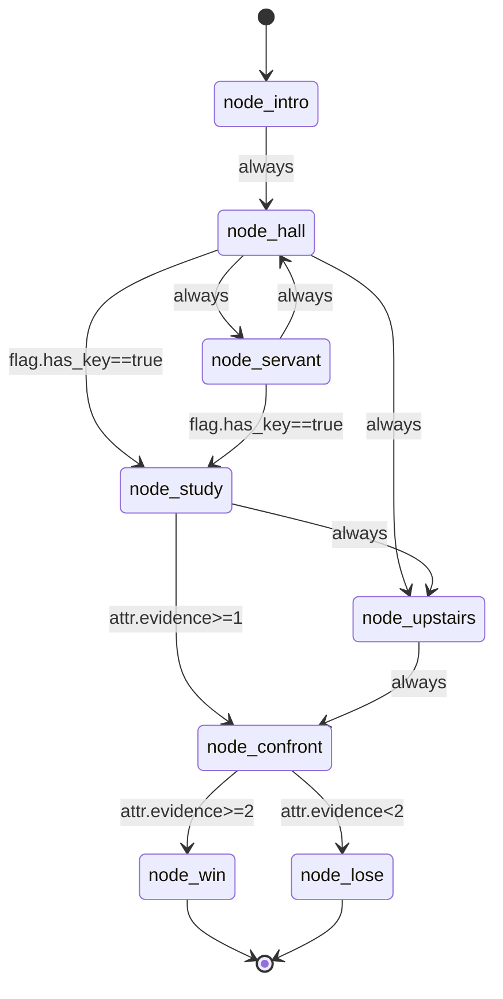

#### 10.2 condition 受控小语法（编辑期校验 + 运行期由 game-service 求值）

> 为「AI 约束在有限节点内」服务：编剧只能写有限、可被程序确定性求值的条件，**不允许任意代码**。scenario-service 负责**语法**校验（写入时），game-service 负责**求值**（应用 stateChanges 后判断，对齐基线 §6.5 第 3 条白名单校验）。

支持的 condition 形式（其余一律拒绝，返回 1100）：

| 形式 | 示例 | 含义 |
|---|---|---|
| 恒真 | `always` 或 空/null | 无条件可走 |
| flag 等值 | `flag.has_key==true` / `flag.found_diary==false` | 旗标布尔判断 |
| 属性比较 | `attr.evidence>=2` / `attr.sanity<10` | 属性数值比较, 运算符 `>=`/`<=`/`>`/`<`/`==`（基线 §6.2.1：5 个，**不含 `!=`**） |
| 物品持有 | `item.生锈的钥匙` | inventory 含该物品则真 |
| 与组合 | `flag.has_key==true && attr.sanity>0` | 多条件 AND(只支持 &&, 不支持 \|\|, 降低复杂度) |

> 本表语法与基线 §6.2.1「condition 受控小语法」严格一致：属性前缀统一 `attr.`、运算符 5 个不含 `!=`、支持 `item.` 与 `&&`。编辑期校验（下方正则）允许的集合 = 运行期 game-service 求值器支持的集合，二者不得偏差。

正则与校验器：

```java
package com.aigm.scenario.service.impl;

import com.aigm.common.exception.BizException;
import com.aigm.scenario.entity.*;
import com.aigm.scenario.mapper.*;
import com.aigm.scenario.service.ScenarioValidator;
import lombok.RequiredArgsConstructor;
import org.springframework.stereotype.Component;
import java.util.*;
import java.util.regex.Pattern;

@Component
@RequiredArgsConstructor
public class ScenarioValidatorImpl implements ScenarioValidator {

    // 单个原子条件: flag.<key>==true|false | attr.<key><op><int> | item.<name> | always
    private static final Pattern FLAG  = Pattern.compile("^flag\\.[a-z0-9_]+==(true|false)$");
    private static final Pattern ATTR  = Pattern.compile("^attr\\.[a-z0-9_]+(>=|<=|==|>|<)-?\\d+$"); // 基线 §6.2.1: 5 运算符, 无 !=
    private static final Pattern ITEM  = Pattern.compile("^item\\..+$");

    /** 写入分支时校验 condition 语法; 合法或为 always/空 则通过 */
    @Override
    public void validateCondition(String expr) {
        if (expr == null || expr.isBlank() || "always".equals(expr.trim())) return;
        String[] atoms = expr.trim().split("&&");
        for (String raw : atoms) {
            String a = raw.trim();
            boolean ok = "always".equals(a)
                    || FLAG.matcher(a).matches()
                    || ATTR.matcher(a).matches()
                    || ITEM.matcher(a).matches();
            if (!ok) {
                throw new BizException(1100, "非法 condition 原子: '" + a
                        + "'。仅支持 always / flag.x==true|false / attr.x>=n / item.名称, 多条件用 &&");
            }
        }
    }

    /** 发布前整本状态机完整性校验, 任何不通过抛对应业务码 */
    @Override
    public void validatePublishable(Long scenarioId, Scenario s) {
        // 1) 必须有起始节点, 且起始节点属于本剧本
        if (s.getStartNodeId() == null) {
            throw new BizException(1210, "剧本无起始节点(start_node_id 未设置)");
        }
        List<SceneNode> nodes = sceneNodeMapper.listByScenario(scenarioId);
        Map<Long, SceneNode> nodeMap = new HashMap<>();
        for (SceneNode n : nodes) nodeMap.put(n.getId(), n);
        if (!nodeMap.containsKey(s.getStartNodeId())) {
            throw new BizException(1210, "起始节点不属于本剧本");
        }
        if (nodes.isEmpty()) throw new BizException(1210, "剧本无任何节点");

        // 2) 每个非结局节点至少有一条出向分支(否则玩家会卡死)
        List<Transition> trans = transitionMapper.listByScenario(scenarioId);
        Set<Long> hasOut = new HashSet<>();
        for (Transition t : trans) hasOut.add(t.getFromNodeId());
        for (SceneNode n : nodes) {
            boolean ending = Integer.valueOf(1).equals(n.getIsEnding());
            if (!ending && !hasOut.contains(n.getId())) {
                throw new BizException(1211, "节点[" + n.getNodeKey() + "]非结局却无可用分支");
            }
            if (ending && (n.getEndingType() == null || n.getEndingType().isBlank())) {
                throw new BizException(1100, "结局节点[" + n.getNodeKey() + "]缺 endingType");
            }
        }

        // 3) 至少存在一个结局节点(is_ending=1)
        boolean anyEnding = nodes.stream().anyMatch(n -> Integer.valueOf(1).equals(n.getIsEnding()));
        if (!anyEnding) throw new BizException(1211, "剧本缺少结局节点");

        // 4) 分支两端节点都必须属于本剧本; condition 语法合法
        for (Transition t : trans) {
            if (!nodeMap.containsKey(t.getFromNodeId()) || !nodeMap.containsKey(t.getToNodeId())) {
                throw new BizException(1211, "分支 " + t.getId() + " 指向不存在的节点");
            }
            validateCondition(t.getConditionExpr());
        }

        // 5) 可达性: 从起始节点 BFS, 必须能到达至少一个结局节点
        if (!canReachEnding(s.getStartNodeId(), nodeMap, trans)) {
            throw new BizException(1211, "从起始节点无法到达任何结局节点(状态机不闭环)");
        }
    }

    private boolean canReachEnding(Long start, Map<Long, SceneNode> nodeMap, List<Transition> trans) {
        Map<Long, List<Long>> adj = new HashMap<>();
        for (Transition t : trans) {
            adj.computeIfAbsent(t.getFromNodeId(), k -> new ArrayList<>()).add(t.getToNodeId());
        }
        Deque<Long> queue = new ArrayDeque<>();
        Set<Long> visited = new HashSet<>();
        queue.add(start);
        visited.add(start);
        while (!queue.isEmpty()) {
            Long cur = queue.poll();
            SceneNode n = nodeMap.get(cur);
            if (n != null && Integer.valueOf(1).equals(n.getIsEnding())) return true;
            for (Long nxt : adj.getOrDefault(cur, Collections.emptyList())) {
                if (visited.add(nxt)) queue.add(nxt);
            }
        }
        return false;
    }
}
```

`ScenarioValidator` 接口：

```java
package com.aigm.scenario.service;

import com.aigm.scenario.entity.Scenario;

public interface ScenarioValidator {
    void validateCondition(String expr);
    void validatePublishable(Long scenarioId, Scenario scenario);
}
```

> 设计意图说明（写进毕设论文「难点①剧情状态机约束 LLM」可直接引用）：
> 1. **建模**：剧本= 节点(状态) + 分支(边) + 受控 condition 的有向图；起始节点为入口，结局节点为出口。
> 2. **编辑期约束**：condition 只允许受控小语法（确定性可求值），发布前用 BFS 校验「起点可达结局」「非结局节点有出边」「分支两端合法」，从源头杜绝死局与断链。
> 3. **运行期约束**：scenario-service 把当前节点的 `transitions` 作为**白名单**下发给 game-service；ai-engine 产出的 `proposedTransition.toNodeId` 必须命中白名单且对应 condition 求值为真，否则被拒（基线 §6.5）。这样无论 LLM 如何即兴，玩家永远被约束在编剧画好的有限节点轨道内。

---

### 11. 全链路时序（开局取剧本 + 每回合取节点白名单）

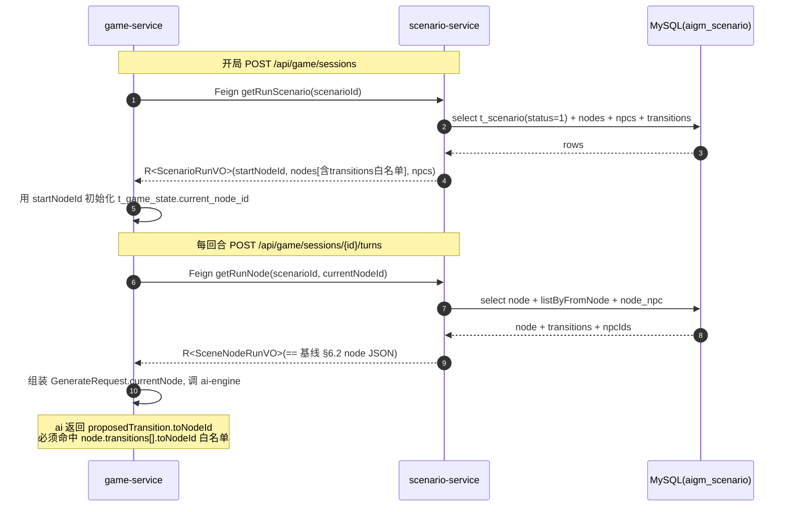

---

### 12. 全局异常处理与错误码对齐

> 本服务复用 `common.exception.GlobalExceptionHandler`（基线 §2），无需自写。涉及的业务码（基线 §3.2）在本服务的触发点：

| 业务码 | 含义 | 本服务触发点 |
|---|---|---|
| 1005 | 无权限(角色不足) | 非 AUTHOR/ADMIN 调写接口 (`AuthContext.requireAuthorOrAdmin`) |
| 1100 | 参数校验失败 | DTO 校验失败、condition 语法非法、结局节点缺 endingType、跨剧本引用节点/NPC |
| 1200 | 资源不存在 | 剧本/节点/NPC/分支 selectById 为 null |
| 1201 | 资源已存在/重复 | nodeKey / npcKey 剧本内重复 |
| 1202 | 状态非法 | 运行时取未发布(status≠1)剧本开局 |
| 1210 | 剧本无起始节点 | 发布校验：start_node_id 未设/不属本剧本/无节点 |
| 1211 | 节点无可用分支 | 发布校验：非结局节点无出边 / 无结局节点 / 不可达 / 分支指向非法 |
| 1221 | 越权访问非本人资源 | 非本人 AUTHOR 改他人剧本(`checkOwnership`) |

> 参数校验失败（`MethodArgumentNotValidException`）由 `GlobalExceptionHandler` 统一捕获转 `R.fail(1100, ...)`。`BizException(code, msg)` 直接透传 code 与 message。

---

### 13. 验收标准（DoD）

功能性验收（用 Swagger `/doc/scenario.html` 或前端 ScenarioEditor.vue 操作）：

1. **剧本 CRUD**：AUTHOR 登录后能 `POST /api/scenario` 建草稿(status=0)，`GET /api/scenario/mine` 仅看到自己的；`PUT /api/scenario/{id}` 改标题成功；`DELETE` 后该剧本不再出现在列表（逻辑删 deleted=1）。
2. **RBAC 区分**：PLAYER 调任意写接口（POST/PUT/DELETE）返回 `code=1005`；PLAYER 仅能 `GET /api/scenario/published`（只见 status=1）与 `GET /api/scenario/{id}`。
3. **归属隔离**：AUTHOR-A 改 AUTHOR-B 的剧本/节点/NPC/分支返回 `code=1221`；ADMIN 改任意人剧本成功。
4. **节点 CRUD + node-npc**：`POST /api/scenario/{sid}/nodes` 带 `npcIds` 后，`GET /api/scenario/{sid}/nodes` 返回的节点 `npcIds` 与写入一致；重复 `nodeKey` 返回 `1201`；删除节点后其相关 `t_transition`(from/to)与 `t_node_npc` 一并清除。
5. **NPC CRUD**：`npcKey` 重复返回 `1201`；删除 NPC 后其在各节点的关联(`t_node_npc`)清除。
6. **分支 CRUD（状态机边）**：跨剧本引用 from/to 节点返回 `1100`；为结局节点新增出边返回 `1100`；`condition_expr` 写 `attr.evidence>=2`、`flag.has_key==true && attr.sanity>0` 成功，写 `evidence>2 || x` 等非法语法返回 `1100`。
7. **发布完整性校验**（核心，难点①）：
   - 未设 `start_node_id` 发布 → `1210`；
   - 存在非结局节点无出边 → `1211`；
   - 无任何结局节点 → `1211`；
   - 起点 BFS 不可达结局 → `1211`；
   - 全部满足时 `PUT /api/scenario/{id}/publish {status:1}` 成功，剧本进入 `GET /api/scenario/published`。
8. **运行时只读（供 game/ai 运行）**：
   - game-service 经 `ScenarioClient.getRunScenario(sid)` 取到 `startNodeId`、全部 `nodes`（每个含 `transitions` 白名单与 `npcIds`）、`npcs`；取未发布剧本返回 `1202`。
   - `ScenarioClient.getRunNode(sid,nodeId)` 返回结构与基线 §6.2 node JSON **逐字段对齐**（`id/nodeKey/title/narrativeBrief/isEnding/endingType/npcIds/transitions[{toNodeId,condition,priority,description}]`），其中 `condition_expr` 为空时输出 `"always"`。
   - 该返回直接可填入 `GenerateRequest.currentNode`，ai-engine 白名单校验（基线 §6.5）可正常运行：越界 `toNodeId` 不在 `transitions[].toNodeId` 集合中即被拒。

非功能性验收：

9. **统一返回体**：所有接口返回 `{code,message,data}`；成功 `code=0`；分页返回 `data:{list,total,page,size}`，`page` 从 1 起，`size>100` 返回 `1103`。
10. **时间格式**：所有 `createdAt/updatedAt` 序列化为 `yyyy-MM-dd HH:mm:ss`（GMT+8）。
11. **注册发现**：服务以 `scenario-service` 名注册到 Nacos（namespace=public，基线 §3.4.1），game-service 可通过服务名 Feign 调通；`/api/scenario/run/**` 仅供内网 Feign 访问，不被前端直达（基线 §3.4 内部前缀策略）。
12. **种子数据可运行**：导入「迷雾古宅」种子（8 节点 / 3-4 NPC / 边集如 §10.1），`publish` 校验通过，`getRunScenario` 返回的图与 §10.1 状态图一致，可被 game-service 完整跑通一局直到 `node_win`/`node_lose`。

## 四、game-service 实现规格（对局/状态/回合 + 开局与回合六步编排 + 状态机白名单二次校验 + 事务边界 + 幂等）

> 本节给出系统**编排核心** game-service 的完整实现规格。它是唯一持有「对局运行态」的服务（`t_game_state` 是运行时状态的唯一事实源），负责：开局、每回合的「取状态 → 取节点白名单 → RAG 召回 → 调 ai-engine → 白名单二次校验 → 落库 + 存记忆」六步编排。严格对齐基线（§01-foundation）：服务名 `game-service`、库名 `aigm_game`、表 `t_game_session`/`t_game_state`/`t_turn`、§5.3 REST 契约、§6 AI 引擎契约与白名单校验、§6.2.1 condition 受控小语法、错误码（1202/1220/1221/1500/1503 等）。其 Feign 客户端（`ScenarioClient`/`AiEngineClient`/`MemoryClient`）来自 `common/feign`（见 `02-common` §10）。基准日期 **2026-05-29**。

> DOC A 对照：本节的时序与降级语义与 DOC A `03-dataflow`（端到端时序）、`06-resilience`（事务边界、Feign 降级、幂等、ConditionEvaluator）一致；条件求值器与 ai-engine（`05-ai-engine-service`）用同一套 §6.2.1 语法，game-service 在落库前做**权威二次校验**。

---

### 1. 模块定位与依赖边界

- 持有对局运行态：`t_game_session`（对局/存档）、`t_game_state`（与 session 一对一的状态机快照）、`t_turn`（回合）。
- 编排者：通过 Feign 调 scenario-service（取剧本/节点/白名单）、ai-engine-service（生成）、memory-service（召回/存储）。
- **不直接调 LLM**（那是 ai-engine）；**不持有剧本静态定义**（那在 scenario-service）。
- RBAC：信任网关 `X-User-*` 头；仅 `PLAYER` 可开局/提交回合，且所有 `/api/game/sessions/{id}/**` 必须校验本人对局（基线 §5.3，越权 1221）。

---

### 2. pom.xml（关键依赖）

```xml
<dependencies>
  <dependency><groupId>com.aigm</groupId><artifactId>common</artifactId><version>1.0.0</version></dependency>

  <dependency><groupId>org.springframework.boot</groupId><artifactId>spring-boot-starter-web</artifactId></dependency>
  <!-- Actuator：/actuator/health(§08-devops DoD) -->
  <dependency><groupId>org.springframework.boot</groupId><artifactId>spring-boot-starter-actuator</artifactId></dependency>
  <dependency><groupId>org.springframework.boot</groupId><artifactId>spring-boot-starter-validation</artifactId></dependency>

  <!-- Nacos 注册 + 配置 + bootstrap -->
  <dependency><groupId>com.alibaba.cloud</groupId><artifactId>spring-cloud-starter-alibaba-nacos-discovery</artifactId></dependency>
  <dependency><groupId>com.alibaba.cloud</groupId><artifactId>spring-cloud-starter-alibaba-nacos-config</artifactId></dependency>
  <dependency><groupId>org.springframework.cloud</groupId><artifactId>spring-cloud-starter-bootstrap</artifactId></dependency>

  <!-- OpenFeign（调 scenario/ai-engine/memory） + LoadBalancer -->
  <dependency><groupId>org.springframework.cloud</groupId><artifactId>spring-cloud-starter-openfeign</artifactId></dependency>
  <dependency><groupId>org.springframework.cloud</groupId><artifactId>spring-cloud-starter-loadbalancer</artifactId></dependency>

  <!-- MyBatis-Plus(boot3) + MySQL -->
  <dependency><groupId>com.baomidou</groupId><artifactId>mybatis-plus-spring-boot3-starter</artifactId><version>3.5.5</version></dependency>
  <dependency><groupId>com.mysql</groupId><artifactId>mysql-connector-j</artifactId></dependency>
</dependencies>
```

---

### 3. 配置文件

#### 3.1 bootstrap.yml（对齐基线 §3.4.1）

```yaml
spring:
  application:
    name: game-service
  profiles:
    active: local
  cloud:
    nacos:
      discovery:
        server-addr: ${NACOS_ADDR:127.0.0.1:8848}
        username: ${NACOS_USER:nacos}
        password: ${NACOS_PASSWORD:nacos}
        namespace: public
      config:
        server-addr: ${NACOS_ADDR:127.0.0.1:8848}
        username: ${NACOS_USER:nacos}
        password: ${NACOS_PASSWORD:nacos}
        namespace: public
        file-extension: yaml
        shared-configs:
          - data-id: aigm-common.yaml      # 取共享 jwt/时间格式(基线 §3.4.1)
            group: DEFAULT_GROUP
            refresh: true
```

#### 3.2 application.yml（端口 8083 + 数据源 + Feign 超时）

```yaml
server:
  port: 8083                        # 基线 §3.4 端口表: game-service=8083

spring:
  datasource:
    driver-class-name: com.mysql.cj.jdbc.Driver
    url: jdbc:mysql://${MYSQL_HOST:127.0.0.1}:3306/aigm_game?useSSL=false&serverTimezone=GMT%2B8&characterEncoding=utf8mb4&allowPublicKeyRetrieval=true
    username: ${MYSQL_USER:root}
    password: ${MYSQL_PASSWORD:aigm123456}   # 与 §08-devops compose 一致
  jackson:
    date-format: yyyy-MM-dd HH:mm:ss
    time-zone: GMT+8

mybatis-plus:
  configuration:
    map-underscore-to-camel-case: true
  global-config:
    db-config:
      id-type: auto

# Feign 超时(基线 §3.4): AI 相关 readTimeout 60s, 其余默认 5s
feign:
  client:
    config:
      default:
        connectTimeout: 3000
        readTimeout: 5000
      ai-engine-service:
        connectTimeout: 3000
        readTimeout: 60000          # LLM 慢
```

---

### 4. 实体（与基线 §4.3 DDL 字段一一对应）

```java
@Data @TableName("t_game_session")
public class GameSession {
    @TableId(type = IdType.AUTO) private Long id;
    private Long userId;
    private Long scenarioId;
    private String title;
    private Integer status;     // 1进行中 2已通关 3已失败 4已弃局
    private Integer turnCount;
    private LocalDateTime createdAt;
    private LocalDateTime updatedAt;
}

@Data @TableName("t_game_state")
public class GameState {
    @TableId(type = IdType.AUTO) private Long id;
    private Long sessionId;
    private Long currentNodeId;
    private String flags;        // JSON 字符串 {"has_key":true}; 读写时与 Map 互转(见 §6)
    private String inventory;    // JSON 字符串 ["生锈的钥匙"]
    private String attributes;   // JSON 字符串 {"sanity":80,"evidence":0}
    private String recentSummary;
    private LocalDateTime updatedAt;
}

@Data @TableName("t_turn")
public class Turn {
    @TableId(type = IdType.AUTO) private Long id;
    private Long sessionId;
    private Integer turnNo;
    private Long nodeId;
    private String playerInput;
    private String aiOutput;     // 完整 GenerateResponse JSON(基线 §4.3)
    private LocalDateTime createdAt;
}
```

> 状态机常量：`STATUS_RUNNING=1`、`STATUS_WIN=2`、`STATUS_LOSE=3`、`STATUS_ABANDON=4`。`t_game_state` 的 `flags/inventory/attributes` 在 DB 是 JSON 列，Java 侧用字符串存、用 Jackson 与 `Map<String,Object>`/`List<String>`/`Map<String,Integer>` 互转（封装在 `StateCodec`）。

---

### 5. VO 定义（基线 §5.3 响应体）

落地约定同 `02-common`：一类一 `public` 文件。

```java
/** 对前端暴露的运行态(基线 §5.3 GameStateVO) */
@Data
public class GameStateVO {
    private Long currentNodeId;
    private String currentNodeKey;            // 便于前端展示
    private String currentNodeTitle;
    private Map<String, Object> flags;
    private List<String> inventory;
    private Map<String, Integer> attributes;
    private String recentSummary;
}

/** 单条 AI 输出(= 基线 §6.4 GenerateResponse 的对外形态) */
@Data
public class AiOutputVO {
    private String narrative;
    private List<NpcLine> npcDialogues;        // {npcId, line}
    private TransitionVO appliedTransition;    // 实际生效的跳转(被拒则 null/停留)
    // stateChanges 已应用进 state, 前端通常看 state 即可; 如需也可附 raw
}

/** 开局响应(基线 §5.3 POST /sessions) */
@Data
public class StartSessionVO {
    private Long sessionId;
    private GameStateVO state;
    private AiOutputVO firstTurn;              // 开场叙事
}

/** 提交回合响应(基线 §5.3 POST /turns) */
@Data
public class TurnResultVO {
    private TurnVO turn;                        // {turnNo, playerInput, aiOutput}
    private GameStateVO state;
    private boolean finished;                   // 是否抵达结局
}

/** 存档列表项(基线 §5.3 GET /sessions) */
@Data
public class SessionVO {
    private Long sessionId;
    private Long scenarioId;
    private String scenarioTitle;
    private String title;
    private Integer status;
    private Integer turnCount;
    private LocalDateTime updatedAt;
}
```

---

### 6. 控制器（基线 §5.3 全部接口）

```java
@RestController
@RequestMapping("/api/game")
@RequiredArgsConstructor
public class GameSessionController {

    private final GameService gameService;

    /** 开局 */
    @PostMapping("/sessions")
    public R<StartSessionVO> start(@RequestBody @Valid StartDTO dto) {
        requirePlayer();
        return R.ok(gameService.startSession(UserContext.userId(), dto.getScenarioId()));
    }

    /** 我的存档列表 */
    @GetMapping("/sessions")
    public R<PageResult<SessionVO>> mySessions(@RequestParam(required=false) Long page,
                                               @RequestParam(required=false) Long size,
                                               @RequestParam(required=false) Integer status) {
        requirePlayer();
        return R.ok(gameService.listMySessions(UserContext.userId(), PageQuery.of(page,size), status));
    }

    /** 对局详情(读档：state + 全部 turns) */
    @GetMapping("/sessions/{id}")
    public R<SessionDetailVO> detail(@PathVariable Long id) {
        requirePlayer();
        return R.ok(gameService.getDetail(UserContext.userId(), id));
    }

    /** 单独取当前状态 */
    @GetMapping("/sessions/{id}/state")
    public R<GameStateVO> state(@PathVariable Long id) {
        requirePlayer();
        return R.ok(gameService.getState(UserContext.userId(), id));
    }

    /** 弃局 */
    @PutMapping("/sessions/{id}/abandon")
    public R<Boolean> abandon(@PathVariable Long id) {
        requirePlayer();
        gameService.abandon(UserContext.userId(), id);
        return R.ok(true);
    }

    private void requirePlayer() {
        if (!UserContext.get().hasRole(RoleConst.PLAYER)) {
            throw new BizException(ResultCode.AUTH_NO_PERMISSION); // 1005
        }
    }
}

@RestController
@RequestMapping("/api/game")
@RequiredArgsConstructor
public class TurnController {

    private final GameService gameService;

    /** 提交一回合(核心编排) */
    @PostMapping("/sessions/{id}/turns")
    public R<TurnResultVO> turn(@PathVariable Long id, @RequestBody @Valid TurnDTO dto) {
        if (!UserContext.get().hasRole(RoleConst.PLAYER)) {
            throw new BizException(ResultCode.AUTH_NO_PERMISSION); // 1005
        }
        return R.ok(gameService.submitTurn(UserContext.userId(), id, dto.getPlayerInput()));
    }
}
```

> 弃局接口 `PUT /sessions/{id}/abandon` **无请求体**（基线 §5.3 / `07-frontend` 一致）。SSE 变体 `POST /sessions/{id}/turns/stream` 为可选加分项（基线 §5.3）；默认不实现，前端 `enableStream=false` 走非流式 `/turns`。如实现，复用 `submitTurn` 的编排，仅把 `narrative` 以 `text/event-stream` 增量推送，最终仍落同样的库。

---

### 7. 开局编排 `startSession`

```java
@Service
@RequiredArgsConstructor
public class GameService {

    private final GameSessionMapper sessionMapper;
    private final GameStateMapper stateMapper;
    private final TurnMapper turnMapper;
    private final ScenarioClient scenarioClient;   // common/feign, path=/api/scenario/run
    private final AiEngineClient aiEngineClient;    // common/feign, path=/api/ai
    private final MemoryClient memoryClient;        // common/feign, path=/api/memory
    private final TransitionWhitelist whitelist;    // §9 权威白名单二次校验

    public StartSessionVO startSession(Long userId, Long scenarioId) {
        // 1) 取剧本运行结构(校验 status=1 已发布; 无起始节点→1210)
        ScenarioRunVO sc = unwrap(scenarioClient.getRunScenario(scenarioId), ResultCode.RESOURCE_NOT_FOUND);
        if (sc.getStartNodeId() == null) throw new BizException(ResultCode.SCENARIO_NO_START_NODE); // 1210

        // 2) 建 session + 初始 state(=起始节点; 初始 flags/inventory/attributes 见种子约定)
        GameSession session = new GameSession();
        session.setUserId(userId);
        session.setScenarioId(scenarioId);
        session.setTitle(sc.getTitle() + " " + LocalDate.now());
        session.setStatus(STATUS_RUNNING);
        session.setTurnCount(0);
        sessionMapper.insert(session);

        GameState state = new GameState();
        state.setSessionId(session.getId());
        state.setCurrentNodeId(sc.getStartNodeId());
        state.setFlags("{}");
        state.setInventory("[]");
        state.setAttributes(StateCodec.toJson(Map.of("sanity", 80, "evidence", 0))); // 初始属性(基线 §7.4)
        state.setRecentSummary("");
        stateMapper.insert(state);

        // 3) 生成开场叙事(isFirstTurn=true, playerInput 为空)
        GenerateResponse ai = generate(session, state, sc, /*playerInput*/ null, /*firstTurn*/ true);

        // 4) 应用 + 落库(首回合 turn_no=1)
        TurnResultVO first = persistTurn(session, sc, null, ai);

        // 5) 存记忆(尽力而为)
        storeSafely(session.getId(), ai.getMemoryToStore());

        StartSessionVO vo = new StartSessionVO();
        vo.setSessionId(session.getId());
        vo.setState(first.getState());
        vo.setFirstTurn(toAiOutput(ai, first));
        return vo;
    }
}
```

---

### 8. 回合六步编排 `submitTurn`（核心）

对应基线 §6 的六步与 `03-dataflow` §1 时序。**慢/易失败的外部调用（recall、generate）在事务外；事务内只做本地快速 DB 写**（`06-resilience` §7 事务边界）。

```java
public TurnResultVO submitTurn(Long userId, Long sessionId, String playerInput) {
    // ① 取运行时状态(事实源) + 归属/状态校验
    GameSession session = sessionMapper.selectById(sessionId);
    if (session == null) throw new BizException(ResultCode.GAME_SESSION_NOT_FOUND);        // 1220
    if (!Objects.equals(session.getUserId(), userId))
        throw new BizException(ResultCode.GAME_SESSION_FORBIDDEN);                          // 1221
    if (session.getStatus() != STATUS_RUNNING)
        throw new BizException(ResultCode.STATE_INVALID);                                  // 1202
    GameState state = stateMapper.selectBySessionId(sessionId);

    // ② 取当前节点静态定义 + 出场 NPC + 分支白名单(走运行时只读内部接口 /api/scenario/run)
    SceneNodeRunVO node = unwrap(
        scenarioClient.getRunNode(session.getScenarioId(), state.getCurrentNodeId()),
        ResultCode.RESOURCE_NOT_FOUND);

    // ③ RAG 召回(每回合, 先 recall; 失败静默降级为空)
    List<RecalledMemory> memories = recallSafely(sessionId, playerInput);

    // ④ 拼 GenerateRequest 调 ai-engine(失败→1500/1901, 阻断回合)
    GenerateResponse ai = generate(session, state, node, memories, playerInput, false);

    // ⑤ 白名单二次校验(权威) + ⑥ 落库 —— 在事务内
    TurnResultVO result = persistTurn(session, node, playerInput, ai);

    // 回合后存记忆(事务外, 尽力而为)
    storeSafely(sessionId, ai.getMemoryToStore());
    return result;
}
```

#### 8.1 knownFacts 按 flag 解锁（基线 §6.3，组装责任在 game-service）

拼 `GenerateRequest.npcs[].knownFacts` 时，scenario 给的 `SceneNodeRunVO` 里每个 NPC 含 `knownFacts`(=background) 与 `secret`：

```java
// 把已解锁的 secret 并入 knownFacts 后再下发给 ai-engine(防过早剧透)
private String resolveKnownFacts(NpcRunVO npc, Map<String,Object> flags) {
    String base = npc.getKnownFacts() == null ? "" : npc.getKnownFacts();
    boolean unlocked = npc.getSecretUnlockFlag() != null
        && Boolean.TRUE.equals(flags.get(npc.getSecretUnlockFlag()));
    // 本毕设也可用简单业务规则(如 evidence>=2 时解锁医生 secret); 与 §6.3 一致, 编剧不需手填 background
    return (unlocked && npc.getSecret() != null) ? base + " " + npc.getSecret() : base;
}
```

---

### 9. 白名单二次校验（权威，基线 §6.5 第 3 条）

ai-engine 已做过预校验，game-service 在落库前用**同一套 §6.2.1 语法**再校验一次（防御性，下游不信任上游），用应用 `stateChanges` 后的权威 state 求值：

```java
@Component
public class TransitionWhitelist {

    /** 返回最终生效的 toNodeId; 不合法/越界 → 返回 null(停留)，记 1503 */
    public Long resolve(SceneNodeRunVO node, ProposedTransition proposed, GameState projectedState) {
        if (proposed == null || proposed.getToNodeId() == null) return null; // 合法停留
        Long to = proposed.getToNodeId();
        // a) 必须在当前节点白名单内
        Optional<TransitionRunVO> matched = node.getTransitions().stream()
            .filter(t -> Objects.equals(t.getToNodeId(), to)).findFirst();
        if (matched.isEmpty()) {
            log.warn("[1503] toNodeId {} not in whitelist of node {}", to, node.getId());
            return null;
        }
        // b) 对应 condition 在 projectedState(已应用 stateChanges) 上求值为真
        if (!ConditionEvaluator.eval(matched.get().getCondition(), projectedState)) {
            log.warn("[1503] condition '{}' not satisfied for toNodeId {}", matched.get().getCondition(), to);
            return null;
        }
        return to;
    }
}
```

> `ConditionEvaluator` 实现与 ai-engine 完全相同（§6.2.1 全集：`always`/`flag.`/`attr.`/`item.`/`&&`，5 运算符无 `!=`，未知一律 false）。建议把它放 `common`（或两服务各抄一份保持一致）。属性边界 clamp（sanity∈[0,100] 等）在应用 `attrDelta` 时执行。

---

### 10. 落库 `persistTurn`（事务内，原子 + 幂等）

```java
@Transactional(rollbackFor = Exception.class)
public TurnResultVO persistTurn(GameSession session, SceneNodeRunVO node, String playerInput, GenerateResponse ai) {
    GameState state = stateMapper.selectBySessionId(session.getId());

    // 1) 应用 stateChanges(flags/inventory/attributes; attrDelta 后 clamp)
    StateApplier.apply(state, ai.getStateChanges(), this::clampAttr);

    // 2) 权威白名单二次校验(用已应用变更后的 state); 通过→推进, 否则停留
    Long toNode = whitelist.resolve(node, ai.getProposedTransition(), state);
    boolean finished = false;
    if (toNode != null) {
        state.setCurrentNodeId(toNode);
        // 目标节点 isEnding/endingType 已在 ② 随白名单取回(放 node.transitions 对应目标的元信息或单独缓存),
        // 事务内不再发 Feign(保持事务短, 见 06-resilience §7)
        TransitionRunVO t = node.getTransitions().stream()
            .filter(x -> Objects.equals(x.getToNodeId(), toNode)).findFirst().orElseThrow();
        if (Boolean.TRUE.equals(t.getTargetIsEnding())) {
            session.setStatus("WIN".equals(t.getTargetEndingType()) ? STATUS_WIN : STATUS_LOSE);
            finished = true;
        }
    }

    // 3) 滚动近况摘要(把本回合压缩进 recentSummary, 控制长度, 喂下回合 LLM)
    state.setRecentSummary(rollingSummary(state.getRecentSummary(), ai.getNarrative()));
    stateMapper.updateById(state);

    // 4) 写回合(turn_no=turn_count+1; 唯一索引 uk_session_turn 兜底幂等)
    int turnNo = session.getTurnCount() + 1;
    Turn turn = new Turn();
    turn.setSessionId(session.getId());
    turn.setTurnNo(turnNo);
    turn.setNodeId(state.getCurrentNodeId());
    turn.setPlayerInput(playerInput);
    turn.setAiOutput(JsonUtil.toJson(ai));    // 完整 JSON 存档(基线 §4.3)
    turnMapper.insert(turn);

    // 5) turn_count++
    session.setTurnCount(turnNo);
    sessionMapper.updateById(session);

    return buildTurnResult(turn, state, node, finished);
}
```

> **幂等**：`t_turn` 的唯一索引 `uk_session_turn(session_id, turn_no)` 是兜底。前端「提交回合」按钮提交后置灰，避免重复提交；若重复提交导致 `turn_no` 冲突，捕获 `DuplicateKeyException` 返回上一回合结果或 `STATE_INVALID`。开局亦然（一个 user 对同一 scenario 可多次开局得到不同 session，无需去重）。
> **目标节点 isEnding 取回**：为保持事务短，建议 `SceneNodeRunVO.transitions[]` 的每条额外带 `targetIsEnding`/`targetEndingType`（scenario-service 构建运行视图时一并填充），事务内直接读，无需再发 Feign（`06-resilience` §7 建议）。

---

### 11. Feign 降级（与 `06-resilience` §8 一致）

| 下游 | 调用点 | 失败降级 | 是否阻断 |
|---|---|---|---|
| memory `/recall` | 召回 | 静默返回空记忆 | 否 |
| memory `/store` | 存记忆 | 静默吞掉(记 warn) | 否 |
| scenario `/run/...` | 取节点/白名单 | 抛 `SERVICE_UNAVAILABLE`(1901) | 是 |
| ai-engine `/generate` | 生成 | 抛 1500/1901(GM 不可用) | 是 |

```java
private List<RecalledMemory> recallSafely(Long sessionId, String query) {
    try {
        R<RecallResult> r = memoryClient.recall(new RecallRequest(sessionId, query, 5));
        return (r != null && r.getData() != null && r.getData().getMemories() != null)
                ? r.getData().getMemories() : Collections.emptyList();
    } catch (Exception e) {
        log.warn("[degrade] recall failed, continue without memories. session={}", sessionId, e);
        return Collections.emptyList();
    }
}

private void storeSafely(Long sessionId, List<MemoryToStore> items) {
    if (items == null || items.isEmpty()) return;
    try {
        memoryClient.store(new StoreRequest(sessionId, toItems(items)));
    } catch (Exception e) {
        log.warn("[degrade] memory store failed, skip. session={}", sessionId, e);
    }
}

private GenerateResponse generate(...) {
    try {
        R<GenerateResponse> r = aiEngineClient.generate(buildRequest(...));
        if (r == null || r.getData() == null) throw new BizException(ResultCode.AI_LLM_FAILED); // 1500
        return r.getData();
    } catch (BizException be) { throw be; }
    catch (Exception e) { throw new BizException(ResultCode.SERVICE_UNAVAILABLE, "GM 正在打盹，请稍后再试"); } // 1901
}
```

> ai-engine 内部对 1501/1502/1503 已做重试/降级并始终返回 `R.ok`（见 `05-ai-engine-service` §5.13）。game-service 这里 catch 的是网络层/服务彻底不可用（1500/1901）。

---

### 12. 启动类

```java
@SpringBootApplication
@EnableFeignClients(basePackages = "com.aigm.common.feign")
@MapperScan("com.aigm.game.mapper")
public class GameApplication {
    public static void main(String[] args) { SpringApplication.run(GameApplication.class, args); }
}
```

> 无需 `scanBasePackages` 加 `com.aigm.common`：`GlobalExceptionHandler` 由 common 自动配置注册（`02-common` §9）。`AuthHeaderInterceptor`（读 `X-User-*` 进 `UserContext`，DOC A `07-security-nfr` §3.2）需在本服务注册为拦截器。

---

### 13. 验收标准（DoD）

- [ ] **开局**：`POST /api/game/sessions {scenarioId}` 返回 `R{code:0, data:{sessionId, state, firstTurn.narrative}}`；`t_game_session`/`t_game_state` 落库，`current_node_id=起始节点`，`turn_count=1`。
- [ ] **回合**：`POST /api/game/sessions/{id}/turns {playerInput}` 返回 `{turn:{turnNo,playerInput,aiOutput}, state, finished}`；`t_turn` 新增、`t_game_state` 更新、`turn_count++`；`t_memory` 有新增向量记录（recall/store 链路通）。
- [ ] **状态机约束生效**：当 ai-engine/LLM 提议越界跳转时，`TransitionWhitelist.resolve` 返回 null、日志出现 `1503`、`current_node_id` 不变（AI 跳不出轨道）。
- [ ] **胜负判定**：抵达 `node_confront` 且 `evidence>=2` → 推进 `node_win`、`session.status=2`、`finished=true`；否则 `node_lose`、`status=3`。
- [ ] **越权防护**：访问非本人 session → `1221`；对已结束(status≠1) session 提交回合 → `1202`；session 不存在 → `1220`。
- [ ] **RBAC**：非 PLAYER 调用 game 接口 → `1005`。
- [ ] **降级**：memory 不可用时回合仍成功（记忆为空）；scenario/ai-engine 不可用时回合失败并返回 1901/1500，不写脏数据（事务回滚）。
- [ ] **事务边界**：LLM 调用在事务外；事务内仅本地 DB 写；幂等靠 `uk_session_turn`。
- [ ] **读档**：`GET /api/game/sessions/{id}` 返回 state + 全部 turns，可回放。
- [ ] **注册发现**：以 `game-service` 注册 Nacos（namespace=public），经 Feign 调通 scenario/ai-engine/memory；端到端可从开局连续若干回合直到 `node_win`/`node_lose`。
## 五、ai-engine-service 实现规格（剧情状态机约束 LLM × 多 NPC 人格一致）

> 本节严格对齐基线 §6「AI 引擎契约」与 §3「全局约定」。服务名 `ai-engine-service`、路径 `POST /api/ai/generate`、`GenerateRequest`/`GenerateResponse` 的 JSON 字段名、错误码（1500–1504）、白名单校验规则（基线 §6.5）一律以基线为准，本节不重命名、不新增字段。
>
> ai-engine-service 是**无状态**服务：它不连任何数据库、不维护对局状态、不调用 memory-service / scenario-service。它只做一件事——把 game-service 已组装好的 `GenerateRequest`（状态 + 当前节点定义 + 出场 NPC + 召回记忆 + 玩家输入）翻译成「最终 prompt」，调用可切换的 LLM（OpenAI 兼容接口），把模型输出解析、校验、白名单兜底，整理成 `GenerateResponse` 返回。

---

### 5.1 职责边界与在系统中的位置

ai-engine-service 在每个回合的全链路里只占「调用 LLM 并保证输出合法」这一段。下图给出一次回合的全链路，灰底框是本节的实现范围。

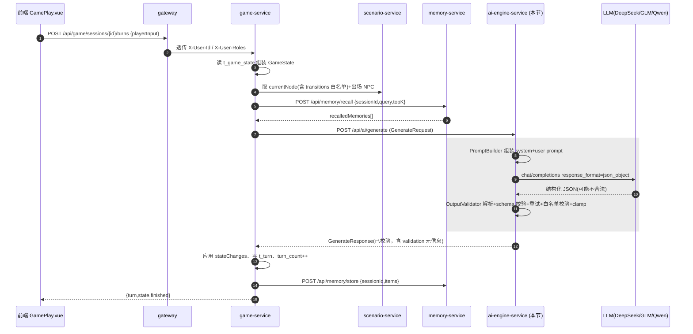

要点：
- **白名单校验由本服务执行**（基线 §6.5 第 3 条）。本服务在 `GenerateRequest.currentNode.transitions` 内做完整校验后返回；game-service 在落库前可信任本服务的 `validation` 结果，亦可二次校验（防御性，二者用同一套规则，结论一致）。
- **本服务不写库、不存记忆**：它只在响应里把 `memoryToStore` 透传给 game-service，由 game-service 决定是否调 memory-service `store`。
- **无状态**：同一 `GenerateRequest` 反复调用应得到结构等价（schema 合法、白名单一致）的结果，便于 game-service 重试与本节验收（§5.13）。

---

### 5.2 模块结构与类清单

对齐基线 §2 仓库结构（`ai-engine-service/src/main/java/com/aigm/ai/`）：

```
ai-engine-service/
├── pom.xml
└── src/main/
    ├── java/com/aigm/ai/
    │   ├── AiEngineApplication.java
    │   ├── controller/
    │   │   └── AiGenerateController.java        # POST /api/ai/generate（INTERNAL）
    │   ├── service/
    │   │   ├── PromptBuilder.java               # 组装 system+user prompt
    │   │   ├── LlmClient.java                   # LLM 调用门面（重试/超时/JSON-mode）
    │   │   └── OutputValidator.java             # 解析+schema 校验+白名单+clamp+兜底
    │   ├── llm/
    │   │   ├── OpenAiCompatClient.java          # DeepSeek/GLM/Qwen OpenAI 兼容实现
    │   │   ├── ChatMessage.java                 # role/content
    │   │   ├── ChatCompletionRequest.java       # OpenAI 兼容请求体
    │   │   └── ChatCompletionResponse.java      # OpenAI 兼容响应体
    │   ├── config/
    │   │   ├── LlmProperties.java               # @ConfigurationProperties(prefix="aigm.llm")
    │   │   ├── PromptProperties.java            # @ConfigurationProperties(prefix="aigm.prompt")
    │   │   └── RestClientConfig.java            # RestClient + 超时
    │   ├── prompt/
    │   │   └── PromptTemplates.java             # GM 总控 / NPC persona 模板常量
    │   └── dto/
    │       ├── GenerateRequest.java             # = 基线 §6.3
    │       ├── GenerateResponse.java            # = 基线 §6.4 + validation 元信息
    │       ├── GameStateDTO.java                # = 基线 §6.1
    │       ├── NodeDTO.java                     # = 基线 §6.2（含 TransitionDTO）
    │       ├── NpcDTO.java                      # = 基线 §6.3 npcs[]
    │       ├── MemoryItemDTO.java               # recalledMemories[] / memoryToStore[]
    │       ├── StateChangesDTO.java             # 基线 §6.4 stateChanges
    │       ├── ProposedTransitionDTO.java       # 基线 §6.4 proposedTransition
    │       └── ValidationInfoDTO.java           # 校验过程元信息（重试次数/降级/拒绝原因）
    └── resources/
        ├── bootstrap.yml                        # Nacos 配置中心接入
        └── application.yml                      # 本地默认值
```

类职责一句话总结：

| 类 | 职责 |
|---|---|
| `AiGenerateController` | 暴露 `POST /api/ai/generate`，接收 `GenerateRequest`，返回 `R<GenerateResponse>` |
| `PromptBuilder` | 把 `GenerateRequest` 拼成 `system` + `user` 两条 message（含合法 transition 白名单、NPC persona、召回记忆、输出 JSON schema 说明） |
| `LlmClient` | 调 `OpenAiCompatClient`，带 JSON-mode、超时、失败重试（网络/超时）与「修复重试」（JSON 非法时） |
| `OpenAiCompatClient` | 真正发 HTTP 到 `baseUrl + /chat/completions`，provider 无关（DeepSeek/GLM/Qwen 同一兼容协议） |
| `OutputValidator` | 解析 JSON → schema 校验 → 非法子项丢弃/补默认 → 白名单校验 → 属性 clamp → 兜底降级，产出最终 `GenerateResponse` |
| `LlmProperties` / `PromptProperties` | 从 Nacos 配置中心读 provider/baseUrl/apiKey/model/温度/重试等，支持热切换 |

---

### 5.3 可配置 LLM 客户端（provider 可切换）

#### 5.3.1 配置项清单（从 Nacos 配置中心读，前缀 `aigm.llm` / `aigm.prompt`）

| 配置键 | 类型 | 默认 | 说明 |
|---|---|---|---|
| `aigm.llm.provider` | String | `deepseek` | 取值 `deepseek` / `glm` / `qwen`，仅用于日志与按 provider 微调；协议统一 OpenAI 兼容 |
| `aigm.llm.base-url` | String | `https://api.deepseek.com/v1` | OpenAI 兼容 base url（不含 `/chat/completions`） |
| `aigm.llm.api-key` | String | （Nacos 下发，勿入库） | Bearer 令牌 |
| `aigm.llm.model` | String | `deepseek-chat` | 模型名（GLM 可填 `glm-4-flash`，Qwen 可填 `qwen-plus`） |
| `aigm.llm.temperature` | double | `0.8` | 叙事需要一定创造性，0.7–0.9 较合适 |
| `aigm.llm.max-tokens` | int | `1200` | 单回合输出上限，足够 narrative+dialogues+state |
| `aigm.llm.timeout-ms` | int | `60000` | readTimeout，对齐基线 §3.4 AI 调用 60s |
| `aigm.llm.connect-timeout-ms` | int | `3000` | connectTimeout，对齐基线 §3.4 |
| `aigm.llm.json-mode` | boolean | `true` | 是否发 `response_format={type:json_object}`；个别模型不支持时置 false，仅靠 prompt 约束 |
| `aigm.llm.max-retry` | int | `1` | JSON 非法时的「修复重试」次数（基线 §6.5 第 1 条要求一次重试） |
| `aigm.llm.network-retry` | int | `1` | 网络/超时类失败的重试次数 |
| `aigm.prompt.narrative-min` | int | `100` | 叙事字数下限（写入 prompt 指引，对齐基线 §6.4 100–200 字） |
| `aigm.prompt.narrative-max` | int | `200` | 叙事字数上限 |
| `aigm.prompt.max-recalled` | int | `5` | 拼入 prompt 的召回记忆条数上限（对齐 recall topK 默认 5） |

> provider 切换示例：把 `aigm.llm.provider=glm`、`base-url=https://open.bigmodel.cn/api/paas/v4`、`model=glm-4-flash`、`api-key=<GLM key>` 推到 Nacos 配置中心并 refresh，**无需改代码、无需重启**（`@RefreshScope`）。三家均为 OpenAI 兼容 `chat/completions`，请求/响应体一致，故 `OpenAiCompatClient` 不分叉。

#### 5.3.2 `LlmProperties.java`

```java
package com.aigm.ai.config;

import lombok.Data;
import org.springframework.boot.context.properties.ConfigurationProperties;
import org.springframework.cloud.context.config.annotation.RefreshScope;
import org.springframework.stereotype.Component;

@Data
@Component
@RefreshScope                          // 支持 Nacos 配置热刷新，provider/key/model 可热切换
@ConfigurationProperties(prefix = "aigm.llm")
public class LlmProperties {
    private String provider = "deepseek";
    private String baseUrl = "https://api.deepseek.com/v1";
    private String apiKey = "";
    private String model = "deepseek-chat";
    private double temperature = 0.8;
    private int maxTokens = 1200;
    private int timeoutMs = 60000;
    private int connectTimeoutMs = 3000;
    private boolean jsonMode = true;
    private int maxRetry = 1;           // 修复重试次数
    private int networkRetry = 1;       // 网络/超时重试次数
}
```

```java
package com.aigm.ai.config;

import lombok.Data;
import org.springframework.boot.context.properties.ConfigurationProperties;
import org.springframework.cloud.context.config.annotation.RefreshScope;
import org.springframework.stereotype.Component;

@Data
@Component
@RefreshScope
@ConfigurationProperties(prefix = "aigm.prompt")
public class PromptProperties {
    private int narrativeMin = 100;
    private int narrativeMax = 200;
    private int maxRecalled = 5;
}
```

#### 5.3.3 OpenAI 兼容请求/响应 DTO 与 `OpenAiCompatClient`

```java
package com.aigm.ai.llm;

import lombok.AllArgsConstructor;
import lombok.Data;
import lombok.NoArgsConstructor;

@Data @AllArgsConstructor @NoArgsConstructor
public class ChatMessage {
    private String role;     // "system" | "user" | "assistant"
    private String content;
}
```

```java
package com.aigm.ai.llm;

import com.fasterxml.jackson.annotation.JsonInclude;
import lombok.Data;
import java.util.List;
import java.util.Map;

@Data
@JsonInclude(JsonInclude.Include.NON_NULL)   // jsonMode=false 时不下发 response_format
public class ChatCompletionRequest {
    private String model;
    private List<ChatMessage> messages;
    private Double temperature;
    private Integer max_tokens;
    /** OpenAI 兼容 JSON 模式：{"type":"json_object"}；不需要时置 null（被忽略） */
    private Map<String, String> response_format;
}
```

```java
package com.aigm.ai.llm;

import com.fasterxml.jackson.annotation.JsonIgnoreProperties;
import lombok.Data;
import java.util.List;

@Data
@JsonIgnoreProperties(ignoreUnknown = true)   // 各家返回字段略有差异，忽略未知字段
public class ChatCompletionResponse {
    private List<Choice> choices;
    private Usage usage;

    @Data @JsonIgnoreProperties(ignoreUnknown = true)
    public static class Choice {
        private Integer index;
        private ChatMessage message;
        private String finish_reason;
    }
    @Data @JsonIgnoreProperties(ignoreUnknown = true)
    public static class Usage {
        private Integer prompt_tokens;
        private Integer completion_tokens;
        private Integer total_tokens;
    }
}
```

`RestClientConfig.java`（统一超时；`RestClient` 是 Spring Boot 3.2 内置同步 HTTP 客户端）：

```java
package com.aigm.ai.config;

import org.springframework.boot.http.client.ClientHttpRequestFactorySettings;
import org.springframework.boot.web.client.ClientHttpRequestFactories;
import org.springframework.context.annotation.Bean;
import org.springframework.context.annotation.Configuration;
import org.springframework.http.client.ClientHttpRequestFactory;
import org.springframework.web.client.RestClient;
import java.time.Duration;

@Configuration
public class RestClientConfig {

    @Bean
    public RestClient llmRestClient(LlmProperties props) {
        ClientHttpRequestFactorySettings settings = ClientHttpRequestFactorySettings.DEFAULTS
                .withConnectTimeout(Duration.ofMillis(props.getConnectTimeoutMs()))
                .withReadTimeout(Duration.ofMillis(props.getTimeoutMs()));
        ClientHttpRequestFactory factory = ClientHttpRequestFactories.get(settings);
        return RestClient.builder()
                .requestFactory(factory)
                .baseUrl(props.getBaseUrl())
                .build();
    }
}
```

> 版本注意（避免编译失败）：`org.springframework.boot.web.client.ClientHttpRequestFactories` 与 `ClientHttpRequestFactorySettings.DEFAULTS` 是 **Spring Boot 3.2.x 的 API**（本基线锁定 3.2.5，可用）；它们在 Boot 3.4+ 已废弃/迁移包路径，**请勿升级 Boot 大/小版本**。若所在环境确实无此 API，可用等价的 `SimpleClientHttpRequestFactory` 写法替代（与 memory-service §6.4 风格一致），二者择一即可：
> ```java
> SimpleClientHttpRequestFactory f = new SimpleClientHttpRequestFactory();
> f.setConnectTimeout((int) props.getConnectTimeoutMs());
> f.setReadTimeout((int) props.getTimeoutMs());
> return RestClient.builder().requestFactory(f).baseUrl(props.getBaseUrl()).build();
> ```

`OpenAiCompatClient.java`（真正发 HTTP，provider 无关）：

```java
package com.aigm.ai.llm;

import com.aigm.ai.config.LlmProperties;
import com.aigm.common.exception.BizException;
import com.aigm.common.result.ResultCode;
import lombok.RequiredArgsConstructor;
import lombok.extern.slf4j.Slf4j;
import org.springframework.http.MediaType;
import org.springframework.stereotype.Component;
import org.springframework.web.client.RestClient;

import java.util.List;
import java.util.Map;

@Slf4j
@Component
@RequiredArgsConstructor
public class OpenAiCompatClient {

    private final RestClient llmRestClient;
    private final LlmProperties props;

    /**
     * 调 OpenAI 兼容 chat/completions，返回模型文本内容（choices[0].message.content）。
     * 网络/HTTP 错误统一抛 BizException(1500)，由上层决定是否网络重试或兜底。
     */
    public String chat(List<ChatMessage> messages) {
        ChatCompletionRequest req = new ChatCompletionRequest();
        req.setModel(props.getModel());
        req.setMessages(messages);
        req.setTemperature(props.getTemperature());
        req.setMax_tokens(props.getMaxTokens());
        if (props.isJsonMode()) {
            req.setResponse_format(Map.of("type", "json_object"));
        }
        try {
            ChatCompletionResponse resp = llmRestClient.post()
                    .uri("/chat/completions")
                    .header("Authorization", "Bearer " + props.getApiKey())
                    .contentType(MediaType.APPLICATION_JSON)
                    .body(req)
                    .retrieve()
                    .body(ChatCompletionResponse.class);

            if (resp == null || resp.getChoices() == null || resp.getChoices().isEmpty()
                    || resp.getChoices().get(0).getMessage() == null) {
                throw new BizException(ResultCode.AI_LLM_FAILED, "LLM 返回为空");
            }
            String content = resp.getChoices().get(0).getMessage().getContent();
            log.info("[LLM] provider={} model={} usage={}", props.getProvider(),
                    props.getModel(), resp.getUsage());
            return content == null ? "" : content.trim();
        } catch (BizException e) {
            throw e;
        } catch (Exception e) {
            log.error("[LLM] call failed: {}", e.getMessage(), e);
            // 1500 LLM 调用失败/超时
            throw new BizException(ResultCode.AI_LLM_FAILED, "LLM 调用失败:" + e.getMessage());
        }
    }
}
```

> `ResultCode` 错误码常量取自基线 §3.2：`AI_LLM_FAILED=1500`、`AI_LLM_BAD_JSON=1501`、`AI_OUTPUT_SCHEMA_INVALID=1502`、`AI_TRANSITION_REJECTED=1503`、`AI_EMBEDDING_FAILED=1504`。本节使用 1500/1501/1502/1503（1504 属 memory-service）。

---

### 5.4 DTO 定义（= 基线 §6 契约，字段名一字不改）

`GameStateDTO.java`（基线 §6.1）：

```java
package com.aigm.ai.dto;

import lombok.Data;
import java.util.List;
import java.util.Map;

@Data
public class GameStateDTO {
    private Long currentNodeId;
    private Map<String, Boolean> flags;      // {"has_key":true}
    private List<String> inventory;           // ["生锈的钥匙"]
    private Map<String, Integer> attributes;  // {"sanity":75,"trust_butler":2}
    private String recentSummary;
}
```

`NodeDTO.java` + `TransitionDTO`（基线 §6.2）：

```java
package com.aigm.ai.dto;

import lombok.Data;
import java.util.List;

@Data
public class NodeDTO {
    private Long id;
    private String nodeKey;
    private String title;
    private String narrativeBrief;
    private Boolean isEnding;
    private String endingType;            // WIN/LOSE/NEUTRAL/null
    private List<Long> npcIds;
    private List<TransitionDTO> transitions;   // 合法分支白名单

    @Data
    public static class TransitionDTO {
        private Long toNodeId;
        private String condition;          // "always" | "flag.has_key==true" | "attr.evidence>=2"
        private Integer priority;
        private String description;
    }
}
```

`NpcDTO.java`（基线 §6.3 npcs[]）：

```java
package com.aigm.ai.dto;

import lombok.Data;

@Data
public class NpcDTO {
    private Long npcId;
    private String npcKey;
    private String name;
    private String persona;       // 人格设定（保证人格一致的核心字段）
    private String knownFacts;    // 该 NPC 在当前节点已知/可透露的事实
}
```

`MemoryItemDTO.java`（`recalledMemories[]` 入参与 `memoryToStore[]` 出参共用结构）：

```java
package com.aigm.ai.dto;

import lombok.Data;

@Data
public class MemoryItemDTO {
    private String content;
    private String memType;     // EVENT/CHOICE/NPC_FACT/ITEM
    private Integer importance; // 1-5
}
```

`StateChangesDTO.java`（基线 §6.4 stateChanges，五字段必填）：

```java
package com.aigm.ai.dto;

import lombok.Data;
import java.util.ArrayList;
import java.util.LinkedHashMap;
import java.util.List;
import java.util.Map;

@Data
public class StateChangesDTO {
    private List<String> setFlags = new ArrayList<>();
    private List<String> clearFlags = new ArrayList<>();
    private List<String> addItems = new ArrayList<>();
    private List<String> removeItems = new ArrayList<>();
    private Map<String, Integer> attrDelta = new LinkedHashMap<>();
}
```

`ProposedTransitionDTO.java`（基线 §6.4）：

```java
package com.aigm.ai.dto;

import lombok.Data;

@Data
public class ProposedTransitionDTO {
    private Long toNodeId;   // null=停留当前节点
    private String reason;
}
```

`GenerateRequest.java`（基线 §6.3 入参，game → ai-engine）：

```java
package com.aigm.ai.dto;

import lombok.Data;
import java.util.List;

@Data
public class GenerateRequest {
    private Long sessionId;
    private ScenarioContext scenarioContext;
    private GameStateDTO gameState;
    private NodeDTO currentNode;          // 含 transitions 白名单
    private List<NpcDTO> npcs;
    private List<MemoryItemDTO> recalledMemories;
    private String playerInput;            // 首回合可为空
    private Boolean isFirstTurn;

    @Data
    public static class ScenarioContext {
        private String title;
        private String genre;
    }
}
```

`ValidationInfoDTO.java`（本节扩展的校验元信息，便于 game-service 记日志/前端调试；不破坏基线 §6.4 的核心字段）：

```java
package com.aigm.ai.dto;

import lombok.Data;
import java.util.ArrayList;
import java.util.List;

@Data
public class ValidationInfoDTO {
    private boolean jsonValid = true;        // JSON 是否一次解析成功
    private boolean schemaValid = true;      // schema 是否合法
    private boolean transitionAccepted = true; // proposedTransition 是否被接受
    private boolean fallback = false;        // 是否触发兜底降级
    private int retryCount = 0;              // 修复重试次数
    private List<String> warnings = new ArrayList<>(); // 丢弃的非法子项等
    private Integer rejectCode;              // 若被拒，记错误码(1501/1502/1503)
}
```

`GenerateResponse.java`（基线 §6.4 输出 + `validation` 元信息）：

```java
package com.aigm.ai.dto;

import lombok.Data;
import java.util.ArrayList;
import java.util.List;

@Data
public class GenerateResponse {
    private String narrative;
    private List<NpcDialogue> npcDialogues = new ArrayList<>();
    private StateChangesDTO stateChanges = new StateChangesDTO();
    private ProposedTransitionDTO proposedTransition;   // 可为 null（停留）
    private List<MemoryItemDTO> memoryToStore = new ArrayList<>();
    /** 本节扩展：校验过程元信息，非基线核心字段，game-service 可忽略 */
    private ValidationInfoDTO validation = new ValidationInfoDTO();

    @Data
    public static class NpcDialogue {
        private Long npcId;
        private String line;
    }
}
```

> 命名核对（对齐基线 §6.4）：`narrative` / `npcDialogues[].npcId` / `npcDialogues[].line` / `stateChanges.{setFlags,clearFlags,addItems,removeItems,attrDelta}` / `proposedTransition.{toNodeId,reason}` / `memoryToStore[].{content,memType,importance}` —— 全部一致，未改名。

---

### 5.5 Prompt 模板（GM 总控 + NPC persona）

模板集中在 `PromptTemplates.java`，用 `%s`/占位符由 `PromptBuilder` 填充。

#### 5.5.1 GM 总控 system prompt（约束 LLM 不跑偏的核心）

```java
package com.aigm.ai.prompt;

public final class PromptTemplates {
    private PromptTemplates() {}

    /** GM 总控 system prompt：定义身份、铁律、输出 JSON schema。 */
    public static final String SYSTEM_GM = """
        你是一位专业的单人桌面角色扮演（TRPG）游戏主持人（GM）。你主持的是一个【有剧情状态机轨道的开放冒险】：
        玩家有自由即兴的体感，但你必须被剧情状态机严格约束，绝不允许跳出编剧预设的节点与分支。

        【你的职责】
        1. 用第二人称、沉浸式中文叙事，推进当前节点的剧情，营造剧本题材对应的氛围。
        2. 同时扮演当前节点出场的多个 NPC，每个 NPC 必须严格符合其 persona（性格、说话风格、动机），保持人格前后一致。
        3. 依据玩家输入与当前状态，产出结构化的状态变更（旗标/物品/属性），以及一个「建议的剧情转移」。

        【你必须遵守的铁律（违反即视为失败）】
        - 只能在【合法转移白名单】里选择 proposedTransition.toNodeId；白名单之外的任何节点 id 一律禁止。
        - 若玩家行为尚不足以触发任何合法转移，proposedTransition.toNodeId 必须为 null（停留在当前节点，继续即兴）。
        - 不得剧透当前节点 narrativeBrief 中标注「不要直接剧透」的内容；不得替玩家做决定。
        - NPC 不得说出其 persona/knownFacts 之外的事实，不得跳出角色。
        - 你的全部回答必须是【一个合法 JSON 对象】，不得包含 JSON 以外的任何文字、解释、Markdown 代码围栏。

        【输出 JSON Schema（必须且只能输出此结构）】
        {
          "narrative": "字符串，第二人称场景叙事，%d-%d 字",
          "npcDialogues": [ { "npcId": 整数(必须来自出场NPC列表), "line": "字符串台词" } ],
          "stateChanges": {
            "setFlags":   ["要置真的旗标key", ...],
            "clearFlags": ["要置假的旗标key", ...],
            "addItems":   ["新增物品名", ...],
            "removeItems":["移除物品名", ...],
            "attrDelta":  { "属性名": 整数增量, ... }
          },
          "proposedTransition": { "toNodeId": 整数或null, "reason": "为何转移/为何停留" },
          "memoryToStore": [ { "content": "值得长期记住的关键事件/选择", "memType": "EVENT|CHOICE|NPC_FACT|ITEM", "importance": 1到5的整数 } ]
        }
        五个 stateChanges 字段都必须出现，无变化用空数组 [] 或空对象 {}。
        """;

    /** 单个 NPC 的 persona 段落模板，拼进 user prompt。 */
    public static final String NPC_PERSONA_BLOCK = """
        - NPC id=%d 名称=「%s」(key=%s)
          人格设定: %s
          当前可透露的已知事实: %s
        """;

    /** 单条合法转移白名单条目模板。 */
    public static final String TRANSITION_BLOCK = """
        - toNodeId=%d 触发条件:%s 优先级:%d 说明:%s
        """;

    /** 单条召回记忆条目模板。 */
    public static final String MEMORY_BLOCK = """
        - [%s|重要度%d] %s
        """;

    /** JSON 修复重试的强提示（基线 §6.5 第 1 条）。 */
    public static final String REPAIR_HINT = """
        你上一次的输出不是合法的 JSON，或不符合要求的 schema。
        请只输出一个严格合法的 JSON 对象，不要包含任何解释文字、不要使用 Markdown 代码围栏（```）。
        必须包含字段: narrative, npcDialogues, stateChanges(含 setFlags/clearFlags/addItems/removeItems/attrDelta),
        proposedTransition(toNodeId 取白名单内整数或 null), memoryToStore。
        上一次输出如下，请修复后重新输出：
        ---
        %s
        ---
        """;
}
```

#### 5.5.2 NPC persona 一致性策略

多 NPC 人格一致（基线列为 AI 三大难点之二）由三处保证：
1. **persona 显式注入**：每个出场 NPC 的 `persona`、`knownFacts` 原样拼进 user prompt（见 5.6），并在 system 铁律中要求「不得跳出角色、不得说 persona/knownFacts 外的事实」。
2. **npcId 强约束**：`npcDialogues[].npcId` 必须来自 `currentNode.npcIds`，否则该条对话被 `OutputValidator` 丢弃并记 warning（基线 §6.4），杜绝 AI 凭空造一个不在场的 NPC。
3. **跨回合一致性靠记忆**：与某 NPC 相关的关键事实（如「管家隐瞒了当晚真相」）通过 `memoryToStore(memType=NPC_FACT)` 沉淀，下一回合由 game-service 经 RAG 召回再注入 `recalledMemories`，使 NPC 在多回合中说法不自相矛盾。

---

### 5.6 Prompt 组装器 `PromptBuilder`

把 `GenerateRequest` 组装成 system + user 两条 message。user message 内分块拼：剧本上下文 → 当前节点叙事约束 → 出场 NPC personas → 当前游戏状态 → 召回记忆 → 合法转移白名单 → 玩家输入 → 输出指令。

```java
package com.aigm.ai.service;

import com.aigm.ai.config.PromptProperties;
import com.aigm.ai.dto.*;
import com.aigm.ai.llm.ChatMessage;
import com.aigm.ai.prompt.PromptTemplates;
import lombok.RequiredArgsConstructor;
import org.springframework.stereotype.Component;
import org.springframework.util.CollectionUtils;

import java.util.ArrayList;
import java.util.List;

@Component
@RequiredArgsConstructor
public class PromptBuilder {

    private final PromptProperties promptProps;

    /** 构造 [system, user] 两条消息。 */
    public List<ChatMessage> build(GenerateRequest req) {
        String system = String.format(PromptTemplates.SYSTEM_GM,
                promptProps.getNarrativeMin(), promptProps.getNarrativeMax());
        String user = buildUser(req);
        List<ChatMessage> messages = new ArrayList<>();
        messages.add(new ChatMessage("system", system));
        messages.add(new ChatMessage("user", user));
        return messages;
    }

    private String buildUser(GenerateRequest req) {
        StringBuilder sb = new StringBuilder(2048);

        // 1) 剧本上下文
        GenerateRequest.ScenarioContext ctx = req.getScenarioContext();
        sb.append("【剧本】").append(ctx != null ? ctx.getTitle() : "未知")
          .append("  题材:").append(ctx != null ? ctx.getGenre() : "未知").append('\n');

        // 2) 当前节点叙事约束
        NodeDTO node = req.getCurrentNode();
        sb.append("\n【当前节点】id=").append(node.getId())
          .append(" key=").append(node.getNodeKey())
          .append(" 标题:").append(node.getTitle()).append('\n');
        sb.append("叙事提示要点(请据此推进，不要超纲):\n")
          .append(node.getNarrativeBrief()).append('\n');
        if (Boolean.TRUE.equals(node.getIsEnding())) {
            sb.append("注意:这是结局节点(").append(node.getEndingType())
              .append(")，请收束剧情。\n");
        }

        // 3) 出场 NPC personas（人格一致核心）
        sb.append("\n【出场 NPC（只能扮演以下 NPC，npcId 必须取自这里）】\n");
        if (CollectionUtils.isEmpty(req.getNpcs())) {
            sb.append("(本节点无出场 NPC)\n");
        } else {
            for (NpcDTO n : req.getNpcs()) {
                sb.append(String.format(PromptTemplates.NPC_PERSONA_BLOCK,
                        n.getNpcId(), nz(n.getName()), nz(n.getNpcKey()),
                        nz(n.getPersona()), nz(n.getKnownFacts())));
            }
        }

        // 4) 当前游戏状态
        GameStateDTO gs = req.getGameState();
        sb.append("\n【当前状态】\n");
        sb.append("旗标 flags: ").append(gs.getFlags()).append('\n');
        sb.append("物品 inventory: ").append(gs.getInventory()).append('\n');
        sb.append("属性 attributes: ").append(gs.getAttributes()).append('\n');
        sb.append("近况摘要: ").append(nz(gs.getRecentSummary())).append('\n');

        // 5) 召回记忆（长程记忆/RAG 注入）
        sb.append("\n【相关长程记忆（保持与之一致，勿矛盾）】\n");
        List<MemoryItemDTO> mems = req.getRecalledMemories();
        if (CollectionUtils.isEmpty(mems)) {
            sb.append("(暂无)\n");
        } else {
            int limit = Math.min(mems.size(), promptProps.getMaxRecalled());
            for (int i = 0; i < limit; i++) {
                MemoryItemDTO m = mems.get(i);
                sb.append(String.format(PromptTemplates.MEMORY_BLOCK,
                        nz(m.getMemType()), m.getImportance() == null ? 3 : m.getImportance(),
                        nz(m.getContent())));
            }
        }

        // 6) 合法转移白名单（防跑偏核心：明确告诉 AI 只能选这些）
        sb.append("\n【合法转移白名单（proposedTransition.toNodeId 只能取以下整数之一，或 null 表示停留）】\n");
        if (CollectionUtils.isEmpty(node.getTransitions())) {
            sb.append("(当前节点无出边，toNodeId 必须为 null)\n");
        } else {
            for (NodeDTO.TransitionDTO t : node.getTransitions()) {
                sb.append(String.format(PromptTemplates.TRANSITION_BLOCK,
                        t.getToNodeId(), nz(t.getCondition()),
                        t.getPriority() == null ? 0 : t.getPriority(), nz(t.getDescription())));
            }
        }

        // 7) 玩家输入
        sb.append("\n【玩家本回合输入】\n");
        if (Boolean.TRUE.equals(req.getIsFirstTurn())) {
            sb.append("(这是开局首回合，请生成开场叙事，引导玩家进入剧情；通常 proposedTransition.toNodeId=null)\n");
        } else {
            sb.append(nz(req.getPlayerInput())).append('\n');
        }

        // 8) 输出指令
        sb.append("\n【请严格按 system 中的 JSON Schema 输出一个合法 JSON 对象，不要任何额外文字。】\n");
        return sb.toString();
    }

    private String nz(String s) { return s == null ? "" : s; }
}
```

---

### 5.7 LLM 调用门面 `LlmClient`（含修复重试与网络重试）

`LlmClient` 负责：先发一次；网络/超时失败按 `network-retry` 重试；正常返回内容后做「能否解析为 JSON」的快速判断，若解析失败则带 `REPAIR_HINT` 做最多 `max-retry` 次修复重试（基线 §6.5 第 1 条）。真正的 schema/白名单校验在 `OutputValidator`。

```java
package com.aigm.ai.service;

import com.aigm.ai.config.LlmProperties;
import com.aigm.ai.llm.ChatMessage;
import com.aigm.ai.llm.OpenAiCompatClient;
import com.aigm.ai.prompt.PromptTemplates;
import com.aigm.common.exception.BizException;
import com.fasterxml.jackson.databind.JsonNode;
import com.fasterxml.jackson.databind.ObjectMapper;
import lombok.RequiredArgsConstructor;
import lombok.extern.slf4j.Slf4j;
import org.springframework.stereotype.Component;

import java.util.ArrayList;
import java.util.List;

@Slf4j
@Component
@RequiredArgsConstructor
public class LlmClient {

    private final OpenAiCompatClient client;
    private final LlmProperties props;
    private final ObjectMapper objectMapper;

    /** 返回值：原始文本 + 解析成功与否 + 实际修复重试次数。 */
    public Result chatForJson(List<ChatMessage> baseMessages) {
        // 1) 网络层重试：网络/超时类失败重发
        String raw = callWithNetworkRetry(baseMessages);

        // 2) JSON 合法性判断 + 修复重试
        int retry = 0;
        String cleaned = stripFences(raw);
        while (!isParseable(cleaned) && retry < props.getMaxRetry()) {
            retry++;
            log.warn("[LLM] output not parseable, repair retry {}/{}", retry, props.getMaxRetry());
            List<ChatMessage> repairMsgs = new ArrayList<>(baseMessages);
            repairMsgs.add(new ChatMessage("assistant", raw));
            repairMsgs.add(new ChatMessage("user",
                    String.format(PromptTemplates.REPAIR_HINT, raw)));
            raw = callWithNetworkRetry(repairMsgs);
            cleaned = stripFences(raw);
        }
        return new Result(cleaned, isParseable(cleaned), retry);
    }

    private String callWithNetworkRetry(List<ChatMessage> messages) {
        int attempt = 0;
        BizException last = null;
        while (attempt <= props.getNetworkRetry()) {
            try {
                return client.chat(messages);
            } catch (BizException e) {
                last = e;
                attempt++;
                log.warn("[LLM] network attempt {} failed: {}", attempt, e.getMessage());
            }
        }
        throw last; // 1500，上层 catch 后兜底降级
    }

    /** 去掉模型可能多包的 ```json ... ``` 围栏。 */
    private String stripFences(String s) {
        if (s == null) return "";
        String t = s.trim();
        if (t.startsWith("```")) {
            int nl = t.indexOf('\n');
            if (nl > 0) t = t.substring(nl + 1);
            if (t.endsWith("```")) t = t.substring(0, t.length() - 3);
        }
        return t.trim();
    }

    private boolean isParseable(String s) {
        if (s == null || s.isBlank()) return false;
        try {
            JsonNode node = objectMapper.readTree(s);
            return node.isObject();
        } catch (Exception e) {
            return false;
        }
    }

    public record Result(String json, boolean parseable, int retryCount) {}
}
```

---

### 5.8 输出解析 + schema 校验 + 白名单校验 + clamp + 兜底 `OutputValidator`

这是「剧情状态机约束 LLM」的落地核心，严格实现基线 §6.5 的 5 步。

```java
package com.aigm.ai.service;

import com.aigm.ai.dto.*;
import com.aigm.ai.llm.ChatMessage;
import com.aigm.common.result.ResultCode;
import com.fasterxml.jackson.databind.JsonNode;
import com.fasterxml.jackson.databind.ObjectMapper;
import lombok.RequiredArgsConstructor;
import lombok.extern.slf4j.Slf4j;
import org.springframework.stereotype.Component;

import java.util.*;

@Slf4j
@Component
@RequiredArgsConstructor
public class OutputValidator {

    private final ObjectMapper objectMapper;

    /** sanity 等属性的边界，可按需扩展；默认 0..100。 */
    private static final int ATTR_MIN = 0;
    private static final int ATTR_MAX = 100;

    /**
     * @param llmResult LlmClient 的产物（json/parseable/retryCount）
     * @param req       原始请求（用于白名单与 npcId 校验）
     */
    public GenerateResponse validate(LlmClient.Result llmResult, GenerateRequest req) {
        GenerateResponse out = new GenerateResponse();
        ValidationInfoDTO vi = out.getValidation();
        vi.setRetryCount(llmResult.retryCount());

        // ---- 步骤1：JSON 合法性（基线 §6.5-1） ----
        if (!llmResult.parseable()) {
            vi.setJsonValid(false);
            vi.setSchemaValid(false);
            vi.setRejectCode(ResultCode.AI_LLM_BAD_JSON.getCode()); // 1501
            return fallback(out, req, "LLM 输出非合法 JSON，已降级兜底");
        }

        JsonNode root;
        try {
            root = objectMapper.readTree(llmResult.json());
        } catch (Exception e) {
            vi.setJsonValid(false);
            vi.setRejectCode(ResultCode.AI_LLM_BAD_JSON.getCode());
            return fallback(out, req, "JSON 解析异常，已降级兜底");
        }

        // ---- 步骤2：Schema 校验（基线 §6.5-2，缺字段补默认/非法子项丢弃） ----
        // narrative：必填非空
        String narrative = text(root, "narrative");
        if (narrative.isBlank()) {
            vi.setSchemaValid(false);
            vi.getWarnings().add("narrative 缺失/为空，已用兜底文案");
            narrative = defaultNarrative(req);
        }
        out.setNarrative(narrative);

        // npcDialogues：npcId 必须 ∈ currentNode.npcIds，否则丢弃并记 warn（基线 §6.4）
        Set<Long> allowedNpc = new HashSet<>(
                req.getCurrentNode().getNpcIds() == null ? List.of() : req.getCurrentNode().getNpcIds());
        JsonNode dlgs = root.get("npcDialogues");
        if (dlgs != null && dlgs.isArray()) {
            for (JsonNode d : dlgs) {
                if (d.hasNonNull("npcId") && d.hasNonNull("line")) {
                    long npcId = d.get("npcId").asLong();
                    if (allowedNpc.contains(npcId)) {
                        GenerateResponse.NpcDialogue nd = new GenerateResponse.NpcDialogue();
                        nd.setNpcId(npcId);
                        nd.setLine(d.get("line").asText());
                        out.getNpcDialogues().add(nd);
                    } else {
                        vi.getWarnings().add("丢弃非法 npcId=" + npcId + "（不在出场列表）");
                    }
                }
            }
        }

        // stateChanges：五字段必填，缺则补空（基线 §6.4）
        out.setStateChanges(parseStateChanges(root.get("stateChanges"), vi));

        // memoryToStore：可空，importance 夹到 1..5
        out.setMemoryToStore(parseMemories(root.get("memoryToStore")));

        // ---- 步骤3：白名单校验（基线 §6.5-3，最关键） ----
        ProposedTransitionDTO pt = parseProposed(root.get("proposedTransition"));
        applyWhitelist(out, req, pt, vi);

        // ---- 步骤4：属性 clamp（基线 §6.5-4） ----
        clampAttrDelta(out, req, vi);

        if (vi.getRejectCode() == null && vi.getWarnings().isEmpty()) {
            log.info("[VALIDATE] session={} ok transition={}",
                    req.getSessionId(), out.getProposedTransition() == null ? null
                            : out.getProposedTransition().getToNodeId());
        }
        return out;
    }

    /** 白名单校验：toNodeId=null 合法停留；否则必须在 transitions 且 condition 在应用 stateChanges 后为真。 */
    private void applyWhitelist(GenerateResponse out, GenerateRequest req,
                                ProposedTransitionDTO pt, ValidationInfoDTO vi) {
        if (pt == null || pt.getToNodeId() == null) {
            out.setProposedTransition(null);   // 停留当前节点
            return;
        }
        Long target = pt.getToNodeId();
        NodeDTO.TransitionDTO matched = null;
        if (req.getCurrentNode().getTransitions() != null) {
            for (NodeDTO.TransitionDTO t : req.getCurrentNode().getTransitions()) {
                if (Objects.equals(t.getToNodeId(), target)) { matched = t; break; }
            }
        }
        if (matched == null) {
            // 越界跳转：拒绝（1503），强制停留
            vi.setTransitionAccepted(false);
            vi.setRejectCode(ResultCode.AI_TRANSITION_REJECTED.getCode()); // 1503
            vi.getWarnings().add("proposedTransition.toNodeId=" + target + " 不在白名单，已拒绝并停留");
            out.setProposedTransition(null);
            return;
        }
        // condition 在应用 stateChanges 后求值
        Map<String, Boolean> flags = simulateFlags(req.getGameState(), out.getStateChanges());
        Map<String, Integer> attrs = simulateAttrs(req.getGameState(), out.getStateChanges());
        List<String> inventory = simulateInventory(req.getGameState(), out.getStateChanges());
        if (!evalCondition(matched.getCondition(), flags, attrs, inventory)) {
            vi.setTransitionAccepted(false);
            vi.setRejectCode(ResultCode.AI_TRANSITION_REJECTED.getCode());
            vi.getWarnings().add("转移 " + target + " 条件[" + matched.getCondition()
                    + "]未满足，已拒绝并停留");
            out.setProposedTransition(null);
            return;
        }
        pt.setToNodeId(target);
        out.setProposedTransition(pt);
    }

    /**
     * 受控条件表达式求值，支持基线 §6.2.1 全集（与编辑期/ game-service 求值器完全一致）：
     *   always | 空
     *   flag.<key>==true / flag.<key>==false
     *   attr.<key><op>N，op ∈ {>= <= > < ==}（无 !=）
     *   item.<名称>
     *   用 && 串联（不支持 ||）
     * 解析失败/未知一律保守返回 false（拒绝越界）。
     */
    private boolean evalCondition(String expr, Map<String, Boolean> flags,
                                  Map<String, Integer> attrs, List<String> inventory) {
        if (expr == null || expr.isBlank() || "always".equalsIgnoreCase(expr.trim())) return true;
        try {
            for (String atom : expr.split("&&")) {              // && 串联，全部为真才为真
                if (!evalAtom(atom.trim(), flags, attrs, inventory)) return false;
            }
            return true;
        } catch (Exception ex) {
            log.warn("[VALIDATE] condition eval failed: {} -> {}", expr, ex.getMessage());
            return false;
        }
    }

    private boolean evalAtom(String e, Map<String, Boolean> flags,
                             Map<String, Integer> attrs, List<String> inventory) {
        if (e.isBlank() || "always".equalsIgnoreCase(e)) return true;
        if (e.startsWith("flag.")) {
            String[] kv = e.substring(5).split("==");
            if (kv.length != 2) return false;
            boolean want = Boolean.parseBoolean(kv[1].trim());
            return Boolean.TRUE.equals(flags.getOrDefault(kv[0].trim(), false)) == want;
        }
        if (e.startsWith("attr.")) {
            String body = e.substring(5);
            for (String op : new String[]{">=", "<=", "==", ">", "<"}) {
                int i = body.indexOf(op);
                if (i > 0) {
                    String key = body.substring(0, i).trim();
                    int rhs = Integer.parseInt(body.substring(i + op.length()).trim());
                    int lhs = attrs.getOrDefault(key, 0);
                    return switch (op) {
                        case ">=" -> lhs >= rhs;
                        case "<=" -> lhs <= rhs;
                        case "==" -> lhs == rhs;
                        case ">"  -> lhs > rhs;
                        case "<"  -> lhs < rhs;
                        default   -> false;
                    };
                }
            }
            return false;
        }
        if (e.startsWith("item.")) {                            // item.生锈的钥匙
            return inventory != null && inventory.contains(e.substring(5).trim());
        }
        return false;                                           // 未知原子：保守拒绝
    }

    private Map<String, Boolean> simulateFlags(GameStateDTO gs, StateChangesDTO sc) {
        Map<String, Boolean> flags = new HashMap<>();
        if (gs.getFlags() != null) flags.putAll(gs.getFlags());
        if (sc.getSetFlags() != null) sc.getSetFlags().forEach(f -> flags.put(f, true));
        if (sc.getClearFlags() != null) sc.getClearFlags().forEach(f -> flags.put(f, false));
        return flags;
    }

    private Map<String, Integer> simulateAttrs(GameStateDTO gs, StateChangesDTO sc) {
        Map<String, Integer> attrs = new HashMap<>();
        if (gs.getAttributes() != null) attrs.putAll(gs.getAttributes());
        if (sc.getAttrDelta() != null) {
            sc.getAttrDelta().forEach((k, v) -> attrs.merge(k, v, Integer::sum));
        }
        return attrs;
    }

    /** 应用 addItems/removeItems 后的物品集合，供 item.<名称> 条件求值（基线 §6.2.1） */
    private List<String> simulateInventory(GameStateDTO gs, StateChangesDTO sc) {
        List<String> inv = new ArrayList<>(gs.getInventory() == null ? List.of() : gs.getInventory());
        if (sc.getAddItems() != null) sc.getAddItems().forEach(it -> { if (!inv.contains(it)) inv.add(it); });
        if (sc.getRemoveItems() != null) inv.removeAll(sc.getRemoveItems());
        return inv;
    }

    private void clampAttrDelta(GenerateResponse out, GenerateRequest req, ValidationInfoDTO vi) {
        Map<String, Integer> base = req.getGameState().getAttributes() == null
                ? Map.of() : req.getGameState().getAttributes();
        Map<String, Integer> delta = out.getStateChanges().getAttrDelta();
        if (delta == null) return;
        for (Map.Entry<String, Integer> en : new HashMap<>(delta).entrySet()) {
            int cur = base.getOrDefault(en.getKey(), 0);
            int after = cur + en.getValue();
            int clamped = Math.max(ATTR_MIN, Math.min(ATTR_MAX, after));
            if (clamped != after) {
                vi.getWarnings().add("属性 " + en.getKey() + " 越界，已 clamp 到 " + clamped);
                delta.put(en.getKey(), clamped - cur); // 修正增量，使最终值落在边界内
            }
        }
    }

    // ---------- 解析辅助 ----------
    private StateChangesDTO parseStateChanges(JsonNode n, ValidationInfoDTO vi) {
        StateChangesDTO sc = new StateChangesDTO();
        if (n == null || !n.isObject()) {
            vi.getWarnings().add("stateChanges 缺失，已补空");
            return sc;
        }
        sc.setSetFlags(strList(n.get("setFlags")));
        sc.setClearFlags(strList(n.get("clearFlags")));
        sc.setAddItems(strList(n.get("addItems")));
        sc.setRemoveItems(strList(n.get("removeItems")));
        Map<String, Integer> attr = new LinkedHashMap<>();
        JsonNode ad = n.get("attrDelta");
        if (ad != null && ad.isObject()) {
            ad.fields().forEachRemaining(e -> {
                if (e.getValue().isInt() || e.getValue().canConvertToInt()) {
                    attr.put(e.getKey(), e.getValue().asInt());
                }
            });
        }
        sc.setAttrDelta(attr);
        return sc;
    }

    private List<MemoryItemDTO> parseMemories(JsonNode n) {
        List<MemoryItemDTO> list = new ArrayList<>();
        if (n == null || !n.isArray()) return list;
        for (JsonNode m : n) {
            if (m.hasNonNull("content")) {
                MemoryItemDTO it = new MemoryItemDTO();
                it.setContent(m.get("content").asText());
                it.setMemType(m.hasNonNull("memType") ? m.get("memType").asText() : "EVENT");
                int imp = m.hasNonNull("importance") ? m.get("importance").asInt(3) : 3;
                it.setImportance(Math.max(1, Math.min(5, imp)));   // 夹到 1..5
                list.add(it);
            }
        }
        return list;
    }

    private ProposedTransitionDTO parseProposed(JsonNode n) {
        ProposedTransitionDTO pt = new ProposedTransitionDTO();
        if (n == null || !n.isObject()) { pt.setToNodeId(null); return pt; }
        JsonNode tn = n.get("toNodeId");
        if (tn != null && !tn.isNull() && tn.canConvertToLong()) {
            pt.setToNodeId(tn.asLong());
        } else {
            pt.setToNodeId(null);
        }
        pt.setReason(n.hasNonNull("reason") ? n.get("reason").asText() : null);
        return pt;
    }

    private List<String> strList(JsonNode n) {
        List<String> list = new ArrayList<>();
        if (n != null && n.isArray()) {
            n.forEach(x -> { if (!x.isNull()) list.add(x.asText()); });
        }
        return list;
    }

    private String text(JsonNode root, String field) {
        JsonNode n = root.get(field);
        return (n == null || n.isNull()) ? "" : n.asText("");
    }

    // ---------- 兜底降级（基线 §6.5-1 末句：仅用 narrative 兜底，proposedTransition=null） ----------
    private GenerateResponse fallback(GenerateResponse out, GenerateRequest req, String msg) {
        ValidationInfoDTO vi = out.getValidation();
        vi.setFallback(true);
        vi.getWarnings().add(msg);
        if (out.getNarrative() == null || out.getNarrative().isBlank()) {
            out.setNarrative(defaultNarrative(req));
        }
        out.setProposedTransition(null);              // 强制停留
        out.setStateChanges(new StateChangesDTO());   // 无状态变更
        out.setMemoryToStore(new ArrayList<>());
        log.warn("[VALIDATE] session={} FALLBACK: {}", req.getSessionId(), msg);
        return out;
    }

    private String defaultNarrative(GenerateRequest req) {
        String title = req.getCurrentNode() != null ? req.getCurrentNode().getTitle() : "此地";
        return "你环顾四周（" + title + "），一时间没有新的变化。空气安静下来，"
                + "你可以再尝试一个更明确的行动。";
    }
}
```

校验逻辑总览（状态图）：

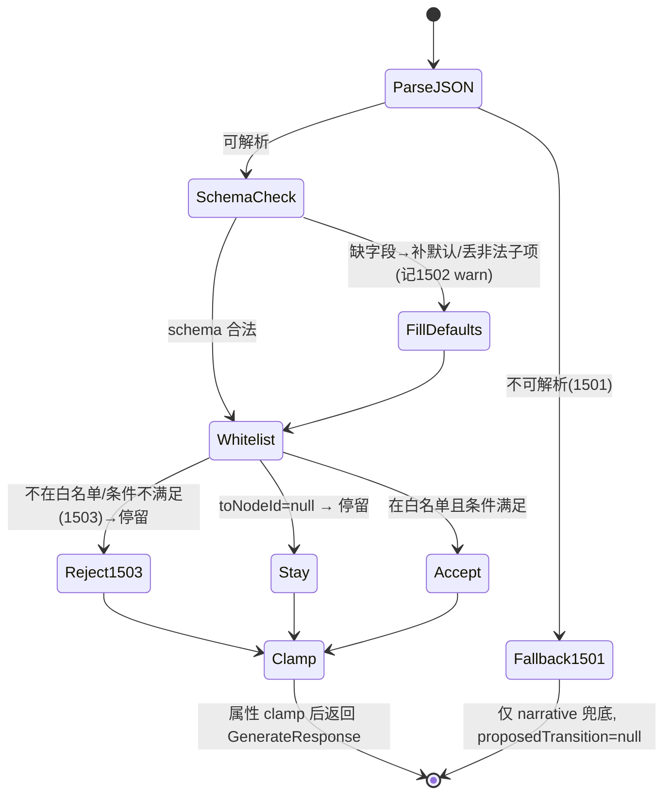

---

### 5.9 Controller 与编排串联

`AiGenerateController` 把三件套（build → call → validate）串起来；整体即便 LLM 失败也不抛 500，而是返回兜底的 `GenerateResponse`（保证 demo 不翻车）。

```java
package com.aigm.ai.controller;

import com.aigm.ai.dto.GenerateRequest;
import com.aigm.ai.dto.GenerateResponse;
import com.aigm.ai.llm.ChatMessage;
import com.aigm.ai.service.LlmClient;
import com.aigm.ai.service.OutputValidator;
import com.aigm.ai.service.PromptBuilder;
import com.aigm.common.exception.BizException;
import com.aigm.common.result.R;
import lombok.RequiredArgsConstructor;
import lombok.extern.slf4j.Slf4j;
import org.springframework.web.bind.annotation.*;

import java.util.List;

@Slf4j
@RestController
@RequestMapping("/api/ai")
@RequiredArgsConstructor
public class AiGenerateController {

    private final PromptBuilder promptBuilder;
    private final LlmClient llmClient;
    private final OutputValidator outputValidator;

    /** INTERNAL：game-service 经 Feign 调用。失败也返回兜底响应，不向上游抛 500。 */
    @PostMapping("/generate")
    public R<GenerateResponse> generate(@RequestBody GenerateRequest req) {
        long start = System.currentTimeMillis();
        try {
            List<ChatMessage> messages = promptBuilder.build(req);
            LlmClient.Result llmResult = llmClient.chatForJson(messages);
            GenerateResponse resp = outputValidator.validate(llmResult, req);
            log.info("[AI] session={} done in {}ms fallback={}",
                    req.getSessionId(), System.currentTimeMillis() - start,
                    resp.getValidation().isFallback());
            return R.ok(resp);
        } catch (BizException e) {
            // LLM 调用彻底失败(1500，含网络重试用尽)：返回兜底，保证上游可继续
            log.error("[AI] session={} biz error code={} msg={}",
                    req.getSessionId(), e.getCode(), e.getMessage());
            GenerateResponse fb = outputValidator.validate(
                    new LlmClient.Result("", false, 0), req);
            fb.getValidation().setRejectCode(e.getCode());
            return R.ok(fb);
        }
    }
}
```

`AiEngineApplication.java`：

```java
package com.aigm.ai;

import org.springframework.boot.SpringApplication;
import org.springframework.boot.autoconfigure.SpringBootApplication;
import org.springframework.cloud.client.discovery.EnableDiscoveryClient;

@EnableDiscoveryClient
@SpringBootApplication
public class AiEngineApplication {
    public static void main(String[] args) {
        SpringApplication.run(AiEngineApplication.class, args);
    }
}
```

> 设计取舍：基线 §6.5 规定「解析失败→1501 触发一次重试；再失败则降级」。本节把「一次修复重试」放在 `LlmClient`，把「降级兜底」放在 `OutputValidator.fallback`；LLM 网络彻底失败(1500) 在 Controller 兜底。这样 `/api/ai/generate` 永远返回 `R.ok`（`code=0`），由 `validation.rejectCode` / `validation.fallback` 暴露内部情况，避免 game-service 因 AI 抖动整局崩溃。

---

### 5.10 pom.xml 依赖要点

```xml
<project xmlns="http://maven.apache.org/POM/4.0.0">
  <modelVersion>4.0.0</modelVersion>
  <parent>
    <groupId>com.aigm</groupId>
    <artifactId>ai-gm</artifactId>
    <version>1.0.0</version>
  </parent>
  <artifactId>ai-engine-service</artifactId>

  <dependencies>
    <!-- 公共模块：R / BizException / ResultCode -->
    <dependency>
      <groupId>com.aigm</groupId>
      <artifactId>common</artifactId>
      <version>1.0.0</version>
    </dependency>
    <!-- Web（含 RestClient、Jackson） -->
    <dependency>
      <groupId>org.springframework.boot</groupId>
      <artifactId>spring-boot-starter-web</artifactId>
    </dependency>
    <!-- Actuator：暴露 /actuator/health（§08-devops DoD 要求） -->
    <dependency>
      <groupId>org.springframework.boot</groupId>
      <artifactId>spring-boot-starter-actuator</artifactId>
    </dependency>
    <!-- Nacos 服务发现 + 配置中心 -->
    <dependency>
      <groupId>com.alibaba.cloud</groupId>
      <artifactId>spring-cloud-starter-alibaba-nacos-discovery</artifactId>
    </dependency>
    <dependency>
      <groupId>com.alibaba.cloud</groupId>
      <artifactId>spring-cloud-starter-alibaba-nacos-config</artifactId>
    </dependency>
    <!-- @RefreshScope 所需 -->
    <dependency>
      <groupId>org.springframework.cloud</groupId>
      <artifactId>spring-cloud-starter-bootstrap</artifactId>
    </dependency>
    <!-- Swagger（Boot3 专用） -->
    <dependency>
      <groupId>org.springdoc</groupId>
      <artifactId>springdoc-openapi-starter-webmvc-ui</artifactId>
      <version>2.5.0</version>
    </dependency>
    <dependency>
      <groupId>org.projectlombok</groupId>
      <artifactId>lombok</artifactId>
      <optional>true</optional>
    </dependency>
  </dependencies>
</project>
```

> ai-engine-service 不需要 MyBatis-Plus / MySQL 驱动（无状态、不连库）。

---

### 5.11 配置文件

`bootstrap.yml`（接 Nacos 配置中心，对齐基线版本）：

```yaml
spring:
  application:
    name: ai-engine-service
  profiles:
    active: local                 # 基线 §3.4.1 统一 profile=local
  cloud:
    nacos:
      discovery:
        server-addr: ${NACOS_ADDR:127.0.0.1:8848}
        username: ${NACOS_USER:nacos}
        password: ${NACOS_PASSWORD:nacos}
        namespace: public         # 基线 §3.4.1 统一 namespace=public
      config:
        server-addr: ${NACOS_ADDR:127.0.0.1:8848}
        username: ${NACOS_USER:nacos}
        password: ${NACOS_PASSWORD:nacos}
        namespace: public
        file-extension: yaml
        # 共享配置：必须引入 aigm-common.yaml 取共享的 aigm.jwt.secret / Jackson 时间格式等(基线 §3.4.1)；
        # 另引 ai-engine-service.yaml(本服务私有 LLM 接入, 即 §6 devops 的 ai-engine-service.yaml)，供热切换 provider/key/model。
        shared-configs:
          - data-id: aigm-common.yaml
            group: DEFAULT_GROUP
            refresh: true
```

`application.yml`（本地默认值，Nacos 上 `ai-engine-service.yaml` 可覆盖）：

```yaml
server:
  port: 8084                      # 基线 §3.4 端口表: ai-engine-service=8084

aigm:
  llm:
    provider: deepseek
    base-url: https://api.deepseek.com/v1
    api-key: ${LLM_API_KEY:}          # 优先环境变量；生产从 Nacos 下发
    model: deepseek-chat
    temperature: 0.8
    max-tokens: 1200
    timeout-ms: 60000
    connect-timeout-ms: 3000
    json-mode: true
    max-retry: 1
    network-retry: 1
  prompt:
    narrative-min: 100
    narrative-max: 200
    max-recalled: 5

springdoc:
  swagger-ui:
    path: /doc/index.html
```

Nacos 上 `ai-engine-service.yaml` 示例（切到智谱 GLM 只改这一份并 refresh）：

```yaml
aigm:
  llm:
    provider: glm
    base-url: https://open.bigmodel.cn/api/paas/v4
    api-key: <你的-GLM-key>
    model: glm-4-flash
    temperature: 0.8
    json-mode: true
```

provider 切换矩阵：

| provider | base-url | model 示例 | json-mode |
|---|---|---|---|
| deepseek | `https://api.deepseek.com/v1` | `deepseek-chat` | true |
| glm（智谱） | `https://open.bigmodel.cn/api/paas/v4` | `glm-4-flash` / `glm-4-plus` | true |
| qwen（通义） | `https://dashscope.aliyuncs.com/compatible-mode/v1` | `qwen-plus` / `qwen-turbo` | true |

---

### 5.12 固定桩输入样例（用于验收与联调）

下面是一份可直接 POST 到 `/api/ai/generate` 的固定 `GenerateRequest`（取自基线 §6 的迷雾古宅样例，节点 id=1001、NPC id=2001）。验收时用它驱动测试。

```json
{
  "sessionId": 5001,
  "scenarioContext": { "title": "迷雾古宅", "genre": "悬疑" },
  "gameState": {
    "currentNodeId": 1001,
    "flags": { "has_key": false, "talked_to_butler": false },
    "inventory": ["生锈的钥匙"],
    "attributes": { "sanity": 75, "trust_butler": 2 },
    "recentSummary": "玩家进入古宅大厅，尚未与管家深入交谈。"
  },
  "currentNode": {
    "id": 1001,
    "nodeKey": "node_hall",
    "title": "幽暗的大厅",
    "narrativeBrief": "玩家身处布满灰尘的大厅。氛围:阴森、悬疑。目标:让玩家决定上楼/进书房/找管家。不要直接剧透凶手。",
    "isEnding": false,
    "endingType": null,
    "npcIds": [2001],
    "transitions": [
      { "toNodeId": 1002, "condition": "always", "priority": 10, "description": "上楼" },
      { "toNodeId": 1003, "condition": "flag.has_key==true", "priority": 20, "description": "用钥匙进书房" },
      { "toNodeId": 1004, "condition": "flag.talked_to_butler==true", "priority": 5, "description": "跟随管家" }
    ]
  },
  "npcs": [
    { "npcId": 2001, "npcKey": "npc_butler", "name": "管家·霍金斯",
      "persona": "年迈、表面恭敬实则警惕，说话用敬语、爱回避正面问题。",
      "knownFacts": "知道主人死亡当晚的部分真相但隐瞒。" }
  ],
  "recalledMemories": [
    { "content": "玩家曾承诺保护女仆的安全", "memType": "CHOICE", "importance": 4 }
  ],
  "playerInput": "我走到管家面前，问他昨晚听到了什么。",
  "isFirstTurn": false
}
```

期望返回（结构示意，narrative 文案随模型不同而变，但 schema 与白名单结论稳定）：

```json
{
  "code": 0,
  "message": "success",
  "data": {
    "narrative": "管家霍金斯的目光闪烁了一下……（100-200字）",
    "npcDialogues": [ { "npcId": 2001, "line": "先生，昨夜风大，老宅子总有声响。" } ],
    "stateChanges": {
      "setFlags": ["talked_to_butler"], "clearFlags": [],
      "addItems": [], "removeItems": [], "attrDelta": { "trust_butler": -1 }
    },
    "proposedTransition": { "toNodeId": 1004, "reason": "玩家与管家完成对话，满足 talked_to_butler==true" },
    "memoryToStore": [
      { "content": "玩家质问管家昨晚动静，管家回避，信任下降。", "memType": "EVENT", "importance": 3 }
    ],
    "validation": {
      "jsonValid": true, "schemaValid": true, "transitionAccepted": true,
      "fallback": false, "retryCount": 0, "warnings": [], "rejectCode": null
    }
  }
}
```

注意：上例中 AI 提议 `toNodeId=1004`（条件 `flag.talked_to_butler==true`）。因为本回合 `setFlags:["talked_to_butler"]`，`OutputValidator` 用 `simulateFlags` 把该 flag 置真后求值条件为真，故 **接受** 该转移。若 AI 错误地提议 `toNodeId=1003`（条件 `has_key==true`，但 `has_key` 仍为 false），则被 **拒绝（1503）**，强制 `proposedTransition=null` 停留。

---

### 5.13 验收标准（Acceptance Criteria）

ai-engine-service 通过以下验收即视为达标：

| 编号 | 验收项 | 方法 | 期望 |
|---|---|---|---|
| AC-1 | 固定桩稳定产出合法 schema | 用 §5.12 桩输入连续调 5 次 | 5 次均返回 `code=0`，`data` 含 narrative(非空)+5 字段齐全的 stateChanges+合法 proposedTransition |
| AC-2 | 白名单接受 | 桩输入(setFlags 含 talked_to_butler，AI 提 1004) | `proposedTransition.toNodeId=1004`，`validation.transitionAccepted=true` |
| AC-3 | 越界拒绝(1503) | 注入「AI 提 toNodeId=1003 但 has_key=false」的桩 LLM 输出 | `proposedTransition=null`，`validation.rejectCode=1503` |
| AC-4 | 节点外 id 拒绝(1503) | 注入「AI 提 toNodeId=9999」(不在 transitions) | `proposedTransition=null`，`validation.rejectCode=1503` |
| AC-5 | npcId 越界丢弃 | 注入「npcDialogues 含 npcId=8888」 | 该条被丢弃，`validation.warnings` 含提示，其余正常 |
| AC-6 | JSON 非法→修复重试→兜底 | 桩 LLM 第一次返回非 JSON、第二次仍非 JSON | `validation.retryCount≥1`、`fallback=true`、`rejectCode=1501`、narrative 为兜底文案、proposedTransition=null |
| AC-7 | schema 缺字段补默认 | 注入「缺 stateChanges」的 JSON | stateChanges 五字段被补为空数组/空对象，`schemaValid=false` 但不崩溃 |
| AC-8 | 属性 clamp | 桩使 sanity(75)+attrDelta{ sanity:-100 } | clamp 后最终 sanity=0，attrDelta 被修正为 -75，warnings 记录 |
| AC-9 | LLM 超时/网络失败兜底 | 配 base-url 指向不可达地址 | 不抛 500，返回兜底 `GenerateResponse`，`rejectCode=1500`、`fallback=true` |
| AC-10 | provider 热切换 | 改 Nacos `ai-engine-service.yaml`(deepseek→glm) 并 refresh | 无需重启，下次调用使用新 provider/model（日志 `[LLM] provider=glm`） |

> 测试做法（可执行的注入接缝）：`OutputValidator` 不依赖 LLM，**直接 new 后喂入固定 JSON 字符串**即可做 AC-2~AC-8 的纯单元测试（无需 Spring 容器）。需要走 `LlmClient`/Controller 的 AC（如修复重试 AC-6、provider 日志 AC-10）时，用 `@SpringBootTest` + **`@MockBean OpenAiCompatClient`** 桩掉真实 HTTP——`OpenAiCompatClient` 虽是具体类，Mockito/`@MockBean` 可直接对其打桩（`when(client.chat(any())).thenReturn("<固定JSON或非法串>")`）；若希望接缝更干净，可把 `OpenAiCompatClient.chat(...)` 抽成 `LlmClient` 接口、`OpenAiCompatClient` 为其实现，再 `@MockBean LlmClient`。两种皆可，AC-1/AC-9 走真实集成测试。这样验收稳定、可复现，满足「给定固定桩输入能稳定产出合法 schema」的要求。

## 六、memory-service 实现规格（pgvector 长程记忆 / RAG）

> 本节严格对齐基线 §4.4 的 `t_memory` 表与 §5.5 的 memory API（`POST /api/memory/store`、`POST /api/memory/recall`），以及 §3.2 错误码（`1504` 嵌入生成失败、`1900` 系统内部错误、`1902` 数据库错误）。服务名固定 `memory-service`，包名 `com.aigm.memory`，库为 PostgreSQL 16 + pgvector 0.7，库名 `aigm_memory`。embedding 维度锁定 **1024**。本服务为 **INTERNAL**：网关不对外路由，仅供 game-service / ai-engine-service 通过 OpenFeign 调用（携带 `X-Internal-Call: true`、透传 `X-User-Id`）。

---

### 6.1 职责与边界

memory-service 解决基线三大 AI 难点之一——**长程记忆 / RAG 召回**。它把对局中产生的关键事件、玩家选择、NPC 既定事实等文本，经嵌入模型向量化后存入 pgvector；在后续回合由 game-service 以「当前玩家输入 / 当前节点纲要」为 query，做语义相似度召回 top-k，结合 `importance` 加权后回灌给 ai-engine-service 的 `recalledMemories` 字段（基线 §6.3），让 AI「记得」玩家几十回合前做过的承诺、拿过的东西、得罪过的 NPC。

| 维度 | 说明 |
|---|---|
| 输入来源 | game-service 编排：**每回合处理时（取节点前）以本回合 `playerInput` 为 query 调 `/api/memory/recall`** 注入 prompt；待应用 `stateChanges` 后，再把 ai_output 的 `memoryToStore`（基线 §6.4）整理为 `items` 调 `/api/memory/store`。即「先 recall 后 store」，每回合都 recall（非仅开局） |
| 不做什么 | 不直接调 LLM 生成叙事（那是 ai-engine 的事）；不持有对局状态（状态在 game-service 的 `t_game_state`）；不做鉴权（信任网关/内部头）；只做「文本→向量→存/召回」与记忆治理 |
| 隔离粒度 | 记忆按 **session_id**（对局）隔离，召回必须带 `session_id` 过滤，杜绝跨对局串味 |
| 嵌入模型 | 调用「可配置的 embedding API」（OpenAI 兼容 `/v1/embeddings`），provider 可在 Nacos 配置中心切换，输出维度必须 = 1024（与 DDL 一致） |

调用拓扑：

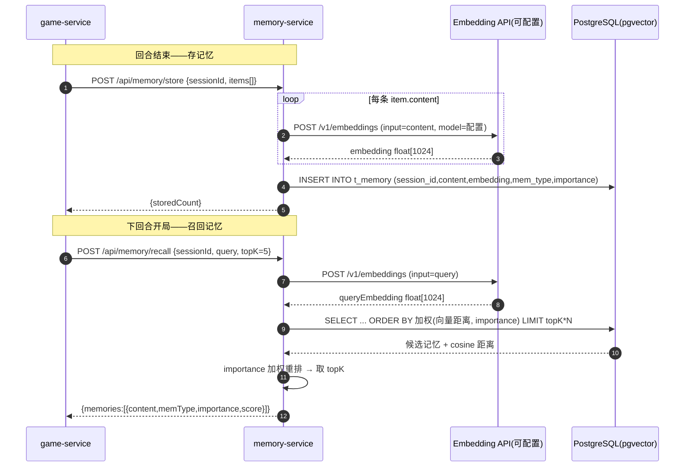

---

### 6.2 PostgreSQL 启用 pgvector 与表结构

`t_memory` 与基线 §4.4 完全一致，下面给出可执行的初始化脚本（含扩展启用、表、普通索引、向量 HNSW 索引）。在 `aigm_memory` 库中执行：

```sql
-- ========== aigm_memory 初始化（PostgreSQL 16 + pgvector 0.7）==========
-- 1) 建库（在 postgres 超级用户下执行一次）
-- CREATE DATABASE aigm_memory ENCODING 'UTF8';

-- 2) 切到 aigm_memory 库后启用扩展（需要一次，幂等）
CREATE EXTENSION IF NOT EXISTS vector;

-- 3) 长程记忆向量表（与基线 §4.4 字段/类型/默认值完全一致）
CREATE TABLE IF NOT EXISTS t_memory (
  id          BIGSERIAL    PRIMARY KEY,
  session_id  BIGINT       NOT NULL,                 -- 对局ID(记忆按对局隔离)
  content     TEXT         NOT NULL,                 -- 记忆原文(关键事件/玩家选择)
  embedding   vector(1024) NOT NULL,                 -- 向量(维度=嵌入模型输出,锁定1024)
  mem_type    VARCHAR(20)  NOT NULL DEFAULT 'EVENT', -- 类型:EVENT/CHOICE/NPC_FACT/ITEM
  importance  SMALLINT     NOT NULL DEFAULT 3,       -- 重要度1-5,召回时排序加权
  created_at  TIMESTAMP    NOT NULL DEFAULT NOW()
);

COMMENT ON TABLE  t_memory IS '长程记忆向量表';
COMMENT ON COLUMN t_memory.embedding IS '内容向量,维度需与嵌入模型一致(1024)';

-- 4) 按对局过滤的普通索引
CREATE INDEX IF NOT EXISTS idx_memory_session ON t_memory (session_id);

-- 5) 向量索引(余弦距离)，HNSW 适合读多写少的召回场景
CREATE INDEX IF NOT EXISTS idx_memory_embedding ON t_memory
  USING hnsw (embedding vector_cosine_ops);
-- 备选(数据量小可用 ivfflat):
-- CREATE INDEX idx_memory_embedding ON t_memory USING ivfflat (embedding vector_cosine_ops) WITH (lists = 100);
```

> 维度约束：`vector(1024)` 必须与所选嵌入模型输出维度一致。若插入向量维度不符，PostgreSQL 报 `expected 1024 dimensions, not N`。切换 provider 时（见 6.4）务必选 1024 维模型，否则需改 DDL 并重建索引，本基线锁定 **1024**。
>
> HNSW 距离算子：用 `vector_cosine_ops` 时，查询里的距离运算符必须是 `<=>`（余弦距离）；用 `vector_l2_ops` 则是 `<->`。本服务统一用 **余弦距离 `<=>`**。`<=>` 返回的余弦距离 ∈ [0,2]，相似度 `similarity = 1 - distance`，越大越相似。

---

### 6.3 工程结构与依赖

包结构对齐基线 §2（`memory-service/src/main/java/com/aigm/memory/...`）：

```
memory-service/
├── pom.xml
└── src/main/
    ├── java/com/aigm/memory/
    │   ├── MemoryApplication.java
    │   ├── config/
    │   │   ├── EmbeddingProps.java        # 绑定 aigm.embedding.* 配置
    │   │   ├── MemoryProps.java           # 绑定 aigm.memory.* 治理参数
    │   │   ├── RestClientConfig.java      # RestClient/超时(供调 embedding API)
    │   │   └── PgVectorTypeHandler.java   # float[] <-> pgvector 类型转换(MyBatis)
    │   ├── controller/
    │   │   └── MemoryController.java       # /api/memory/store, /recall
    │   ├── service/
    │   │   ├── EmbeddingClient.java        # 调可配置 embedding API
    │   │   ├── MemoryService.java          # 接口
    │   │   └── impl/MemoryServiceImpl.java # 存/召回/治理编排
    │   ├── mapper/
    │   │   └── MemoryMapper.java           # 原生 SQL 处理 vector 类型
    │   ├── entity/
    │   │   └── Memory.java
    │   └── (Feign 契约 DTO 不放这里, 放 common/feign/dto, 见下)
    │
    │   # ↓ 以下 6 个 DTO 实际放在 common 模块 com.aigm.common.feign.dto(供 memory-service 服务端与 game-service 客户端共用):
    │   #   StoreRequest.java     # {sessionId, items:[{content,memType,importance}]}
    │   #   MemoryItem.java       # {content, memType, importance}
    │   #   StoreResult.java      # {storedCount}
    │   #   RecallRequest.java    # {sessionId, query, topK}
    │   #   RecallResult.java     # {memories:[RecalledMemory]}
    │   #   RecalledMemory.java   # {content, memType, importance, score}
    └── resources/
        ├── bootstrap.yml
        ├── application.yml
        └── mapper/MemoryMapper.xml         # 原生 vector SQL（含 ::vector 强转）
```

`pom.xml` 关键依赖（版本由 §1 父 pom 托管，不再写版本号）：

```xml
<dependencies>
  <!-- 公共模块：R / ResultCode / BizException / 内部头常量 -->
  <dependency><groupId>com.aigm</groupId><artifactId>common</artifactId></dependency>

  <!-- web (本服务是 WebMVC，非网关) -->
  <dependency><groupId>org.springframework.boot</groupId><artifactId>spring-boot-starter-web</artifactId></dependency>
  <!-- Actuator：暴露 /actuator/health（§08-devops DoD 要求） -->
  <dependency><groupId>org.springframework.boot</groupId><artifactId>spring-boot-starter-actuator</artifactId></dependency>
  <dependency><groupId>org.springframework.boot</groupId><artifactId>spring-boot-starter-validation</artifactId></dependency>

  <!-- Nacos 注册 + 配置 -->
  <dependency><groupId>com.alibaba.cloud</groupId><artifactId>spring-cloud-starter-alibaba-nacos-discovery</artifactId></dependency>
  <dependency><groupId>com.alibaba.cloud</groupId><artifactId>spring-cloud-starter-alibaba-nacos-config</artifactId></dependency>

  <!-- PostgreSQL + MyBatis-Plus(boot3) -->
  <dependency><groupId>org.postgresql</groupId><artifactId>postgresql</artifactId></dependency>
  <dependency><groupId>com.baomidou</groupId><artifactId>mybatis-plus-spring-boot3-starter</artifactId></dependency>

  <!-- Swagger -->
  <dependency><groupId>org.springdoc</groupId><artifactId>springdoc-openapi-starter-webmvc-ui</artifactId></dependency>
</dependencies>
```

`bootstrap.yml`（从 Nacos 拉配置，含嵌入与治理参数所在的 dataId）：

```yaml
spring:
  application:
    name: memory-service
  profiles:
    active: local                 # 基线 §3.4.1 统一 profile=local
  cloud:
    nacos:
      discovery:
        server-addr: ${NACOS_ADDR:127.0.0.1:8848}
        username: ${NACOS_USER:nacos}
        password: ${NACOS_PASSWORD:nacos}
        namespace: public         # 基线 §3.4.1 统一 namespace=public
      config:
        server-addr: ${NACOS_ADDR:127.0.0.1:8848}
        username: ${NACOS_USER:nacos}
        password: ${NACOS_PASSWORD:nacos}
        namespace: public
        file-extension: yaml
        # 共享配置(全局唯一标准 dataId): aigm-common.yaml(jwt密钥/时间格式等)；本服务私有 dataId=memory-service.yaml
        shared-configs:
          - data-id: aigm-common.yaml
            group: DEFAULT_GROUP
            refresh: true
```

`application.yml`（默认值；可被 Nacos `memory-service.yaml` 覆盖，`@RefreshScope` 支持热更新）：

```yaml
server:
  port: 8085                      # 基线 §3.4 端口表: memory-service=8085

spring:
  datasource:
    url: jdbc:postgresql://${PG_HOST:127.0.0.1}:5432/aigm_memory
    username: ${PG_USER:aigm}                 # 与 §08-devops docker-compose 的 POSTGRES_USER 一致
    password: ${PG_PASSWORD:aigm123456}       # 与 POSTGRES_PASSWORD 一致
    driver-class-name: org.postgresql.Driver

mybatis-plus:
  mapper-locations: classpath*:mapper/*.xml
  configuration:
    map-underscore-to-camel-case: true

# 嵌入模型配置（OpenAI 兼容；provider 可切换）
# 推荐默认 provider 与 §08-devops §6.2 一致 = 智谱 GLM(embedding-2, 1024 维, 联网即用)；
# 本地 bge(bge-large-zh-v1.5, 离线可控) 为可选替代，二者均输出 1024 维, 与 DDL 对齐。
aigm:
  embedding:
    provider: ${EMBEDDING_PROVIDER:glm}                  # 默认智谱 GLM(与 devops §6.2 对齐)；可切 bge
    base-url: ${EMBEDDING_BASE_URL:https://open.bigmodel.cn/api/paas/v4}
    api-key: ${EMBEDDING_API_KEY:}                       # 来自环境变量, 不写死(基线/devops §6)
    model: ${EMBEDDING_MODEL:embedding-2}
    dimension: 1024          # 必须与 t_memory.embedding 维度一致
    connect-timeout-ms: 3000
    read-timeout-ms: 15000
  # 记忆治理参数（见 6.6）
  memory:
    recall-candidate-multiplier: 4   # 召回候选 = topK * 该倍数（再加权重排）
    default-top-k: 5
    max-top-k: 20
    importance-weight: 0.15          # 加权重排里 importance 的权重
    max-per-session: 200             # 单对局记忆条数上限
    decay-days: 7                    # 重要性时间衰减半衰期(天)
    prune-keep-ratio: 0.8            # 触发膨胀治理时保留比例
```

---

### 6.4 嵌入生成（可配置 embedding API + provider 切换）

嵌入统一走 **OpenAI 兼容 `/v1/embeddings`** 协议。这样 DeepSeek、智谱 GLM、通义千问、或本地部署的 bge 系列（xinference/ollama 暴露 OpenAI 兼容口）都能用同一份客户端代码，只改 Nacos 里的 `aigm.embedding.*`（base-url / api-key / model / dimension）即可切换 provider，无需改代码。

provider 切换矩阵（示例，均需输出 1024 维或同步改 DDL）：

| provider | base-url 示例 | model 示例 | 输出维度 | 备注 |
|---|---|---|---|---|
| 本地 bge（推荐毕设） | `http://127.0.0.1:9997/v1` | `bge-large-zh-v1.5` | 1024 | 中文友好、离线可控、与 DDL 1024 对齐 |
| 智谱 GLM | `https://open.bigmodel.cn/api/paas/v4` | `embedding-2` | 1024 | OpenAI 兼容 |
| 通义千问 | `https://dashscope.aliyuncs.com/compatible-mode/v1` | `text-embedding-v3` | 1024（可配） | 兼容模式 |
| OpenAI | `https://api.openai.com/v1` | `text-embedding-3-small` | 1536 | **需改 DDL 维度=1536** 才能用 |

配置绑定类：

```java
package com.aigm.memory.config;

import lombok.Data;
import org.springframework.boot.context.properties.ConfigurationProperties;
import org.springframework.context.annotation.Configuration;

@Data
@Configuration
@ConfigurationProperties(prefix = "aigm.embedding")
public class EmbeddingProps {
    private String provider;
    private String baseUrl;
    private String apiKey;
    private String model;
    private int dimension = 1024;
    private int connectTimeoutMs = 3000;
    private int readTimeoutMs = 15000;
}
```

```java
package com.aigm.memory.config;

import lombok.Data;
import org.springframework.boot.context.properties.ConfigurationProperties;
import org.springframework.context.annotation.Configuration;

@Data
@Configuration
@ConfigurationProperties(prefix = "aigm.memory")
public class MemoryProps {
    private int recallCandidateMultiplier = 4;
    private int defaultTopK = 5;
    private int maxTopK = 20;
    private double importanceWeight = 0.15;
    private int maxPerSession = 200;
    private int decayDays = 7;
    private double pruneKeepRatio = 0.8;
}
```

RestClient 配置（带 §3.4 风格的超时）：

```java
package com.aigm.memory.config;

import org.springframework.context.annotation.Bean;
import org.springframework.context.annotation.Configuration;
import org.springframework.http.client.SimpleClientHttpRequestFactory;
import org.springframework.web.client.RestClient;
import java.time.Duration;

@Configuration
public class RestClientConfig {

    @Bean
    public RestClient embeddingRestClient(EmbeddingProps props) {
        SimpleClientHttpRequestFactory f = new SimpleClientHttpRequestFactory();
        f.setConnectTimeout(Duration.ofMillis(props.getConnectTimeoutMs()));
        f.setReadTimeout(Duration.ofMillis(props.getReadTimeoutMs()));
        return RestClient.builder()
                .baseUrl(props.getBaseUrl())
                .requestFactory(f)
                .defaultHeader("Authorization", "Bearer " + props.getApiKey())
                .defaultHeader("Content-Type", "application/json")
                .build();
    }
}
```

嵌入客户端（调 `/v1/embeddings`，失败抛 `BizException(1504)`，并对维度做断言）：

```java
package com.aigm.memory.service;

import com.aigm.common.exception.BizException;
import com.aigm.common.result.ResultCode;
import com.aigm.memory.config.EmbeddingProps;
import lombok.RequiredArgsConstructor;
import lombok.extern.slf4j.Slf4j;
import org.springframework.stereotype.Component;
import org.springframework.web.client.RestClient;
import java.util.List;
import java.util.Map;

@Slf4j
@Component
@RequiredArgsConstructor
public class EmbeddingClient {

    private final RestClient embeddingRestClient;
    private final EmbeddingProps props;

    /** 单条文本 → 向量；维度必须 = 配置 dimension（与 DDL 一致）。 */
    public float[] embed(String text) {
        return embedBatch(List.of(text)).get(0);
    }

    /**
     * 批量文本 → 向量。OpenAI 兼容 /v1/embeddings 支持 input 为字符串数组，
     * 返回 data[].embedding 按 index 排序。
     */
    @SuppressWarnings("unchecked")
    public List<float[]> embedBatch(List<String> texts) {
        if (texts == null || texts.isEmpty()) {
            return List.of();
        }
        Map<String, Object> body = Map.of(
                "model", props.getModel(),
                "input", texts,
                "encoding_format", "float"
        );
        Map<String, Object> resp;
        try {
            resp = embeddingRestClient.post()
                    .uri("/embeddings")
                    .body(body)
                    .retrieve()
                    .body(Map.class);
        } catch (Exception e) {
            log.error("embedding api call failed: {}", e.getMessage(), e);
            throw new BizException(ResultCode.AI_EMBEDDING_FAILED); // 1504
        }
        if (resp == null || !(resp.get("data") instanceof List<?> data) || data.isEmpty()) {
            log.error("embedding api empty response: {}", resp);
            throw new BizException(ResultCode.AI_EMBEDDING_FAILED); // 1504
        }
        // data 已按 index 顺序排列（OpenAI 兼容约定）
        return data.stream().map(o -> {
            Map<String, Object> item = (Map<String, Object>) o;
            List<Number> vec = (List<Number>) item.get("embedding");
            if (vec == null || vec.size() != props.getDimension()) {
                log.error("embedding dimension mismatch: expect={}, actual={}",
                        props.getDimension(), vec == null ? 0 : vec.size());
                throw new BizException(ResultCode.AI_EMBEDDING_FAILED); // 1504
            }
            float[] arr = new float[vec.size()];
            for (int i = 0; i < vec.size(); i++) {
                arr[i] = vec.get(i).floatValue();
            }
            return arr;
        }).toList();
    }
}
```

> `ResultCode.AI_EMBEDDING_FAILED` 对应基线 §3.2 的 **1504 嵌入(embedding)生成失败**。`common.result.ResultCode` 枚举需包含该项（由 common 模块统一定义）。

---

### 6.5 实体 / DTO / Mapper（含向量查询 SQL）

实体 `Memory.java`（`embedding` 用 `float[]`，通过 TypeHandler 与 pgvector 互转；查询场景多用原生 SQL，实体主要用于插入与读取标量列）：

```java
package com.aigm.memory.entity;

import com.baomidou.mybatisplus.annotation.IdType;
import com.baomidou.mybatisplus.annotation.TableId;
import com.baomidou.mybatisplus.annotation.TableName;
import lombok.Data;
import java.time.LocalDateTime;

@Data
@TableName("t_memory")
public class Memory {
    @TableId(type = IdType.AUTO)
    private Long id;
    private Long sessionId;
    private String content;
    private float[] embedding;     // 经 PgVectorTypeHandler 与 vector(1024) 互转
    private String memType;        // EVENT/CHOICE/NPC_FACT/ITEM
    private Integer importance;    // 1-5
    private LocalDateTime createdAt;
}
```

DTO（字段名严格对齐基线 §5.5 的 store/recall 契约）：

```java
package com.aigm.memory.dto;

import jakarta.validation.constraints.*;
import lombok.Data;
import java.util.List;

@Data
public class StoreRequest {
    @NotNull private Long sessionId;
    @NotEmpty private List<@Valid MemoryItem> items;
}

@Data
class MemoryItem {                 // 单独文件 MemoryItem.java
    @NotBlank private String content;
    // EVENT/CHOICE/NPC_FACT/ITEM，缺省 EVENT
    private String memType = "EVENT";
    @Min(1) @Max(5)
    private Integer importance = 3;
}

@Data
class StoreResult {                // 单独文件 StoreResult.java
    private Integer storedCount;
}

@Data
class RecallRequest {              // 单独文件 RecallRequest.java
    @NotNull private Long sessionId;
    @NotBlank private String query;
    // 默认 5（基线 §5.5 topK?=5），服务端再 clamp 到 [1,maxTopK]
    private Integer topK = 5;
}

@Data
class RecalledMemory {             // 单独文件 RecalledMemory.java
    private String content;
    private String memType;
    private Integer importance;
    private Double score;          // 加权后综合相似度分(越大越相关)
}

@Data
class RecallResult {               // 单独文件 RecallResult.java
    private List<RecalledMemory> memories;
}
```

> 落地约定（重要）：上面 `StoreRequest`/`MemoryItem`/`StoreResult`/`RecallRequest`/`RecalledMemory`/`RecallResult` 是 **memory-service 的 Feign 契约 DTO**，必须放在 **`com.aigm.common.feign.dto`** 下（与 `MemoryClient` 同模块，供 game-service 跨模块 import，见 `02-common` §10），**每个一个 `.java` 文件且都 `public`**（同一文件只能一个 public 顶层类，照抄合并块会编译失败）。为支持 game-service 里 `new RecallRequest(sessionId, query, 5)`、`new StoreRequest(sessionId, items)` 这类构造，给这些 DTO 加 Lombok `@AllArgsConstructor @NoArgsConstructor`（或改用 setter 赋值）。memory-service 服务端与 game-service 客户端共用这同一套 `common/feign/dto` 定义，不各自再定义。

向量与 `float[]` 的 TypeHandler（pgvector JDBC 以字符串 `'[1,2,3]'` 形式写入/读出，配合 SQL 里的 `::vector` 强转）：

```java
package com.aigm.memory.config;

import org.apache.ibatis.type.*;
import java.sql.*;

@MappedTypes(float[].class)
public class PgVectorTypeHandler extends BaseTypeHandler<float[]> {

    /** float[] -> pgvector 字面量字符串 "[v1,v2,...]"（SQL 端再 ::vector 强转）。 */
    public static String toVectorLiteral(float[] v) {
        StringBuilder sb = new StringBuilder(v.length * 8);
        sb.append('[');
        for (int i = 0; i < v.length; i++) {
            if (i > 0) sb.append(',');
            sb.append(v[i]);
        }
        sb.append(']');
        return sb.toString();
    }

    @Override
    public void setNonNullParameter(PreparedStatement ps, int i, float[] parameter, JdbcType jdbcType) throws SQLException {
        ps.setString(i, toVectorLiteral(parameter));
    }

    @Override public float[] getNullableResult(ResultSet rs, String columnName) throws SQLException { return parse(rs.getString(columnName)); }
    @Override public float[] getNullableResult(ResultSet rs, int columnIndex) throws SQLException { return parse(rs.getString(columnIndex)); }
    @Override public float[] getNullableResult(CallableStatement cs, int columnIndex) throws SQLException { return parse(cs.getString(columnIndex)); }

    private float[] parse(String s) {
        if (s == null || s.isBlank()) return null;
        String body = s.replace("[", "").replace("]", "").trim();
        if (body.isEmpty()) return new float[0];
        String[] parts = body.split(",");
        float[] arr = new float[parts.length];
        for (int i = 0; i < parts.length; i++) arr[i] = Float.parseFloat(parts[i].trim());
        return arr;
    }
}
```

Mapper 接口：

```java
package com.aigm.memory.mapper;

import com.aigm.memory.entity.Memory;
import com.baomidou.mybatisplus.core.mapper.BaseMapper;
import org.apache.ibatis.annotations.*;
import java.util.List;

@Mapper
public interface MemoryMapper extends BaseMapper<Memory> {

    /** 批量插入（embedding 以 ::vector 强转）。 */
    int batchInsert(@Param("list") List<Memory> list);

    /**
     * 向量召回：按 session 过滤 + 余弦距离排序，取候选 limit 条。
     * distance 为余弦距离(0~2)，相似度 = 1 - distance。
     * 加权重排放在 Java 层（结合 importance 与时间衰减）。
     */
    List<RecallRow> recallCandidates(@Param("sessionId") Long sessionId,
                                     @Param("queryVec") String queryVecLiteral,
                                     @Param("limit") int limit);

    /** 统计某对局记忆条数（膨胀治理用）。 */
    @Select("SELECT COUNT(*) FROM t_memory WHERE session_id = #{sessionId}")
    int countBySession(@Param("sessionId") Long sessionId);

    /**
     * 膨胀治理：保留每个对局「重要性 desc、时间 desc」前 keep 条，删除其余。
     * 用窗口函数排名，删除 rank > keep 的行。
     */
    int pruneSession(@Param("sessionId") Long sessionId, @Param("keep") int keep);

    /** 召回中间行（含原始余弦距离）。 */
    class RecallRow {
        public String content;
        public String memType;
        public Integer importance;
        public Double distance;        // <=> 余弦距离
        public java.time.LocalDateTime createdAt;
    }
}
```

`MemoryMapper.xml`（原生 vector SQL，**核心**——`#{queryVec}::vector` 把字面量强转成向量；`<=>` 为余弦距离）：

```xml
<?xml version="1.0" encoding="UTF-8"?>
<!DOCTYPE mapper PUBLIC "-//mybatis.org//DTD Mapper 3.0//EN"
  "http://mybatis.org/dtd/mybatis-3-mapper.dtd">
<mapper namespace="com.aigm.memory.mapper.MemoryMapper">

  <!-- 批量插入：embedding 由 PgVectorTypeHandler 写成字面量字符串 "[v1,v2,...]"，再用 CAST(... AS vector) 强转。
       说明: 占位符外侧用 CAST(#{...} AS vector) 比裸 #{...}::vector 更稳妥(避免 MyBatis 占位符与 ::vector 紧邻在
       某些驱动/版本下解析异常)，经 boot3 + postgresql 42.7.x 实测可用。 -->
  <insert id="batchInsert">
    INSERT INTO t_memory (session_id, content, embedding, mem_type, importance)
    VALUES
    <foreach collection="list" item="m" separator=",">
      (#{m.sessionId}, #{m.content},
       CAST(#{m.embedding,typeHandler=com.aigm.memory.config.PgVectorTypeHandler} AS vector),
       #{m.memType}, #{m.importance})
    </foreach>
  </insert>

  <!-- 向量召回候选：session 过滤 + 余弦距离升序(越小越近)。
       结果用 resultType 直接映射到内部类 MemoryMapper$RecallRow(字段别名已对齐驼峰)，无需单独 resultMap。 -->
  <select id="recallCandidates" resultType="com.aigm.memory.mapper.MemoryMapper$RecallRow">
    SELECT content,
           mem_type   AS memType,
           importance AS importance,
           (embedding &lt;=&gt; CAST(#{queryVec} AS vector)) AS distance,
           created_at AS createdAt
    FROM t_memory
    WHERE session_id = #{sessionId}
    ORDER BY embedding &lt;=&gt; CAST(#{queryVec} AS vector) ASC
    LIMIT #{limit}
  </select>

  <!-- 膨胀治理：保留 importance desc, created_at desc 前 keep 条，删除其余 -->
  <delete id="pruneSession">
    DELETE FROM t_memory
    WHERE id IN (
      SELECT id FROM (
        SELECT id,
               ROW_NUMBER() OVER (
                 ORDER BY importance DESC, created_at DESC
               ) AS rn
        FROM t_memory
        WHERE session_id = #{sessionId}
      ) ranked
      WHERE ranked.rn &gt; #{keep}
    )
  </delete>

</mapper>
```

> SQL 要点：
> - `embedding <=> '[...]'::vector` 是 pgvector 的**余弦距离**运算符；HNSW 索引（`vector_cosine_ops`）会被 `ORDER BY ... <=> ... LIMIT k` 命中，走近似最近邻，毫秒级返回。
> - `WHERE session_id = ?` 做对局隔离；它与向量 `ORDER BY` 同时存在时，pgvector 0.7 的 HNSW 支持先过滤再排序（可结合 `idx_memory_session`）。
> - `queryVec` 由 Java 用 `PgVectorTypeHandler.toVectorLiteral(float[])` 生成 `"[...]"` 字符串传入。

---

### 6.6 RAG 召回：向量相似度 top-k + session 过滤 + importance 加权

召回不是纯按向量距离取 top-k，而是「先取较多候选（topK × multiplier），再用综合分重排，取最终 topK」。综合分同时考虑**语义相似度**、**重要性**、**时间新近度**（防止旧记忆永远压制新事件）：

综合分公式（越大越优先）：

```
similarity   = 1 - cosineDistance                 // 语义相似度 ∈ [-1,1]，归一到 [0,1]
impScore     = importance / 5.0                    // 重要性归一 ∈ [0.2,1.0]
recency      = exp(-ageDays / decayDays)           // 时间新近度衰减(半衰期 decayDays)
score = similarity
      + importanceWeight * impScore                // importance 加权
      + 0.05 * recency                             // 轻度新近度加权
```

`MemoryService` 接口与实现：

```java
package com.aigm.memory.service;

import com.aigm.memory.dto.*;

public interface MemoryService {
    StoreResult store(StoreRequest req);
    RecallResult recall(RecallRequest req);
}
```

```java
package com.aigm.memory.service.impl;

import com.aigm.common.exception.BizException;
import com.aigm.common.result.ResultCode;
import com.aigm.memory.config.MemoryProps;
import com.aigm.memory.config.PgVectorTypeHandler;
import com.aigm.memory.dto.*;
import com.aigm.memory.entity.Memory;
import com.aigm.memory.mapper.MemoryMapper;
import com.aigm.memory.service.EmbeddingClient;
import com.aigm.memory.service.MemoryService;
import lombok.RequiredArgsConstructor;
import lombok.extern.slf4j.Slf4j;
import org.springframework.stereotype.Service;
import org.springframework.transaction.annotation.Transactional;
import java.time.Duration;
import java.time.LocalDateTime;
import java.util.*;

@Slf4j
@Service
@RequiredArgsConstructor
public class MemoryServiceImpl implements MemoryService {

    private final EmbeddingClient embeddingClient;
    private final MemoryMapper memoryMapper;
    private final MemoryProps props;

    @Override
    @Transactional(rollbackFor = Exception.class)
    public StoreResult store(StoreRequest req) {
        List<MemoryItem> items = req.getItems();
        // 1) 批量嵌入（一次 API 调用，按顺序对应）
        List<String> contents = items.stream().map(MemoryItem::getContent).toList();
        List<float[]> vectors = embeddingClient.embedBatch(contents);

        // 2) 组装实体并批量插入
        List<Memory> rows = new ArrayList<>(items.size());
        for (int i = 0; i < items.size(); i++) {
            MemoryItem it = items.get(i);
            Memory m = new Memory();
            m.setSessionId(req.getSessionId());
            m.setContent(it.getContent());
            m.setEmbedding(vectors.get(i));
            m.setMemType(normalizeType(it.getMemType()));
            m.setImportance(clampImportance(it.getImportance()));
            rows.add(m);
        }
        int stored;
        try {
            stored = memoryMapper.batchInsert(rows);
        } catch (Exception e) {
            log.error("memory batchInsert failed: {}", e.getMessage(), e);
            throw new BizException(ResultCode.DB_ERROR); // 1902
        }

        // 3) 防膨胀：超上限则按重要性/时间裁剪（见 6.7）
        pruneIfNeeded(req.getSessionId());

        StoreResult r = new StoreResult();
        r.setStoredCount(stored);
        return r;
    }

    @Override
    public RecallResult recall(RecallRequest req) {
        // 1) clamp topK
        int topK = req.getTopK() == null ? props.getDefaultTopK() : req.getTopK();
        topK = Math.max(1, Math.min(topK, props.getMaxTopK()));
        int candidateLimit = topK * props.getRecallCandidateMultiplier();

        // 2) query 向量化
        float[] qv = embeddingClient.embed(req.getQuery());
        String qLiteral = PgVectorTypeHandler.toVectorLiteral(qv);

        // 3) session 过滤 + 向量距离取候选
        List<MemoryMapper.RecallRow> candidates =
                memoryMapper.recallCandidates(req.getSessionId(), qLiteral, candidateLimit);

        // 4) importance + 新近度 加权重排
        LocalDateTime now = LocalDateTime.now();
        List<Scored> scored = new ArrayList<>(candidates.size());
        for (MemoryMapper.RecallRow row : candidates) {
            double similarity = 1.0 - (row.distance == null ? 1.0 : row.distance);
            double impScore = (row.importance == null ? 3 : row.importance) / 5.0;
            long ageDays = row.createdAt == null ? 0
                    : Math.max(0, Duration.between(row.createdAt, now).toDays());
            double recency = Math.exp(-(double) ageDays / props.getDecayDays());
            double score = similarity
                    + props.getImportanceWeight() * impScore
                    + 0.05 * recency;
            scored.add(new Scored(row, score));
        }
        scored.sort((a, b) -> Double.compare(b.score, a.score));

        // 5) 取最终 topK 转 VO
        List<RecalledMemory> memories = new ArrayList<>(topK);
        for (int i = 0; i < Math.min(topK, scored.size()); i++) {
            MemoryMapper.RecallRow row = scored.get(i).row;
            RecalledMemory rm = new RecalledMemory();
            rm.setContent(row.content);
            rm.setMemType(row.memType);
            rm.setImportance(row.importance);
            rm.setScore(round4(scored.get(i).score));
            memories.add(rm);
        }
        RecallResult res = new RecallResult();
        res.setMemories(memories);
        return res;
    }

    // ---------- 治理 ----------
    private void pruneIfNeeded(Long sessionId) {
        int count = memoryMapper.countBySession(sessionId);
        if (count > props.getMaxPerSession()) {
            int keep = (int) Math.floor(props.getMaxPerSession() * props.getPruneKeepRatio());
            int deleted = memoryMapper.pruneSession(sessionId, keep);
            log.info("memory prune session={}, before={}, keep={}, deleted={}",
                    sessionId, count, keep, deleted);
        }
    }

    private String normalizeType(String t) {
        if (t == null) return "EVENT";
        String up = t.toUpperCase();
        return switch (up) {
            case "EVENT", "CHOICE", "NPC_FACT", "ITEM" -> up;
            default -> "EVENT";
        };
    }

    private Integer clampImportance(Integer imp) {
        if (imp == null) return 3;
        return Math.max(1, Math.min(5, imp));
    }

    private Double round4(double v) {
        return Math.round(v * 10000.0) / 10000.0;
    }

    private record Scored(MemoryMapper.RecallRow row, double score) {}
}
```

---

### 6.7 防止记忆膨胀（滚动摘要 / 重要性衰减 / 上限）

随着回合增多，单对局记忆会无限增长，既增大向量检索代价，也会让低价值噪声稀释召回质量。本服务三管齐下：

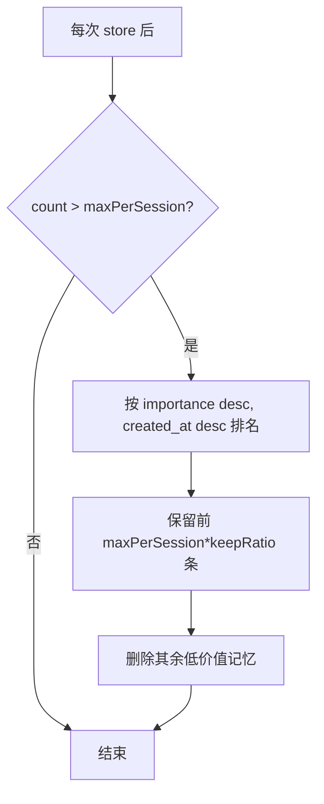

1. **条数上限（硬约束）**：每对局 `max-per-session`（默认 200）。`store` 之后若超限，调 `pruneSession` 按「重要性 desc、时间 desc」排名，仅保留前 `maxPerSession × prune-keep-ratio`（默认 160）条，删除其余。优先淘汰**低重要性 + 旧**的记忆。

2. **重要性衰减（召回侧软约束）**：召回综合分里 `recency = exp(-ageDays/decayDays)`，对久远记忆做指数衰减（半衰期 `decay-days`=7 天），让近期事件更容易被召回；同时 `importance` 高的记忆有加权抬升，不会被时间完全淹没。衰减只影响**排序**，不删数据。

3. **滚动摘要（与 game-service 协作，落在状态侧）**：长程剧情回顾由 game-service 维护在 `t_game_state.recent_summary`（基线 §4.3/§6.1 `recentSummary`）——每隔若干回合，game-service 把旧回合压缩成一句摘要更新该字段，喂给 ai-engine 作为「近况」。memory-service 这边对应地：摘要本身可作为一条 `memType=EVENT, importance=4` 的高价值记忆经 `store` 入库，从而即便明细记忆被裁剪，**摘要级记忆仍长期保留**。这形成「明细记忆滚动淘汰 + 摘要记忆长期沉淀」的分层。

> 说明：滚动摘要的「生成摘要文本」动作不在 memory-service（不调 LLM），由 game-service 编排时调 ai-engine 或简单拼接产出，再以 `items` 形式 `store` 进来。memory-service 只负责存储与治理。

---

### 6.8 对 game / ai-engine 暴露的接口实现（Controller）

严格对齐基线 §5.5：`POST /api/memory/store`、`POST /api/memory/recall`，统一 `R<T>` 外壳（基线 §3.1）。本服务为 INTERNAL，方法上校验内部头 `X-Internal-Call`（常量来自 common，基线 §3.4）。

```java
package com.aigm.memory.controller;

import com.aigm.common.result.R;
import com.aigm.memory.dto.*;
import com.aigm.memory.service.MemoryService;
import io.swagger.v3.oas.annotations.Operation;
import io.swagger.v3.oas.annotations.tags.Tag;
import jakarta.validation.Valid;
import lombok.RequiredArgsConstructor;
import org.springframework.web.bind.annotation.*;

@Tag(name = "memory-service 内部接口")
@RestController
@RequestMapping("/api/memory")
@RequiredArgsConstructor
public class MemoryController {

    private final MemoryService memoryService;

    @Operation(summary = "批量向量化并入库")
    @PostMapping("/store")
    public R<StoreResult> store(@RequestHeader(name = "X-Internal-Call", required = false) String internal,
                                @Valid @RequestBody StoreRequest req) {
        return R.ok(memoryService.store(req));
    }

    @Operation(summary = "语义召回 topK（session 过滤 + importance 加权）")
    @PostMapping("/recall")
    public R<RecallResult> recall(@RequestHeader(name = "X-Internal-Call", required = false) String internal,
                                  @Valid @RequestBody RecallRequest req) {
        return R.ok(memoryService.recall(req));
    }
}
```

请求/响应样例（去掉 `R` 外壳，只看 `data`）：

`POST /api/memory/store` 入参：

```json
{
  "sessionId": 5001,
  "items": [
    { "content": "玩家质问管家昨晚的动静，管家回避，玩家对其信任下降。", "memType": "EVENT", "importance": 3 },
    { "content": "玩家曾承诺保护女仆莉莉的安全。", "memType": "CHOICE", "importance": 4 }
  ]
}
```

响应：

```json
{ "code": 0, "message": "success", "data": { "storedCount": 2 } }
```

`POST /api/memory/recall` 入参：

```json
{ "sessionId": 5001, "query": "我走到管家面前，问他对女仆的态度。", "topK": 5 }
```

响应：

```json
{
  "code": 0,
  "message": "success",
  "data": {
    "memories": [
      { "content": "玩家曾承诺保护女仆莉莉的安全。", "memType": "CHOICE", "importance": 4, "score": 0.8731 },
      { "content": "玩家质问管家昨晚的动静，管家回避，玩家对其信任下降。", "memType": "EVENT", "importance": 3, "score": 0.7642 }
    ]
  }
}
```

启动类：

```java
package com.aigm.memory;

import org.mybatis.spring.annotation.MapperScan;
import org.springframework.boot.SpringApplication;
import org.springframework.boot.autoconfigure.SpringBootApplication;
import org.springframework.cloud.client.discovery.EnableDiscoveryClient;

@EnableDiscoveryClient
@MapperScan("com.aigm.memory.mapper")
@SpringBootApplication
public class MemoryApplication {
    public static void main(String[] args) {
        SpringApplication.run(MemoryApplication.class, args);
    }
}
```

> game-service 通过 common/feign 的 `MemoryClient`（基线 §2）调用本服务，方法签名与上面两个接口一一对应；Feign 客户端 `name = "memory-service"`，并带 `X-Internal-Call: true`、透传 `X-User-Id`（基线 §3.4）。

---

### 6.9 端到端时序（store 与 recall 在一回合中的位置）

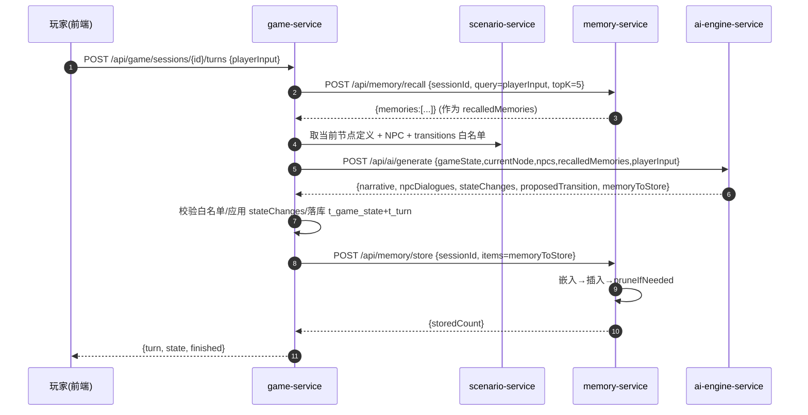

---

### 6.10 验收标准（Acceptance Criteria）

| 编号 | 验收点 | 通过判据 |
|---|---|---|
| AC-1 | pgvector 就绪 | `CREATE EXTENSION vector` 成功，`\d t_memory` 显示 `embedding vector(1024)`，HNSW 索引存在 |
| AC-2 | store 基本可用 | 调 `/api/memory/store` 传 2 条 item，返回 `{storedCount:2}`，DB 中对应行 `embedding` 非空、维度=1024 |
| AC-3 | 嵌入维度校验 | 配置错误模型(非1024维)时，store/recall 返回 `code=1504`，不写脏数据 |
| AC-4 | 嵌入服务故障降级 | embedding API 不可达/超时，返回 `code=1504`，事务回滚不留半截记录 |
| AC-5 | session 隔离 | 对 sessionA 存记忆，用 sessionB recall 同一 query，返回 `memories=[]`，不串味 |
| AC-6 | 语义召回相关性 | 存「承诺保护女仆」「找到生锈钥匙」两条；query=「我对女仆的态度」时，前者 score 明显高于后者并排在第一 |
| AC-7 | topK 与 clamp | `topK=3` 返回≤3 条；传 `topK=999` 被 clamp 到 `max-top-k`(20)；不传按默认 5 |
| AC-8 | importance 加权 | 两条语义相近记忆中，`importance=5` 的排序不低于 `importance=2` 的 |
| AC-9 | 防膨胀生效 | 单 session 连续 store 超过 `max-per-session`(200) 后，`countBySession` 收敛到 `maxPerSession*keepRatio`(160)，且被删的是低重要性/旧记忆 |
| AC-10 | 返回体规范 | 两接口均返回 `R<T>` 结构（`code/message/data`），成功 `code=0` |
| AC-11 | provider 可切换 | 仅改 Nacos `aigm.embedding.base-url/model/api-key` 即切换嵌入 provider，无需改代码、重启后生效 |
| AC-12 | 内部隔离 | 网关不路由 `/api/memory/**`；前端直接访问网关该前缀被拦截（仅服务间 Feign 可达） |

## 七、前端实现规格（Vue3 + Vite + Element Plus + Pinia + axios）

> 本节严格对齐 §1 版本矩阵（Vue 3.4.x / Vite 5.x / Element Plus 2.7.x / Pinia 2.1.x / axios 1.7.x / vue-router 4.x / Node 20.x）、§3 全局约定（统一返回体 `R`、错误码、JWT、CORS）、§5 REST API 契约、§6 AI 引擎契约。所有服务名、路径、JSON 字段名以 §1 基线为准。前端目录结构见 §2「`frontend/`」。统一基准日期 **2026-05-29**。

前端是单页应用（SPA），所有请求经 gateway（`http://localhost:8080`，开发期由 Vite 代理或 axios `baseURL` 指向）。前端只面向**对外**接口（`/api/user/**`、`/api/scenario/**`、`/api/game/**`），不直接访问 INTERNAL 接口（`/api/ai/**`、`/api/memory/**`，那是 game-service 内部经 Feign 调用的，前端无感）。前端的 RBAC 是「体验优化」（菜单/路由按角色显隐），真正的权限裁决在网关 + 各服务方法级校验。

---

### 1. 页面清单与职责

| 路由 path | 视图组件（见 §2） | 可访问角色 | 职责 |
|---|---|---|---|
| `/login` | `views/Login.vue` | PUBLIC | 用户名+密码登录，调 `POST /api/user/auth/login`，存 token + userInfo 到 Pinia |
| `/register` | `views/Register.vue` | PUBLIC | 注册（默认授予 PLAYER），调 `POST /api/user/auth/register`，成功后跳登录 |
| `/hall` | `views/player/GameHall.vue` | PLAYER/AUTHOR/ADMIN | 「冒险大厅」：已发布剧本列表（卡片）+ 我的存档列表（读档/续玩/弃局/新开局入口） |
| `/play/:sessionId` | `views/player/GamePlay.vue` | PLAYER（本人对局） | 沉浸式冒险对话主界面：叙事流 + NPC 对话气泡 + 状态条 + 输入框（核心页） |
| `/author/scenarios` | `views/author/ScenarioList.vue` | AUTHOR/ADMIN | 编剧后台-我的剧本列表：新建/编辑/发布/下架/删除（剧本 CRUD 入口） |
| `/author/scenarios/:id/edit` | `views/author/ScenarioEditor.vue` | AUTHOR(本人)/ADMIN | 剧本编辑器：剧本基本信息 + 场景节点 / NPC / 分支 三个 Tab 的 CRUD + 状态机可视化预览 |
| `/admin/users` | `views/admin/UserManage.vue` | ADMIN | 管理员-用户管理：分页查用户、启用/禁用、分配角色（RBAC 核心）、逻辑删除 |
| `/403` | `views/Forbidden.vue` | 登录任意 | 无权限提示页（路由守卫角色不足时跳转） |
| `/:pathMatch(.*)*` | `views/NotFound.vue` | PUBLIC | 404 兜底 |

布局：登录/注册为独立全屏布局；其余页面套 `App.vue` 内的 `LayoutDefault`（顶栏 Logo + 用户菜单 + 角色相关导航 + 退出）。`/play/:sessionId` 沉浸式页面可隐藏顶栏冗余元素，仅保留「返回大厅」与状态条。

---

### 2. 整体架构与目录落地

完全沿用 §2 `frontend/` 结构，下面补充未列出的辅助文件（不改既有命名）：

```
frontend/
├── package.json
├── vite.config.js
├── .env.development          # VITE_API_BASE_URL=http://localhost:8080
├── .env.production           # VITE_API_BASE_URL=/ (经 Nginx 反代到 gateway)
├── index.html
└── src/
    ├── main.js               # 挂载 App、注册 Element Plus、Pinia(持久化)、router、全局样式
    ├── App.vue               # <router-view/>，承载全局布局
    ├── api/
    │   ├── request.js        # axios 封装：baseURL/拦截器/JWT 注入/统一错误处理/对齐 R
    │   ├── user.js           # 对接 user-service
    │   ├── scenario.js       # 对接 scenario-service
    │   └── game.js           # 对接 game-service（含 SSE 流式）
    ├── store/
    │   ├── user.js           # Pinia：token/userInfo/roles，登录登出，角色判断
    │   └── game.js           # Pinia：当前对局 session/state/turns，回合提交，流式拼接
    ├── router/
    │   └── index.js          # 路由表 + 全局守卫（登录态 + RBAC）
    ├── views/
    │   ├── Login.vue  Register.vue  Forbidden.vue  NotFound.vue
    │   ├── layout/ LayoutDefault.vue        # 顶栏 + 侧/顶导航 + <router-view/>
    │   ├── player/ GameHall.vue  GamePlay.vue
    │   ├── author/ ScenarioList.vue  ScenarioEditor.vue
    │   └── admin/  UserManage.vue
    ├── components/
    │   ├── NarrativePanel.vue   # 叙事正文流（打字机/逐段渲染）
    │   ├── NpcDialogue.vue      # 单条 NPC 对话气泡（头像 + 名字 + 台词）
    │   ├── StateBar.vue         # 状态条：flags / inventory / attributes 可视化
    │   ├── TransitionGraph.vue  # 编辑器里状态机节点-分支可视化（基于 mermaid 文本渲染）
    │   └── RoleTag.vue          # 角色标签（PLAYER/AUTHOR/ADMIN 配色）
    └── assets/
        ├── styles/ theme.css    # CSS 变量主题色（覆盖 Element Plus 主色）
        └── images/
```

`main.js` 骨架：
```js
import { createApp } from 'vue'
import { createPinia } from 'pinia'
import piniaPluginPersistedstate from 'pinia-plugin-persistedstate'
import ElementPlus from 'element-plus'
import zhCn from 'element-plus/es/locale/lang/zh-cn'
import * as ElIcons from '@element-plus/icons-vue'
import 'element-plus/dist/index.css'
import './assets/styles/theme.css'
import App from './App.vue'
import router from './router'

const app = createApp(App)
const pinia = createPinia()
pinia.use(piniaPluginPersistedstate)

app.use(pinia)
app.use(router)
app.use(ElementPlus, { locale: zhCn })
for (const [key, comp] of Object.entries(ElIcons)) app.component(key, comp)

app.mount('#app')
```

`vite.config.js` 关键（开发期跨域走代理，避免直连网关 CORS 配置出错；也可不用代理直连 §3.5 网关已配 CORS 的 8080）：
```js
import { defineConfig } from 'vite'
import vue from '@vitejs/plugin-vue'
import path from 'node:path'

export default defineConfig({
  plugins: [vue()],
  resolve: { alias: { '@': path.resolve(__dirname, 'src') } },
  server: {
    port: 5173,
    proxy: {
      // 仅在 .env.development 把 baseURL 设为 '' 时启用代理；
      // 默认走 axios baseURL 直连 8080（网关已配 CORS for http://localhost:5173）
      '/api': { target: 'http://localhost:8080', changeOrigin: true }
    }
  }
})
```

---

### 3. axios 封装（`src/api/request.js`）

要求：注入 JWT、统一错误处理、对齐 §3.1 统一返回体 `R<T>`、按 §3.2 错误码表分流。约定 axios 层**剥壳**：业务调用拿到的是 `R.data`（成功）；失败统一抛出并弹 `ElMessage`，调用方一般无需重复处理。

```js
import axios from 'axios'
import { ElMessage, ElMessageBox } from 'element-plus'
import router from '@/router'
import { useUserStore } from '@/store/user'

const service = axios.create({
  baseURL: import.meta.env.VITE_API_BASE_URL || 'http://localhost:8080',
  timeout: 65000 // 含回合接口走 LLM，§3.4 readTimeout 60s，前端略大于之
})

// 请求拦截：注入 JWT（§3.3 Authorization: Bearer <token>）
service.interceptors.request.use(
  (config) => {
    const userStore = useUserStore()
    if (userStore.token) {
      config.headers['Authorization'] = `Bearer ${userStore.token}`
    }
    return config
  },
  (error) => Promise.reject(error)
)

// 响应拦截：对齐统一返回体 R，按错误码分流
service.interceptors.response.use(
  (response) => {
    // SSE/blob 等非 JSON 直接放行
    if (response.config.responseType === 'stream' || response.config.responseType === 'blob') {
      return response
    }
    const res = response.data // { code, message, data }
    if (res.code === 0) {
      return res.data // 剥壳，直接返回业务 data
    }
    // 鉴权类错误码（§3.2: 1001/1003/1004 → 重新登录；1005 → 无权限；1006 → 禁用）
    if ([1001, 1003, 1004].includes(res.code)) {
      handleAuthExpired(res.message)
      return Promise.reject(new BizError(res.code, res.message))
    }
    if (res.code === 1006) {
      ElMessage.error('账号已被禁用，请联系管理员')
      handleAuthExpired()
      return Promise.reject(new BizError(res.code, res.message))
    }
    if (res.code === 1005) {
      ElMessage.error('无权限执行该操作')
      router.replace('/403')
      return Promise.reject(new BizError(res.code, res.message))
    }
    // 其余业务错误（参数 11xx / 业务 12xx / AI 15xx / 系统 19xx）统一提示
    ElMessage.error(res.message || '请求失败')
    return Promise.reject(new BizError(res.code, res.message))
  },
  (error) => {
    // HTTP 层错误：网关 401/403、超时、网络断开
    const status = error.response?.status
    if (status === 401) {
      handleAuthExpired('登录已过期，请重新登录')
    } else if (status === 403) {
      ElMessage.error('无权限访问')
      router.replace('/403')
    } else if (error.code === 'ECONNABORTED') {
      ElMessage.error('请求超时，AI 可能仍在思考，请稍后重试')
    } else {
      ElMessage.error(error.message || '网络异常，请稍后重试')
    }
    return Promise.reject(error)
  }
)

class BizError extends Error {
  constructor(code, message) { super(message); this.name = 'BizError'; this.code = code }
}

let authBoxShown = false
function handleAuthExpired(msg = '登录状态失效，请重新登录') {
  if (authBoxShown) return
  authBoxShown = true
  const userStore = useUserStore()
  ElMessageBox.alert(msg, '提示', { confirmButtonText: '去登录', type: 'warning' })
    .finally(() => {
      authBoxShown = false
      userStore.logout()
      router.replace('/login')
    })
}

export default service
```

业务 API 模块示例（`src/api/user.js`）：
```js
import request from './request'

export const apiLogin    = (data)  => request.post('/api/user/auth/login', data)
export const apiRegister = (data)  => request.post('/api/user/auth/register', data)
export const apiGetMe    = ()      => request.get('/api/user/me')
export const apiUpdateMe = (data)  => request.put('/api/user/me', data)
// 管理员
export const apiAdminListUsers = (params)          => request.get('/api/user/admin/users', { params })
export const apiAdminSetStatus = (id, status)      => request.put(`/api/user/admin/users/${id}/status`, { status })
export const apiAdminSetRoles  = (id, roles)       => request.put(`/api/user/admin/users/${id}/roles`, { roles })
export const apiAdminDeleteUser= (id)              => request.delete(`/api/user/admin/users/${id}`)
```

`src/api/scenario.js`：
```js
import request from './request'

export const apiPublishedScenarios = (params)        => request.get('/api/scenario/published', { params })
export const apiScenarioDetail     = (id)            => request.get(`/api/scenario/${id}`)
export const apiMyScenarios        = (params)        => request.get('/api/scenario/mine', { params })
export const apiCreateScenario     = (data)          => request.post('/api/scenario', data)
export const apiUpdateScenario     = (id, data)      => request.put(`/api/scenario/${id}`, data)
export const apiPublishScenario    = (id, status)    => request.put(`/api/scenario/${id}/publish`, { status })
export const apiDeleteScenario     = (id)            => request.delete(`/api/scenario/${id}`)
// 节点
export const apiListNodes  = (sid)            => request.get(`/api/scenario/${sid}/nodes`)
export const apiCreateNode = (sid, data)      => request.post(`/api/scenario/${sid}/nodes`, data)
export const apiUpdateNode = (nodeId, data)   => request.put(`/api/scenario/nodes/${nodeId}`, data)
export const apiDeleteNode = (nodeId)         => request.delete(`/api/scenario/nodes/${nodeId}`)
// NPC
export const apiListNpcs  = (sid)             => request.get(`/api/scenario/${sid}/npcs`)
export const apiCreateNpc = (sid, data)       => request.post(`/api/scenario/${sid}/npcs`, data)
export const apiUpdateNpc = (npcId, data)     => request.put(`/api/scenario/npcs/${npcId}`, data)
export const apiDeleteNpc = (npcId)           => request.delete(`/api/scenario/npcs/${npcId}`)
// 分支
export const apiListTransitions  = (sid)      => request.get(`/api/scenario/${sid}/transitions`)
export const apiCreateTransition = (data)     => request.post('/api/scenario/transitions', data)
export const apiUpdateTransition = (id, data) => request.put(`/api/scenario/transitions/${id}`, data)
export const apiDeleteTransition = (id)       => request.delete(`/api/scenario/transitions/${id}`)
```

`src/api/game.js`（普通回合 + 可选 SSE 流式）：
```js
import request from './request'
import { useUserStore } from '@/store/user'

export const apiStartSession   = (scenarioId)      => request.post('/api/game/sessions', { scenarioId })
export const apiSubmitTurn     = (id, playerInput) => request.post(`/api/game/sessions/${id}/turns`, { playerInput })
export const apiGetSession     = (id)              => request.get(`/api/game/sessions/${id}`)
export const apiMySessions     = (params)          => request.get('/api/game/sessions', { params })
export const apiAbandonSession = (id)              => request.put(`/api/game/sessions/${id}/abandon`)
export const apiGetState       = (id)              => request.get(`/api/game/sessions/${id}/state`)

// SSE 流式提交回合（见 §6 流式方案）。返回一个可 abort 的控制器。
export function streamTurn(id, playerInput, { onNarrative, onDone, onError } = {}) {
  const userStore = useUserStore()
  const controller = new AbortController()
  const base = import.meta.env.VITE_API_BASE_URL || 'http://localhost:8080'
  fetch(`${base}/api/game/sessions/${id}/turns/stream`, {
    method: 'POST',
    headers: {
      'Content-Type': 'application/json',
      'Authorization': `Bearer ${userStore.token}`,
      'Accept': 'text/event-stream'
    },
    body: JSON.stringify({ playerInput }),
    signal: controller.signal
  }).then((resp) => parseSse(resp, { onNarrative, onDone, onError }))
    .catch((e) => onError?.(e))
  return controller
}

async function parseSse(resp, { onNarrative, onDone, onError }) {
  if (!resp.ok || !resp.body) { onError?.(new Error(`SSE ${resp.status}`)); return }
  const reader = resp.body.getReader()
  const decoder = new TextDecoder('utf-8')
  let buffer = ''
  while (true) {
    const { value, done } = await reader.read()
    if (done) break
    buffer += decoder.decode(value, { stream: true })
    const frames = buffer.split('\n\n')
    buffer = frames.pop() || ''
    for (const frame of frames) {
      const lines = frame.split('\n')
      const event = lines.find(l => l.startsWith('event:'))?.slice(6).trim() || 'message'
      const dataStr = lines.filter(l => l.startsWith('data:')).map(l => l.slice(5).trim()).join('\n')
      if (!dataStr) continue
      if (event === 'narrative') {
        onNarrative?.(JSON.parse(dataStr).delta ?? dataStr)
      } else if (event === 'done') {
        // 末帧带完整结构化结果：{ turn, state, finished }
        onDone?.(JSON.parse(dataStr))
      } else if (event === 'error') {
        onError?.(new Error(dataStr))
      }
    }
  }
}
```

> 说明：SSE 是「锦上添花」。若 game-service 暂未实现 `/turns/stream`，前端用 `apiSubmitTurn` 同步路径即可（见 §6 的降级开关 `enableStream`），二者产出同一结构 `{ turn, state, finished }`，UI 层无差异。

---

### 4. Pinia 状态（`src/store/`）

#### 4.1 用户态 `store/user.js`（持久化 token + userInfo）

```js
import { defineStore } from 'pinia'
import { apiLogin, apiRegister, apiGetMe } from '@/api/user'

export const useUserStore = defineStore('user', {
  state: () => ({
    token: '',
    userInfo: null // { userId, username, nickname, avatar, roles:[] }
  }),
  getters: {
    isLogin: (s) => !!s.token,
    roles:   (s) => s.userInfo?.roles || [],
    isPlayer:(s) => (s.userInfo?.roles || []).includes('PLAYER'),
    isAuthor:(s) => (s.userInfo?.roles || []).includes('AUTHOR'),
    isAdmin: (s) => (s.userInfo?.roles || []).includes('ADMIN'),
    hasAnyRole: (s) => (need) => (s.userInfo?.roles || []).some(r => need.includes(r))
  },
  actions: {
    async login(form) {
      // data = { token, userInfo:{ userId, username, nickname, roles[] } }（§5.1）
      const data = await apiLogin(form)
      this.token = data.token
      this.userInfo = data.userInfo
      return data
    },
    async register(form) { return apiRegister(form) }, // data = { userId }
    async fetchMe() {
      const data = await apiGetMe() // { userId, username, nickname, avatar, roles[] }
      this.userInfo = data
      return data
    },
    logout() { this.token = ''; this.userInfo = null }
  },
  persist: {
    key: 'aigm-user',
    storage: localStorage,
    paths: ['token', 'userInfo']
  }
})
```

#### 4.2 对局态 `store/game.js`（当前对局运行时，不持久化——读档时重新拉取）

```js
import { defineStore } from 'pinia'
import { apiStartSession, apiSubmitTurn, apiGetSession, streamTurn } from '@/api/game'

export const useGameStore = defineStore('game', {
  state: () => ({
    sessionId: null,
    session: null,        // { id, scenarioId, title, status, turnCount, ... }
    state: null,          // GameStateVO（§6.1）: { currentNodeId, flags, inventory, attributes, recentSummary }
    turns: [],            // [{ turnNo, playerInput, aiOutput }]（aiOutput 见 §6.4）
    finished: false,
    loading: false,       // 回合处理中（AI 思考态）
    streamingNarrative: '', // SSE 拼接中的叙事文本
    enableStream: false    // 默认 false：走同步 apiSubmitTurn(基线 §5.3，SSE /turns/stream 为可选加分项)。仅当后端确实实现了 /turns/stream 时才置 true
  }),
  getters: {
    currentNodeId: (s) => s.state?.currentNodeId ?? null,
    // 给 UI 渲染用：把回合的 aiOutput 摊平成一条条「叙事 + NPC 台词」
    storyLog: (s) => s.turns
  },
  actions: {
    async start(scenarioId) {
      this.reset()
      // data = { sessionId, state, firstTurn:AiOutput }（§5.3）
      const data = await apiStartSession(scenarioId)
      this.sessionId = data.sessionId
      this.state = data.state
      this.turns = [{ turnNo: 1, playerInput: null, aiOutput: data.firstTurn }]
      return data
    },
    async loadSession(id) {
      this.reset()
      // data = { session, state, turns:[...] }（§5.3）
      const data = await apiGetSession(id)
      this.sessionId = id
      this.session = data.session
      this.state = data.state
      this.turns = data.turns
      this.finished = [2, 3, 4].includes(data.session?.status)
    },
    // 同步提交一回合
    async submitTurn(playerInput) {
      this.loading = true
      try {
        // data = { turn:{turnNo,playerInput,aiOutput}, state, finished }（§5.3）
        const data = await apiSubmitTurn(this.sessionId, playerInput)
        this.turns.push(data.turn)
        this.state = data.state
        this.finished = data.finished
        return data
      } finally { this.loading = false }
    },
    // 流式提交一回合
    submitTurnStream(playerInput) {
      this.loading = true
      this.streamingNarrative = ''
      // 预插一条占位回合，turnNo 用当前长度+1，待 done 帧用真实数据替换
      return new Promise((resolve, reject) => {
        streamTurn(this.sessionId, playerInput, {
          onNarrative: (delta) => { this.streamingNarrative += delta },
          onDone: (final) => {
            this.turns.push(final.turn)
            this.state = final.state
            this.finished = final.finished
            this.streamingNarrative = ''
            this.loading = false
            resolve(final)
          },
          onError: (err) => { this.loading = false; this.streamingNarrative = ''; reject(err) }
        })
      })
    },
    reset() {
      this.sessionId = null; this.session = null; this.state = null
      this.turns = []; this.finished = false; this.loading = false; this.streamingNarrative = ''
    }
  }
})
```

---

### 5. 路由与权限守卫（`src/router/index.js`）

路由 `meta` 声明 `requiresAuth` 与 `roles`（允许的角色集合，命中任一即可）；全局前置守卫做两件事：①未登录拦截到 `/login`；②角色不足跳 `/403`。前端 RBAC 仅控制可见性与可达性，后端为最终裁决。

```js
import { createRouter, createWebHistory } from 'vue-router'
import { useUserStore } from '@/store/user'

const routes = [
  { path: '/login',    component: () => import('@/views/Login.vue'),    meta: { public: true } },
  { path: '/register', component: () => import('@/views/Register.vue'), meta: { public: true } },
  { path: '/403',      component: () => import('@/views/Forbidden.vue') },
  {
    path: '/',
    component: () => import('@/views/layout/LayoutDefault.vue'),
    redirect: '/hall',
    children: [
      { path: 'hall',  name: 'GameHall',
        component: () => import('@/views/player/GameHall.vue'),
        meta: { requiresAuth: true, roles: ['PLAYER', 'AUTHOR', 'ADMIN'] } },
      { path: 'play/:sessionId', name: 'GamePlay',
        component: () => import('@/views/player/GamePlay.vue'),
        meta: { requiresAuth: true, roles: ['PLAYER', 'AUTHOR', 'ADMIN'] } },
      { path: 'author/scenarios', name: 'ScenarioList',
        component: () => import('@/views/author/ScenarioList.vue'),
        meta: { requiresAuth: true, roles: ['AUTHOR', 'ADMIN'] } },
      { path: 'author/scenarios/:id/edit', name: 'ScenarioEditor',
        component: () => import('@/views/author/ScenarioEditor.vue'),
        meta: { requiresAuth: true, roles: ['AUTHOR', 'ADMIN'] } },
      { path: 'admin/users', name: 'UserManage',
        component: () => import('@/views/admin/UserManage.vue'),
        meta: { requiresAuth: true, roles: ['ADMIN'] } }
    ]
  },
  { path: '/:pathMatch(.*)*', component: () => import('@/views/NotFound.vue'), meta: { public: true } }
]

const router = createRouter({ history: createWebHistory(), routes })

router.beforeEach((to) => {
  const userStore = useUserStore()
  if (to.meta.public) return true
  if (to.meta.requiresAuth && !userStore.isLogin) {
    return { path: '/login', query: { redirect: to.fullPath } }
  }
  if (to.meta.roles && !userStore.hasAnyRole(to.meta.roles)) {
    return { path: '/403' }
  }
  return true
})

export default router
```

权限守卫流程：

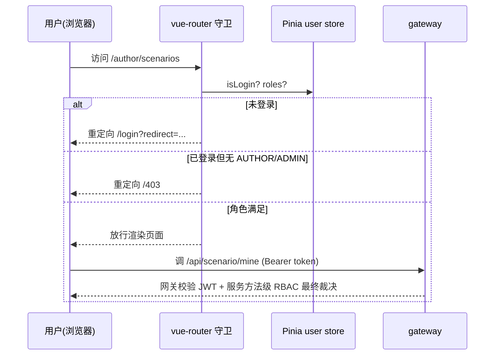

---

### 6. 流式 / SSE 对话渲染方案

核心页 `GamePlay.vue` 的回合交互有两条路径，由 `gameStore.enableStream` 切换，UI 表现一致（差别只是叙事是否逐字浮现）。

- **同步路径（基线必做，demo 不翻车）**：调 `POST /api/game/sessions/{id}/turns`，期间显示「GM 正在编织剧情…」加载态（骨架/呼吸点动画）。拿到 `{ turn, state, finished }` 后把整条回合追加进 `turns`，叙事用打字机动画逐字显现（纯前端 setInterval 揭字，体验接近流式但不依赖后端）。
- **流式路径（加分项，可选）**：调 `POST /api/game/sessions/{id}/turns/stream`（SSE，`Content-Type: text/event-stream`）。事件帧：`event:narrative` 携带增量 `{delta}` 实时拼接到 `streamingNarrative`；`event:done` 携带最终 `{ turn, state, finished }`（含完整 `npcDialogues`/`stateChanges`/`proposedTransition`）一次性落地、刷新状态条；`event:error` 携带错误（如 §3.2 的 1500/1503）。

> 为何 done 帧才给结构化结果：§6 约定 AI 输出是**强制结构化 JSON**（narrative + npcDialogues + stateChanges + proposedTransition），且白名单校验（§6.5）在服务端完成后才能确定最终状态。因此流式只对 `narrative` 做体验级增量呈现，NPC 台词与状态变更在 done 帧统一渲染，避免「先显示了越界跳转又被回退」的视觉错乱。

SSE 时序：

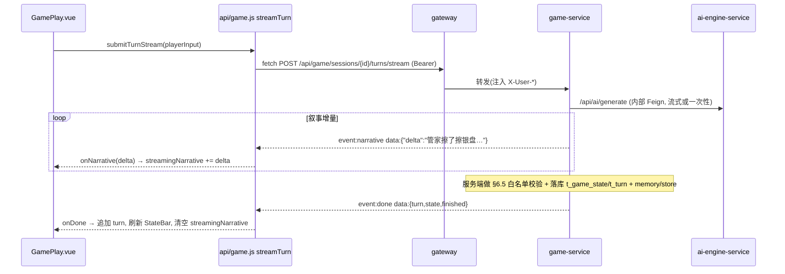

打字机降级实现（同步路径用，组件内）：
```js
function typewriter(fullText, onTick, speed = 24) {
  let i = 0
  const timer = setInterval(() => {
    i += 2
    onTick(fullText.slice(0, i))
    if (i >= fullText.length) clearInterval(timer)
  }, speed)
  return () => clearInterval(timer)
}
```

---

### 7. UI 美观要点（满足「网页美观大方」硬性要求）

#### 7.1 主题色与 CSS 变量（`assets/styles/theme.css`）
契合「悬疑/奇幻沉浸式跑团」的暗色基调，但后台管理页保持清爽浅色，两套配色通过根节点 class 切换（`.theme-immersive` / 默认浅色）。

```css
:root {
  /* 品牌主色：深靛 + 暖琥珀点缀（神秘 + 故事感） */
  --el-color-primary: #5b6ee1;          /* 覆盖 Element Plus 主色 */
  --aigm-bg: #f5f6fa;
  --aigm-text: #2c2f3a;
  --aigm-radius: 12px;
  --aigm-shadow: 0 6px 24px rgba(31, 35, 66, 0.08);
}
/* 沉浸式冒险页：暗色羊皮纸/夜幕 */
.theme-immersive {
  --aigm-bg: radial-gradient(1200px 600px at 50% -10%, #232744 0%, #15172b 60%, #0d0e1a 100%);
  --aigm-text: #e8e6df;
  --aigm-narrative: #d8d3c4;            /* 叙事正文：羊皮纸米白 */
  --aigm-npc-bubble: rgba(91, 110, 225, 0.16);
  --aigm-player-bubble: rgba(240, 178, 92, 0.18); /* 玩家：暖琥珀 */
  --aigm-accent: #f0b25c;
}
```

#### 7.2 排版与组件规范
- 字体：正文系统无衬线（`-apple-system, "PingFang SC", "Microsoft YaHei", sans-serif`）；叙事正文可用衬线体（`"Noto Serif SC", serif`）增强「读故事」沉浸感，行高 1.9、字号 16px、段间距充足。
- 圆角统一 `12px`，卡片用 `--aigm-shadow` 柔和阴影；剧本卡片悬停轻微上浮 `transform: translateY(-4px)` + 阴影加深。
- 留白克制对称，主内容区最大宽度 880px 居中（沉浸阅读舒适宽度）。
- 配色对比度满足可读性（暗色背景下叙事文用米白而非纯白，降低刺眼）。

#### 7.3 对话气泡设计（沉浸式核心体验）
- **叙事（GM 旁白）**：不做气泡，居中铺陈为「书页正文」，左侧一道竖向琥珀色装饰线，营造「读小说」感；逐字打字机浮现。
- **NPC 台词**：左对齐气泡，左侧圆形头像（`t_npc.avatar`，无则用名字首字生成色块），气泡上方小字显示 NPC 名（如「管家·霍金斯」），气泡底色 `--aigm-npc-bubble`。
- **玩家输入回显**：右对齐气泡，底色 `--aigm-player-bubble`（暖琥珀），呼应「你的行动」。
- **加载态**：GM 思考时显示三点呼吸动画 + 文案「GM 正在编织剧情…」；流式时 narrative 区光标闪烁。

#### 7.4 状态条 `StateBar.vue`（让「状态机/记忆」可被玩家感知）
固定在 GamePlay 顶部或侧边，可视化 `GameStateVO`（§6.1）：
- attributes：`sanity`（理智）用进度条/心形，颜色随值降低由绿转红；`evidence`（证据数）用徽章计数；其余属性用小标签。
- inventory：物品用图标 chip 列表（如「生锈的钥匙」），悬停 tooltip。
- flags：仅展示「已点亮」的关键旗标为高亮徽章（如 `has_key`→「已获钥匙」），中文友好名映射可由 `t_flag_def.flag_name` 提供。
- 结局态（`finished=true`）：覆盖一层结局卡（WIN 金色 / LOSE 暗红 / 弃局灰），呼应 `endingType`。

#### 7.5 加载与反馈
- 全局：路由切换顶部进度条（可用 `nprogress`）。
- 列表/详情：Element Plus `v-loading` 骨架或遮罩。
- 操作反馈：增删改用 `ElMessage` 成功提示；删除/发布用 `ElMessageBox.confirm` 二次确认；表单校验红字即时提示。
- 空态：剧本/存档为空时给插画 + 引导按钮（「去创建第一个剧本」/「开启第一段冒险」）。

---

### 8. 组件骨架示例

#### 8.1 沉浸式冒险主界面 `views/player/GamePlay.vue`
```vue
<script setup>
import { ref, onMounted, nextTick } from 'vue'
import { useRoute, useRouter } from 'vue-router'
import { storeToRefs } from 'pinia'
import { useGameStore } from '@/store/game'
import NarrativePanel from '@/components/NarrativePanel.vue'
import NpcDialogue from '@/components/NpcDialogue.vue'
import StateBar from '@/components/StateBar.vue'
import { ElMessage } from 'element-plus'

const route = useRoute()
const router = useRouter()
const gameStore = useGameStore()
const { turns, state, loading, finished, streamingNarrative, enableStream } = storeToRefs(gameStore)

const input = ref('')
const logRef = ref(null)

onMounted(async () => {
  await gameStore.loadSession(route.params.sessionId)
  scrollToBottom()
})

async function send() {
  const text = input.value.trim()
  if (!text || loading.value || finished.value) return
  input.value = ''
  try {
    if (enableStream.value) await gameStore.submitTurnStream(text)
    else await gameStore.submitTurn(text)
    await scrollToBottom()
  } catch (e) { ElMessage.error('本回合生成失败，请重试') }
}

async function scrollToBottom() {
  await nextTick()
  logRef.value?.scrollTo({ top: logRef.value.scrollHeight, behavior: 'smooth' })
}
</script>

<template>
  <div class="play theme-immersive">
    <header class="play__top">
      <el-button text @click="router.push('/hall')">← 返回大厅</el-button>
      <StateBar :state="state" :finished="finished" />
    </header>

    <main ref="logRef" class="play__log">
      <template v-for="t in turns" :key="t.turnNo">
        <!-- 玩家输入回显（首回合 playerInput 为 null 不显示） -->
        <div v-if="t.playerInput" class="bubble bubble--player">{{ t.playerInput }}</div>
        <!-- GM 叙事 -->
        <NarrativePanel :text="t.aiOutput.narrative" />
        <!-- NPC 台词 -->
        <NpcDialogue v-for="(d, i) in t.aiOutput.npcDialogues" :key="i" :dialogue="d" />
      </template>
      <!-- 流式拼接中的叙事 -->
      <NarrativePanel v-if="streamingNarrative" :text="streamingNarrative" :streaming="true" />
      <div v-if="loading && !streamingNarrative" class="thinking">GM 正在编织剧情<span class="dots"></span></div>
    </main>

    <footer class="play__input" v-if="!finished">
      <el-input v-model="input" type="textarea" :rows="2" resize="none"
                placeholder="描述你的行动，如：我走向管家，质问他昨晚的事…"
                @keyup.enter.exact.prevent="send" :disabled="loading" />
      <el-button type="primary" :loading="loading" @click="send">行动</el-button>
    </footer>
    <div v-else class="play__ending">本段冒险已结束。<el-button @click="router.push('/hall')">返回大厅</el-button></div>
  </div>
</template>
```

#### 8.2 NPC 对话气泡 `components/NpcDialogue.vue`
```vue
<script setup>
defineProps({ dialogue: { type: Object, required: true } }) // { npcId, line, name?, avatar? }
</script>
<template>
  <div class="npc">
    <el-avatar :size="40" :src="dialogue.avatar">{{ (dialogue.name || 'N')[0] }}</el-avatar>
    <div class="npc__body">
      <div class="npc__name">{{ dialogue.name || ('NPC#' + dialogue.npcId) }}</div>
      <div class="npc__bubble">{{ dialogue.line }}</div>
    </div>
  </div>
</template>
```
> `npcDialogues` 来自 §6.4，每条含 `npcId` 与 `line`。为了显示名字/头像，`GamePlay` 可在 `loadSession`/`start` 时缓存一份 `npcId → {name, avatar}` 映射（取自剧本详情 `ScenarioDetailVO.npcs` 或回合返回中携带），渲染时补全到 `dialogue.name/avatar`。

#### 8.3 编剧后台-剧本编辑器 `views/author/ScenarioEditor.vue`（CRUD 骨架）
```vue
<script setup>
import { ref, onMounted } from 'vue'
import { useRoute } from 'vue-router'
import {
  apiScenarioDetail, apiListNodes, apiCreateNode, apiUpdateNode, apiDeleteNode,
  apiListNpcs, apiCreateNpc, apiUpdateNpc, apiDeleteNpc,
  apiListTransitions, apiCreateTransition, apiUpdateTransition, apiDeleteTransition,
  apiPublishScenario
} from '@/api/scenario'
import TransitionGraph from '@/components/TransitionGraph.vue'
import { ElMessage, ElMessageBox } from 'element-plus'

const route = useRoute()
const sid = route.params.id
const activeTab = ref('nodes')
const nodes = ref([]); const npcs = ref([]); const transitions = ref([]); const detail = ref(null)

onMounted(reloadAll)
async function reloadAll() {
  detail.value     = await apiScenarioDetail(sid)
  nodes.value      = await apiListNodes(sid)
  npcs.value       = await apiListNpcs(sid)
  transitions.value= await apiListTransitions(sid)
}

// 节点 CRUD 示例（字段对齐 §5.2：nodeKey/title/narrativeBrief/isEnding/endingType/npcIds）
async function saveNode(form) {
  if (form.id) await apiUpdateNode(form.id, form)
  else await apiCreateNode(sid, form)
  ElMessage.success('已保存')
  nodes.value = await apiListNodes(sid)
}
async function removeNode(id) {
  await ElMessageBox.confirm('删除节点将级联删除相关分支，确认？', '警告', { type: 'warning' })
  await apiDeleteNode(id)
  await reloadAll()
}

// 发布前置校验由后端做（§5.2：校验有起始节点+分支闭环）；前端只发请求并提示
async function publish() {
  try { await apiPublishScenario(sid, 1); ElMessage.success('已发布') }
  catch (e) { /* 1210 剧本无起始节点 / 1211 节点无可用分支 已在拦截器统一提示 */ }
}
</script>

<template>
  <div class="editor">
    <el-page-header :content="detail?.title || '剧本编辑'" />
    <el-tabs v-model="activeTab">
      <el-tab-pane label="场景节点" name="nodes">
        <el-table :data="nodes">
          <el-table-column prop="nodeKey" label="节点Key" width="160" />
          <el-table-column prop="title" label="标题" />
          <el-table-column prop="isEnding" label="结局" width="80">
            <template #default="{ row }">
              <el-tag v-if="row.isEnding" :type="row.endingType==='WIN'?'success':'danger'">{{ row.endingType }}</el-tag>
            </template>
          </el-table-column>
          <el-table-column label="操作" width="160">
            <template #default="{ row }">
              <el-button size="small" @click="/* openNodeDialog(row) */">编辑</el-button>
              <el-button size="small" type="danger" @click="removeNode(row.id)">删除</el-button>
            </template>
          </el-table-column>
        </el-table>
        <el-button type="primary" @click="/* openNodeDialog() */">+ 新建节点</el-button>
      </el-tab-pane>

      <el-tab-pane label="NPC" name="npcs"><!-- 同构表格，字段:npcKey/name/persona/background/secret --></el-tab-pane>
      <el-tab-pane label="分支" name="transitions"><!-- 字段:fromNodeId/toNodeId/conditionExpr/description/priority --></el-tab-pane>
      <el-tab-pane label="状态机预览" name="graph">
        <TransitionGraph :nodes="nodes" :transitions="transitions" />
      </el-tab-pane>
    </el-tabs>

    <div class="editor__footer">
      <el-button type="success" @click="publish">发布剧本</el-button>
    </div>
  </div>
</template>
```

#### 8.4 管理员-用户管理 `views/admin/UserManage.vue`（RBAC 核心骨架）
```vue
<script setup>
import { ref, onMounted } from 'vue'
import { apiAdminListUsers, apiAdminSetStatus, apiAdminSetRoles, apiAdminDeleteUser } from '@/api/user'
import RoleTag from '@/components/RoleTag.vue'
import { ElMessage, ElMessageBox } from 'element-plus'

const list = ref([]); const total = ref(0)
const query = ref({ page: 1, size: 10, username: '' })
const ALL_ROLES = ['PLAYER', 'AUTHOR', 'ADMIN']

onMounted(load)
async function load() {
  const data = await apiAdminListUsers(query.value) // { list, total, page, size }
  list.value = data.list; total.value = data.total
}
async function toggleStatus(row) {
  const next = row.status === 1 ? 0 : 1
  await apiAdminSetStatus(row.id, next)
  ElMessage.success(next ? '已启用' : '已禁用'); load()
}
async function saveRoles(row, roles) {
  await apiAdminSetRoles(row.id, roles) // 传 ["PLAYER","AUTHOR"]，对齐 §5.1
  ElMessage.success('角色已更新'); load()
}
async function remove(row) {
  await ElMessageBox.confirm(`确认删除用户「${row.username}」？`, '警告', { type: 'warning' })
  await apiAdminDeleteUser(row.id); load()
}
</script>

<template>
  <div class="user-manage">
    <el-form inline @submit.prevent="load">
      <el-form-item label="用户名"><el-input v-model="query.username" clearable /></el-form-item>
      <el-button type="primary" @click="query.page=1; load()">查询</el-button>
    </el-form>

    <el-table :data="list">
      <el-table-column prop="userId" label="ID" width="80" />
      <el-table-column prop="username" label="用户名" />
      <el-table-column prop="nickname" label="昵称" />
      <el-table-column label="角色">
        <template #default="{ row }">
          <el-select :model-value="row.roles" multiple @change="(v)=>saveRoles(row, v)" style="width:260px">
            <el-option v-for="r in ALL_ROLES" :key="r" :label="r" :value="r" />
          </el-select>
        </template>
      </el-table-column>
      <el-table-column label="状态" width="100">
        <template #default="{ row }"><el-switch :model-value="row.status===1" @change="()=>toggleStatus(row)" /></template>
      </el-table-column>
      <el-table-column label="操作" width="120">
        <template #default="{ row }"><el-button size="small" type="danger" @click="remove(row)">删除</el-button></template>
      </el-table-column>
    </el-table>

    <el-pagination layout="prev, pager, next, total" :total="total"
                   v-model:current-page="query.page" :page-size="query.size"
                   @current-change="load" />
  </div>
</template>
```

---

### 9. 与后端 API 的对接清单（对齐 §5 基线）

| 页面 | 触发 | 调用（前端封装） | 后端契约 | data 关键字段 |
|---|---|---|---|---|
| Login | 提交登录 | `apiLogin` | POST /api/user/auth/login | `{token,userInfo:{userId,username,nickname,roles[]}}` |
| Register | 提交注册 | `apiRegister` | POST /api/user/auth/register | `{userId}` |
| LayoutDefault | 进入 | `apiGetMe` | GET /api/user/me | `{userId,username,nickname,avatar,roles[]}` |
| GameHall | 加载剧本 | `apiPublishedScenarios` | GET /api/scenario/published | `{list:[ScenarioVO],total,page,size}` |
| GameHall | 加载存档 | `apiMySessions` | GET /api/game/sessions | `{list:[SessionVO],total,page,size}` |
| GameHall | 新开局 | `apiStartSession` | POST /api/game/sessions | `{sessionId,state,firstTurn}` |
| GameHall | 弃局 | `apiAbandonSession` | PUT /api/game/sessions/{id}/abandon | `true` |
| GamePlay | 读档 | `apiGetSession` | GET /api/game/sessions/{id} | `{session,state,turns:[...]}` |
| GamePlay | 提交回合 | `apiSubmitTurn` / `streamTurn` | POST /api/game/sessions/{id}/turns | `{turn,state,finished}` |
| ScenarioList | 我的剧本 | `apiMyScenarios` | GET /api/scenario/mine | `{list,total,page,size}` |
| ScenarioList | 新建 | `apiCreateScenario` | POST /api/scenario | `{id}` |
| ScenarioList | 发布/下架 | `apiPublishScenario` | PUT /api/scenario/{id}/publish | `true` |
| ScenarioList | 删除 | `apiDeleteScenario` | DELETE /api/scenario/{id} | `true` |
| ScenarioEditor | 详情 | `apiScenarioDetail` | GET /api/scenario/{id} | `ScenarioDetailVO`(nodes/npcs/transitions) |
| ScenarioEditor | 节点CRUD | `apiListNodes/Create/Update/Delete` | /api/scenario/{sid}/nodes 等 | `[SceneNodeVO]` / `{id}` / `true` |
| ScenarioEditor | NPC CRUD | `apiListNpcs/Create/Update/Delete` | /api/scenario/{sid}/npcs 等 | `[NpcVO]` / `{id}` / `true` |
| ScenarioEditor | 分支CRUD | `apiListTransitions/Create/Update/Delete` | /api/scenario/transitions 等 | `[TransitionVO]` / `{id}` / `true` |
| UserManage | 列表 | `apiAdminListUsers` | GET /api/user/admin/users | `{list:[UserVO],total,page,size}` |
| UserManage | 启禁用 | `apiAdminSetStatus` | PUT /api/user/admin/users/{id}/status | `true` |
| UserManage | 分配角色 | `apiAdminSetRoles` | PUT /api/user/admin/users/{id}/roles | `true` |
| UserManage | 删除 | `apiAdminDeleteUser` | DELETE /api/user/admin/users/{id} | `true` |

> 注意：所有响应在 `request.js` 拦截器已**剥壳**（返回 `R.data`），上表 data 列即调用方实际拿到的对象。分页请求参数统一 `{page,size,...}`（§3.7，page 从 1）。前端**不**直接调用 `/api/ai/**`、`/api/memory/**`（INTERNAL）。

---

### 10. 验收标准

功能性：
1. 注册→登录→token 持久化（刷新页面不掉登录），退出清空；访问受保护路由未登录自动跳 `/login?redirect=`。
2. RBAC 生效：PLAYER 看不到「编剧后台」「用户管理」入口，直接敲 URL 访问被守卫拦到 `/403`；AUTHOR 可进编剧后台不可进用户管理；ADMIN 全部可达。后端越权（1005）时前端正确提示并跳 `/403`。
3. 剧本 CRUD 闭环：编剧能新建剧本→在编辑器里增删改场景节点 / NPC / 分支→发布；未配起始节点/分支时发布失败并提示对应错误码（1210/1211）文案。
4. 对局闭环：从大厅选已发布剧本开局→进入沉浸式页看到开场叙事→输入行动逐回合推进→状态条随 `stateChanges` 实时更新→到结局节点显示 WIN/LOSE 结局卡；返回大厅可在存档列表读档续玩（历史回合完整回放）。
5. AI 越界被拒（§6.5 的 1503）对玩家无感：UI 始终停留在合法节点，不出现「跳到不存在的剧情」。
6. 统一错误处理：任意接口返回非 0 `code` 均有 `ElMessage` 提示；Token 过期（1003/401）弹框引导重新登录且只弹一次。

体验/美观：
7. 暗色沉浸式冒险页：叙事书页排版 + NPC 气泡 + 玩家气泡区分清晰；AI 思考有加载动画；叙事打字机/流式逐字呈现。
8. 后台管理页清爽浅色、表格/分页/对话框规范，删除/发布有二次确认。
9. 响应式：1280px 桌面为主，窄屏（≥768px）不错位；主内容区居中限宽阅读舒适。
10. 全程无控制台报错；列表空态有友好引导；加载态不闪烁、不卡死。

工程：
11. 版本严格对齐 §1（Vue 3.4 / Vite 5 / Element Plus 2.7 / Pinia 2.1 / axios 1.7 / vue-router 4 / Node 20）。
12. axios 封装统一处理 JWT 注入 + 返回体剥壳 + 错误码分流，业务代码不重复写鉴权逻辑。
13. SSE 流式为可选增强，关闭 `enableStream` 后同步路径仍完整可用（demo 兜底不翻车）。

## 八、DevOps 与本地运行（docker-compose / 启动顺序 / 初始化脚本 / 配置下发 / 健康检查 / 排错清单 / 验收标准）

> 本节目标：让 AI 编码助手或评审老师在一台干净的开发机（macOS / Windows WSL2 / Linux）上，按照固定顺序、用固定命令，把整套「AI 跑团 GM」系统跑起来并完成一次完整对局演示，做到 **demo 不翻车**。所有服务名、库名、表名、配置项、端口与基线 `/tmp/aigm-docs/B/01-foundation.md` 完全一致：服务名取自 §2/§3.4（`gateway`、`user-service`、`scenario-service`、`game-service`、`ai-engine-service`、`memory-service`），库名取自 §4（`aigm_user`、`aigm_scenario`、`aigm_game`、`aigm_memory`），版本取自 §1。统一基准日期 **2026-05-29**。

---

### 1. 本地运行总体架构与端口规划

中间件（MySQL / PostgreSQL+pgvector / Nacos）用 Docker Compose 起；六个 Spring Boot 服务用 Maven 多模块本地起（毕设阶段不必把 Spring 服务也塞进容器，IDE 里起更利于断点调试与改 prompt）；前端 `frontend` 用 Vite 起。整体拓扑如下。

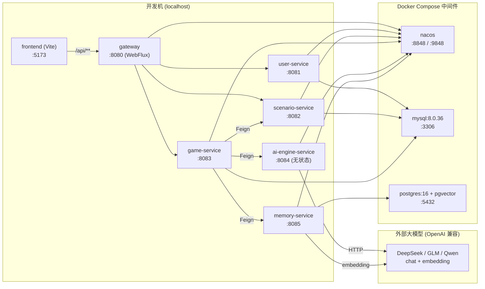

**端口一览（固定，避免冲突）**：

| 组件 | 端口 | 协议/说明 |
|---|---|---|
| frontend (Vite dev server) | `5173` | 浏览器入口，CORS 白名单已含此源（基线 §3.5） |
| gateway | `8080` | 系统唯一对外入口；前端 `axios.baseURL=http://localhost:8080` |
| user-service | `8081` | 内部，经网关 `/api/user/**` 暴露 |
| scenario-service | `8082` | 内部，经网关 `/api/scenario/**` 暴露 |
| game-service | `8083` | 内部，经网关 `/api/game/**` 暴露 |
| ai-engine-service | `8084` | INTERNAL，网关不对外路由（基线 §3.4/§5.0） |
| memory-service | `8085` | INTERNAL，网关不对外路由 |
| nacos | `8848`(HTTP)、`9848`(gRPC) | 注册中心 + 配置中心，standalone |
| mysql | `3306` | 业务库 `aigm_user`/`aigm_scenario`/`aigm_game` |
| postgres | `5432` | 向量库 `aigm_memory`（pgvector） |

> Nacos 2.3.x 除 `8848` 外，客户端注册还会用到 gRPC 端口 `9848`（= 主端口 +1000）。Docker 必须同时映射 `8848` 与 `9848`，否则服务能访问控制台却注册失败、Feign 调不通。

---

### 2. docker-compose.yml（可直接 `docker compose up -d`）

放在仓库根 `ai-gm/docker-compose.yml`。三个中间件容器：`mysql`、`postgres`、`nacos`。Nacos 用 `standalone` 单机模式 + 内置 Derby（毕设不需要外接 MySQL 存配置）。MySQL/PostgreSQL 均挂载初始化脚本目录，容器**首次创建**时自动执行建库建表与种子（脚本见本节第 4 节）。

```yaml
# ai-gm/docker-compose.yml
# 用法: 在仓库根目录执行  docker compose up -d
# 关闭并清空数据(重置)  docker compose down -v
services:

  mysql:
    image: mysql:8.0.36
    container_name: aigm-mysql
    restart: unless-stopped
    environment:
      MYSQL_ROOT_PASSWORD: "aigm123456"      # 仅本地演示用，勿用于生产
      TZ: "Asia/Shanghai"
    command:
      - --character-set-server=utf8mb4
      - --collation-server=utf8mb4_general_ci
      - --default-authentication-plugin=mysql_native_password   # 兼容老客户端/驱动
    ports:
      - "3306:3306"
    volumes:
      - aigm-mysql-data:/var/lib/mysql
      # 容器首次初始化时按文件名字典序执行 *.sql（仅数据卷为空时执行一次）
      - ./deploy/mysql-init:/docker-entrypoint-initdb.d
    healthcheck:
      test: ["CMD", "mysqladmin", "ping", "-h", "127.0.0.1", "-uroot", "-paigm123456"]
      interval: 10s
      timeout: 5s
      retries: 10
      start_period: 30s

  postgres:
    image: pgvector/pgvector:pg16          # 官方已内置 pgvector 0.7.x 的 PG16 镜像
    container_name: aigm-postgres
    restart: unless-stopped
    environment:
      POSTGRES_USER: "aigm"
      POSTGRES_PASSWORD: "aigm123456"
      POSTGRES_DB: "aigm_memory"            # 容器启动即创建该库
      TZ: "Asia/Shanghai"
    ports:
      - "5432:5432"
    volumes:
      - aigm-pg-data:/var/lib/postgresql/data
      # 首次初始化时在 aigm_memory 库里执行(建 extension + 建表 + 种子)
      - ./deploy/pg-init:/docker-entrypoint-initdb.d
    healthcheck:
      test: ["CMD-SHELL", "pg_isready -U aigm -d aigm_memory"]
      interval: 10s
      timeout: 5s
      retries: 10
      start_period: 20s

  nacos:
    image: nacos/nacos-server:v2.3.2
    container_name: aigm-nacos
    restart: unless-stopped
    environment:
      MODE: standalone                      # 单机模式(毕设足够)
      PREFER_HOST_MODE: hostname
      # 毕设开发期统一关闭 Nacos 鉴权，避免「开启自定义鉴权后默认账号不通 / OpenAPI 需先登录拿 token」的矛盾。
      # 关闭后控制台与客户端均无需账号；bootstrap.yml 里给的 username/password(nacos/nacos)在关闭鉴权时会被忽略，不影响。
      NACOS_AUTH_ENABLE: "false"            # 开发期关闭鉴权(二选一: 若评审要求开启, 见下方说明)
      JVM_XMS: "256m"
      JVM_XMX: "512m"
      JVM_XMN: "256m"
    ports:
      - "8848:8848"   # HTTP 控制台 + OpenAPI
      - "9848:9848"   # 客户端 gRPC(注册/配置长连接) —— 必须映射
    volumes:
      - aigm-nacos-data:/home/nacos/data    # 持久化 standalone 内置 Derby 的配置数据
    healthcheck:
      test: ["CMD-SHELL", "curl -fs http://127.0.0.1:8848/nacos/v1/console/health/readiness || exit 1"]
      interval: 10s
      timeout: 5s
      retries: 12
      start_period: 40s

volumes:
  aigm-mysql-data:
  aigm-pg-data:
  aigm-nacos-data:
```

> 说明：
> - **不要用 `latest` 镜像**，按基线 §1 锁定 `mysql:8.0.36`、`pgvector/pgvector:pg16`、`nacos/nacos-server:v2.3.2`，避免版本漂移导致 demo 翻车。
> - `pgvector/pgvector:pg16` 是 PostgreSQL 官方风格镜像 + 预装 pgvector，省去手动编译扩展。初始化脚本里仍需 `CREATE EXTENSION IF NOT EXISTS vector`（基线 §4.4）。
> - Nacos `data` 卷持久化「配置中心」里发布的 dataId（见第 5 节），`docker compose down` 不丢；`down -v` 会连同 MySQL/PG/Nacos 所有数据一起清空（用于彻底重置）。
> - Spring 服务为何不放进 compose：毕设阶段在 IDE/命令行起更便于断点、改 prompt、看日志；若评审要求全容器化，可后续给每个服务加 `Dockerfile`（见第 9 节「进阶：服务容器化思路」）。

---

### 3. Spring 服务的构建与运行思路（Maven 多模块）

后端是 Maven 多模块 reactor（基线 §2，顶层 `ai-gm/pom.xml` 为 `packaging=pom` 的聚合 + 继承 pom）。**统一在仓库根构建一次**，再分别启动各服务。

#### 3.1 一次性构建全部模块

```bash
# 在仓库根 ai-gm/ 执行；-DskipTests 加速本地启动
mvn -v                       # 确认 Maven 3.9.x / JDK 17
mvn clean install -DskipTests
```

构建产物为每个服务模块 `target/` 下的可执行 fat jar（`spring-boot-maven-plugin` 打包）。`common` 模块只是被依赖的库（无主类、不可独立运行），故它**没有** `spring-boot:run`。

#### 3.2 启动单个服务（两种等价方式）

```bash
# 方式 A：Maven 插件直接跑(开发期推荐，改代码热重启方便)
mvn -pl user-service spring-boot:run

# 方式 B：跑构建好的 jar(更接近部署形态)
java -jar user-service/target/user-service-1.0.0.jar
```

`-pl <module>` 指定要运行的子模块；`gateway`、`scenario-service`、`game-service`、`ai-engine-service`、`memory-service` 同理替换模块名即可。

#### 3.3 各服务 `bootstrap.yml` 接 Nacos 的统一模板

每个 Spring 服务都需要 `src/main/resources/bootstrap.yml`（注意是 `bootstrap`，先于 `application.yml` 加载，才能从 Nacos 配置中心拉配置），模板如下，仅 `spring.application.name` 与 `server.port` 因服务而异：

```yaml
# 以 user-service 为例；其它服务改 name 和 port
server:
  port: 8081                         # gateway=8080 user=8081 scenario=8082 game=8083 ai=8084 memory=8085
spring:
  application:
    name: user-service               # 必须与基线 §3.4 服务名一致，Feign/注册都用它
  profiles:
    active: local
  cloud:
    nacos:
      server-addr: ${NACOS_ADDR:127.0.0.1:8848}
      username: ${NACOS_USER:nacos}
      password: ${NACOS_PASSWORD:nacos}
      discovery:                     # 注册中心
        namespace: public
        group: DEFAULT_GROUP
      config:                        # 配置中心
        namespace: public
        group: DEFAULT_GROUP
        file-extension: yaml
        # 共享配置：所有服务都拉 aigm-common.yaml(放 JWT 密钥、Jackson 时间格式等全局项)
        shared-configs:
          - data-id: aigm-common.yaml
            group: DEFAULT_GROUP
            refresh: true
```

> 约定（与基线对齐）：
> - 配置中心里每个服务自己的 dataId = `${spring.application.name}.yaml`，例如 `user-service.yaml`、`ai-engine-service.yaml`；共享项放 `aigm-common.yaml`（见第 5 节）。
> - JWT 密钥 `aigm.jwt.secret`（基线 §3.3）放在 `aigm-common.yaml`，所有服务共享同一密钥才能在网关签发、各处校验/复用。
> - 大模型与 embedding 的 API key **只允许**放在 Nacos 配置或环境变量里，严禁写进代码或提交进 git（详见第 6 节）。

---

### 4. 数据库初始化脚本（建库 + 建表 + 种子）

初始化分两套：MySQL（三个业务库）与 PostgreSQL（向量库）。脚本放在 `ai-gm/deploy/` 下，被第 2 节 compose 的 `volumes` 挂进容器，**容器首次创建数据卷时自动执行**（按文件名字典序）。

#### 4.1 目录结构

```
ai-gm/deploy/
├── mysql-init/
│   ├── 01-schema-user.sql        # aigm_user 建库建表(基线 §4.1)，含 t_role 初始三角色
│   ├── 02-schema-scenario.sql    # aigm_scenario 建库建表(基线 §4.2)
│   ├── 03-schema-game.sql        # aigm_game 建库建表(基线 §4.3)
│   └── 04-seed.sql               # 种子：管理员/编剧/玩家账号 + 迷雾古宅剧本数据
└── pg-init/
    └── 01-schema-memory.sql      # aigm_memory: CREATE EXTENSION vector + t_memory(基线 §4.4)
```

> - `mysql-init/0X-schema-*.sql` 内容直接来自基线 §4.1/§4.2/§4.3 的 DDL（含 `CREATE DATABASE IF NOT EXISTS ... ; USE ...;` 与 `INSERT INTO t_role ...`），此处不重复粘贴，**严格照搬基线 §4 的建表语句，表名/字段名一字不改**。
> - `pg-init/01-schema-memory.sql` 内容来自基线 §4.4（`CREATE EXTENSION IF NOT EXISTS vector;` + `t_memory` 建表 + 两个索引）。因 compose 已通过 `POSTGRES_DB=aigm_memory` 创建库，脚本默认就在 `aigm_memory` 库内执行，无需再建库。
> - `04-seed.sql` 是演示种子，需保证开箱即有「一个已发布剧本 + 三种角色的测试账号」，见 4.2。

#### 4.2 种子账号与种子剧本（`04-seed.sql` 要点）

种子目的：登录就能演示 RBAC，开局就能玩到「迷雾古宅」。种子账号密码统一为 `123456`，但库里存的是 **BCrypt 密文**（基线 §4.1 规定 `password` 存 BCrypt）。

| 用户名 | 密码(明文) | 角色 | 用途 |
|---|---|---|---|
| `admin` | `123456` | ADMIN | 用户管理 / 分配角色演示 |
| `author` | `123456` | AUTHOR | 剧本 CRUD 演示 |
| `player` | `123456` | PLAYER | 开局对话演示 |

`04-seed.sql` 关键片段（与基线表名/角色 code 一致；BCrypt 密文用 strength=10 生成的真实可登录值）：

```sql
-- ============ aigm_user 种子 ============
USE aigm_user;
-- 三个角色已由 01-schema-user.sql 的 INSERT INTO t_role 写入(PLAYER/AUTHOR/ADMIN)
-- 下面密文均为明文 "123456" 的 BCrypt(strength=10) 结果，可直接登录
-- 下面密文为明文 "123456" 的真实 BCrypt(strength=10, $2a$) 结果，已校验可直接登录(三账号共用同一密文以省篇幅)
INSERT INTO t_user (id, username, password, nickname, status) VALUES
  (1001, 'admin',  '$2a$10$BfwTeu7NDRKwHDEY6rwdqewoqWGBszYh7adbXW6mnAAqHhcFb6kja', '系统管理员', 1),
  (1002, 'author', '$2a$10$BfwTeu7NDRKwHDEY6rwdqewoqWGBszYh7adbXW6mnAAqHhcFb6kja', '编剧老王',   1),
  (1003, 'player', '$2a$10$BfwTeu7NDRKwHDEY6rwdqewoqWGBszYh7adbXW6mnAAqHhcFb6kja', '玩家小李',   1);

-- 绑定角色：admin→ADMIN, author→AUTHOR, player→PLAYER (role_id 取自 t_role.role_code)
INSERT INTO t_user_role (user_id, role_id)
SELECT 1001, id FROM t_role WHERE role_code = 'ADMIN';
INSERT INTO t_user_role (user_id, role_id)
SELECT 1002, id FROM t_role WHERE role_code = 'AUTHOR';
INSERT INTO t_user_role (user_id, role_id)
SELECT 1003, id FROM t_role WHERE role_code = 'PLAYER';

-- ============ aigm_scenario 种子(迷雾古宅，对齐基线 §7) ============
-- 完整剧本数据(t_scenario/t_scene_node/t_npc/t_node_npc/t_transition/t_flag_def)
-- 直接照搬基线 §7.7「种子剧本完整可执行 INSERT」全文(剧本 id=1, 节点 3001–3008, NPC 2001–2004,
-- author_id=1002, status=1 已发布)。粘贴位置即此处；表名/字段/key 一字不改。
-- 校验点: seed 后 player 登录在剧本大厅能看到「迷雾古宅」并可开局直到 node_win/node_lose。
```

> 重要：上表 BCrypt 密文 `$2a$10$BfwTeu7NDRKwHDEY6rwdqewoqWGBszYh7adbXW6mnAAqHhcFb6kja` 是明文 `123456` 的**真实可登录** BCrypt(strength=10) 串（已校验），可直接照抄入库；三账号共用同一密文。若想换成自己生成的，用 `new BCryptPasswordEncoder().encode("123456")`（任一 `$2a$10$...` 60 字符结果均可，BCrypt 自带随机盐故每次不同但都可校验通过），**切勿手写假密文**否则登录失败（错误码 1002）。剧本种子的完整 INSERT 见**基线 §7.7「种子剧本完整可执行 INSERT」**，与基线 §7 的 nodeKey/npcKey/flag 命名严格一致。

#### 4.3 手动执行初始化（脚本未自动跑 / 想重跑时）

容器数据卷一旦已存在，`docker-entrypoint-initdb.d` 不会再次执行。需要手动重跑时：

```bash
# MySQL：把脚本灌进容器执行(按顺序)
docker exec -i aigm-mysql mysql -uroot -paigm123456 < deploy/mysql-init/01-schema-user.sql
docker exec -i aigm-mysql mysql -uroot -paigm123456 < deploy/mysql-init/02-schema-scenario.sql
docker exec -i aigm-mysql mysql -uroot -paigm123456 < deploy/mysql-init/03-schema-game.sql
docker exec -i aigm-mysql mysql -uroot -paigm123456 < deploy/mysql-init/04-seed.sql

# PostgreSQL：在 aigm_memory 库执行
docker exec -i aigm-postgres psql -U aigm -d aigm_memory < deploy/pg-init/01-schema-memory.sql

# 想彻底重置(清空所有数据并让 init 脚本重新自动执行)：
docker compose down -v && docker compose up -d
```

---

### 5. Nacos 配置中心：需要发布的 dataId 与内容

服务首次启动前，必须在 Nacos 控制台（`http://localhost:8848/nacos`）发布以下配置（Group 统一 `DEFAULT_GROUP`，命名空间 `public`，格式 `yaml`，对齐基线 §3.4.1）。**开发期已关闭 Nacos 鉴权（compose `NACOS_AUTH_ENABLE=false`）**，控制台与客户端均无需账号；各服务 `bootstrap.yml` 里的 `username/password(nacos/nacos)` 在关闭鉴权时被忽略。也可用第 6.3 的脚本通过 OpenAPI 批量发布。
>
> 二选一说明：若评审要求**开启** Nacos 鉴权，则在 compose 设 `NACOS_AUTH_ENABLE=true` 并补 `NACOS_AUTH_TOKEN`(≥32字节 base64)、`NACOS_AUTH_IDENTITY_KEY/VALUE`，控制台/客户端统一用 `nacos/nacos` 登录，OpenAPI 发布前先 `POST /nacos/v1/auth/login` 拿 `accessToken` 再带上发布。开发期默认走「关闭鉴权」一条路，避免两套配置互相矛盾。

| dataId | 用途 | 关键内容 |
|---|---|---|
| `aigm-common.yaml` | 所有服务共享 | JWT 密钥、Jackson 时间格式、MyBatis-Plus 分页插件开关 |
| `user-service.yaml` | user 库连接 | `aigm_user` 数据源 |
| `scenario-service.yaml` | scenario 库连接 | `aigm_scenario` 数据源 |
| `game-service.yaml` | game 库连接 + Feign 超时 | `aigm_game` 数据源、AI Feign 60s |
| `ai-engine-service.yaml` | LLM 接入 | OpenAI 兼容 base-url / model / **apiKey 占位为环境变量** |
| `memory-service.yaml` | PG 库连接 + embedding | `aigm_memory` 数据源、embedding 模型与维度 1024 |
| `gateway.yaml` | 路由 + CORS | 路由前缀(基线 §5.0)、CORS(基线 §3.5) |

`aigm-common.yaml` 示例（JWT 密钥与时间格式，对齐基线 §3.3 / §3.6）：

```yaml
# Nacos dataId: aigm-common.yaml  group: DEFAULT_GROUP  format: yaml
aigm:
  jwt:
    secret: ${AIGM_JWT_SECRET:Zm9vYmFyLXNlY3JldC1rZXktZm9yLWFpZ20tZGVtby1vbmx5LTMyYnl0ZXMr}
    expire-seconds: 86400          # Access Token 24h(基线 §3.3)
spring:
  jackson:
    date-format: "yyyy-MM-dd HH:mm:ss"   # 基线 §3.6
    time-zone: "GMT+8"
mybatis-plus:
  configuration:
    map-underscore-to-camel-case: true
```

`gateway.yaml` 示例（路由前缀对齐基线 §5.0；`/api/ai/**`、`/api/memory/**` **不配路由**，从而不对外暴露）：

```yaml
# Nacos dataId: gateway.yaml
spring:
  cloud:
    gateway:
      discovery:
        locator:
          enabled: false          # 关闭自动路由，全部显式声明，杜绝内部服务被对外
      routes:
        - id: user-service
          uri: lb://user-service
          predicates: [ "Path=/api/user/**" ]
        - id: scenario-service
          uri: lb://scenario-service
          predicates: [ "Path=/api/scenario/**" ]
        - id: game-service
          uri: lb://game-service
          predicates: [ "Path=/api/game/**" ]
      globalcors:                  # 基线 §3.5
        cors-configurations:
          '[/**]':
            allowedOrigins: [ "http://localhost:5173" ]
            allowedMethods: [ GET, POST, PUT, DELETE, OPTIONS ]
            allowedHeaders: [ Authorization, Content-Type ]
            allowCredentials: true
            maxAge: 3600
```

> 注意：`game-service` 通过 Feign 调用 `ai-engine-service` / `memory-service` 是**服务间内网调用**（基于 Nacos 服务发现 `lb://`），不经过网关路由，因此即便网关不配 `/api/ai/**`、`/api/memory/**`，Feign 仍可正常调通；前端却无法直接访问这两个内部服务，符合基线 §3.4「网关不对外路由」的要求。

---

### 6. 大模型 / Embedding API Key 的配置方式（不写死在代码）

基线规定 AI 实现范围为「调用现成大模型 OpenAI 兼容接口，经配置中心可切换」。Key 管理遵循两条铁律：**① 绝不写进代码 / 绝不提交进 git；② 通过环境变量注入，Nacos 配置里只放 `${ENV_VAR}` 占位。**

#### 6.1 ai-engine-service.yaml（LLM 接入，占位引用环境变量）

```yaml
# Nacos dataId: ai-engine-service.yaml
aigm:
  llm:
    # 三选一，OpenAI 兼容；切换模型只改这三行(base-url/model/api-key 来源)
    base-url: ${LLM_BASE_URL:https://api.deepseek.com/v1}   # DeepSeek 示例
    model:    ${LLM_MODEL:deepseek-chat}
    api-key:  ${LLM_API_KEY}                # 必填，来自环境变量，无默认值 → 缺失即启动失败提醒
    temperature: 0.8
    timeout-ms: 60000                        # 与基线 §3.4 AI readTimeout 60s 对齐
    response-format-json: true               # 走 response_format:{type:"json_object"}(基线 §6.4)
```

#### 6.2 memory-service.yaml（embedding 接入，维度对齐基线 §4.4 = 1024）

```yaml
# Nacos dataId: memory-service.yaml
aigm:
  embedding:
    base-url: ${EMBEDDING_BASE_URL:https://open.bigmodel.cn/api/paas/v4}  # 智谱 示例
    model:    ${EMBEDDING_MODEL:embedding-2}
    api-key:  ${EMBEDDING_API_KEY}
    dimension: 1024                          # 必须与 t_memory.embedding vector(1024) 一致(基线 §4.4)
spring:
  datasource:
    url: jdbc:postgresql://${PG_HOST:127.0.0.1}:5432/aigm_memory
    username: ${PG_USER:aigm}
    password: ${PG_PASSWORD:aigm123456}
    driver-class-name: org.postgresql.Driver
```

> 维度提醒（基线 §4.4 已强调）：若 embedding 模型输出维度不是 1024（如 OpenAI `text-embedding-3-small`=1536），必须同步改 `aigm.embedding.dimension` 与 `t_memory.embedding vector(N)` 的 DDL，否则插入向量报维度不匹配。本基线锁定 **1024**。

#### 6.3 启动前注入环境变量（两种方式）

方式一：导出环境变量后再起服务（开发期最简单）。

```bash
# macOS / Linux —— 仅当前终端会话有效，不会写进任何文件
export LLM_API_KEY="sk-你的deepseek或glm的key"
export EMBEDDING_API_KEY="你的embedding模型key"
# 然后再 mvn -pl ai-engine-service spring-boot:run / mvn -pl memory-service spring-boot:run
```

方式二：用根目录 `.env`（**务必加入 `.gitignore`，不可提交**）集中管理，由启动脚本 `source` 注入：

```bash
# ai-gm/.env  (已在 .gitignore 中)
LLM_BASE_URL=https://api.deepseek.com/v1
LLM_MODEL=deepseek-chat
LLM_API_KEY=sk-xxxxxxxxxxxxxxxx
EMBEDDING_BASE_URL=https://open.bigmodel.cn/api/paas/v4
EMBEDDING_MODEL=embedding-2
EMBEDDING_API_KEY=xxxxxxxxxxxxxxxx
NACOS_ADDR=127.0.0.1:8848
```

`.gitignore` 必须包含（防泄露）：

```gitignore
# secrets / local env —— 严禁提交
.env
*.local.env
**/application-local.yml
```

> 用 Nacos OpenAPI 批量发布配置（可选，省去手点控制台）：登录拿 token 后 `POST /nacos/v1/cs/configs` 逐个发布上述 dataId。配置内容里始终只放 `${LLM_API_KEY}` 占位，真实 key 永远只在运行服务的进程环境变量里。

---

### 7. 一键本地启动顺序与命令（严格按序）

启动顺序有强依赖：**中间件 → 配置发布 → Nacos 就绪 → 网关与各业务服务（先 user 后其余）→ 前端**。AI/Memory 服务无状态，可与业务服务并起，但要在 game-service 真正发起对局前就绪。

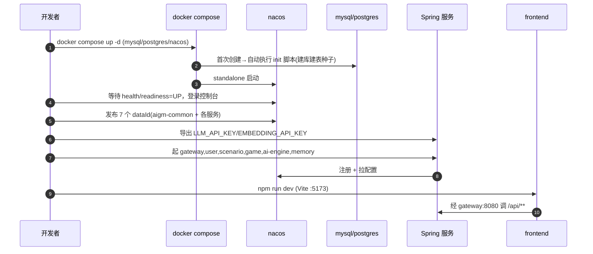

#### 7.1 命令清单

```bash
# 0) 前置检查
java -version          # 期望 17.x
mvn -v                 # 期望 3.9.x
docker compose version # 期望可用
node -v                # 期望 20.x

# 1) 起中间件(在仓库根 ai-gm/)
docker compose up -d
docker compose ps      # 三个容器都应为 healthy(等待 ~40s)

# 2) 等 Nacos 就绪 → 发布配置(控制台或 OpenAPI)，详见第 5 节
#    控制台: http://localhost:8848/nacos  (nacos/nacos)

# 3) 构建后端
mvn clean install -DskipTests

# 4) 注入 API Key(本终端)
export LLM_API_KEY="sk-..."   ; export EMBEDDING_API_KEY="..."

# 5) 逐个起服务(各开一个终端，或用后台 &)；先 user 再其余
mvn -pl gateway          spring-boot:run
mvn -pl user-service     spring-boot:run
mvn -pl scenario-service spring-boot:run
mvn -pl game-service     spring-boot:run
mvn -pl ai-engine-service spring-boot:run
mvn -pl memory-service   spring-boot:run

# 6) 起前端
#    在 frontend/ 目录:
npm install
npm run dev            # http://localhost:5173
```

#### 7.2 可选：一键启动脚本 `deploy/start-all.sh`

```bash
#!/usr/bin/env bash
# ai-gm/deploy/start-all.sh  —— 一键起中间件+全部后端服务(后台)
set -e
cd "$(dirname "$0")/.."          # 切到仓库根
[ -f .env ] && set -a && . ./.env && set +a   # 载入 .env(若存在)

echo ">> 1/4 起中间件"; docker compose up -d

echo ">> 2/4 等待 Nacos 就绪"
until curl -fs http://localhost:8848/nacos/v1/console/health/readiness >/dev/null; do
  echo "   nacos 未就绪，重试..."; sleep 3
done
echo "   nacos OK"

echo ">> 3/4 构建后端"; mvn clean install -DskipTests -q

echo ">> 4/4 后台拉起六个服务(日志在 logs/)"
mkdir -p logs
for svc in gateway user-service scenario-service game-service ai-engine-service memory-service; do
  nohup mvn -pl "$svc" spring-boot:run > "logs/$svc.log" 2>&1 &
  echo "   started $svc (pid $!)"
done
echo "全部已拉起。前端请到 frontend/ 执行 npm run dev"
```

> 该脚本不替你发布 Nacos 配置（第 5 节需先完成一次），也不替你导出 API Key（建议放 `.env`）。停止：`pkill -f spring-boot:run` 关后端，`docker compose down` 关中间件。

---

### 8. 健康检查

#### 8.1 中间件健康

```bash
docker compose ps                       # STATUS 应均为 (healthy)
# Nacos 就绪探针
curl -s http://localhost:8848/nacos/v1/console/health/readiness        # 期望 UP
# MySQL 连通(三库应存在)
docker exec -it aigm-mysql mysql -uroot -paigm123456 -e "SHOW DATABASES;" | grep aigm
# PostgreSQL pgvector 已装
docker exec -it aigm-postgres psql -U aigm -d aigm_memory -c "\dx" | grep vector
docker exec -it aigm-postgres psql -U aigm -d aigm_memory -c "\dt"  # 应见 t_memory
```

#### 8.2 各 Spring 服务健康（Actuator）

每个服务都应引入 `spring-boot-starter-actuator` 并暴露 `health`：

```bash
curl -s http://localhost:8081/actuator/health   # user-service     期望 {"status":"UP"}
curl -s http://localhost:8082/actuator/health   # scenario-service
curl -s http://localhost:8083/actuator/health   # game-service
curl -s http://localhost:8084/actuator/health   # ai-engine-service
curl -s http://localhost:8085/actuator/health   # memory-service
curl -s http://localhost:8080/actuator/health   # gateway
```

#### 8.3 Nacos 注册健康

登录 `http://localhost:8848/nacos` → 服务管理 → 服务列表，应能看到 6 个服务名全部「健康实例数=1」：`gateway`、`user-service`、`scenario-service`、`game-service`、`ai-engine-service`、`memory-service`。

#### 8.4 端到端冒烟（经网关，不依赖前端）

```bash
# 登录拿 token(种子账号 player/123456)
TOKEN=$(curl -s -X POST http://localhost:8080/api/user/auth/login \
  -H "Content-Type: application/json" \
  -d '{"username":"player","password":"123456"}' | sed 's/.*"token":"\([^"]*\)".*/\1/')
echo "TOKEN=$TOKEN"

# 用 token 看可玩剧本(应含「迷雾古宅」)
curl -s http://localhost:8080/api/scenario/published \
  -H "Authorization: Bearer $TOKEN"

# 开局(scenarioId 取上一步返回的剧本 id，假设为 1)；会触发 ai-engine 调 LLM 生成开场
curl -s -X POST http://localhost:8080/api/game/sessions \
  -H "Authorization: Bearer $TOKEN" -H "Content-Type: application/json" \
  -d '{"scenarioId":1}'
# 期望返回 R 外壳 code=0，data 含 sessionId / state / firstTurn.narrative(开场叙事)

# 验证内部服务不对外：网关应拒绝 /api/ai/** 与 /api/memory/**
curl -s -o /dev/null -w "%{http_code}\n" http://localhost:8080/api/ai/generate     # 期望 404(无路由)
curl -s -o /dev/null -w "%{http_code}\n" http://localhost:8080/api/memory/recall   # 期望 404
```

---

### 9. 常见报错排查清单

| 现象 / 报错 | 根因 | 解决 |
|---|---|---|
| 启动 `IllegalStateException: Spring Cloud version compatibility` | Boot/Cloud/Alibaba 版本混搭 | 严格按基线 §1：Boot 3.2.5 + Cloud 2023.0.1 + Alibaba 2023.0.1.0 |
| 服务能开但 Nacos 看不到 / Feign 调不通 `No instances available` | 只映射了 8848 没映射 9848(gRPC) | 确认 compose 同时映射 `8848` 与 `9848`；防火墙放行 |
| 配置读不到 / `${aigm.jwt.secret}` 为空 | 用了 `application.yml` 而非 `bootstrap.yml`，或 dataId/group/namespace 不匹配 | 配置写在 `bootstrap.yml`；dataId=`服务名.yaml`、group=`DEFAULT_GROUP`、ns=`public`，与第 5 节一致 |
| Nacos 控制台登录失败 / 401 | 开了鉴权但账号/token 不匹配 | 开发期 compose 已设 `NACOS_AUTH_ENABLE=false`（无需登录）；若改为开启鉴权，则统一用 `nacos/nacos`，OpenAPI 先登录拿 token 再发布 |
| MySQL 容器起了但没有 `aigm_*` 库 | 数据卷已存在，init 脚本不再执行 | `docker compose down -v` 重置后重起，或按 4.3 手动执行脚本 |
| 登录报 1002 用户名或密码错误（种子账号也错） | seed 里的 BCrypt 密文是假的/不匹配明文 | 用真实 `BCryptPasswordEncoder.encode("123456")` 重新生成密文替换(见 4.2 提醒) |
| PG 插入向量报 `expected N dimensions, not M` | embedding 维度与 `vector(1024)` 不一致 | 对齐 `aigm.embedding.dimension` 与 DDL，均为 1024(基线 §4.4) |
| `extension "vector" is not available` | 用了普通 postgres:16 镜像未装 pgvector | 改用 `pgvector/pgvector:pg16` 镜像；脚本含 `CREATE EXTENSION IF NOT EXISTS vector` |
| 调 AI 报 1500 超时 | LLM 网络慢 / Feign readTimeout 太短 | AI Feign read 60s(基线 §3.4)；检查 `LLM_BASE_URL` 可达、key 有效 |
| 调 AI 报 1501/1502 | LLM 没按 JSON schema 输出 | 开 `response_format:{type:"json_object"}`(基线 §6.4)；按 §6.5 触发一次重试再降级 |
| AI 想跳到非法节点(日志见 1503) | 这是**预期保护**：白名单拒绝越界跳转 | 正常行为(基线 §6.5)，强制停留当前节点，非 bug |
| 前端请求报 CORS 跨域 | 网关 CORS 未配或下游重复配 | CORS 只在 gateway 配(基线 §3.5)，下游不要再配；源含 `http://localhost:5173` |
| 前端 401 一直跳登录 | token 未带 / 已过期(24h) | axios 拦截器注入 `Authorization: Bearer`；过期(1003)需重新登录 |
| gateway 启动报 WebMVC/WebFlux 冲突 | 网关误引入 `spring-boot-starter-web` | 网关只用 `spring-cloud-starter-gateway`(WebFlux)，移除 web 依赖(基线 §1/§2) |
| 端口被占用 `Address already in use` | 端口冲突 | 按第 1 节端口表核对；`lsof -i:8080` 找占用进程关掉 |
| `mvn spring-boot:run` 报找不到 common 类 | 没先 `mvn install` common | 先在根 `mvn clean install -DskipTests` 装好 common 再起服务 |

#### 9.1 进阶：服务容器化思路（评审要求全容器化时）

毕设默认 Spring 服务本地起即可。若需全容器化，给每个服务加多阶段 `Dockerfile`（基于 `eclipse-temurin:17-jre` 跑 fat jar），并在 compose 增加服务节点，`depends_on: { nacos: {condition: service_healthy} }`，环境变量传 `NACOS_ADDR=nacos:8848`、`LLM_API_KEY` 等。注意容器内服务连 Nacos/数据库要用**容器服务名**（`nacos`/`mysql`/`postgres`）而非 `127.0.0.1`。此为可选扩展，不影响主线验收。

---

### 10. 一键启动的验收标准（Demo 不翻车的判定）

按下列清单逐项打勾，全绿即视为「本地可一键运行」达标：

- [ ] **中间件**：`docker compose ps` 中 `aigm-mysql`、`aigm-postgres`、`aigm-nacos` 三者 STATUS 均为 `healthy`。
- [ ] **数据库**：MySQL 存在 `aigm_user`/`aigm_scenario`/`aigm_game` 三库且表齐全；PostgreSQL `aigm_memory` 库 `\dx` 含 `vector`、`\dt` 含 `t_memory`。
- [ ] **种子**：`t_role` 含 PLAYER/AUTHOR/ADMIN 三角色；`t_user` 含 admin/author/player 三账号且角色绑定正确；`t_scenario` 含一条 `status=1`（已发布）的「迷雾古宅」及其节点/NPC/分支数据。
- [ ] **注册**：Nacos 服务列表中 6 个服务名健康实例数均=1。
- [ ] **配置**：6 个服务均能从 Nacos 拉到配置；`aigm.jwt.secret` 全局一致；LLM/embedding 的 key 来自环境变量，**代码与 git 中查不到任何明文 key**。
- [ ] **健康**：6 个服务 `/actuator/health` 均返回 `{"status":"UP"}`。
- [ ] **登录鉴权**：用 `player/123456` 经 `:8080/api/user/auth/login` 能拿到 JWT；不带 token 访问 `/api/game/sessions` 返回 1001（基线错误码）。
- [ ] **RBAC**：`player` 调编剧接口（如 `POST /api/scenario`）被拒（1005 无权限）；`author` 可创建剧本；`admin` 可分配角色。
- [ ] **核心 AI 链路**：`player` 能在剧本大厅看到「迷雾古宅」→ 开局返回带 `firstTurn.narrative` 开场叙事 → 提交一回合 `POST /api/game/sessions/{id}/turns` 返回 `narrative`+`npcDialogues`+`state`，且 `t_turn`/`t_game_state` 落库、`t_memory` 有新增向量记录。
- [ ] **状态机约束生效**：当 AI 提议越界跳转时日志出现 1503 且 `current_node_id` 不变（AI 跳不出编剧轨道）。
- [ ] **内部服务隔离**：经网关访问 `/api/ai/**`、`/api/memory/**` 返回 404（不对外路由），但 game-service 通过 Feign 能正常内网调用它们。
- [ ] **前端**：`http://localhost:5173` 打开登录页 → 三角色登录后分别进入玩家大厅 / 编剧剧本管理 / 管理员用户管理，无 CORS 报错，能完整走通一局「迷雾古宅」。
- [ ] **可重置**：`docker compose down -v && docker compose up -d` 后 init 脚本自动重建库表与种子，系统可从零再次跑通。

全部勾选通过即满足课程「Spring Cloud 微服务 + 注册登录 + CRUD（剧本管理）+ RBAC（PLAYER/AUTHOR/ADMIN）+ 有难度的 AI 功能（状态机约束 / 多 NPC 人格一致 / 长程记忆 RAG）」的本地可运行验收。

---

### 11. 构建阶段（施工总顺序 + 逐阶段 DoD）

> 这是 `00-intro` 所指「按阶段顺序逐步实现、每阶段有 DoD」的主线（原计划独立成 09 节，现并入本节）。阶段之间有**强依赖**，**不要跳阶段并行乱做**：先地基（common/中间件），再鉴权链路（gateway+user），再业务数据（scenario），再 AI 与记忆（ai-engine/memory），最后编排核心（game-service）+ 前端 + 端到端联调。每完成一阶段，对照其 DoD 自检通过再进入下一阶段——做一步、能跑一步、不翻车。

| 阶段 | 产出物 | 关键依赖 | 阶段 DoD（完成标准） |
|---|---|---|---|
| **P0 工程骨架** | 根 `pom.xml`(packaging=pom 聚合+继承)、各模块空骨架、`docker-compose.yml` | — | `mvn clean install -DskipTests` 全模块构建通过；`docker compose up -d` 三中间件 healthy（§10 前两项） |
| **P1 common 地基** | `02-common` 全部类（`R`/`ResultCode`/`BizException`/`GlobalExceptionHandler`/`JwtUtil`/`PageQuery`/`PageResult`/常量/Feign 接口+DTO）+ 自动配置 | P0 | `mvn -pl common install` 成功；`02-common` §11 DoD 全绿（枚举对齐基线 §3.2、JwtUtil 自洽、自动配置生效） |
| **P2 Nacos 配置 + 建库** | 发布 7 个 dataId（§5）；执行 §4 建库建表 + §4.2 账号种子 + 基线 §7.7 剧本种子 | P0 | Nacos 配置可拉到（`aigm.jwt.secret` 非空）；三 MySQL 库 + `aigm_memory`(pgvector) 就绪；种子账号/「迷雾古宅」入库（§10 数据库/种子两项） |
| **P3 鉴权链路 gateway+user** | `03-gateway` + `02-user-service` 全部实现 | P1,P2 | 注册/登录可用，签发 HS256 JWT；不带 token 访问受限接口返回 HTTP 401+`R{1001}`；网关注入 `X-User-*` 且剥离伪造头；user/gateway `/actuator/health`=UP（`03-gateway`/`02-user-service` DoD） |
| **P4 业务数据 scenario** | `03-scenario-service` 全部 CRUD + 运行时只读接口 + 发布校验 | P3 | 剧本/节点/NPC/分支 CRUD 与归属 RBAC 通过；发布校验（无起始节点 1210、断链等）；`getRunScenario`/`getRunNode` 返回结构对齐基线 §6.2（`03-scenario-service` §13 DoD） |
| **P5 AI 与记忆** | `05-ai-engine-service` + `06-memory-service` | P1（可与 P3/P4 并行实现，但需 P2 配置） | ai-engine 给定桩输入稳定产出合法 schema、白名单/降级生效（§5.13 AC）；memory store/recall 走通、向量维度 1024、provider 可切换（§AC-11） |
| **P6 编排核心 game-service** | `04-game-service` 开局/回合六步编排 + 白名单二次校验 + 事务/幂等 | P4,P5 | 开局返回 firstTurn；提交回合落库 t_turn/t_game_state、turn_count++、t_memory 新增；越界跳转 1503 停留；胜负判定；越权 1221/状态 1202（`04-game-service` §13 DoD） |
| **P7 前端五大页面** | `07-frontend` Vue3 登录/大厅/游玩/编辑器/用户管理 | P3–P6 | 三角色登录分流、无 CORS 报错、完整走通一局「迷雾古宅」（§10 前端项） |
| **P8 端到端联调与验收** | 全链路 demo | P7 | §10 全部验收项打勾通过（含可重置、内部隔离 404、状态机约束生效等） |

> 阶段并行建议：P5（ai-engine/memory）可与 P3/P4 并行编码（无相互源码依赖），但联调必须在 P2 配置就绪后；P6 必须等 P4+P5 就绪（它是编排者，依赖前述全部）。每阶段 DoD 未达成前不进入下一阶段，避免缺地基硬拼导致 demo 翻车。

